# HyperPhysics

**A scientific computing platform at the intersection of computational neuroscience, hyperbolic geometry, thermodynamic computing, and quantitative finance.**

HyperPhysics unifies biophysically-accurate neural simulation (OpenWorm/Sibernetic), physics-inspired optimization (pBit/Ising machines), and enterprise-grade trading infrastructure into a coherent Rust workspace.

---

## Core Philosophy

HyperPhysics is built on three foundational principles from complex systems science:

1. **Autopoiesis** — Self-organizing systems that maintain their own boundaries
2. **Self-Organized Criticality** — Systems naturally evolving toward critical states
3. **Embodied Cognition** — Intelligence emerging from physical substrate interaction

These principles manifest across all components: from C. elegans neural dynamics to market regime detection to thermodynamic optimization.

---

## System Architecture

```mermaid
flowchart TB
    subgraph NEURO["🧠 COMPUTATIONAL NEUROSCIENCE LAYER"]
        direction TB
        CONN["hyperphysics-connectome<br/><i>302 neurons, c302 models</i>"]
        SPH["hyperphysics-sph<br/><i>PCISPH fluid dynamics</i>"]
        STDP["hyperphysics-stdp<br/><i>Spike-Timing Plasticity</i>"]
        EMBOD["hyperphysics-embodiment<br/><i>Neural-Body Coupling</i>"]
        SIBER["sibernetic-hyperphysics<br/><i>C. elegans Simulator</i>"]

        CONN --> EMBOD
        SPH --> EMBOD
        STDP --> EMBOD
        EMBOD --> SIBER
    end

    subgraph PHYSICS["⚛️ PHYSICS & GEOMETRY LAYER"]
        direction LR
        GEOM["hyperphysics-geometry<br/><i>H³ manifold, K=-1</i>"]
        LORENTZ["hyperphysics-lorentz<br/><i>Hyperboloid model</i>"]
        THERMO["hyperphysics-thermo<br/><i>Landauer/Hamiltonian</i>"]
        PBIT["hyperphysics-pbit<br/><i>p-bit dynamics</i>"]
        ISING["ising-optimizer<br/><i>NP-hard solver</i>"]
        QUANTUM["quantum-circuit<br/><i>Quantum simulation</i>"]
    end

    subgraph COGNITIVE["🧬 COGNITIVE ARCHITECTURE LAYER"]
        direction LR
        ACTIVE["active-inference-agent<br/><i>Free Energy Principle</i>"]
        CORTICAL["hyperphysics-cortical-bus<br/><i>Neural routing</i>"]
        CONSC["hyperphysics-consciousness<br/><i>Φ IIT / CI metrics</i>"]
        REASON["hyperphysics-reasoning-router<br/><i>Multi-backend reasoning</i>"]
        STRAT["hyperphysics-strategy-router<br/><i>pBit MoE</i>"]
        GAME["game-theory-engine<br/><i>Nash/LMSR/Prospect</i>"]
    end

    subgraph TRADING["📈 TRADING & RISK INFRASTRUCTURE"]
        direction LR
        RISK["hyper-risk-engine<br/><i>&lt;100μs fast path</i>"]
        ATS["ats-core<br/><i>Conformal Prediction</i>"]
        NAUT["hyperphysics-nautilus<br/><i>Nautilus Trader bridge</i>"]
        MARKET["hyperphysics-market<br/><i>Lock-free order book</i>"]
        TENGRI["tengri<br/><i>Crypto strategies</i>"]
        CWTS["cwts-ultra<br/><i>HFT infrastructure</i>"]
    end

    subgraph BACKENDS["⚙️ PHYSICS SIMULATION BACKENDS"]
        direction LR
        RAP["Rapier<br/><i>2D/3D</i>"]
        JOLT["Jolt<br/><i>C++</i>"]
        MUJO["MuJoCo<br/><i>DeepMind</i>"]
        WARP["Warp<br/><i>NVIDIA</i>"]
        TAICHI["Taichi<br/><i>GPU</i>"]
        UNIFIED["hyperphysics-unified<br/><i>Backend abstraction</i>"]
    end

    NEURO -.->|"Neural signals"| COGNITIVE
    PHYSICS -.->|"Geometric ops"| COGNITIVE
    COGNITIVE -.->|"Decisions"| TRADING
    BACKENDS -.->|"Simulation"| NEURO
    PBIT -.->|"Optimization"| STRAT
    ISING -.->|"Combinatorial"| RISK

    style NEURO fill:#e1f5fe,stroke:#01579b
    style PHYSICS fill:#f3e5f5,stroke:#4a148c
    style COGNITIVE fill:#e8f5e9,stroke:#1b5e20
    style TRADING fill:#fff3e0,stroke:#e65100
    style BACKENDS fill:#fce4ec,stroke:#880e4f
```



---

## Featured Components

### Computational Neuroscience (OpenWorm/Sibernetic Port)

The `sibernetic-hyperphysics` stack provides a complete C. elegans simulation ported from OpenWorm:

| Crate | Description |
|-------|-------------|
| **hyperphysics-connectome** | Complete 302-neuron connectome with 6 model levels (A→D1), graded synapses, ion channels (k_slow, k_fast, ca_boyle) based on c302 |
| **hyperphysics-sph** | PCISPH (Predictive-Corrective Incompressible SPH) fluid dynamics for soft body simulation |
| **hyperphysics-embodiment** | Neural-muscle coupling linking connectome outputs to 96 body wall muscles |
| **hyperphysics-stdp** | Spike-Timing Dependent Plasticity for online learning |
| **hyperphysics-nas** | Neural architecture search for connectome optimization |

**c302 Model Levels:**
- **Level A**: Leaky Integrate-and-Fire (fast behavioral studies)
- **Level B**: Izhikevich neurons with gap junctions
- **Level C**: Conductance-based with spike-triggered synapses
- **Level C1**: Conductance-based with graded synaptic transmission
- **Level D**: Full Hodgkin-Huxley with ion channel dynamics
- **Level D1**: Full biophysical with calcium-based GradedSynapse2

### Hyperbolic Geometry & Thermodynamic Computing

| Crate | Description |
|-------|-------------|
| **hyperphysics-geometry** | H³ hyperbolic manifold (K=-1), {3,7,2} tessellation, Poincaré disk model |
| **hyperphysics-lorentz** | Lorentz/Hyperboloid model with f64 SIMD Minkowski operations |
| **hyperphysics-pbit** | Probabilistic bit dynamics (Gillespie SSA, Metropolis-Hastings, Hopfield networks) |
| **hyperphysics-thermo** | Thermodynamics engine (Landauer principle: E_min = k_B T ln 2) |
| **ising-optimizer** | Ising machine for NP-hard combinatorial optimization |
| **quantum-circuit** | Quantum circuit simulation (PennyLane compatible) |
| **quantum-lstm** | Quantum-enhanced LSTM with biological quantum effects |

### Cognitive Architecture

| Crate | Description |
|-------|-------------|
| **active-inference-agent** | Free Energy Principle agents (Friston), predictive processing |
| **hyperphysics-consciousness** | Integrated Information Theory (Φ) and Complexity Index (CI) |
| **hyperphysics-cortical-bus** | Neural signal routing and similarity-based retrieval |
| **hyperphysics-reasoning-router** | Multi-backend reasoning orchestration |
| **hyperphysics-strategy-router** | pBit-aware Mixture-of-Experts action selection |
| **game-theory-engine** | Nash equilibrium, mechanism design, auction theory |
| **lmsr** | Logarithmic Market Scoring Rule (Hanson prediction markets) |
| **prospect-theory** | Kahneman-Tversky probability weighting |

### Trading Infrastructure

| Crate | Description |
|-------|-------------|
| **hyper-risk-engine** | 3-tier latency risk management (<100μs fast path) |
| **ats-core** | Adaptive Temperature Scaling, Conformal Quantile Regression |
| **hyperphysics-nautilus** | Nautilus Trader integration bridge |
| **hyperphysics-market** | Multi-venue data providers, lock-free order book |
| **tengri** | Cryptocurrency trading strategies |
| **cwts-ultra** | High-frequency trading infrastructure |

---

## Performance Characteristics

| Component | Target Latency | Implementation |
|-----------|---------------|----------------|
| Data Ingestion | <5μs | Lock-free ring buffer |
| Feature Computation | <10μs | SIMD vectorized (AVX2/NEON) |
| Risk Pre-trade Check | <20μs | Inline quantile functions |
| Anomaly Detection | <15μs | SPOT/DSPOT streaming |
| Model Inference | <30μs | Pre-fitted parameters |
| Decision Logic | <10μs | Lookup tables |
| **Total Fast Path** | **<90μs** | |

---

## Scientific Foundation

### Neuroscience
- **Hodgkin-Huxley Model**: Full ion channel dynamics (Boyle & Cohen, 2008)
- **Graded Synapses**: Voltage-dependent analog transmission for C. elegans
- **STDP**: Bi-exponential spike-timing dependent plasticity (Bi & Poo, 1998)
- **c302**: OpenWorm connectome data model (Gleeson et al.)

### Physics
- **Hyperbolic Geometry**: H³ space with constant curvature K=-1
- **Lorentz Model**: Hyperboloid representation with Minkowski inner product
- **Thermodynamics**: Landauer principle, Second Law compliance
- **SPH**: Predictive-Corrective Incompressible Smoothed Particle Hydrodynamics

### Machine Learning
- **Conformal Prediction**: Guaranteed coverage (Romano et al., 2019)
- **Active Inference**: Free Energy Principle (Friston, 2010)
- **Integrated Information Theory**: Φ metric (Tononi et al.)

### Finance
- **Extreme Value Theory**: GARCH + EVT for tail risk (McNeil & Frey, 2000)
- **Kelly Criterion**: Optimal position sizing
- **LMSR**: Logarithmic market scoring rule (Hanson, 2003)

---

## Quick Start

```bash
# Build workspace
cargo build --workspace --release

# Run tests
cargo test --workspace

# Run connectome example
cargo run -p hyperphysics-connectome --example celegans_simulation

# Build with SIMD optimizations
cargo build --release --features simd
```

### C. elegans Simulation

```rust
use hyperphysics_connectome::{Connectome, SpikingNetwork, ModelLevel};

// Load full 302-neuron connectome
let connectome = Connectome::celegans();

// Create network with graded synapses (Level C1)
let mut network = SpikingNetwork::from_connectome(&connectome, ModelLevel::C1);

// Simulate with 0.05ms timestep
for _ in 0..10000 {
    network.step(0.05);
}

// Get muscle activation for body control
let muscle_signals = network.get_muscle_output();
```

### Hyperbolic pBit Dynamics

```rust
use hyperphysics_pbit::{HopfieldNetwork, PBitConfig};

// Create Hopfield network on hyperbolic lattice
let config = PBitConfig::default();
let mut network = HopfieldNetwork::new(64, config);

// Store patterns and recall
network.store_pattern(&pattern);
let recalled = network.recall(&noisy_pattern, 100);
```

### Risk Engine Integration

```rust
use hyper_risk_engine::{HyperRiskEngine, EngineConfig};

// Initialize with sub-100μs target
let config = EngineConfig::production();
let mut engine = HyperRiskEngine::new(config)?;

// Fast-path pre-trade check
let decision = engine.pre_trade_check(&order)?;
```

---

## Platform Support

### CPU Architectures
- **x86_64**: AVX2 (256-bit), AVX-512 (512-bit)
- **aarch64**: NEON (128-bit), Apple Silicon M1/M2/M3/M4
- **wasm32**: SIMD128 (128-bit)

### Operating Systems
- macOS (primary development, Apple Silicon optimized)
- Linux (tested on Ubuntu 22.04+)
- Windows (via WSL2)

---

## Project Statistics

| Metric | Count |
|--------|-------|
| Workspace Crates | 64+ |
| Total Rust Lines | ~1.05M |
| Physics Backends | 6 |
| Neuron Models | 3 (LIF, Izhikevich, HH) |
| Model Levels | 6 (A, B, C, C1, D, D1) |
| Ion Channels | 4 (k_slow, k_fast, ca_boyle, leak) |
| Bio-inspired Algorithms | 14 |
| Market Providers | 7 |

---

## References

### Neuroscience
- Boyle, J.H. & Cohen, N. (2008). C. elegans body wall muscles are simple actuators. *PLOS Computational Biology*
- Gleeson, P. et al. (2018). c302: A multiscale framework for modelling the nervous system of C. elegans. *Phil Trans R Soc B*
- Bi, G. & Poo, M. (1998). Synaptic modifications in cultured hippocampal neurons. *J Neurosci*

### Physics & Computing
- Camsari, K.Y. et al. (2017). Stochastic p-bits for invertible logic. *Phys Rev X*
- Landauer, R. (1961). Irreversibility and heat generation in the computing process. *IBM J Res Dev*

### Machine Learning & Finance
- Friston, K. (2010). The free-energy principle: a unified brain theory? *Nat Rev Neurosci*
- Tononi, G. (2008). Consciousness as integrated information. *Biol Bull*
- Romano, Y. et al. (2019). Conformalized quantile regression. *NeurIPS*

---

## License

MIT OR Apache-2.0

---

*HyperPhysics: Where computational neuroscience meets quantitative finance through the lens of physics-inspired computing.*
