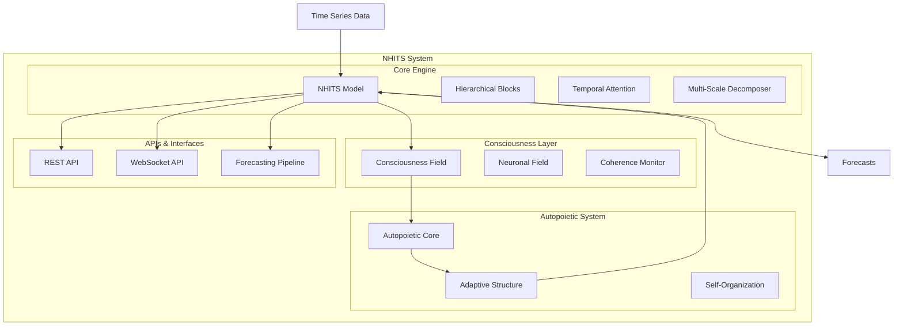
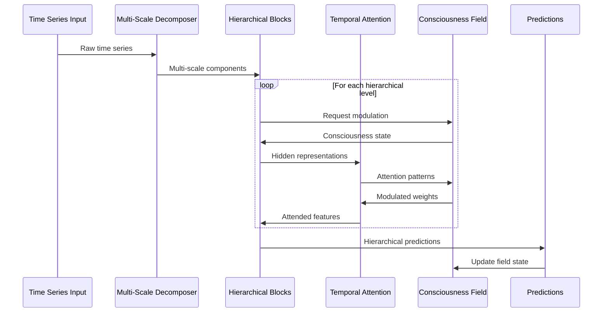
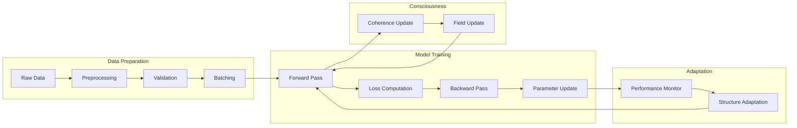
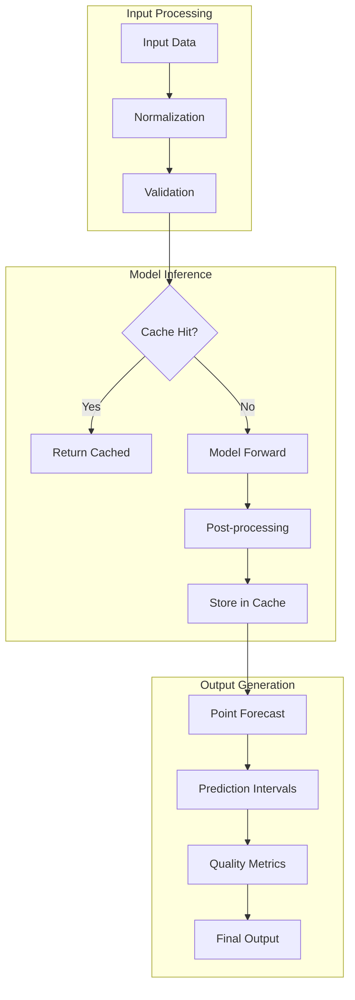

# Architecture Overview

Comprehensive overview of the NHITS (Neural Hierarchical Interpolation for Time Series) architecture, its consciousness integration, and autopoietic system design.

## Table of Contents

- [System Architecture](#system-architecture)
- [Core Components](#core-components)
- [Consciousness Integration](#consciousness-integration)
- [Autopoietic System](#autopoietic-system)
- [Data Flow](#data-flow)
- [Neural Architecture](#neural-architecture)
- [Adaptation Mechanisms](#adaptation-mechanisms)
- [Performance Characteristics](#performance-characteristics)
- [Integration Points](#integration-points)

## System Architecture

### High-Level Overview



### Layered Architecture

The NHITS system follows a layered architecture with clear separation of concerns:

1. **Presentation Layer**: REST API, WebSocket API, CLI interfaces
2. **Application Layer**: Forecasting pipeline, configuration management
3. **Business Logic Layer**: NHITS model, consciousness integration
4. **Infrastructure Layer**: Data persistence, monitoring, caching

## Core Components

### NHITS Model

The central neural architecture implementing hierarchical interpolation:

```rust
pub struct NHITS {
    /// Model configuration
    config: NHITSConfig,
    
    /// Hierarchical neural blocks for multi-scale processing
    blocks: Vec<HierarchicalBlock>,
    
    /// Temporal attention mechanism with consciousness modulation
    attention: TemporalAttention,
    
    /// Multi-scale time series decomposer
    decomposer: MultiScaleDecomposer,
    
    /// Adaptive structure manager
    adapter: AdaptiveStructure,
    
    /// Consciousness field integration
    consciousness: Arc<ConsciousnessField>,
    
    /// Autopoietic system reference
    autopoietic_system: Arc<AutopoieticSystem>,
    
    /// Model state and metadata
    state: ModelState,
}
```

**Key Responsibilities:**
- Hierarchical feature extraction through multiple scales
- Temporal pattern recognition with attention mechanisms
- Consciousness-aware processing and adaptation
- Multi-horizon forecasting with uncertainty quantification

### Hierarchical Blocks

Multi-scale neural processing units that form the backbone of the architecture:

```rust
pub struct HierarchicalBlock {
    /// Block configuration
    config: BlockConfig,
    
    /// Input projection layer
    input_projection: LinearLayer,
    
    /// Basis expansion functions
    basis_functions: Vec<BasisFunction>,
    
    /// Pooling operation for downsampling
    pooling: PoolingOperation,
    
    /// Interpolation for upsampling
    interpolation: InterpolationLayer,
    
    /// Output projection
    output_projection: LinearLayer,
    
    /// Activation function
    activation: ActivationType,
}
```

**Design Principles:**
- **Hierarchical Processing**: Each block operates at a different temporal scale
- **Basis Expansion**: Rich representation through multiple basis functions
- **Pooling & Interpolation**: Efficient handling of different resolutions
- **Residual Connections**: Gradient flow and training stability

### Temporal Attention

Consciousness-aware attention mechanism for focusing on relevant temporal patterns:

```rust
pub struct TemporalAttention {
    /// Attention configuration
    config: AttentionConfig,
    
    /// Query, Key, Value projections
    qkv_projection: MultiHeadProjection,
    
    /// Attention head parameters
    attention_heads: Vec<AttentionHead>,
    
    /// Output projection
    output_projection: LinearLayer,
    
    /// Consciousness integration module
    consciousness_modulator: ConsciousnessModulator,
}
```

**Attention Variants:**
- **Standard Attention**: Full quadratic attention mechanism
- **Sparse Attention**: Memory-efficient sparse patterns
- **Local Window**: Sliding window attention for streaming data
- **Relative Attention**: Position-aware attention with relative encodings

### Multi-Scale Decomposer

Advanced time series decomposition supporting multiple methods:

```rust
pub struct MultiScaleDecomposer {
    /// Decomposition configuration
    config: DecomposerConfig,
    
    /// Primary decomposition method
    primary_decomposer: DecompositionMethod,
    
    /// Seasonal extractors for different periods
    seasonal_extractors: HashMap<usize, SeasonalExtractor>,
    
    /// Trend filter
    trend_filter: TrendFilter,
    
    /// Residual analyzer
    residual_analyzer: ResidualAnalyzer,
}
```

**Decomposition Methods:**
- **STL**: Seasonal and Trend decomposition using Loess
- **EMD**: Empirical Mode Decomposition
- **Additive/Multiplicative**: Classical decomposition
- **Hybrid**: Adaptive combination of methods

## Consciousness Integration

### Consciousness Field

The consciousness field provides global awareness and coherence monitoring:

```rust
pub struct ConsciousnessField {
    /// Current consciousness state
    state: ConsciousnessState,
    
    /// Field strength over time
    field_history: VecDeque<f64>,
    
    /// Coherence patterns
    coherence_patterns: HashMap<String, CoherencePattern>,
    
    /// Attention weight distributions
    attention_weights: Vec<Array2<f64>>,
    
    /// Synchronization mechanisms
    sync_channels: Vec<SyncChannel>,
}

pub struct ConsciousnessState {
    /// Overall coherence level (0.0 to 1.0)
    pub coherence: f64,
    
    /// Field strength
    pub field_strength: f64,
    
    /// Attention weight matrices for each layer
    pub attention_weights: Vec<Option<Array2<f64>>>,
    
    /// Pattern recognition confidence
    pub pattern_confidence: f64,
    
    /// Temporal consistency measure
    pub temporal_consistency: f64,
}
```

**Consciousness Functions:**
- **Coherence Monitoring**: Track system-wide consistency
- **Attention Modulation**: Guide focus based on global patterns
- **Pattern Recognition**: Enhanced pattern detection through field effects
- **Adaptation Guidance**: Influence structural changes

### Neuronal Field Integration

```rust
pub struct NeuronalField {
    /// Field dynamics
    dynamics: FieldDynamics,
    
    /// Neuron interactions
    interactions: InteractionMatrix,
    
    /// Synchronization patterns
    sync_patterns: Vec<SyncPattern>,
    
    /// Plasticity mechanisms
    plasticity: PlasticityRules,
}
```

**Field Properties:**
- **Spatial Coherence**: Consistency across different model components
- **Temporal Coherence**: Consistency across time steps
- **Cross-Scale Coherence**: Consistency across hierarchical levels
- **Adaptive Coupling**: Dynamic interaction strengths

## Autopoietic System

### Self-Organization

The autopoietic system enables self-organization and adaptation:

```rust
pub struct AutopoieticSystem {
    /// System configuration
    config: AutopoieticConfig,
    
    /// Component network
    component_network: ComponentNetwork,
    
    /// Production processes
    production_processes: Vec<ProductionProcess>,
    
    /// Boundary maintenance
    boundary_mechanisms: BoundaryMaintenance,
    
    /// Self-monitoring
    introspection: IntrospectionModule,
}
```

**Autopoietic Principles:**
1. **Self-Production**: System components produce and maintain themselves
2. **Operational Closure**: Operations produce operations within system boundaries
3. **Structural Coupling**: System structure adapts to environmental perturbations
4. **Autonomy**: Self-determined responses to external influences

### Adaptation Mechanisms

```rust
pub struct AdaptiveStructure {
    /// Adaptation configuration
    config: AdaptationConfig,
    
    /// Performance monitoring
    performance_monitor: PerformanceMonitor,
    
    /// Structure evolution rules
    evolution_rules: Vec<EvolutionRule>,
    
    /// Change history
    change_history: Vec<StructuralChange>,
    
    /// Consciousness integration
    consciousness_coupling: ConsciousnessCoupling,
}
```

**Adaptation Types:**
- **Structural**: Adding/removing layers, changing connections
- **Parametric**: Adjusting weights, learning rates, hyperparameters
- **Functional**: Changing activation functions, loss functions
- **Architectural**: Modifying attention patterns, block configurations

## Data Flow

### Forward Pass Pipeline



### Training Pipeline



### Inference Pipeline



## Neural Architecture

### Block Architecture

Each hierarchical block implements the following structure:

```
Input (B, T, F)
    ↓
Input Projection (Linear)
    ↓
Basis Expansion (Multiple parallel paths)
    ↓ ↓ ↓
Pooling Operations (Different factors)
    ↓ ↓ ↓
Fully Connected Layers
    ↓ ↓ ↓
Activation Functions
    ↓ ↓ ↓
Interpolation (Upsampling)
    ↓ ↓ ↓
Concatenation
    ↓
Output Projection
    ↓
Residual Connection
    ↓
Output (B, T', F')
```

### Attention Architecture

```
Query (B, T, D)    Key (B, T, D)    Value (B, T, D)
    ↓                  ↓                ↓
Multi-Head Projection
    ↓                  ↓                ↓
Q (B, H, T, D/H)   K (B, H, T, D/H)  V (B, H, T, D/H)
    ↓                  ↓                ↓
    ↓───── Attention Computation ──────↓
           (with Consciousness Modulation)
                      ↓
            Attention Weights (B, H, T, T)
                      ↓
              Weighted Values (B, H, T, D/H)
                      ↓
               Concatenate Heads
                      ↓
              Output Projection
                      ↓
               Output (B, T, D)
```

### Multi-Scale Processing

```
Time Series Input (Resolution R)
    ↓
┌───────────────────────────────────────┐
│ Scale 1: Resolution R                 │
│ Block 1: Full resolution processing   │
└───────────────────────────────────────┘
    ↓ (Pooling factor 2)
┌───────────────────────────────────────┐
│ Scale 2: Resolution R/2               │
│ Block 2: Medium resolution processing │
└───────────────────────────────────────┘
    ↓ (Pooling factor 2)
┌───────────────────────────────────────┐
│ Scale 3: Resolution R/4               │
│ Block 3: Low resolution processing    │
└───────────────────────────────────────┘
    ↓ (Interpolation)
Hierarchical Feature Aggregation
    ↓
Final Predictions
```

## Adaptation Mechanisms

### Performance-Based Adaptation

```rust
pub struct PerformanceMonitor {
    /// Performance metrics history
    metrics_history: VecDeque<PerformanceMetrics>,
    
    /// Threshold configurations
    thresholds: AdaptationThresholds,
    
    /// Change detection algorithms
    change_detectors: Vec<ChangeDetector>,
}

pub struct AdaptationDecisionEngine {
    /// Decision rules
    rules: Vec<AdaptationRule>,
    
    /// Consciousness integration
    consciousness_influence: f64,
    
    /// Risk assessment
    risk_evaluator: RiskEvaluator,
}
```

**Adaptation Triggers:**
- Performance degradation beyond threshold
- Consciousness coherence changes
- Data distribution shifts
- Resource constraints
- User-defined triggers

### Structural Evolution

```rust
pub enum StructuralChange {
    AddBlock { 
        position: usize, 
        config: BlockConfig 
    },
    RemoveBlock { 
        position: usize 
    },
    ModifyBlock { 
        position: usize, 
        new_config: BlockConfig 
    },
    ChangeAttention { 
        new_type: AttentionType 
    },
    AdjustBasisFunctions { 
        block_id: usize, 
        new_count: usize 
    },
    ModifyPoolingStrategy { 
        block_id: usize, 
        new_strategy: PoolingType 
    },
}
```

**Evolution Strategies:**
- **Conservative**: Small, incremental changes
- **Balanced**: Moderate changes with performance validation
- **Aggressive**: Large changes for rapid adaptation
- **Consciousness-Guided**: Changes guided by consciousness field

## Performance Characteristics

### Computational Complexity

| Component | Time Complexity | Space Complexity |
|-----------|----------------|------------------|
| Forward Pass | O(n·h·b) | O(n·h) |
| Attention | O(n²·h) | O(n²) |
| Hierarchical Blocks | O(n·h·k) | O(n·h) |
| Consciousness Integration | O(n·h) | O(h) |
| Adaptation | O(1) amortized | O(h) |

Where:
- n = sequence length
- h = hidden dimension
- b = number of blocks
- k = number of basis functions

### Memory Usage Patterns

```
Total Memory = Model Parameters + Activations + Consciousness State + Cache

Model Parameters:
- Hierarchical blocks: ~10-50MB (depends on configuration)
- Attention layers: ~5-20MB
- Projection layers: ~2-10MB

Activations (per batch):
- Forward pass: ~100MB-1GB (depends on batch size)
- Attention maps: ~10-100MB
- Intermediate features: ~50-500MB

Consciousness State:
- Field state: ~1-5MB
- Coherence patterns: ~1-10MB
- History buffers: ~10-50MB

Cache:
- Prediction cache: ~10-100MB (configurable)
- Feature cache: ~5-50MB
```

### Scalability Characteristics

```
Horizontal Scaling:
- Data parallelism: Linear scaling up to memory limits
- Model parallelism: Sub-linear scaling (communication overhead)
- Pipeline parallelism: 80-90% efficiency

Vertical Scaling:
- Memory: Linear improvement with RAM
- CPU: Near-linear up to core count
- GPU: 2-5x improvement with appropriate hardware
```

## Integration Points

### External Systems

```rust
// Database integration
pub trait DataStore {
    async fn save_model(&self, model: &NHITS) -> Result<String, DataStoreError>;
    async fn load_model(&self, id: &str) -> Result<NHITS, DataStoreError>;
    async fn save_predictions(&self, predictions: &[Prediction]) -> Result<(), DataStoreError>;
}

// Message queue integration
pub trait MessageQueue {
    async fn publish_forecast(&self, forecast: &ForecastResult) -> Result<(), MessageQueueError>;
    async fn subscribe_data_updates(&self) -> Result<DataStream, MessageQueueError>;
}

// Monitoring integration
pub trait MetricsCollector {
    fn record_prediction_latency(&self, duration: Duration);
    fn record_model_accuracy(&self, accuracy: f64);
    fn record_consciousness_coherence(&self, coherence: f64);
}
```

### Configuration Management

```rust
pub struct SystemConfiguration {
    /// Model configuration
    pub model: NHITSConfig,
    
    /// Consciousness configuration
    pub consciousness: ConsciousnessConfig,
    
    /// Autopoietic configuration
    pub autopoietic: AutopoieticConfig,
    
    /// Infrastructure configuration
    pub infrastructure: InfrastructureConfig,
}

pub struct InfrastructureConfig {
    /// Database settings
    pub database: DatabaseConfig,
    
    /// Cache settings
    pub cache: CacheConfig,
    
    /// Monitoring settings
    pub monitoring: MonitoringConfig,
    
    /// Performance settings
    pub performance: PerformanceConfig,
}
```

### API Integration

```rust
// REST API endpoints
#[derive(OpenApi)]
#[openapi(
    paths(forecast, train_model, get_model_status),
    components(schemas(ForecastRequest, ForecastResponse, ModelStatus))
)]
pub struct ApiDoc;

// WebSocket for real-time predictions
pub struct WebSocketHandler {
    model: Arc<Mutex<NHITS>>,
    consciousness: Arc<ConsciousnessField>,
}

impl WebSocketHandler {
    pub async fn handle_connection(&self, ws: WebSocket) -> Result<(), WebSocketError> {
        // Handle real-time forecasting requests
    }
}
```

This architecture provides a robust, scalable, and adaptable foundation for consciousness-aware time series forecasting, with clear separation of concerns and well-defined integration points for external systems.