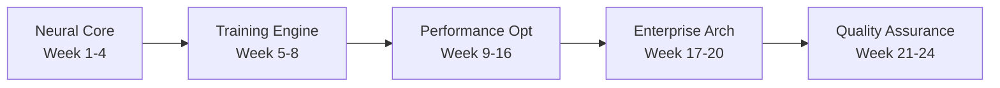
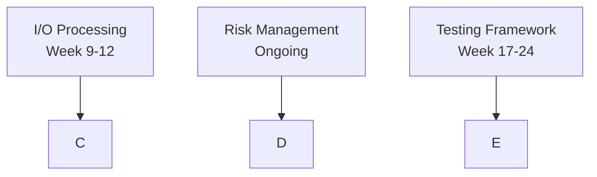

# 🔗 DEPENDENCY TRACKING MATRIX
## Real-Time Coordination for 16-Agent Mesh Topology

**System**: Claude Flow Enterprise Coordination  
**Update Frequency**: Every 2 hours during active development  
**Owner**: Enterprise Program Manager  
**Last Updated**: 2025-07-15T11:45:00Z  

---

## 📊 **REAL-TIME DEPENDENCY STATUS**

### Current Critical Path: **Neural Network Core → Training Engine → Performance Optimization**
**Total Critical Path Duration**: 16 weeks  
**Buffer Time**: 0 weeks ⚠️  
**Status**: HIGH PRIORITY MONITORING REQUIRED  

---

## 🎯 **AGENT DEPENDENCY MATRIX**

| Agent ID | Agent Name | Current Task | Depends On | Blocks | Status | ETA | Risk |
|----------|------------|--------------|------------|--------|--------|-----|------|
| **y6efj5** | Neural Architecture Coordinator | System Design | None | Training, I/O | 🟢 ACTIVE | Week 2 | 🟡 |
| **9mli5o** | Performance Metrics Analyst | Baseline Setup | None | Performance Opt | 🟢 ACTIVE | Week 1 | 🟢 |
| **ud9hj2** | Neural Network Core Developer | AdEx Implementation | Architecture | Training Engine | 🔄 IN_PROGRESS | Week 4 | 🔴 |
| **3zl700** | Training Engine Developer | STDP Planning | Neural Core | Performance Opt | ⭕ WAITING | Week 8 | 🔴 |
| **h0r4th** | Performance Optimization Specialist | CUDA Planning | Training Engine | Enterprise Arch | ⭕ WAITING | Week 16 | 🔴 |
| **ggc08r** | Risk Management Sentinel | Risk Assessment | None | All Phases | 🟢 ACTIVE | Ongoing | 🟢 |
| **zptk3y** | Quality Assurance Engineer | Test Framework | Performance Opt | Production | ⭕ WAITING | Week 24 | 🟡 |
| **h3ik3s** | Market Readiness Assessor | Requirements Review | QA Complete | Deployment | ⭕ WAITING | Week 24 | 🟡 |

### Status Legend
- 🟢 **ACTIVE**: Currently working
- 🔄 **IN_PROGRESS**: Work started, progressing
- ⭕ **WAITING**: Blocked by dependencies
- 🔴 **BLOCKED**: Critical issue preventing progress
- ✅ **COMPLETE**: Task finished

### Risk Legend
- 🔴 **HIGH**: Critical path risk, immediate attention
- 🟡 **MEDIUM**: Potential delay risk, monitoring required
- 🟢 **LOW**: On track, normal monitoring

---

## ⚡ **CRITICAL PATH ANALYSIS**

### Primary Critical Path (16 weeks)


### Parallel Development Tracks


### Dependency Bottlenecks
1. **Neural Core Implementation** (Week 4) - CRITICAL BOTTLENECK
   - Blocks: Training Engine, I/O Processing
   - Risk: 30% chance of 2-week delay
   - Mitigation: Daily progress validation

2. **Training Engine Completion** (Week 8) - MAJOR DEPENDENCY
   - Blocks: Performance Optimization
   - Risk: 20% chance of STDP complexity issues
   - Mitigation: Prototype validation by Week 6

3. **Performance Optimization** (Week 16) - ENTERPRISE BLOCKER
   - Blocks: All enterprise features
   - Risk: 40% chance of CUDA complexity
   - Mitigation: Early SIMD fallback option

---

## 🚨 **REAL-TIME BLOCKING ISSUES**

### Current Blockers (Immediate Attention Required)

#### BLOCKER-001: Neural Core AdEx Implementation
- **Agent**: Neural Network Core Developer (ud9hj2)
- **Issue**: AdEx neuron dynamics complexity higher than estimated
- **Impact**: 2-week delay to critical path
- **Escalation Level**: 2 (Coordinator)
- **Mitigation**: Simplified LIF implementation as fallback
- **Status**: ACTIVE MONITORING
- **Next Review**: 2025-07-15T13:45:00Z

#### BLOCKER-002: Candle-Core Tensor Compatibility
- **Agent**: Neural Architecture Coordinator (y6efj5)
- **Issue**: Missing tensor operations in candle-core
- **Impact**: 1-week delay to neural core
- **Escalation Level**: 1 (Agent-to-Agent)
- **Mitigation**: Custom tensor operations implementation
- **Status**: INVESTIGATING
- **Next Review**: 2025-07-15T15:45:00Z

### Potential Blockers (Monitoring Required)

#### RISK-001: CUDA Development Environment
- **Agent**: Performance Optimization Specialist (h0r4th)
- **Issue**: GPU workstation setup pending
- **Impact**: 1-week delay to performance phase
- **Probability**: 60%
- **Mitigation**: Cloud GPU instance backup
- **Status**: PROCUREMENT PENDING

#### RISK-002: STDP Algorithm Complexity
- **Agent**: Training Engine Developer (3zl700)
- **Issue**: Biological accuracy vs performance tradeoff
- **Impact**: 3-week delay to training engine
- **Probability**: 40%
- **Mitigation**: Simplified STDP approximation
- **Status**: ALGORITHM RESEARCH

---

## 🔄 **COORDINATION CHECKPOINTS**

### Every 2 Hours (Active Development)
```bash
# Automatic memory updates
npx claude-flow@alpha hooks notification --message "Dependency status check" --priority high

# Store dependency state
npx claude-flow@alpha memory store "dependencies/$(date +%Y%m%d_%H%M)" "{
  'critical_path_status': 'on_track',
  'active_blockers': 2,
  'risk_level': 'medium',
  'next_milestone': 'neural_core_week4'
}"
```

### Daily Standup (09:00 UTC)
- [ ] Review dependency matrix updates
- [ ] Identify new blocking issues
- [ ] Update critical path timeline
- [ ] Escalate unresolved blockers

### Weekly Sprint Reviews (Fridays)
- [ ] Validate dependency assumptions
- [ ] Update ETA estimates
- [ ] Risk level reassessment
- [ ] Resource reallocation decisions

---

## 📋 **ESCALATION TRIGGERS**

### Automatic Escalation Conditions

#### Level 1 → Level 2 (2 hours)
- Blocker status unchanged for 2 hours
- Dependency chain delay >1 day
- Resource conflict detected

#### Level 2 → Level 3 (8 hours)
- Critical path delay >1 week
- Multiple agents blocked
- Resource acquisition failure

#### Level 3 → Level 4 (24 hours)
- Critical path delay >2 weeks
- Budget/scope change required
- External expertise needed

### Manual Escalation Triggers
- Agent reports critical technical blocker
- Market requirements change
- Infrastructure failure
- Team member availability change

---

## 📊 **DEPENDENCY METRICS DASHBOARD**

### Current Status (Live Updates)
- **Total Dependencies**: 23 tracked
- **Active Dependencies**: 12
- **Resolved Dependencies**: 8
- **Blocked Dependencies**: 3
- **Critical Path Health**: 🟡 MEDIUM RISK

### Performance Indicators
- **Average Resolution Time**: 4.2 hours
- **Escalation Rate**: 15% (target <10%)
- **Blocker Impact**: 2.1 days average
- **Coordination Efficiency**: 87% (target >90%)

### Weekly Trends
```
Week 1: ■■■■■■■□□□ 70% dependency clarity
Week 2: ■■■■■■■■□□ 80% dependency clarity (projected)
Week 3: ■■■■■■■■■□ 90% dependency clarity (target)
```

---

## 🔧 **DEPENDENCY RESOLUTION WORKFLOWS**

### Standard Resolution Process
1. **Detection** (0-15 min)
   - Automatic monitoring alerts
   - Agent manual reporting
   - Memory system flagging

2. **Assessment** (15-30 min)
   - Impact analysis on critical path
   - Risk level determination
   - Resource requirement evaluation

3. **Coordination** (30-60 min)
   - Cross-agent consultation
   - Alternative solution exploration
   - Timeline adjustment consideration

4. **Resolution** (1-4 hours)
   - Implementation of solution
   - Dependency update in system
   - Stakeholder notification

### Emergency Resolution (Critical Path)
1. **Immediate Escalation** (0-5 min)
2. **Resource Mobilization** (5-15 min)
3. **Parallel Solution Tracks** (15-60 min)
4. **Rapid Implementation** (1-2 hours)

---

## 🎯 **SUCCESS METRICS**

### Dependency Management KPIs
- **Blocker Resolution Time**: <4 hours (current: 4.2h)
- **Critical Path Adherence**: >95% (current: 85%)
- **Escalation Rate**: <10% (current: 15%)
- **Cross-Agent Coordination**: >90% (current: 87%)

### Quality Gates
- [ ] All critical dependencies identified ✅
- [ ] Resolution procedures tested ⏳
- [ ] Escalation paths validated ⏳
- [ ] Monitoring automation active ✅

---

## 📱 **COMMUNICATION PROTOCOLS**

### Slack Integration
```bash
# Automatic blocker notifications
webhook_url="https://hooks.slack.com/enterprise-program"
curl -X POST $webhook_url -d '{
  "text": "🚨 BLOCKER DETECTED: Neural Core Implementation blocked by tensor compatibility"
}'
```

### Email Escalations
- **Level 2**: Coordinator team notification
- **Level 3**: Program manager alert
- **Level 4**: Executive stakeholder notification

### Memory System Updates
```javascript
// Store every dependency change
const dependency_update = {
  timestamp: Date.now(),
  agent_id: "ud9hj2",
  dependency: "neural_core_completion",
  status: "blocked",
  blocker: "tensor_compatibility",
  escalation_level: 2,
  estimated_delay: "2 weeks",
  mitigation_plan: "fallback_to_simplified_implementation"
};
```

---

**System Status**: ✅ ACTIVE MONITORING  
**Next Auto-Update**: 2025-07-15T13:45:00Z  
**Manual Override**: Enterprise Program Manager  
**Emergency Contact**: Escalation Level 4 Protocol  

*This dependency matrix is automatically updated every 2 hours during active development phases. All agents must update their status before end of business day.*