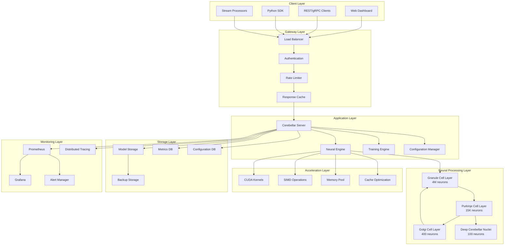
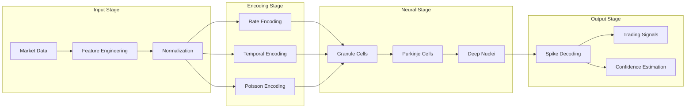
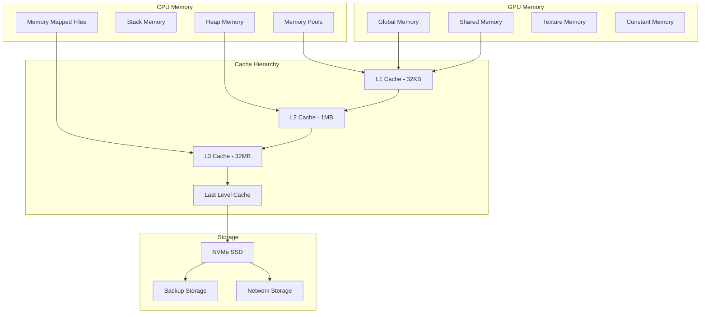
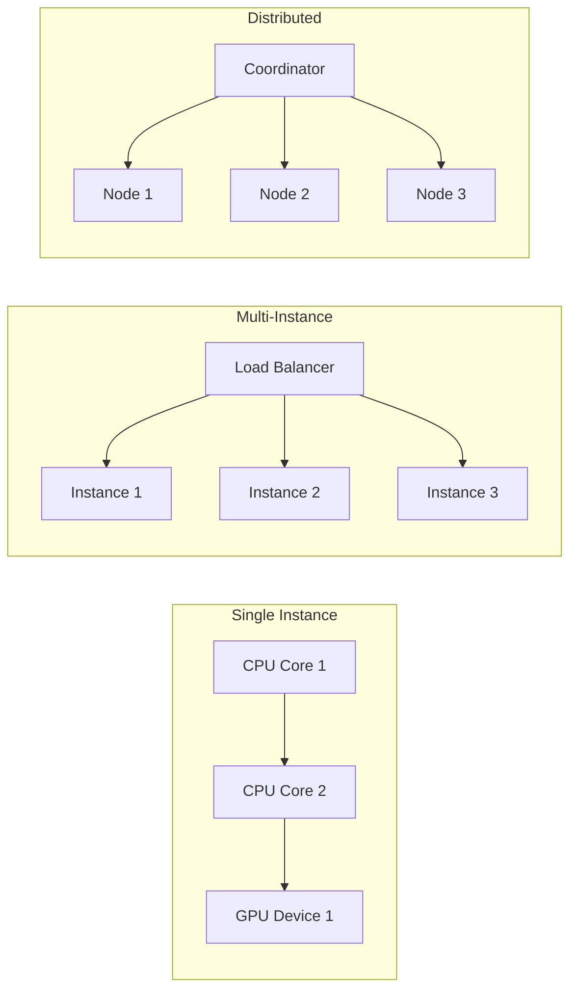
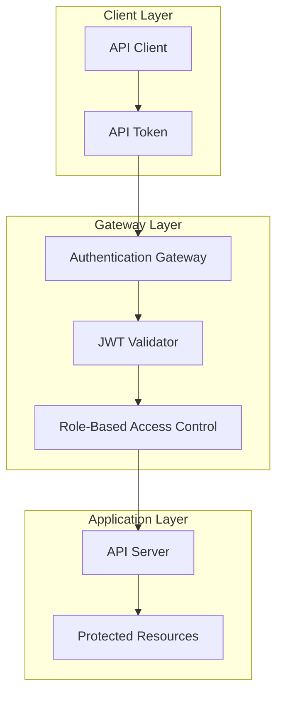
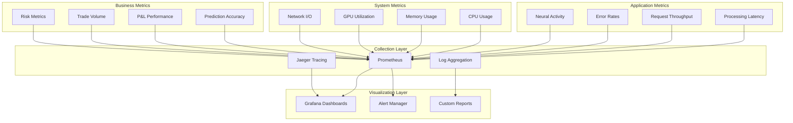
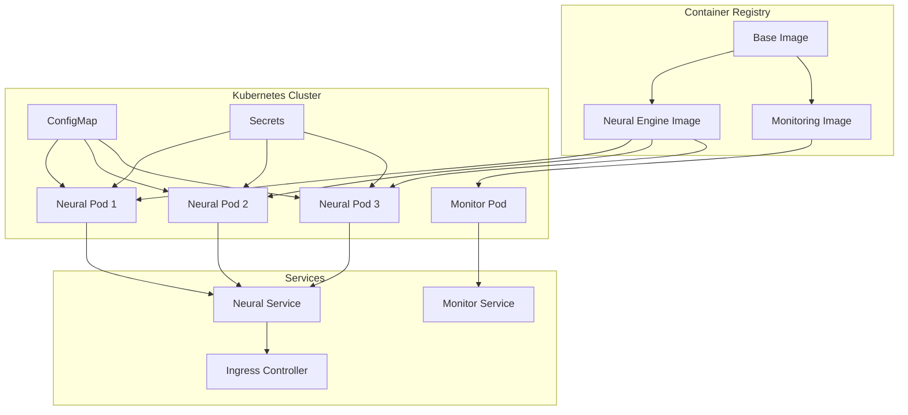

# System Architecture

## Overview

The Cerebellar-Norse system is designed as a high-performance, biologically-inspired spiking neural network optimized for ultra-low latency applications. This document provides a comprehensive overview of the system architecture, component interactions, and design decisions.

## High-Level Architecture



## Core Components

### 1. Neural Engine

The Neural Engine is the core component responsible for spike-based neural computation.

#### Architecture
```rust
pub struct NeuralEngine {
    /// Cerebellar microcircuit implementation
    circuit: CerebellarCircuit,
    
    /// Input preprocessing pipeline
    input_processor: InputProcessor,
    
    /// Output decoding pipeline
    output_decoder: OutputDecoder,
    
    /// Performance optimization components
    accelerator: AccelerationEngine,
    
    /// Metrics collection
    metrics_collector: MetricsCollector,
}
```

#### Key Features
- **Biologically Accurate Modeling**: Implements cerebellar microcircuit with realistic connectivity
- **Ultra-Low Latency**: Optimized for sub-microsecond processing times
- **CUDA Acceleration**: GPU-accelerated spike processing
- **Memory Efficiency**: Zero-allocation hot paths with memory pooling

#### Processing Pipeline
1. **Input Encoding**: Convert market data to spike patterns
2. **Neural Propagation**: Process spikes through cerebellar layers
3. **Output Decoding**: Convert spike patterns to trading signals
4. **Metrics Collection**: Gather performance and neural metrics

### 2. Training Engine

The Training Engine implements both biological and artificial learning algorithms.

```rust
pub struct TrainingEngine {
    /// STDP (Spike-Timing Dependent Plasticity) engine
    stdp_engine: STDPEngine,
    
    /// Supervised learning trainer
    supervised_trainer: SupervisedTrainer,
    
    /// Optimization algorithms
    optimizer: Optimizer,
    
    /// Training data pipeline
    data_pipeline: DataPipeline,
    
    /// Validation and testing framework
    validator: ModelValidator,
}
```

#### Learning Mechanisms
- **STDP Learning**: Unsupervised, biologically-inspired plasticity
- **Supervised Learning**: Error-driven learning with climbing fibers
- **Hybrid Learning**: Combined STDP and supervised approaches
- **Meta-Learning**: Learning to learn efficiently

### 3. Acceleration Engine

Provides hardware-specific optimizations for maximum performance.

```rust
pub struct AccelerationEngine {
    /// CUDA kernel manager
    cuda_manager: CudaKernelManager,
    
    /// SIMD operation dispatcher
    simd_dispatcher: SIMDDispatcher,
    
    /// Memory management system
    memory_manager: MemoryManager,
    
    /// Cache optimization system
    cache_optimizer: CacheOptimizer,
}
```

#### Optimization Techniques
- **CUDA Parallelization**: Thousands of neurons processed simultaneously
- **SIMD Vectorization**: 8-way parallel operations on CPU
- **Memory Pool Management**: Pre-allocated, reusable memory blocks
- **Cache-Aware Data Structures**: Optimized for L1/L2/L3 cache hierarchies

## Neural Architecture Details

### Cerebellar Microcircuit

The system implements a biologically accurate cerebellar microcircuit:

```
Input Layer (Market Data)
    ↓ (Mossy Fibers)
Granule Cell Layer (4M neurons)
    ↓ (Parallel Fibers) ← Golgi Cells (Inhibitory Feedback)
Purkinje Cell Layer (15K neurons)
    ↓ (Inhibitory Output) ← Climbing Fibers (Error Signals)
Deep Cerebellar Nuclei (100 neurons)
    ↓
Output Layer (Trading Signals)
```

### Layer Specifications

#### Granule Cell Layer
- **Function**: Input expansion and sparse coding
- **Neuron Type**: Leaky Integrate-and-Fire (LIF)
- **Count**: 4,000,000 neurons
- **Connectivity**: 4-5 mossy fiber inputs per neuron
- **Dynamics**: Fast membrane dynamics (τ_mem = 8ms)

```rust
pub struct GranuleCellLayer {
    neurons: Vec<LIFNeuron>,           // 4M neurons
    mossy_fiber_weights: SparseMatrix,  // Input connections
    golgi_feedback: InhibitoryConnections,
    spike_buffer: SpikeBuffer,
}
```

#### Purkinje Cell Layer
- **Function**: Main pattern classification and computation
- **Neuron Type**: Adaptive Exponential (AdEx)
- **Count**: 15,000 neurons
- **Connectivity**: ~200K parallel fiber inputs per neuron
- **Dynamics**: Complex adaptive behavior with spike-frequency adaptation

```rust
pub struct PurkinjeCellLayer {
    neurons: Vec<AdExNeuron>,           // 15K neurons
    parallel_fiber_weights: SparseMatrix, // 200K inputs per neuron
    climbing_fiber_weights: DenseMatrix,   // 1:1 error signals
    dendrite_tree: DendriteSimulation,
}
```

#### Golgi Cell Layer
- **Function**: Inhibitory feedback and gain control
- **Neuron Type**: LIF with extended refractory period
- **Count**: 400 neurons
- **Connectivity**: Sparse feedback to granule cells (2% connectivity)

#### Deep Cerebellar Nuclei
- **Function**: Output processing and motor command generation
- **Neuron Type**: AdEx with strong adaptation
- **Count**: 100 neurons
- **Connectivity**: Convergent input from Purkinje cells (30% connectivity)

## Data Flow Architecture

### Input Processing Pipeline



### Memory Architecture



## Performance Architecture

### Latency Optimization

The system employs multiple strategies to achieve sub-microsecond latency:

1. **Hardware Optimization**
   - CUDA GPU acceleration for parallel processing
   - SIMD CPU instructions for vectorized operations
   - Memory-mapped files for large datasets
   - NUMA-aware memory allocation

2. **Software Optimization**
   - Zero-allocation hot paths
   - Lock-free data structures
   - Branchless programming techniques
   - Cache-optimized algorithms

3. **Neural Optimization**
   - Sparse connectivity patterns
   - Pre-computed lookup tables
   - Quantized weights and activations
   - Early termination strategies

### Throughput Scaling



## Security Architecture

### Authentication and Authorization



### Security Measures

1. **Network Security**
   - TLS 1.3 encryption for all communications
   - Certificate-based authentication
   - API rate limiting and DDoS protection
   - Network segmentation and firewalls

2. **Application Security**
   - Input validation and sanitization
   - Memory safety (Rust benefits)
   - Secure configuration management
   - Regular security audits

3. **Data Security**
   - Encryption at rest and in transit
   - Secure key management
   - Data anonymization
   - Audit logging

## Monitoring and Observability

### Metrics Collection



### Distributed Tracing

The system implements distributed tracing to track requests across components:

```rust
use opentelemetry::trace::Tracer;

#[tracing::instrument]
async fn process_market_data(data: MarketData) -> Result<TradingSignals> {
    let span = tracer.start("neural_processing");
    
    // Input encoding
    let encoded = encode_market_data(&data).await?;
    span.add_event("input_encoded".to_string());
    
    // Neural computation
    let neural_output = neural_engine.process(&encoded).await?;
    span.add_event("neural_computed".to_string());
    
    // Output decoding
    let signals = decode_neural_output(&neural_output).await?;
    span.add_event("output_decoded".to_string());
    
    span.end();
    Ok(signals)
}
```

## Deployment Architecture

### Container Architecture



### High Availability

1. **Redundancy**
   - Multiple service instances
   - Database replication
   - Cross-region deployment

2. **Load Balancing**
   - Round-robin request distribution
   - Health check-based routing
   - Automatic failover

3. **Disaster Recovery**
   - Automated backups
   - Point-in-time recovery
   - Geographic distribution

## Configuration Management

### Hierarchical Configuration

```toml
# Base configuration
[neural.base]
neuron_model = "LIF"
time_step = 1.0
simulation_time = 100.0

# Environment-specific overrides
[neural.development]
granule_size = 10000
debug_mode = true
logging_level = "debug"

[neural.production]
granule_size = 4000000
debug_mode = false
logging_level = "info"
cuda_enabled = true
```

### Dynamic Configuration

The system supports runtime configuration updates without restart:

```rust
impl ConfigurationManager {
    pub async fn update_configuration(&mut self, updates: ConfigUpdates) -> Result<()> {
        // Validate configuration changes
        self.validate_updates(&updates)?;
        
        // Apply updates atomically
        self.apply_updates(updates).await?;
        
        // Notify components of changes
        self.broadcast_config_change().await?;
        
        Ok(())
    }
}
```

## Design Principles

### 1. Performance First
- Every design decision optimized for latency and throughput
- Hardware-specific optimizations
- Minimal abstraction overhead

### 2. Biological Accuracy
- Faithful implementation of cerebellar microcircuit
- Realistic neuron models and connectivity
- Biologically plausible learning rules

### 3. Scalability
- Horizontal scaling capabilities
- Resource-efficient design
- Modular architecture

### 4. Reliability
- Fault tolerance and graceful degradation
- Comprehensive monitoring and alerting
- Automated recovery procedures

### 5. Security
- Defense in depth
- Principle of least privilege
- Regular security audits

---

*This architecture document is maintained by the Cerebellar-Norse development team and updated with each major release.*