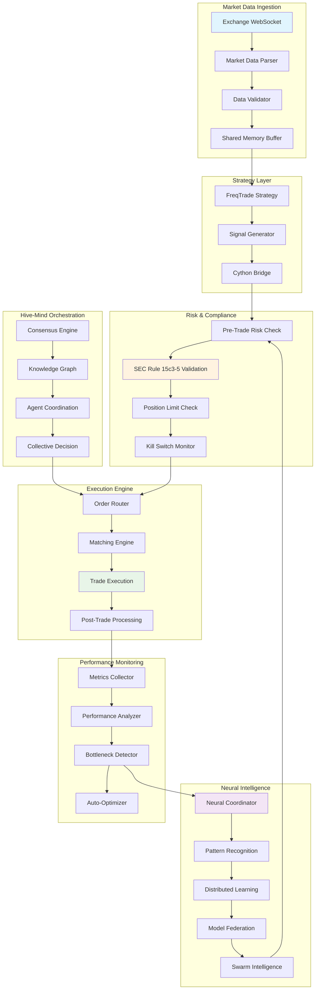
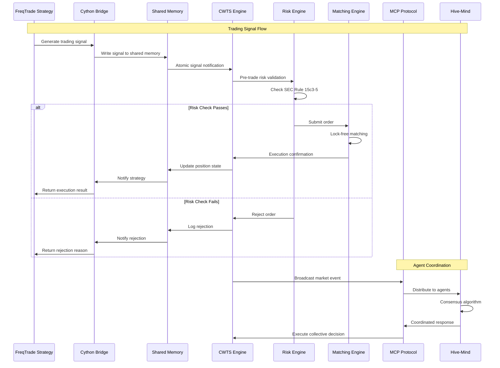
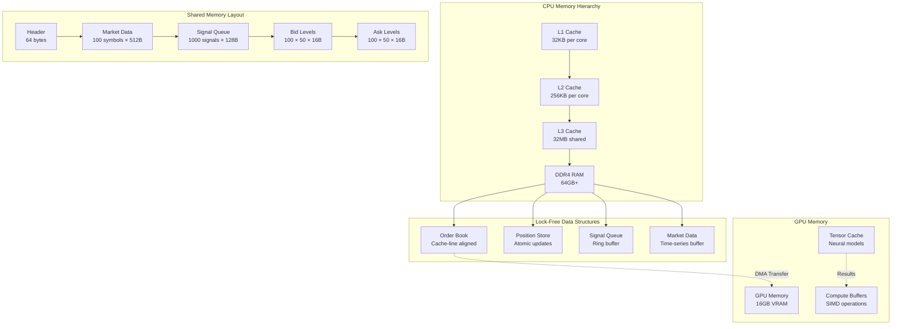
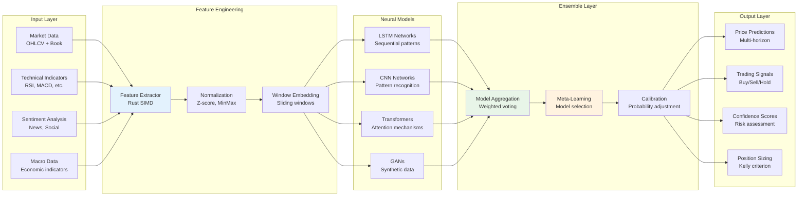
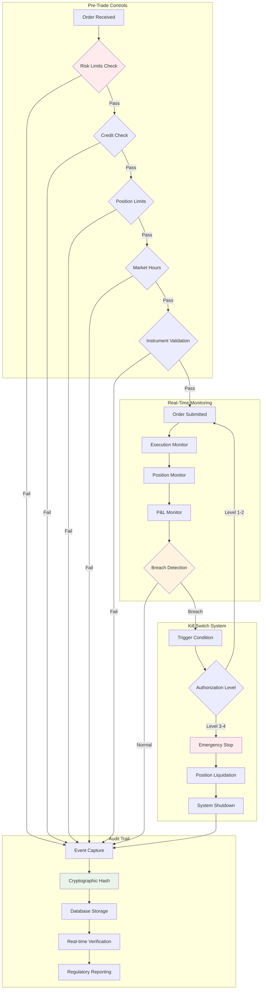

# CWTS-Ultra Component Interaction Diagrams

## System Overview Architecture

```mermaid
C4Component
    title CWTS-Ultra System Architecture

    Container_Boundary(hive, "Hive-Mind Orchestrator") {
        Component(consensus, "Consensus Engine", "Rust", "Byzantine fault tolerant coordination")
        Component(knowledge, "Knowledge Graph", "Rust", "Distributed learning and memory")
        Component(swarm, "Swarm Intelligence", "Rust", "Multi-agent coordination")
    }

    Container_Boundary(core, "CWTS Core Engine") {
        Component(matching, "Matching Engine", "Rust", "Lock-free order matching")
        Component(risk, "Risk Engine", "Rust", "SEC Rule 15c3-5 compliance")
        Component(neural, "Neural Models", "Rust+Candle", "ML inference and prediction")
        Component(execution, "Execution Engine", "Rust", "Order routing and execution")
    }

    Container_Boundary(python, "Python Integration Layer") {
        Component(freqtrade, "FreqTrade", "Python", "Strategy execution framework")
        Component(cython, "Cython Bridge", "Cython", "Ultra-low latency bindings")
        Component(strategies, "Trading Strategies", "Python", "ML-based trading logic")
    }

    Container_Boundary(parasitic, "Parasitic System") {
        Component(organisms, "Bio Algorithms", "Rust", "Organism-inspired trading")
        Component(quantum, "Quantum Sim", "Rust", "Quantum-inspired optimization")
        Component(evolution, "Evolution Engine", "Rust", "Genetic algorithm optimization")
    }

    Container_Boundary(acceleration, "Acceleration Layer") {
        Component(gpu, "GPU Kernels", "CUDA/HIP", "Neural network acceleration")
        Component(simd, "SIMD Ops", "Rust", "Vectorized mathematical operations")
        Component(memory, "Memory Manager", "Rust", "Lock-free memory allocation")
    }

    Container_Boundary(data, "Data Layer") {
        Component(market, "Market Data", "WebSocket", "Real-time market feeds")
        Component(cache, "Redis Cache", "Redis", "Hot data storage")
        Component(timeseries, "InfluxDB", "InfluxDB", "Time-series data")
        Component(postgres, "PostgreSQL", "SQL", "Compliance and audit data")
    }

    Rel(hive, core, "Orchestrates", "MCP Protocol")
    Rel(core, python, "Communicates", "Shared Memory IPC")
    Rel(python, cython, "Calls", "Native C API")
    Rel(cython, core, "Accesses", "Direct Memory")
    Rel(core, parasitic, "Coordinates", "Internal API")
    Rel(core, acceleration, "Offloads", "Compute Tasks")
    Rel(all, data, "Reads/Writes", "Various Protocols")
```

## Data Flow Architecture



## Inter-Process Communication Patterns



## Memory Layout and Performance Architecture



## Neural Network Architecture Integration



## Compliance and Audit Flow



## Performance Optimization Pipeline

```mermaid
graph TB
    subgraph "Latency Optimization"
        LO1[Profile Critical Path]
        LO2[SIMD Vectorization]
        LO3[Cache Optimization]
        LO4[Branch Prediction]
        LO5[Memory Prefetching]
    end

    subgraph "Throughput Optimization"
        TO1[Lock-Free Algorithms]
        TO2[Batch Processing]
        TO3[Pipeline Parallelism]
        TO4[Work Stealing]
        TO5[Load Balancing]
    end

    subgraph "Memory Optimization"
        MO1[Memory Pool Allocation]
        MO2[Cache-Line Alignment]
        MO3[Data Structure Packing]
        MO4[Garbage Collection Tuning]
        MO5[Memory Mapping]
    end

    subgraph "Network Optimization"
        NO1[Zero-Copy Networking]
        NO2[Kernel Bypass]
        NO3[Connection Pooling]
        NO4[Protocol Optimization]
        NO5[Load Balancing]
    end

    subgraph "GPU Acceleration"
        GA1[Tensor Operations]
        GA2[Parallel Inference]
        GA3[Memory Transfer Optimization]
        GA4[Kernel Fusion]
        GA5[Mixed Precision]
    end

    LO1 --> LO2 --> LO3 --> LO4 --> LO5
    TO1 --> TO2 --> TO3 --> TO4 --> TO5
    MO1 --> MO2 --> MO3 --> MO4 --> MO5
    NO1 --> NO2 --> NO3 --> NO4 --> NO5
    GA1 --> GA2 --> GA3 --> GA4 --> GA5

    LO5 -.-> TO1
    TO5 -.-> MO1
    MO5 -.-> NO1
    NO5 -.-> GA1

    style LO3 fill:#e3f2fd
    style TO1 fill:#e8f5e8
    style MO2 fill:#fff3e0
    style NO2 fill:#f3e5f5
    style GA2 fill:#fce4ec
```



## Deployment and Scaling Architecture

```mermaid
C4Deployment
    title CWTS-Ultra Deployment Architecture

    Deployment_Node(lb, "Load Balancer", "NGINX/HAProxy") {
        Container(proxy, "API Gateway", "Kong/Envoy")
    }

    Deployment_Node(k8s, "Kubernetes Cluster", "Production") {
        Deployment_Node(core, "Core Services", "High-Performance Nodes") {
            Container(engine, "CWTS Engine", "Rust")
            Container(matching, "Matching Engine", "Rust")
            Container(risk, "Risk Engine", "Rust")
        }
        
        Deployment_Node(ml, "ML Services", "GPU Nodes") {
            Container(neural, "Neural Models", "Rust+Candle")
            Container(training, "Model Training", "Python")
            Container(inference, "Inference Service", "Rust")
        }
        
        Deployment_Node(python, "Python Services", "Standard Nodes") {
            Container(freqtrade, "FreqTrade", "Python")
            Container(strategies, "Strategies", "Python")
            Container(analytics, "Analytics", "Python")
        }
        
        Deployment_Node(data, "Data Services", "Storage-Optimized") {
            ContainerDb(redis, "Redis", "Cache/Session")
            ContainerDb(influx, "InfluxDB", "Time Series")
            ContainerDb(postgres, "PostgreSQL", "Relational")
        }
    }

    Deployment_Node(monitoring, "Monitoring", "Observability Stack") {
        Container(prometheus, "Prometheus", "Metrics")
        Container(grafana, "Grafana", "Dashboards")
        Container(jaeger, "Jaeger", "Tracing")
        Container(elk, "ELK Stack", "Logs")
    }

    Rel(lb, proxy, "Routes Traffic")
    Rel(proxy, core, "API Calls")
    Rel(core, ml, "ML Inference")
    Rel(core, python, "Strategy Execution")
    Rel(core, data, "Data Access")
    Rel_U(monitoring, k8s, "Monitors")
```

---

*Generated by: CWTS-Ultra Architecture Assessment Team*  
*Date: September 5, 2025*  
*Version: 1.0*