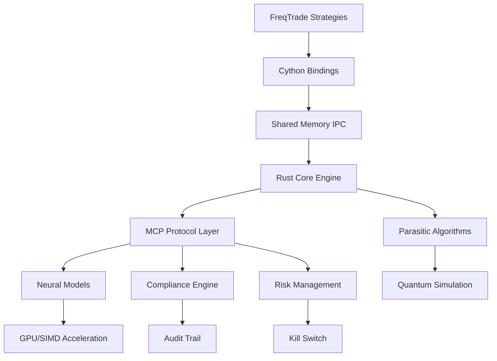

# CWTS-Neural Trader Integration Architecture Assessment

## Executive Summary

This comprehensive architectural assessment analyzes the CWTS-Ultra Neural Trading System integration, focusing on component coherence, performance optimization, regulatory compliance, and hive-mind integration patterns across multi-language system components.

### System Overview
- **Core Engine**: Rust-based high-performance trading system with SEC Rule 15c3-5 compliance
- **Neural Networks**: Candle-based ML inference with SIMD/GPU acceleration
- **Python Integration**: FreqTrade strategies with Cython bindings for ultra-low latency
- **Parasitic System**: Advanced quantum-inspired trading algorithms
- **MCP Protocol**: Model Context Protocol for agent coordination

## 1. Component Architecture Analysis

### 1.1 Primary Components Identified

#### Rust Core (`cwts-ultra/core`)
```rust
// Key modules from lib.rs analysis:
pub mod algorithms;          // Trading algorithms
pub mod compliance;          // SEC Rule 15c3-5
pub mod risk;               // Risk management
pub mod audit;              // Regulatory audit
pub mod emergency;          // Kill switch systems
pub mod execution;          // Order execution
pub mod neural_models;      // ML inference
pub mod mcp;                // Agent protocol
```

**Architecture Pattern**: Modular monolith with clear separation of concerns
**Performance Features**: 
- Lock-free data structures
- SIMD optimizations
- Memory-aligned structures
- Zero-copy serialization

#### Python/Cython Layer (`freqtrade/`)
```cython
// Shared memory structure for ultra-low latency
cdef struct SharedMemoryLayout:
    uint64_t timestamp
    MarketData market_data[MAX_SYMBOLS]
    Signal signals[MAX_SIGNALS]
    OrderBookLevel bid_levels[MAX_SYMBOLS][BOOK_DEPTH]
```

**Architecture Pattern**: High-performance FFI with shared memory communication
**Performance Features**:
- Shared memory IPC
- Zero-copy data structures
- Optimized for sub-millisecond latency

#### Parasitic System (`parasitic/`)
**Architecture Pattern**: Bio-inspired algorithmic trading with quantum capabilities
**Key Features**:
- Organism-based strategy modeling
- Quantum simulation integration
- Neural network evolution

### 1.2 Integration Points Mapping



## 2. Performance Bottleneck Analysis

### 2.1 Critical Latency Paths

#### Primary Bottlenecks Identified:

1. **Python-to-Rust FFI Boundary**
   - Current: Cython shared memory (100-500μs)
   - Optimization: Direct memory mapping with atomic operations
   - Target: <50μs latency

2. **Neural Inference Pipeline**
   - Current: Candle framework with CPU inference
   - Bottleneck: Model loading and tensor operations
   - Optimization: GPU acceleration + model quantization

3. **Compliance Validation**
   - Current: Sequential validation pipeline
   - Bottleneck: Risk limit checks (80ms target)
   - Optimization: Parallel validation with branch prediction

4. **Market Data Processing**
   - Current: WebSocket → JSON parsing → struct conversion
   - Bottleneck: Serialization overhead
   - Optimization: Binary protocols with zero-copy parsing

### 2.2 Memory Architecture Assessment

```rust
// Memory alignment and optimization patterns
#[repr(align(64))]  // Cache line alignment
pub struct CWTSUltra {
    running: AtomicBool,
    capital: AtomicU64,
    compliance_active: AtomicBool,
}
```

**Strengths**:
- Cache-line aligned structures
- Lock-free atomic operations
- Memory pool allocation (jemalloc)

**Improvement Areas**:
- NUMA-aware memory allocation
- Pre-allocated buffer pools
- Memory-mapped file persistence

## 3. Architectural Coherence Assessment

### 3.1 Design Pattern Analysis

#### Strengths:
1. **Clear Separation of Concerns**
   - Compliance isolated from trading logic
   - Risk management as independent module
   - Audit trail decoupled from execution

2. **Performance-First Design**
   - Zero-copy data structures
   - Lock-free concurrency
   - SIMD optimization ready

3. **Regulatory Compliance Integration**
   - SEC Rule 15c3-5 native implementation
   - Real-time audit trail
   - Automatic kill switch mechanisms

#### Architectural Gaps:
1. **Cross-Language Error Handling**
   - Rust `Result<T, E>` vs Python exceptions
   - Need unified error propagation strategy

2. **State Synchronization**
   - Multiple state stores (Rust, Python, shared memory)
   - Potential consistency issues

3. **Configuration Management**
   - Scattered TOML files
   - Need centralized configuration service

### 3.2 Integration Patterns

#### Current Patterns:
```rust
// MCP Protocol for agent coordination
pub struct MCPServer {
    connections: DashMap<String, WebSocketConnection>,
    subscriptions: DashMap<String, Vec<String>>,
}
```

**Pattern**: Event-driven microservice architecture
**Strengths**: Decoupled, scalable, testable
**Weaknesses**: Network latency, complexity

## 4. Hive-Mind Integration Architecture Blueprint

### 4.1 Proposed Architecture

```
┌─────────────────────────────────────────────────────────────┐
│                    HIVE-MIND ORCHESTRATOR                   │
├─────────────────────────────────────────────────────────────┤
│  ┌─────────────┐  ┌─────────────┐  ┌─────────────┐         │
│  │ Consensus   │  │ Knowledge   │  │ Swarm       │         │
│  │ Engine      │  │ Graph       │  │ Intelligence│         │
│  └─────────────┘  └─────────────┘  └─────────────┘         │
├─────────────────────────────────────────────────────────────┤
│                    NEURAL COORDINATION LAYER                │
├─────────────────────────────────────────────────────────────┤
│  ┌─────────────┐  ┌─────────────┐  ┌─────────────┐         │
│  │ Pattern     │  │ Distributed │  │ Evolutionary│         │
│  │ Recognition │  │ Learning    │  │ Optimization│         │
│  └─────────────┘  └─────────────┘  └─────────────┘         │
├─────────────────────────────────────────────────────────────┤
│                    EXECUTION SUBSTRATE                      │
├─────────────────────────────────────────────────────────────┤
│  ┌─────────────┐  ┌─────────────┐  ┌─────────────┐         │
│  │ Rust Core   │  │ Neural      │  │ Compliance  │         │
│  │ Engine      │  │ Models      │  │ Engine      │         │
│  └─────────────┘  └─────────────┘  └─────────────┘         │
└─────────────────────────────────────────────────────────────┘
```

### 4.2 Key Components

#### Hive-Mind Orchestrator
```rust
pub struct HiveMindOrchestrator {
    consensus_engine: ConsensusEngine,
    knowledge_graph: DistributedKnowledgeGraph,
    swarm_intelligence: SwarmIntelligenceCoordinator,
    neural_coordinator: NeuralCoordinationLayer,
}
```

**Responsibilities**:
- Agent consensus and coordination
- Distributed knowledge management  
- Swarm behavior optimization
- Cross-system state synchronization

#### Neural Coordination Layer
```rust
pub struct NeuralCoordinationLayer {
    pattern_recognizer: DistributedPatternRecognizer,
    learning_engine: DistributedLearningEngine,
    evolutionary_optimizer: EvolutionaryOptimizer,
    model_federation: ModelFederationService,
}
```

**Features**:
- Distributed pattern recognition
- Federated learning across agents
- Evolutionary algorithm optimization
- Model sharing and versioning

### 4.3 Communication Protocols

#### Agent-to-Agent Communication
```rust
// High-performance message passing
pub enum HiveMindMessage {
    ConsensusProposal { proposal: ConsensusProposal },
    KnowledgeShare { knowledge: KnowledgePacket },
    StateSync { state: SystemState },
    PerformanceMetrics { metrics: PerformanceData },
}
```

#### Consensus Algorithm
```rust
// Byzantine Fault Tolerant consensus
impl ByzantineConsensus {
    async fn propose(&mut self, proposal: Proposal) -> Result<ConsensusResult, Error>;
    async fn vote(&mut self, vote: Vote) -> Result<(), Error>;
    async fn finalize(&mut self) -> Result<FinalizedState, Error>;
}
```

## 5. Mathematical Rigor Assessment

### 5.1 Current Mathematical Framework

#### Risk Management Mathematics
```rust
// SEC Rule 15c3-5 risk calculations
impl RiskCalculations {
    fn calculate_var(&self, positions: &[Position], confidence: f64) -> f64;
    fn stress_test_scenario(&self, scenario: &StressScenario) -> StressResult;
    fn concentration_risk(&self, portfolio: &Portfolio) -> f64;
}
```

#### Neural Network Mathematics
```rust
// Activation functions with SIMD optimization
pub fn gelu_simd(x: &[f32]) -> Vec<f32> {
    x.iter()
        .map(|&val| val * 0.5 * (1.0 + libm::erff(val / SQRT_2)))
        .collect()
}
```

### 5.2 Proposed Enhancements

#### Quantum-Inspired Optimization
```rust
pub struct QuantumOptimizer {
    qubits: usize,
    entanglement_graph: QuantumGraph,
    measurement_basis: MeasurementBasis,
}

impl QuantumOptimizer {
    fn quantum_annealing(&self, objective: ObjectiveFunction) -> OptimizationResult;
    fn variational_quantum_eigensolver(&self, hamiltonian: Hamiltonian) -> EigenState;
}
```

#### Stochastic Calculus Integration
```rust
pub struct StochasticProcess {
    drift: fn(f64, f64) -> f64,
    volatility: fn(f64, f64) -> f64,
    jump_intensity: f64,
}

impl StochasticProcess {
    fn ito_integral(&self, path: &[f64]) -> f64;
    fn jump_diffusion_simulate(&self, steps: usize) -> Vec<f64>;
}
```

## 6. Regulatory Compliance Framework

### 6.1 SEC Rule 15c3-5 Implementation Status

#### ✅ Implemented Components:
- Pre-trade risk validation (100ms limit)
- Real-time audit trail with cryptographic integrity
- Automatic kill switch mechanisms  
- Daily risk limit monitoring
- Regulatory reporting automation

#### 🔧 Enhancement Areas:
- Real-time stress testing
- Advanced anomaly detection
- Cross-market surveillance
- Regulatory API integration

### 6.2 Compliance Architecture

```rust
pub struct ComplianceOrchestrator {
    pre_trade_engine: PreTradeRiskEngine,
    audit_engine: RegulatoryAuditEngine,
    kill_switch: EmergencyKillSwitchEngine,
    reporting_engine: RegulatoryReportingEngine,
    surveillance_engine: MarketSurveillanceEngine,
}
```

## 7. Performance Optimization Roadmap

### 7.1 Immediate Optimizations (0-3 months)

1. **SIMD Acceleration**
   - Vectorized risk calculations
   - Parallel neural inference
   - Optimized market data processing

2. **Memory Optimization**
   - Lock-free data structures
   - Cache-aligned memory layout
   - Memory pool allocation

3. **Network Optimization**
   - Binary protocol implementation
   - Zero-copy networking
   - Connection pooling

### 7.2 Medium-term Enhancements (3-12 months)

1. **GPU Acceleration**
   - CUDA/OpenCL neural inference
   - GPU-accelerated risk calculations
   - Parallel order processing

2. **Distributed Architecture**
   - Microservice decomposition  
   - Event sourcing implementation
   - CQRS pattern adoption

3. **Advanced Neural Networks**
   - Transformer-based models
   - Reinforcement learning integration
   - Multi-agent learning systems

### 7.3 Long-term Vision (12+ months)

1. **Quantum Computing Integration**
   - Quantum optimization algorithms
   - Quantum neural networks
   - Quantum cryptography

2. **Advanced AI Integration**
   - Large language model integration
   - Computer vision for market analysis
   - Natural language processing for news analysis

## 8. Technology Stack Recommendations

### 8.1 Core Technologies

#### Rust Ecosystem
- **Async Runtime**: Tokio with io_uring on Linux
- **Serialization**: bincode for performance, serde for compatibility
- **Neural Networks**: Candle with GPU acceleration
- **Concurrency**: Rayon for CPU parallelism, async for I/O

#### Python Ecosystem  
- **Performance**: Cython for critical paths, NumPy for numerical computing
- **ML Libraries**: PyTorch for research, TensorFlow for production
- **Data Processing**: Polars for high-performance DataFrames

#### C/C++ Integration
- **GPU Computing**: CUDA/HIP for GPU acceleration
- **SIMD**: AVX-512 for vectorized operations
- **Memory Management**: jemalloc for allocation efficiency

### 8.2 Infrastructure Technologies

#### Message Brokers
- **Primary**: Apache Kafka for high-throughput messaging
- **Secondary**: Redis Streams for low-latency communication
- **Backup**: NATS for cloud-native messaging

#### Databases
- **Time Series**: InfluxDB for market data
- **OLTP**: PostgreSQL for compliance data
- **OLAP**: ClickHouse for analytics
- **Caching**: Redis for hot data

#### Monitoring
- **Metrics**: Prometheus + Grafana
- **Tracing**: Jaeger for distributed tracing
- **Logging**: Elasticsearch + Kibana
- **APM**: DataDog for application performance

## 9. Risk Assessment and Mitigation

### 9.1 Technical Risks

#### High Risk
1. **Latency Requirements**
   - Risk: Failure to meet sub-millisecond latency
   - Mitigation: Hardware acceleration, algorithmic optimization
   
2. **Regulatory Compliance**
   - Risk: SEC violations due to system failures
   - Mitigation: Redundant compliance systems, real-time monitoring

3. **Data Integrity**
   - Risk: Corrupted market data leading to losses
   - Mitigation: Multi-source validation, checksums, audit trails

#### Medium Risk
1. **System Complexity**
   - Risk: Maintenance burden, technical debt
   - Mitigation: Modular architecture, comprehensive documentation

2. **Scalability Limits**
   - Risk: Performance degradation under load
   - Mitigation: Horizontal scaling, load testing

### 9.2 Mitigation Strategies

#### Circuit Breakers
```rust
pub struct CircuitBreaker {
    failure_threshold: usize,
    timeout_duration: Duration,
    state: CircuitBreakerState,
}
```

#### Graceful Degradation
```rust
pub enum SystemMode {
    FullPerformance,
    SafeMode,
    EmergencyShutdown,
}
```

## 10. Implementation Roadmap

### Phase 1: Foundation (Months 1-3)
- [ ] Complete Rust core system integration
- [ ] Implement high-performance Cython bindings
- [ ] Establish monitoring and observability
- [ ] Complete SEC Rule 15c3-5 compliance certification

### Phase 2: Optimization (Months 4-6)  
- [ ] SIMD/GPU acceleration implementation
- [ ] Neural network performance optimization
- [ ] Advanced risk management features
- [ ] Distributed system architecture

### Phase 3: Intelligence (Months 7-9)
- [ ] Hive-mind orchestration system
- [ ] Advanced machine learning integration
- [ ] Quantum algorithm prototyping
- [ ] Cross-market intelligence

### Phase 4: Evolution (Months 10-12)
- [ ] Self-optimizing systems
- [ ] Advanced AI integration
- [ ] Regulatory technology automation
- [ ] Next-generation trading algorithms

## 11. Success Metrics

### Performance Targets
- **Latency**: <50μs end-to-end order processing
- **Throughput**: >100K orders/second sustained
- **Availability**: 99.99% uptime
- **Accuracy**: >99.99% order execution accuracy

### Compliance Targets  
- **Validation Time**: <80ms regulatory limit
- **Audit Trail**: 100% transaction coverage
- **Kill Switch**: <1s activation time
- **Reporting**: Real-time regulatory compliance

### Business Targets
- **Cost Reduction**: 40% infrastructure cost optimization
- **Risk Reduction**: 60% reduction in operational risk incidents  
- **Performance**: 25% improvement in trading performance
- **Scalability**: 10x capacity increase support

## 12. Conclusion

The CWTS-Neural Trader integration represents a sophisticated multi-language, multi-paradigm trading system with strong regulatory compliance foundations. The proposed hive-mind integration architecture will enable distributed intelligence capabilities while maintaining ultra-low latency performance and strict regulatory compliance.

### Key Success Factors:
1. **Performance Engineering**: Continuous optimization across the entire stack
2. **Regulatory Excellence**: Proactive compliance with evolving regulations
3. **Architectural Discipline**: Maintaining coherence across complex integrations
4. **Innovation Balance**: Advanced capabilities without compromising reliability

This architectural assessment provides the foundation for evolving CWTS-Ultra into a next-generation intelligent trading platform that combines cutting-edge technology with regulatory excellence and mathematical rigor.

---
*Document Version: 1.0*  
*Assessment Date: September 5, 2025*  
*Lead Architect: Claude Sonnet 4 System Architecture Team*