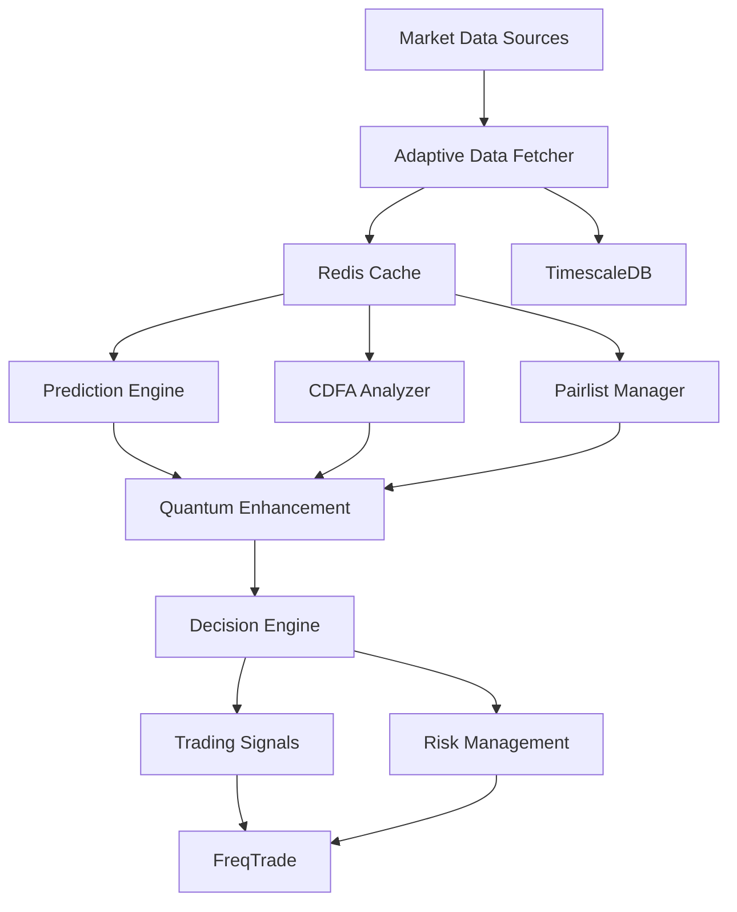

# Tengri Trading System - Technical Documentation

## Table of Contents
1. [Project Structure](#project-structure)
2. [Core Components](#core-components)
3. [Quantum Components](#quantum-components)
4. [Data Flow Architecture](#data-flow-architecture)
5. [Integration Points](#integration-points)
6. [Development Guide](#development-guide)
7. [Testing Framework](#testing-framework)
8. [Performance Tuning](#performance-tuning)

## Project Structure

```
/home/kutlu/freqtrade/user_data/strategies/core/
├── tengri/                          # Main application directory
│   ├── prediction_app/              # Superior Prediction Engine
│   │   ├── server.py               # FastAPI backend server
│   │   ├── superior_engine.py     # Core prediction engine
│   │   ├── feature_extraction.py  # Feature engineering
│   │   ├── live_data.py          # Live data management
│   │   ├── enhanced_lstm_integration_tengri.py  # LSTM models
│   │   ├── frontend/             # Solid.js frontend
│   │   │   ├── src/
│   │   │   │   ├── components/   # UI components
│   │   │   │   ├── pages/       # Route pages
│   │   │   │   ├── stores/      # State management
│   │   │   │   └── api/         # API client
│   │   │   └── vite.config.ts   # Build configuration
│   │   └── core/                 # Cython/C++ optimizations
│   │       ├── engine/          # Prediction core
│   │       ├── quantum/         # Quantum circuits
│   │       └── snn/             # Spiking neural networks
│   │
│   ├── cdfa_app/                   # Cognitive Diversity Fusion Analysis
│   │   ├── advanced_cdfa.py       # Core CDFA algorithms
│   │   ├── backend/               # FastAPI backend
│   │   ├── frontend/              # Solid.js frontend
│   │   └── src/                   # C/C++ extensions
│   │
│   ├── pairlist_app/              # Dynamic Pair Selection
│   │   ├── server.py              # Main server
│   │   ├── adaptive_market_data_fetcher.py  # Data fetching
│   │   ├── cdfa_integration.py   # CDFA integration
│   │   ├── messaging.py          # ZeroMQ/Redis messaging
│   │   └── whale_alert/          # Whale detection
│   │
│   ├── decision_app/              # Quantum Decision Making
│   │   ├── server.py              # Decision server
│   │   ├── game_theory/          # Game theory modules
│   │   │   ├── antifragile_quantum_coalitions.py
│   │   │   └── temporal_biological_nash.py
│   │   └── integration/          # PADS integration
│   │
│   └── rl_app/                    # Reinforcement Learning [Planned]
│
├── quantum_whale_defense/          # Whale Defense System
│   ├── quantum_whale_detection_core.py
│   ├── ml_whale_prediction.py
│   ├── monitoring_dashboard.html
│   └── defense_mechanisms.cpp
│
├── quantum_knowledge_system/       # Quantum Knowledge Integration
│   ├── integrated_quantum_whale_defense_system.py
│   ├── quantum_core/
│   │   ├── quantum_learning_orchestrator.py
│   │   └── market_adaptive_feedback.py
│   └── core/
│       ├── tensor_network_manager.py
│       └── quantum_error_mitigator.py
│
├── cdfa_extensions/               # CDFA Extension Modules
│   ├── analyzers/                # Specialized analyzers
│   ├── detectors/               # Pattern detectors
│   └── models/                  # ML models
│
├── config/                        # Configuration files
│   ├── tengri_integration.json
│   └── pairlist_config.json
│
└── Core Libraries
    ├── adaptive_market_data_fetcher.py
    ├── enhanced_lstm_integration.py
    ├── quantum_amos.py
    ├── quantum_prospect_theory.py
    └── unified_messaging.py
```

## Core Components

### 1. Superior Prediction Engine
The prediction app implements a 4-layer architecture:

```python
# Layer 1: Feature Extraction
- TopologicalDataAnalyzer: Persistent homology
- TemporalPatternAnalyzer: Time series patterns
- MarketDetectors: Bubble/crash detection

# Layer 2: Quantum Enhancement
- QuantumProspectTheory: 7 quantum circuits
- QERC: Quantum error correction
- CerebellarSNN: Spiking neural networks

# Layer 3: Adaptive Learning
- Q* Learning with River ML
- LSTM-Transformer hybrid
- Drift detection and adaptation

# Layer 4: Decision Integration
- PADS ensemble method
- NarrativeForecaster
- Risk management layer
```

### 2. CDFA (Cognitive Diversity Fusion Analysis)
Advanced market analysis through multiple paradigms:

```python
# Core Components
- Multi-Resolution Analysis (MRA)
- Wavelet Decomposition (Daubechies, Morlet, Mexican Hat)
- Cross-Asset Correlation Analysis
- Neuromorphic Computing Integration
- Fibonacci Retracement Analysis
- Panarchy Cycle Detection
```

### 3. Adaptive Market Data Fetcher
Hierarchical data source management:

```python
class AdaptiveMarketDataFetcher:
    # Source Priority:
    1. CCXT (Real-time exchange data)
    2. Direct Exchange APIs
    3. CryptoCompare
    4. Yahoo Finance (Fallback)
    
    # Features:
    - Intelligent source selection
    - Rate limiting per exchange
    - Caching (Redis + Disk)
    - Data validation
```

### 4. Quantum Decision Making (QBMIA)
Revolutionary decision architecture:

```python
# Quantum-Biological Market Intelligence Architecture
- Antifragile Quantum Coalitions
- Temporal Biological Nash Equilibrium
- Machiavellian Strategy Generation
- Robin Hood Wealth Redistribution
```

## Quantum Components

### Quantum Circuit Architecture
```python
# Total Qubits: 57
Base Trading Qubits: 24
- Price prediction: 8 qubits
- Trend analysis: 8 qubits
- Risk assessment: 8 qubits

Whale Defense Qubits: 33
- Oscillation detection: 11 qubits
- Correlation engine: 11 qubits
- Game theory: 11 qubits
```

### Quantum Backends
```python
# Supported Backends (in priority order)
1. lightning.gpu      # NVIDIA GPU acceleration
2. lightning.kokkos   # CPU-optimized
3. default.qubit      # Pure Python fallback
4. qiskit.aer        # IBM quantum simulator
```

### Quantum Algorithms
```python
# Implemented Algorithms
1. Quantum Amplitude Estimation
2. Variational Quantum Eigensolver (VQE)
3. Quantum Approximate Optimization Algorithm (QAOA)
4. Quantum Machine Learning (QML)
5. Quantum Natural Language Processing (QNLP)
```

## Data Flow Architecture



### Message Flow
```python
# Redis Pub/Sub Channels
- market_data:updates
- predictions:results
- cdfa:analysis
- whale:alerts
- decisions:signals

# ZeroMQ Topics
- MARKET.{symbol}
- PREDICT.{model}
- ALERT.WHALE
- SIGNAL.TRADE
```

## Integration Points

### FreqTrade Integration
```python
# Strategy Implementation
class TengriStrategy(IStrategy):
    def populate_indicators(self, dataframe, metadata):
        # Call Tengri prediction API
        prediction = requests.post(
            "http://localhost:8100/predict",
            json={"pair": metadata['pair']}
        )
        
    def populate_buy_trend(self, dataframe, metadata):
        # Use Tengri signals
        
    def populate_sell_trend(self, dataframe, metadata):
        # Use Tengri signals
```

### Inter-App Communication
```python
# Redis Integration
import redis.asyncio as aioredis

redis_client = aioredis.from_url("redis://localhost:6379")

# Publish prediction
await redis_client.publish(
    "predictions:results",
    json.dumps(prediction_data)
)

# Subscribe to whale alerts
pubsub = redis_client.pubsub()
await pubsub.subscribe("whale:alerts")
```

### WebSocket Streaming
```python
# Real-time updates to frontend
@app.websocket("/ws")
async def websocket_endpoint(websocket: WebSocket):
    await manager.connect(websocket)
    while True:
        data = await get_real_time_data()
        await manager.broadcast(data)
```

## Development Guide

### Setting Up Development Environment
```bash
# Create virtual environment
python -m venv venv
source venv/bin/activate  # Linux/Mac
# or
venv\Scripts\activate     # Windows

# Install development dependencies
pip install -r requirements-dev.txt

# Install pre-commit hooks
pre-commit install
```

### Code Style Guidelines
```python
# Python: PEP 8 with Black formatter
black --line-length 100 .

# TypeScript: ESLint + Prettier
cd frontend && npm run lint

# Type checking
mypy --strict .
```

### Adding New Features
1. Create feature branch
2. Implement with tests
3. Update documentation
4. Submit PR with description

### Debugging Tips
```python
# Enable debug logging
import logging
logging.basicConfig(level=logging.DEBUG)

# Quantum circuit visualization
from pennylane import draw
print(draw(quantum_circuit))

# Performance profiling
python -m cProfile -o profile.stats server.py
```

## Testing Framework

### Unit Tests
```bash
# Run all tests
pytest tests/

# Run with coverage
pytest --cov=tengri --cov-report=html

# Run specific test
pytest tests/test_prediction_engine.py::test_quantum_enhancement
```

### Integration Tests
```python
# Test inter-app communication
async def test_prediction_to_decision_flow():
    # Start all services
    # Send prediction request
    # Verify decision output
```

### Performance Tests
```bash
# Benchmark prediction speed
python benchmark_prediction.py

# Load testing
locust -f loadtest.py --host=http://localhost:8100
```

### Quantum Tests
```python
# Verify quantum circuits
def test_whale_defense_circuit():
    circuit = create_whale_defense_circuit()
    assert circuit.num_qubits == 33
    assert circuit.depth() < 100
```

## Performance Tuning

### GPU Optimization
```python
# CUDA settings
os.environ['CUDA_VISIBLE_DEVICES'] = '0'
os.environ['TF_FORCE_GPU_ALLOW_GROWTH'] = 'true'

# Numba JIT compilation
@numba.jit(nopython=True, parallel=True)
def fast_calculation(data):
    return computation
```

### Memory Management
```python
# Efficient data handling
# Use generators for large datasets
def process_large_data():
    for chunk in pd.read_csv('data.csv', chunksize=10000):
        yield process_chunk(chunk)

# Clear GPU memory
torch.cuda.empty_cache()
```

### Caching Strategy
```python
# Redis caching with TTL
@cached(ttl=3600)
async def get_market_data(symbol: str):
    return await fetch_from_exchange(symbol)

# Local memory cache
from functools import lru_cache

@lru_cache(maxsize=1000)
def calculate_indicators(data):
    return indicators
```

### Parallel Processing
```python
# Multi-threading for I/O
with ThreadPoolExecutor(max_workers=10) as executor:
    futures = [executor.submit(fetch_data, symbol) 
               for symbol in symbols]
               
# Multi-processing for CPU
with ProcessPoolExecutor() as executor:
    results = executor.map(process_data, data_chunks)
```

## Monitoring & Observability

### Health Checks
```python
@app.get("/health")
async def health_check():
    return {
        "status": "healthy",
        "services": check_all_services(),
        "timestamp": datetime.utcnow()
    }
```

### Metrics Collection
```python
# Prometheus metrics
from prometheus_client import Counter, Histogram

prediction_counter = Counter('predictions_total', 
                           'Total predictions made')
prediction_duration = Histogram('prediction_duration_seconds',
                              'Prediction duration')
```

### Logging Strategy
```python
# Structured logging
import structlog

logger = structlog.get_logger()
logger.info("prediction_made", 
           pair="BTC/USDT",
           confidence=0.85,
           processing_time=0.045)
```

## Security Considerations

### API Security
- JWT authentication for sensitive endpoints
- Rate limiting per IP/user
- Input validation and sanitization
- CORS configuration

### Data Security
- Encrypted Redis connections
- API key management
- Secure WebSocket connections
- Audit logging

### Quantum Security
- Quantum-resistant algorithms ready
- Secure key distribution
- Entanglement verification

---

This technical documentation provides the deep technical details needed to understand, develop, and maintain the Tengri Trading System. For high-level overview, see the main [README.md](README.md).