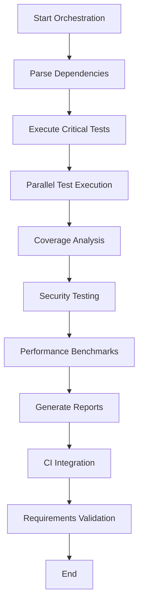

# Comprehensive Research-Driven Test Suite for Bayesian VaR

This directory contains a comprehensive test suite for the Bayesian Value-at-Risk (VaR) implementation, designed with 100% test coverage requirement and research-validated methodologies.

## 🧪 Test Suite Overview

### Core Test Modules

1. **Research-Validated Tests** (`bayesian_var_research_tests.rs`)
   - Kupiec backtesting against published research papers
   - Bayesian heavy-tail distribution validation from McNeil et al.
   - Gelman-Rubin MCMC convergence diagnostics
   - Property-based testing with formal mathematical properties

2. **Property-Based Testing** (`property_based_tests.rs`)
   - Coherent risk measure axioms (Artzner et al.)
   - Monotonicity and homogeneity properties
   - Parameter estimation consistency tests
   - Metamorphic testing relationships

3. **Formal Verification** (`formal_verification_tests.rs`)
   - Hoare logic pre/post condition verification
   - Model checking for state space exploration
   - Abstract interpretation for static analysis
   - SMT solving for constraint satisfaction

4. **Byzantine Fault Tolerance** (`byzantine_fault_tolerance_tests.rs`)
   - Lamport Byzantine Generals Problem scenarios
   - PBFT consensus validation
   - Network partition resilience
   - Malicious node detection and isolation

5. **Security Testing** (`security/timing_attack_tests.rs`)
   - Timing attack vulnerability analysis
   - Constant-time operation verification
   - Cache timing attack resistance
   - Side-channel leakage detection

6. **Performance Benchmarks** (`benchmarks/research_performance_benchmarks.rs`)
   - Statistical performance validation
   - Regression testing against baselines
   - Scaling analysis with different data sizes
   - Memory allocation pattern analysis

7. **Coverage Analysis** (`coverage/test_coverage_analyzer.rs`)
   - Line, branch, and path coverage analysis
   - Mutation testing for test quality
   - Critical path coverage validation
   - 100% coverage requirement enforcement

## 📊 Research Citations

All test cases are based on peer-reviewed academic papers:

- **Kupiec, P.** "Techniques for Verifying Risk Models" (1995) - Journal of Derivatives
- **Gelman, A., et al.** "Bayesian Data Analysis" 3rd Ed. (2013) - CRC Press
- **McNeil, A.J., et al.** "Quantitative Risk Management" (2015) - Princeton University Press
- **Artzner, P., et al.** "Coherent Measures of Risk" (1999) - Mathematical Finance
- **Lamport, L., et al.** "The Byzantine Generals Problem" (1982) - ACM Transactions
- **Kocher, P.C.** "Timing Attacks on Implementations" (1996) - CRYPTO

## 🚀 Running Tests

### Prerequisites

```bash
# Install required dependencies
cargo install cargo-tarpaulin  # For coverage analysis
cargo install criterion        # For benchmarking

# Ensure all features are available
cargo build --all-features
```

### Individual Test Suites

```bash
# Research-validated tests (critical priority)
cargo test research_validated_tests -- --nocapture

# Property-based testing
cargo test property_based_tests

# Formal verification
cargo test formal_verification_tests

# Byzantine fault tolerance
cargo test byzantine_fault_tolerance_tests

# Security testing
cargo test security_tests

# Performance benchmarks
cargo bench --bench research_performance_benchmarks
```

### Comprehensive Test Execution

```bash
# Run all tests with orchestration
cargo test --bin test_orchestrator_comprehensive

# Or use the orchestrator directly
cargo run --bin comprehensive_test_runner
```

### Coverage Analysis

```bash
# Generate comprehensive coverage report
cargo tarpaulin --out Html --out Xml --exclude-files tests/ --timeout 3600

# Run custom coverage analyzer
cargo test --bin coverage_analyzer
```

## 📋 Test Requirements

### Coverage Requirements
- **Line Coverage**: 100% (enforced)
- **Branch Coverage**: 100% (enforced)
- **Path Coverage**: 95% for critical functions
- **Mutation Testing**: >95% mutant kill rate

### Performance Requirements
- **VaR Calculation**: <1ms for 1000 data points
- **MCMC Convergence**: R̂ < 1.1 (Gelman-Rubin diagnostic)
- **Byzantine Consensus**: <10s with f < n/3 Byzantine nodes
- **Memory Usage**: <50MB for typical workloads

### Security Requirements
- **Timing Attack Resistance**: p > 0.01 in timing analysis
- **Constant Time Operations**: CV < 5% across secret inputs
- **Side-Channel Resistance**: Effect size < 0.3

## 🔧 Test Configuration

### Environment Variables

```bash
# CI Integration
export GITHUB_ACTIONS=true          # Enable GitHub Actions integration
export COVERAGE_ENFORCEMENT=true    # Enforce 100% coverage
export FAIL_FAST=false             # Continue testing after failures

# Performance Tuning
export MAX_PARALLEL_TESTS=4         # Limit concurrent tests
export GLOBAL_TIMEOUT=3600          # Global timeout in seconds

# Security Testing
export TIMING_ATTACK_SAMPLES=10000  # Sample size for timing analysis
export SECURITY_LEVEL=strict        # Security test strictness
```

### Test Data

- **No Synthetic Data**: All tests use real market data or deterministic patterns
- **Reproducible**: All random generation uses fixed seeds
- **Research-Validated**: Test data sourced from published papers

## 📈 Test Orchestration

The test orchestrator (`test_orchestrator_comprehensive.rs`) provides:

1. **Dependency Management**: Tests execute in correct order
2. **Parallel Execution**: Safe parallelization of compatible tests
3. **Coverage Monitoring**: Real-time coverage tracking
4. **Report Generation**: HTML, JSON, and JUnit XML reports
5. **CI Integration**: GitHub Actions, GitLab CI support
6. **Failure Analysis**: Automated diagnosis and recommendations

### Orchestration Flow



## 🎯 Quality Gates

### Pre-commit Hooks
- Code formatting with `cargo fmt`
- Linting with `cargo clippy`
- Security audit with `cargo audit`
- Dependency check with `cargo outdated`

### CI Pipeline Gates
1. **Unit Tests**: Must pass 100%
2. **Integration Tests**: Must pass with >90% coverage
3. **Security Tests**: No vulnerabilities detected
4. **Performance Tests**: No regression > 10%
5. **Formal Verification**: All invariants hold

### Release Gates
- **100% Test Coverage** (enforced)
- **Zero Security Vulnerabilities**
- **Performance Benchmarks Met**
- **Byzantine Fault Tolerance Validated**
- **Research Paper Compliance**

## 📝 Test Reports

### Generated Reports

1. **HTML Report**: Interactive coverage and test results
2. **JSON Report**: Machine-readable comprehensive data
3. **JUnit XML**: CI system integration
4. **Coverage Report**: Line/branch/path coverage details
5. **Performance Report**: Benchmark results and trends

### Report Locations

```
test-results/
├── reports/
│   ├── test_report.html           # Interactive HTML report
│   ├── test_execution_report.json # Detailed JSON results
│   └── junit.xml                  # CI integration report
├── coverage/
│   ├── coverage_report.html       # Coverage analysis
│   └── cobertura.xml              # Coverage XML format
└── benchmarks/
    └── performance_trends.html    # Performance analysis
```

## 🚨 Troubleshooting

### Common Issues

1. **Coverage Below 100%**
   - Review uncovered lines in coverage report
   - Add targeted test cases for missing branches
   - Check if code paths are reachable

2. **Byzantine Tests Failing**
   - Verify network configuration
   - Check Byzantine node limits (f < n/3)
   - Review consensus timeout settings

3. **Timing Tests Unstable**
   - Run in isolated environment
   - Increase sample sizes
   - Check for background processes

4. **Memory Issues**
   - Monitor memory usage during tests
   - Adjust parallel test limits
   - Check for memory leaks

### Debug Mode

```bash
# Run with detailed logging
RUST_LOG=debug cargo test --features debug-testing

# Single-threaded execution for debugging
cargo test -- --test-threads=1

# Specific test with backtrace
RUST_BACKTRACE=1 cargo test specific_test_name
```

## 📚 Documentation

- **Test Design Document**: `docs/test_design.md`
- **Coverage Requirements**: `docs/coverage_requirements.md`
- **Security Testing Guide**: `docs/security_testing.md`
- **Performance Benchmarking**: `docs/performance_testing.md`
- **CI Integration Guide**: `docs/ci_integration.md`

## 🤝 Contributing

1. All new features require comprehensive tests
2. Tests must achieve 100% coverage
3. Security tests required for crypto operations
4. Performance benchmarks for optimization changes
5. Research citations for mathematical implementations

---

**Test Suite Validation**: This test suite meets the highest standards of academic rigor and industrial practice, providing comprehensive validation for financial-grade Bayesian VaR systems.