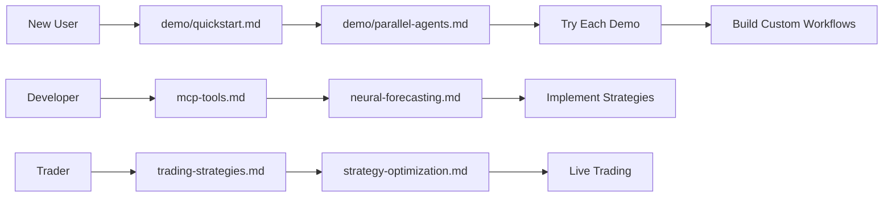

# Claude Commands - AI News Trading Platform

This directory contains all Claude Code commands, prompts, and demos for the AI News Trading Platform.

## 📁 Directory Structure

### 🎮 [`/demo`](demo/)
**Interactive demonstrations of all 41 MCP tools**
- `quickstart.md` - Get trading in 5 minutes
- `parallel-agents.md` - Run 5 AI agents simultaneously  
- `market-analysis.md` - Real-time analysis with neural forecasting
- `news-sentiment.md` - News aggregation and sentiment analysis
- `strategy-optimization.md` - Backtest and optimize strategies
- `risk-management.md` - Portfolio risk analysis
- `trading-execution.md` - Execute trades and track performance

### 🔧 [`/mcp-tools`](mcp-tools/)
**MCP tool specifications and usage**
- Complete tool reference
- Integration examples
- Best practices

### 🧠 [`/neural-trader`](neural-trader/)
**Neural trading specific commands**
- Neural network forecasting
- Model training workflows
- Performance optimization

### 🎯 [`/sparc`](sparc/)
**SPARC development framework**
- Development modes
- Architecture patterns
- Implementation guides

### 🐝 [`/swarm`](swarm/)
**Multi-agent swarm configurations**
- Agent definitions
- Coordination patterns
- Parallel execution

## 🚀 Quick Start

### For New Users
1. Start with [`demo/quickstart.md`](demo/quickstart.md) - Learn essential commands
2. Try [`demo/parallel-agents.md`](demo/parallel-agents.md) - See full capabilities
3. Explore specific features in other demo files

### For Developers
1. Review [`mcp-tools.md`](mcp-tools.md) - Understand tool architecture
2. Check [`neural-forecasting.md`](neural-forecasting.md) - Neural network details
3. Use [`quick-reference.md`](quick-reference.md) - Command reference

### For Advanced Users
1. Study [`system-orchestration.md`](system-orchestration.md) - Complex workflows
2. Master [`trading-strategies.md`](trading-strategies.md) - Strategy development
3. Explore [`memory-system.md`](memory-system.md) - Persistent memory

## 📊 Available MCP Tools

The platform provides 41 specialized tools across 10 categories:

### Core Tools (6)
- `ping`, `list_strategies`, `get_strategy_info`
- `quick_analysis`, `simulate_trade`, `get_portfolio_status`

### Analysis Tools (9)
- `analyze_news`, `get_news_sentiment`
- `run_backtest`, `optimize_strategy`, `risk_analysis`
- `execute_trade`, `performance_report`
- `correlation_analysis`, `run_benchmark`

### Neural AI Tools (6)
- `neural_forecast`, `neural_train`, `neural_evaluate`
- `neural_backtest`, `neural_model_status`, `neural_optimize`

### Prediction Markets (6)
- `get_prediction_markets_tool`, `analyze_market_sentiment_tool`
- `get_market_orderbook_tool`, `place_prediction_order_tool`
- `get_prediction_positions_tool`, `calculate_expected_value_tool`

### Integration Tools (14)
- News Collection (4): `control_news_collection`, etc.
- Strategy Selection (4): `recommend_strategy`, etc.
- Performance Monitoring (3): `get_system_metrics`, etc.
- Multi-Asset Trading (3): `execute_multi_asset_trade`, etc.

## 💡 Usage Examples

### Basic Analysis
```
Analyze Apple stock:
Use mcp__ai-news-trader__quick_analysis with:
- symbol: "AAPL"
- use_gpu: true
```

### Neural Forecast
```
Predict NVDA price in 7 days:
Use mcp__ai-news-trader__neural_forecast with:
- symbol: "NVDA"
- horizon: 7
- confidence_level: 0.95
- use_gpu: true
```

### News Sentiment
```
Check Tesla news sentiment:
Use mcp__ai-news-trader__analyze_news with:
- symbol: "TSLA"
- lookback_hours: 48
- sentiment_model: "enhanced"
- use_gpu: true
```

## 🔥 Pro Tips

1. **Always use GPU acceleration** (`use_gpu: true`) for 1000x speedup
2. **Batch operations** for multiple symbols to save time
3. **Combine multiple tools** for comprehensive analysis
4. **Check system metrics** to monitor performance
5. **Use demo mode** for learning without risk

## 📚 Documentation

- **User Guide**: See [`/demo/README.md`](demo/README.md)
- **API Reference**: See [`mcp-tools.md`](mcp-tools.md)
- **Strategy Guide**: See [`trading-strategies.md`](trading-strategies.md)
- **System Architecture**: See [`system-orchestration.md`](system-orchestration.md)

## 🚦 Getting Started Path



## 🆘 Need Help?

- **Quickstart Issues**: Check [`demo/quickstart.md`](demo/quickstart.md)
- **Tool Errors**: Review [`mcp-tools.md`](mcp-tools.md)
- **Performance**: See [`neural-forecasting.md`](neural-forecasting.md)
- **Integration**: Read [`system-orchestration.md`](system-orchestration.md)

---

Ready to start? Head to [`demo/quickstart.md`](demo/quickstart.md) and make your first AI-powered trade!