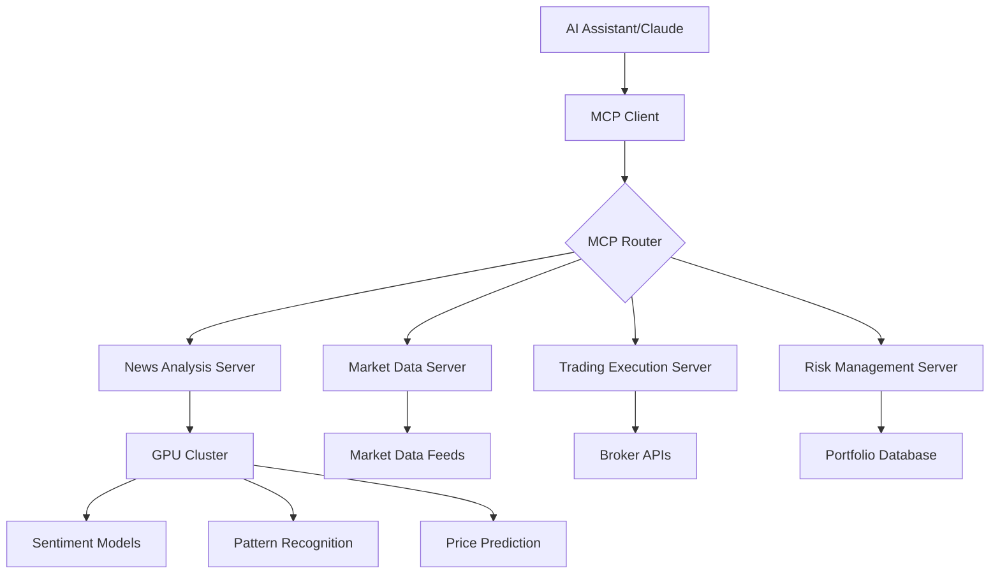

# Model Context Protocol (MCP) Research Document
## For AI News Trading Platform Integration

### Executive Summary

The Model Context Protocol (MCP) is an open standard introduced by Anthropic in November 2024 that standardizes how AI assistants connect to external systems and data sources. Dubbed "the USB-C of AI apps," MCP provides a universal framework for bidirectional communication between AI models and various tools, databases, and services.

This research document provides comprehensive insights into MCP's protocol specification, discovery mechanisms, implementation patterns, and specific applications for financial trading systems, with a focus on integration with our GPU-accelerated AI News Trading platform.

## Table of Contents

1. [MCP Protocol Specification](#mcp-protocol-specification)
2. [MCP Discovery Mechanisms](#mcp-discovery-mechanisms)
3. [MCP Implementation Patterns](#mcp-implementation-patterns)
4. [Trading Platform Integration](#trading-platform-integration)
5. [Security and Best Practices](#security-and-best-practices)
6. [Implementation Recommendations](#implementation-recommendations)

## MCP Protocol Specification

### Core Architecture

MCP follows a client-server architecture with three primary entities:

1. **MCP Hosts**: LLM applications that initiate connections
2. **MCP Clients**: Connectors within host applications that maintain connections with servers
3. **MCP Servers**: Services that expose specific capabilities (tools, resources, prompts)

### Message Format and Communication

- **Protocol**: JSON-RPC 2.0 for all message communication
- **Message Types**: Requests, notifications, responses, and batch operations
- **State Management**: Stateful connections with explicit lifecycle management

### Transport Mechanisms

#### 1. stdio Transport (Primary/Recommended)
- **Implementation**: Server reads from stdin and writes to stdout
- **Message Format**: JSON-RPC messages delimited by newlines
- **Use Case**: Local server implementations
- **Best For**: File system access, Git operations, local tools

```json
{
  "jsonrpc": "2.0",
  "method": "tools/call",
  "params": {
    "name": "analyze_stock",
    "arguments": {"symbol": "AAPL"}
  },
  "id": 1
}
```

#### 2. Streamable HTTP Transport
- **Implementation**: HTTP POST/GET with optional Server-Sent Events (SSE)
- **Features**: 
  - Supports multiple concurrent clients
  - Real-time streaming capabilities
  - Stateless request/response patterns
- **Use Case**: Remote servers, cloud deployments
- **Best For**: Trading APIs, market data feeds, distributed systems

#### 3. WebSocket Transport (Community/Experimental)
- **Status**: Not officially part of MCP spec but widely requested
- **Benefits**: Full duplex, real-time bidirectional communication
- **Implementation**: Available through community projects
- **Best For**: High-frequency trading, real-time market data

### Protocol Features

1. **Resources**: Contextual data exposed by servers
2. **Tools**: Executable functions that AI models can invoke
3. **Prompts**: Templated message workflows
4. **Sampling**: Server-initiated AI interactions

### Capability System

MCP uses explicit capability negotiation during initialization:

```json
{
  "capabilities": {
    "resources": {
      "subscribe": true,
      "list": true
    },
    "tools": {
      "list": true,
      "call": true
    },
    "prompts": {
      "list": true
    }
  }
}
```

## MCP Discovery Mechanisms

### Service Discovery Process

1. **Dynamic Tool Discovery**
   - Runtime discovery of available capabilities
   - No predefined function requirements
   - Automatic capability registration

2. **Capability Negotiation Flow**
   ```
   Client → Server: initialize request with client capabilities
   Server → Client: initialize response with server capabilities
   Client → Server: initialized notification
   [Normal operation begins]
   ```

3. **Metadata Discovery**
   - Standardized metadata URLs following OAuth discovery patterns
   - Automatic endpoint discovery
   - Reduced configuration overhead

### Registration Mechanisms

#### Dynamic Client Registration
- **Protocol**: OAuth 2.0 Dynamic Client Registration
- **Benefits**: 
  - Automatic client registration without manual setup
  - No hard-coded credentials required
  - Simplified deployment process

#### Service Registration Example
```json
{
  "mcpServers": {
    "trading-data": {
      "command": "node",
      "args": ["./mcp-trading-server.js"],
      "env": {
        "API_KEY": "${TRADING_API_KEY}",
        "MARKET_DATA_URL": "wss://market-data.example.com"
      }
    }
  }
}
```

### Health Checking and Monitoring

- Periodic capability queries
- Connection state monitoring
- Automatic reconnection strategies
- Service availability tracking

## MCP Implementation Patterns

### SDK Support

Official SDKs available for:
- **TypeScript/JavaScript**: Primary implementation
- **Python**: Full feature support
- **C#**: Microsoft collaboration
- **Java**: Spring AI collaboration
- **Ruby**: Shopify collaboration
- **Swift**: Mobile integration
- **Kotlin**: Android support

### Common Implementation Patterns

#### 1. Basic Tool Server
```typescript
// TypeScript example
import { Server } from '@modelcontextprotocol/sdk';

const server = new Server({
  name: 'trading-tools',
  version: '1.0.0',
});

server.setRequestHandler('tools/list', async () => ({
  tools: [
    {
      name: 'analyze_market',
      description: 'Analyze market conditions',
      inputSchema: {
        type: 'object',
        properties: {
          symbol: { type: 'string' },
          timeframe: { type: 'string' }
        }
      }
    }
  ]
}));
```

#### 2. Resource Server Pattern
```python
# Python example
from mcp import Server, Resource

server = Server("market-data-server")

@server.resource("market://quotes/{symbol}")
async def get_quote(symbol: str) -> Resource:
    # Fetch real-time quote
    quote_data = await fetch_market_quote(symbol)
    return Resource(
        uri=f"market://quotes/{symbol}",
        mimeType="application/json",
        text=json.dumps(quote_data)
    )
```

#### 3. Streaming Data Pattern
```javascript
// SSE streaming for real-time data
server.setRequestHandler('market/stream', async (request, { signal }) => {
  const stream = new ReadableStream({
    async start(controller) {
      const ws = connectToMarketData();
      ws.on('message', (data) => {
        controller.enqueue({
          type: 'market_update',
          data: JSON.parse(data)
        });
      });
    }
  });
  return { stream };
});
```

### Production Deployment Patterns

1. **Containerized Deployments**
   - Docker containers for MCP servers
   - Kubernetes orchestration for scaling
   - Service mesh for inter-service communication

2. **Serverless Implementations**
   - AWS Lambda for stateless MCP servers
   - Azure Functions for event-driven processing
   - Edge computing for low-latency requirements

3. **High Availability Patterns**
   - Load balancing across multiple MCP servers
   - Failover mechanisms
   - State synchronization for stateful services

## Trading Platform Integration

### Financial MCP Implementations

#### 1. Real-Time Market Data Servers

**Twelve Data MCP Server**
- WebSocket-based streaming
- Real-time quotes and market metrics
- Historical time series data
- Multi-asset support (stocks, forex, crypto)

**Implementation Example**:
```javascript
const marketDataServer = new MCPServer({
  name: 'realtime-market-data',
  transport: 'websocket',
  capabilities: ['streaming', 'historical', 'quotes']
});

marketDataServer.addTool('subscribe_quotes', async ({ symbols, interval }) => {
  const stream = await marketDataProvider.subscribeQuotes(symbols, {
    interval,
    includeVolume: true,
    includeBidAsk: true
  });
  
  return {
    stream,
    metadata: {
      subscription_id: generateId(),
      symbols,
      interval
    }
  };
});
```

#### 2. Trading Strategy Servers

**Features for AI News Trading**:
- News sentiment analysis integration
- Real-time position management
- Risk calculation tools
- Order execution capabilities

```python
# Trading strategy MCP server
class TradingStrategyServer(MCPServer):
    def __init__(self):
        super().__init__("ai-news-trader")
        self.gpu_pool = GPUResourcePool()
        
    @tool("analyze_news_impact")
    async def analyze_news(self, news_items: List[Dict]) -> Dict:
        # Leverage GPU for parallel news processing
        embeddings = await self.gpu_pool.compute_embeddings(news_items)
        sentiment_scores = await self.gpu_pool.run_sentiment_model(embeddings)
        
        return {
            "impact_scores": sentiment_scores,
            "recommended_positions": self.calculate_positions(sentiment_scores),
            "risk_metrics": self.calculate_risk(sentiment_scores)
        }
    
    @tool("execute_trade")
    async def execute_trade(self, order: Dict) -> Dict:
        # Validate order parameters
        validation = self.validate_order(order)
        if not validation.is_valid:
            return {"error": validation.message}
        
        # Execute through broker API
        result = await self.broker.execute_order(order)
        return {"order_id": result.id, "status": result.status}
```

#### 3. GPU-Accelerated Model Serving

**Architecture for GPU Model Integration**:

```yaml
# MCP Server Configuration for GPU Models
services:
  sentiment-analyzer:
    type: mcp-server
    transport: http-sse
    gpu_allocation: 
      device_ids: [0, 1]
      memory_limit: 8GB
    capabilities:
      - batch_inference
      - streaming_predictions
      - model_versioning
    
  pattern-detector:
    type: mcp-server
    transport: stdio
    gpu_allocation:
      device_ids: [2]
      memory_limit: 4GB
    models:
      - name: chart_pattern_v2
        framework: pytorch
        optimization: tensorrt
```

### Integration Architecture for AI News Trading



### Performance Considerations

1. **Latency Optimization**
   - Use stdio transport for local GPU models
   - WebSocket for real-time market data
   - Batch operations for efficiency

2. **Scalability Patterns**
   - Horizontal scaling of MCP servers
   - GPU resource pooling
   - Load balancing strategies

3. **Reliability Features**
   - Circuit breakers for external APIs
   - Retry mechanisms with exponential backoff
   - Graceful degradation

## Security and Best Practices

### Security Principles

1. **User Consent and Control**
   - Explicit authorization for all operations
   - Granular permission management
   - Audit logging for compliance

2. **Authentication Patterns**
   - OAuth 2.0 for external services
   - API key management
   - Certificate-based authentication for internal services

3. **Data Protection**
   - End-to-end encryption for sensitive data
   - Secure credential storage
   - Data minimization principles

### Best Practices for Trading Systems

1. **Risk Controls**
   ```javascript
   // Implement safety checks in MCP tools
   server.addTool('execute_trade', async (params) => {
     // Position size limits
     if (params.quantity > MAX_POSITION_SIZE) {
       throw new Error('Position size exceeds limit');
     }
     
     // Daily loss limits
     const dailyLoss = await calculateDailyLoss();
     if (dailyLoss > MAX_DAILY_LOSS) {
       throw new Error('Daily loss limit reached');
     }
     
     // Execute with confirmation
     return await executeWithConfirmation(params);
   });
   ```

2. **Monitoring and Observability**
   - Structured logging for all MCP operations
   - Metrics collection (latency, throughput, errors)
   - Distributed tracing for complex workflows

3. **Error Handling**
   - Graceful error messages
   - Fallback mechanisms
   - Recovery strategies

## Implementation Recommendations

### Phase 1: Foundation (Weeks 1-2)
1. Set up basic MCP server infrastructure
2. Implement stdio transport for local GPU models
3. Create tools for news analysis and sentiment scoring
4. Develop resource endpoints for market data

### Phase 2: Integration (Weeks 3-4)
1. Integrate with existing trading strategies
2. Implement WebSocket transport for real-time data
3. Add authentication and authorization
4. Create monitoring and logging infrastructure

### Phase 3: Advanced Features (Weeks 5-6)
1. Implement GPU resource management
2. Add streaming capabilities for live predictions
3. Create advanced risk management tools
4. Develop backtesting integration

### Phase 4: Production Readiness (Weeks 7-8)
1. Performance optimization
2. Security hardening
3. Disaster recovery planning
4. Documentation and training

### Technology Stack Recommendations

**Core Technologies**:
- TypeScript for MCP server implementation
- Python for ML model integration
- Redis for state management
- PostgreSQL for trade history
- Kubernetes for orchestration

**GPU Infrastructure**:
- NVIDIA Triton for model serving
- TensorRT for inference optimization
- CUDA streams for parallel processing
- GPU memory pooling for efficiency

**Monitoring Stack**:
- Prometheus for metrics
- Grafana for visualization
- OpenTelemetry for tracing
- ELK stack for log aggregation

### Example MCP Server Configuration

```yaml
# config/mcp-servers.yaml
servers:
  ai-news-analyzer:
    command: python
    args: ["-m", "mcp_servers.news_analyzer"]
    env:
      MODEL_PATH: "/models/sentiment_v3"
      GPU_DEVICE: "0"
      BATCH_SIZE: "32"
    capabilities:
      - tools.analyze_sentiment
      - tools.extract_entities
      - resources.news_feed
  
  market-data-provider:
    command: node
    args: ["./servers/market-data.js"]
    transport: websocket
    port: 8080
    env:
      MARKET_DATA_API: "${POLYGON_API_KEY}"
      CACHE_TTL: "5"
    capabilities:
      - tools.get_quote
      - tools.get_historical
      - resources.market_stream
  
  trade-executor:
    command: cargo
    args: ["run", "--bin", "mcp-trader"]
    env:
      BROKER_API: "${IB_GATEWAY_URL}"
      RISK_LIMITS: "/config/risk_limits.json"
    capabilities:
      - tools.place_order
      - tools.cancel_order
      - resources.portfolio
```

## Conclusion

The Model Context Protocol represents a paradigm shift in how AI systems interact with external tools and data sources. For the AI News Trading platform, MCP provides:

1. **Standardized Integration**: Single protocol for all external connections
2. **Dynamic Discovery**: Runtime capability detection and registration
3. **Scalable Architecture**: Support for distributed, GPU-accelerated workloads
4. **Real-time Capabilities**: WebSocket and SSE for streaming market data
5. **Security Framework**: Built-in authorization and audit mechanisms

By implementing MCP, the AI News Trading platform can seamlessly integrate AI-powered analysis with real-time market data and automated trading execution, while maintaining security, scalability, and reliability.

### Next Steps

1. Review and approve the implementation plan
2. Set up development environment with MCP SDKs
3. Begin Phase 1 implementation
4. Establish monitoring and testing frameworks
5. Plan for gradual production rollout

This research document provides the foundation for building a robust, MCP-based integration layer for the AI News Trading platform, enabling sophisticated AI-driven trading strategies with proper risk controls and monitoring.