# AI News Trader: Architecture Diagrams

## 1. Current vs. Future Architecture Overview

### Current Architecture (Simulation-Based)
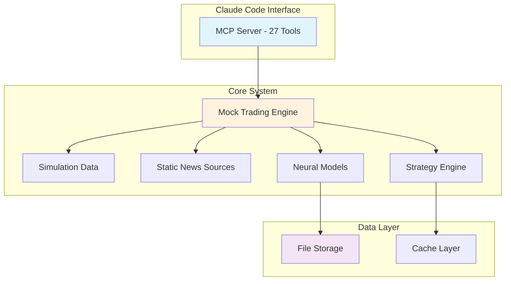

### Future Architecture (Live Trading System)
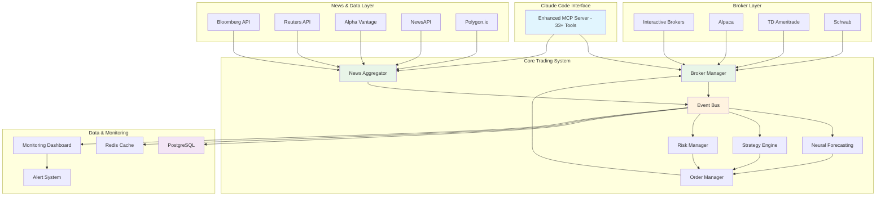

## 2. Real-Time Data Flow Architecture

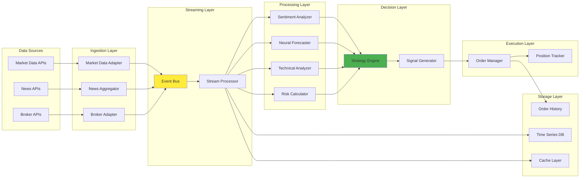

## 3. Order Execution Flow

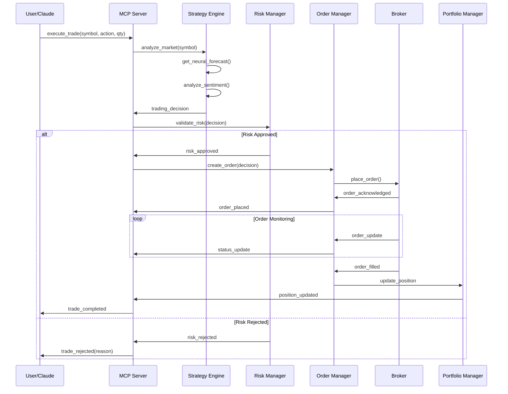

## 4. News Processing Pipeline

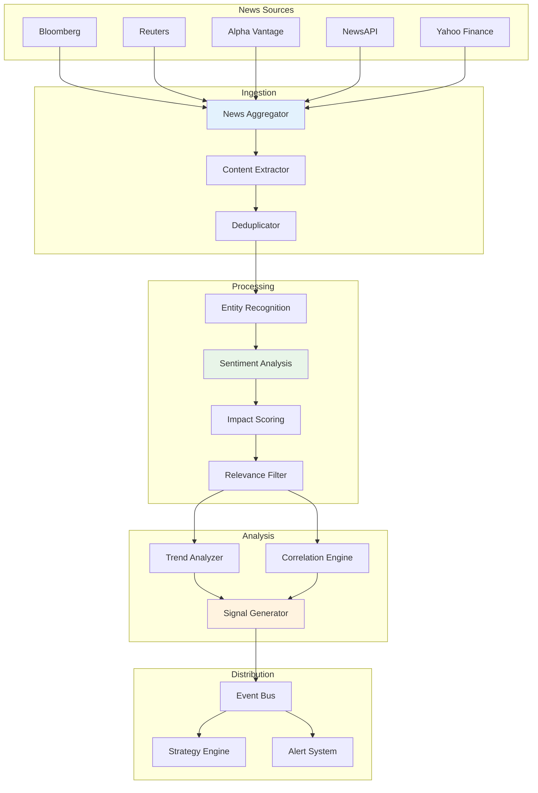

## 5. Neural Forecasting Integration

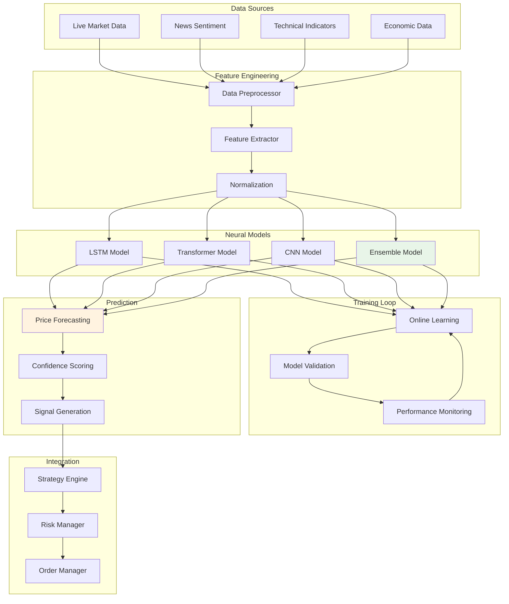

## 6. Risk Management Architecture

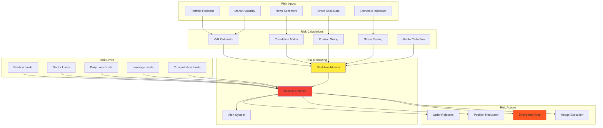

## 7. Monitoring and Alerting System

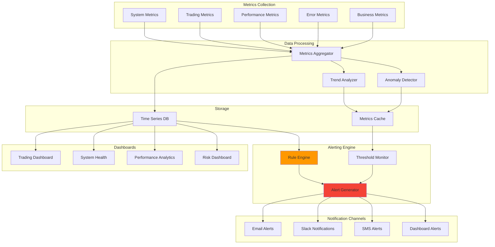

## 8. Database Schema Design

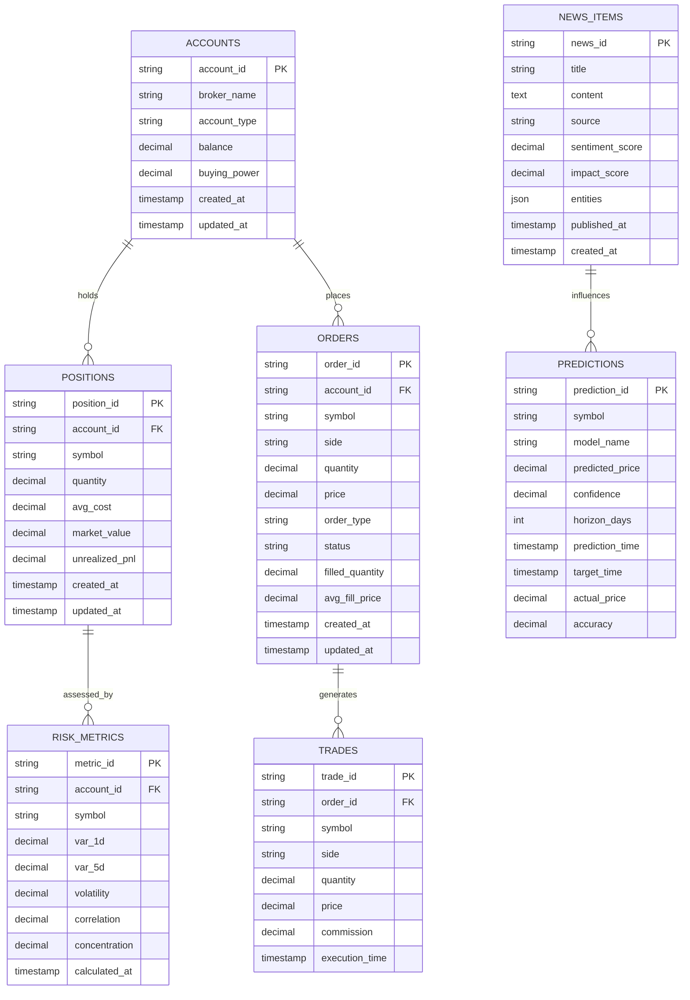

## 9. Deployment Architecture

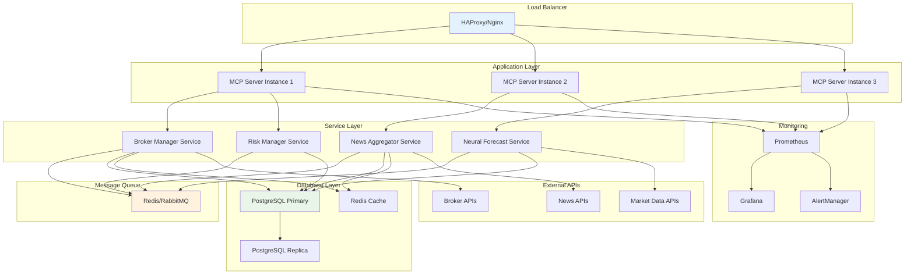

## 10. Security Architecture

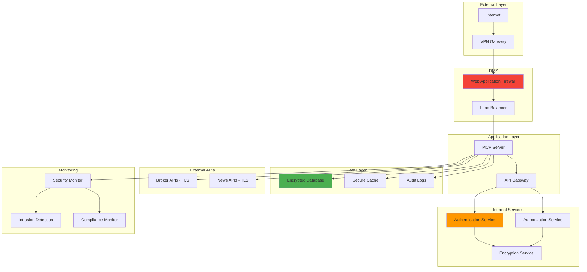

These architecture diagrams provide a comprehensive visual representation of the AI News Trader integration plan, showing the transformation from a simulation-based system to a full live trading platform with real-time data integration, advanced analytics, and robust monitoring capabilities.