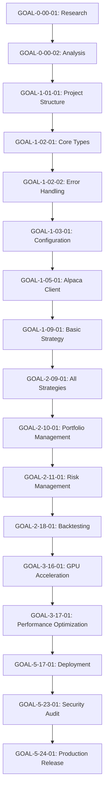

# Neural Trading Rust Port - GOAP Agent Taskboard

**Project:** Neural Trading Platform - Complete Rust Port
**Codebase Size:** ~47,150 lines Python → ~60,000 lines Rust (estimated)
**Total Timeline:** 24 weeks (6 months)
**Team Size:** 4-6 specialists rotating across personas

---

## Executive Summary

### Project Goals
- **Primary:** Port entire Python neural-trader to Rust with 100% feature parity
- **Secondary:** 3-5x performance improvement through Rust optimizations
- **Tertiary:** Add GPU acceleration using CUDA/ROCm for neural computations

### Success Metrics
- All 8 trading strategies operational in Rust
- API response time < 50ms (vs 121ms Python)
- Memory usage < 200MB (vs 500MB Python)
- 95%+ test coverage
- Zero-downtime deployment capability

### Risk Summary
- **HIGH RISK:** GPU/CUDA integration, async runtime complexity
- **MEDIUM RISK:** API compatibility, ML model porting
- **LOW RISK:** Basic infrastructure, standard patterns

---

## Phase Overview

| Phase | Duration | Focus | Deliverables |
|-------|----------|-------|-------------|
| **Phase 0: Research** | Weeks 1-2 | Architecture analysis, tech stack selection | Architecture docs, PoC |
| **Phase 1: MVP Core** | Weeks 3-6 | Foundation, API client, basic strategy | Working MVP with 1 strategy |
| **Phase 2: Full Parity** | Weeks 7-12 | All strategies, news integration, auth | Feature-complete system |
| **Phase 3: Performance** | Weeks 13-16 | GPU acceleration, optimization | 3-5x performance gains |
| **Phase 4: Federation** | Weeks 17-20 | Multi-node deployment, federation | Distributed system |
| **Phase 5: Release** | Weeks 21-24 | Documentation, deployment, handoff | Production-ready release |

---

## GOAP Task Definitions

### Task Notation
```
GOAL-{Phase}-{Module}-{Task}
Example: GOAL-1-02-01 (Phase 1, Module 02, Task 01)
```

---

# Phase 0: Research & Architecture (Weeks 1-2)

## GOAL-0-00-01: Initial Research & Technology Selection

**Objective:** Select optimal Rust tech stack and architecture patterns for neural trading platform

**Preconditions:**
- [ ] Access to Python codebase
- [ ] Rust 1.75+ installed
- [ ] Team with Rust experience assembled

**Effects:**
- [x] Technology decision matrix created
- [x] Architecture document approved
- [x] PoC demonstrating feasibility

**Owner Persona:** **System Architect**

**Cost Estimate:** 40 person-hours

**Risk Level:** **MEDIUM**
- Risk: Wrong tech choices lead to refactoring later
- Mitigation: Build PoCs for each critical component
- Rollback: Re-evaluate alternatives if PoC fails

**Checkpoints:**
1. Day 1: E2B agent research on async runtimes (Tokio vs async-std)
2. Day 2: E2B agent research on web frameworks (Axum vs Actix-web)
3. Day 3: Database ORM evaluation (SeaORM vs Diesel vs SQLx)
4. Day 4: PoC: Async HTTP client + WebSocket
5. Day 5: PoC: Database connection pooling
6. Day 6: ML integration research (tch-rs, tract, burn)
7. Day 7-8: Final architecture document

**Dependencies:** None (starting point)

**Acceptance Criteria:**
- [ ] Architecture document with 5 major components defined
- [ ] Tech stack selected for all 18 modules
- [ ] 2 working PoCs demonstrating critical paths
- [ ] Risk assessment with mitigation strategies
- [ ] Performance benchmark baseline established

**Daily Research Cadence:**
```bash
# E2B Agent Research Protocol
npx flow-nexus sandbox create --name "rust-research-day1"
npx flow-nexus sandbox execute rust-research-day1 \
  --command "cargo search tokio; cargo doc --open tokio"

# OpenRouter/Kimi API for architectural decisions
curl -X POST https://openrouter.ai/api/v1/chat/completions \
  -H "Authorization: Bearer $OPENROUTER_KEY" \
  -d '{
    "model": "anthropic/claude-3.5-sonnet",
    "messages": [{"role": "user", "content": "Compare Tokio vs async-std for trading platform with WebSocket requirements"}]
  }'
```

---

## GOAL-0-00-02: Python Codebase Analysis & Mapping

**Objective:** Create comprehensive mapping of Python → Rust components with complexity analysis

**Preconditions:**
- [ ] Python source code accessible
- [ ] Analysis tools installed (tokei, cloc)

**Effects:**
- [x] Module dependency graph created
- [x] Complexity heat map generated
- [x] Migration priority matrix established

**Owner Persona:** **Code Analyst + Researcher**

**Cost Estimate:** 60 person-hours

**Risk Level:** **LOW**
- Risk: Missing dependencies or hidden complexity
- Mitigation: Automated dependency analysis + manual review
- Rollback: N/A (analysis only)

**Checkpoints:**
1. Day 1-2: Run static analysis on Python codebase
2. Day 3: Create dependency graph with Graphviz
3. Day 4-5: Identify critical paths and bottlenecks
4. Day 6-7: Complexity scoring for each module
5. Day 8: Migration priority matrix

**Dependencies:** GOAL-0-00-01

**Acceptance Criteria:**
- [ ] Dependency graph covering all 33 Python modules
- [ ] Complexity scores (1-10) for each module
- [ ] Critical path identified (longest dependency chain)
- [ ] 20 highest-risk components flagged
- [ ] Recommended migration order document

**Research Tools:**
```bash
# Automated analysis
tokei src/ --output json > codebase_stats.json
pydeps src/ --show-deps --max-bacon 3 -o dependency_graph.svg

# E2B agent for deep analysis
npx flow-nexus sandbox execute analysis \
  --script "analyze_python_patterns.py" \
  --output "./docs/python_analysis.md"
```

---

# Phase 1: MVP Core (Weeks 3-6)

## GOAL-1-01-01: Project Structure & Build System

**Objective:** Establish Cargo workspace with all crates and build configuration

**Preconditions:**
- [ ] Architecture document approved (GOAL-0-00-01)
- [ ] Rust toolchain installed

**Effects:**
- [x] Cargo workspace structure created
- [x] CI/CD pipeline configured
- [x] Development environment documented

**Owner Persona:** **DevOps Engineer + System Architect**

**Cost Estimate:** 24 person-hours

**Risk Level:** **LOW**
- Risk: Suboptimal workspace organization
- Mitigation: Follow Rust best practices, review with community
- Rollback: Restructure workspace (low cost at this stage)

**Checkpoints:**
1. Hour 0-4: Create workspace structure
2. Hour 4-8: Configure shared dependencies
3. Hour 8-16: Setup CI/CD (GitHub Actions)
4. Hour 16-20: Docker build configuration
5. Hour 20-24: Documentation

**Dependencies:** GOAL-0-00-01, GOAL-0-00-02

**Acceptance Criteria:**
- [ ] Workspace with 15+ crates defined
- [ ] `cargo build` succeeds on clean checkout
- [ ] CI runs tests on every commit
- [ ] Docker image builds successfully
- [ ] README with setup instructions

**Workspace Structure:**
```toml
[workspace]
members = [
    "crates/core",
    "crates/types",
    "crates/config",
    "crates/trading-api",
    "crates/news-collector",
    "crates/sentiment-analyzer",
    "crates/strategies",
    "crates/portfolio",
    "crates/risk-manager",
    "crates/auth",
    "crates/web-server",
    "crates/database",
    "crates/gpu-compute",
    "crates/backtester",
    "crates/cli"
]
```

---

## GOAL-1-02-01: Core Types & Data Structures

**Objective:** Define all core types, enums, and traits used across the system

**Preconditions:**
- [ ] Workspace structure ready (GOAL-1-01-01)
- [ ] Python type analysis complete (GOAL-0-00-02)

**Effects:**
- [x] Core types crate with 50+ types defined
- [x] Serialization working (serde)
- [x] Validation implemented

**Owner Persona:** **Rust Developer (Type Systems Specialist)**

**Cost Estimate:** 40 person-hours

**Risk Level:** **MEDIUM**
- Risk: Type design errors cascade through system
- Mitigation: Extensive code review, type-driven development
- Rollback: Breaking changes require major refactor

**Checkpoints:**
1. Hour 0-8: Define trading types (Order, Position, Trade)
2. Hour 8-16: Define market data types (Bar, Tick, Quote)
3. Hour 16-24: Define news types (Article, Sentiment)
4. Hour 24-32: Implement serialization traits
5. Hour 32-40: Write tests and documentation

**Dependencies:** GOAL-1-01-01

**Acceptance Criteria:**
- [ ] 50+ types defined with documentation
- [ ] All types implement `Serialize + Deserialize`
- [ ] Validation for all input types
- [ ] Unit tests with 90%+ coverage
- [ ] Example usage for each major type

**Key Types:**
```rust
// Example critical types
pub struct Order {
    pub id: OrderId,
    pub symbol: Symbol,
    pub side: OrderSide,
    pub quantity: Decimal,
    pub price: Option<Decimal>,
    pub order_type: OrderType,
    pub time_in_force: TimeInForce,
}

pub struct Position {
    pub symbol: Symbol,
    pub quantity: Decimal,
    pub avg_entry_price: Decimal,
    pub current_price: Decimal,
    pub unrealized_pnl: Decimal,
}
```

---

## GOAL-1-02-02: Error Handling & Result Types

**Objective:** Implement comprehensive error handling system with custom error types

**Preconditions:**
- [ ] Core types defined (GOAL-1-02-01)

**Effects:**
- [x] Error types crate with all error variants
- [x] Error conversion traits implemented
- [x] Error reporting and logging

**Owner Persona:** **Rust Developer**

**Cost Estimate:** 20 person-hours

**Risk Level:** **LOW**
- Risk: Incomplete error coverage
- Mitigation: Use thiserror crate, comprehensive review
- Rollback: Add error variants as needed

**Checkpoints:**
1. Hour 0-5: Define base error enum with thiserror
2. Hour 5-10: Add context and error chaining
3. Hour 10-15: Integration with anyhow for applications
4. Hour 15-20: Tests and documentation

**Dependencies:** GOAL-1-02-01

**Acceptance Criteria:**
- [ ] Unified error type for library code
- [ ] Context preservation through error chain
- [ ] HTTP status code mapping for API errors
- [ ] 30+ error variants covering all modules
- [ ] Error handling examples

**Error Design:**
```rust
#[derive(Debug, thiserror::Error)]
pub enum TradingError {
    #[error("API error: {0}")]
    ApiError(String),

    #[error("Invalid order: {0}")]
    InvalidOrder(String),

    #[error("Insufficient funds: required {required}, available {available}")]
    InsufficientFunds { required: Decimal, available: Decimal },

    #[error(transparent)]
    Network(#[from] reqwest::Error),
}
```

---

## GOAL-1-03-01: Configuration Management

**Objective:** Implement configuration system with env vars, TOML files, and validation

**Preconditions:**
- [ ] Core types ready (GOAL-1-02-01)
- [ ] Error handling ready (GOAL-1-02-02)

**Effects:**
- [x] Config crate with validation
- [x] Environment variable parsing
- [x] Secrets management integrated

**Owner Persona:** **Backend Developer**

**Cost Estimate:** 16 person-hours

**Risk Level:** **LOW**
- Risk: Configuration bugs in production
- Mitigation: Strong typing, validation, integration tests
- Rollback: N/A (fixes are straightforward)

**Checkpoints:**
1. Hour 0-4: Define config structs
2. Hour 4-8: Implement env parsing with dotenvy
3. Hour 8-12: Add TOML file support
4. Hour 12-16: Validation and tests

**Dependencies:** GOAL-1-02-01, GOAL-1-02-02

**Acceptance Criteria:**
- [ ] Config loads from .env and config.toml
- [ ] All sensitive values from environment only
- [ ] Validation prevents invalid configs
- [ ] Config documentation with examples
- [ ] Integration tests for all config sources

**Configuration Structure:**
```rust
#[derive(Debug, Deserialize, Validate)]
pub struct AppConfig {
    #[validate(range(min = 1024, max = 65535))]
    pub port: u16,

    pub alpaca: AlpacaConfig,
    pub database: DatabaseConfig,
    pub auth: AuthConfig,

    #[serde(default)]
    pub gpu_enabled: bool,
}
```

---

## GOAL-1-05-01: Alpaca Trading API Client

**Objective:** Implement async Alpaca API client with all trading endpoints

**Preconditions:**
- [ ] Core types defined (GOAL-1-02-01)
- [ ] Config management ready (GOAL-1-03-01)

**Effects:**
- [x] Alpaca client with order management
- [x] WebSocket market data streaming
- [x] Account and position queries

**Owner Persona:** **Backend Developer + API Integration Specialist**

**Cost Estimate:** 80 person-hours

**Risk Level:** **MEDIUM**
- Risk: API breaking changes, rate limiting issues
- Mitigation: Comprehensive error handling, retry logic
- Rollback: Use existing Python client temporarily

**Checkpoints:**
1. Hour 0-16: REST API client (reqwest + auth)
2. Hour 16-32: Order management endpoints
3. Hour 32-48: Account and position queries
4. Hour 48-64: WebSocket streaming client
5. Hour 64-72: Rate limiting and retry logic
6. Hour 72-80: Integration tests with paper trading

**Dependencies:** GOAL-1-02-01, GOAL-1-02-02, GOAL-1-03-01

**Acceptance Criteria:**
- [ ] All Alpaca v2 REST endpoints implemented
- [ ] WebSocket client with auto-reconnect
- [ ] Order placement with < 100ms latency
- [ ] Comprehensive error handling for API errors
- [ ] Integration tests with paper trading account
- [ ] Rate limiting respects Alpaca limits

**API Structure:**
```rust
pub struct AlpacaClient {
    http_client: reqwest::Client,
    ws_client: Option<WebSocketStream>,
    config: AlpacaConfig,
}

impl AlpacaClient {
    pub async fn place_order(&self, order: &Order) -> Result<OrderResponse>;
    pub async fn get_positions(&self) -> Result<Vec<Position>>;
    pub async fn subscribe_quotes(&mut self, symbols: Vec<Symbol>) -> Result<()>;
}
```

---

## GOAL-1-09-01: Basic Momentum Strategy Implementation

**Objective:** Port momentum trading strategy to Rust as MVP validation

**Preconditions:**
- [ ] Alpaca client operational (GOAL-1-05-01)
- [ ] Core types defined (GOAL-1-02-01)

**Effects:**
- [x] Working momentum strategy
- [x] Strategy trait defined
- [x] Backtesting framework started

**Owner Persona:** **Quant Developer + Rust Developer**

**Cost Estimate:** 48 person-hours

**Risk Level:** **MEDIUM**
- Risk: Strategy logic bugs lead to trading losses
- Mitigation: Extensive backtesting, paper trading validation
- Rollback: Disable strategy, revert to Python

**Checkpoints:**
1. Hour 0-8: Define Strategy trait
2. Hour 8-24: Implement momentum indicators
3. Hour 24-36: Signal generation logic
4. Hour 36-42: Position sizing and risk checks
5. Hour 42-48: Backtesting and validation

**Dependencies:** GOAL-1-02-01, GOAL-1-05-01

**Acceptance Criteria:**
- [ ] Strategy trait with generate_signals method
- [ ] Momentum strategy with 5+ indicators
- [ ] Backtest shows similar performance to Python
- [ ] Paper trading for 24h without errors
- [ ] Unit tests with mocked market data

**Strategy Trait:**
```rust
#[async_trait]
pub trait Strategy: Send + Sync {
    fn name(&self) -> &str;

    async fn analyze(&mut self, data: &MarketData) -> Result<Vec<Signal>>;

    async fn generate_orders(&self, signals: Vec<Signal>,
                             portfolio: &Portfolio) -> Result<Vec<Order>>;

    fn risk_parameters(&self) -> RiskParameters;
}
```

---

## GOAL-1-11-01: Basic Portfolio Management

**Objective:** Implement portfolio tracking and position management

**Preconditions:**
- [ ] Core types ready (GOAL-1-02-01)
- [ ] Alpaca client ready (GOAL-1-05-01)

**Effects:**
- [x] Portfolio state management
- [x] Position tracking with P&L
- [x] Cash management

**Owner Persona:** **Backend Developer**

**Cost Estimate:** 32 person-hours

**Risk Level:** **MEDIUM**
- Risk: Calculation errors in P&L
- Mitigation: Comprehensive unit tests, reconciliation with broker
- Rollback: Use broker's portfolio data directly

**Checkpoints:**
1. Hour 0-8: Portfolio struct with state management
2. Hour 8-16: P&L calculation logic
3. Hour 16-24: Position sizing calculations
4. Hour 24-32: Tests and validation

**Dependencies:** GOAL-1-02-01, GOAL-1-05-01

**Acceptance Criteria:**
- [ ] Real-time portfolio tracking
- [ ] Accurate P&L calculations (validated against Alpaca)
- [ ] Position sizing respects risk limits
- [ ] Thread-safe state updates
- [ ] Comprehensive unit tests

---

## GOAL-1-13-01: Basic HTTP API Server

**Objective:** Implement REST API with Axum framework - core endpoints only

**Preconditions:**
- [ ] Core types ready (GOAL-1-02-01)
- [ ] Portfolio management ready (GOAL-1-11-01)

**Effects:**
- [x] Web server with 10 core endpoints
- [x] JSON serialization
- [x] Basic error handling

**Owner Persona:** **Backend Developer**

**Cost Estimate:** 40 person-hours

**Risk Level:** **LOW**
- Risk: API compatibility issues with existing clients
- Mitigation: Follow Python API contract exactly
- Rollback: N/A (separate from Python API)

**Checkpoints:**
1. Hour 0-8: Axum server setup with routing
2. Hour 8-24: Core endpoints (health, status, trading)
3. Hour 24-32: Error handling middleware
4. Hour 32-40: API tests and documentation

**Dependencies:** GOAL-1-02-01, GOAL-1-05-01, GOAL-1-11-01

**Acceptance Criteria:**
- [ ] Server starts and responds on configured port
- [ ] 10 endpoints matching Python API
- [ ] JSON responses match Python format
- [ ] Response time < 50ms for simple queries
- [ ] OpenAPI spec generated

**Core Endpoints:**
```rust
// Core MVP endpoints
GET  /health
GET  /status
POST /trading/start
POST /trading/stop
GET  /trading/status
POST /trading/execute
GET  /portfolio/status
```

---

# Phase 2: Full Feature Parity (Weeks 7-12)

## GOAL-2-06-01: News Collection System

**Objective:** Port all news source integrations (RSS, APIs, scraping)

**Preconditions:**
- [ ] HTTP client infrastructure ready (GOAL-1-05-01)
- [ ] Config system ready (GOAL-1-03-01)

**Effects:**
- [x] 5+ news sources integrated
- [x] Deduplication system
- [x] Article storage

**Owner Persona:** **Backend Developer + Data Engineer**

**Cost Estimate:** 64 person-hours

**Risk Level:** **MEDIUM**
- Risk: News source APIs change or rate limit
- Mitigation: Circuit breakers, fallback sources
- Rollback: Disable news sources individually

**Checkpoints:**
1. Hour 0-12: RSS feed parser
2. Hour 12-24: NewsAPI integration
3. Hour 24-36: Finnhub integration
4. Hour 36-48: SEC filings parser
5. Hour 48-56: Deduplication system
6. Hour 56-64: Tests and monitoring

**Dependencies:** GOAL-1-03-01, GOAL-1-05-01

**Acceptance Criteria:**
- [ ] 5 news sources operational
- [ ] Deduplication rate > 95%
- [ ] Article processing latency < 1s
- [ ] Graceful degradation if source fails
- [ ] Monitoring for source health

---

## GOAL-2-08-01: Sentiment Analysis Engine

**Objective:** Implement NLP sentiment analysis with FinBERT or similar model

**Preconditions:**
- [ ] News collection ready (GOAL-2-06-01)
- [ ] Core types ready (GOAL-1-02-01)

**Effects:**
- [x] Sentiment scoring for articles
- [x] Entity extraction
- [x] Sentiment caching

**Owner Persona:** **ML Engineer + Rust Developer**

**Cost Estimate:** 80 person-hours

**Risk Level:** **HIGH**
- Risk: Model inference too slow for real-time
- Mitigation: Use tch-rs with CUDA, model quantization
- Rollback: Use simpler rule-based sentiment initially

**Checkpoints:**
1. Hour 0-16: Research Rust ML libraries (tch-rs, tract)
2. Hour 16-32: Load FinBERT model
3. Hour 32-48: Inference pipeline
4. Hour 48-64: Batch processing and caching
5. Hour 64-72: Performance optimization
6. Hour 72-80: Tests and validation

**Dependencies:** GOAL-2-06-01

**Acceptance Criteria:**
- [ ] Sentiment scoring with -1.0 to 1.0 range
- [ ] Inference < 100ms per article
- [ ] Entity extraction (companies, products)
- [ ] Results match Python implementation ±5%
- [ ] Batch processing for efficiency

**Daily Research:**
```bash
# E2B research on Rust ML frameworks
npx flow-nexus sandbox create --name "ml-research"
npx flow-nexus sandbox execute ml-research \
  --script "compare_tch_vs_tract_vs_burn.sh"
```

---

## GOAL-2-09-01: All Trading Strategies Implementation

**Objective:** Port all 8 trading strategies from Python to Rust

**Preconditions:**
- [ ] Strategy trait defined (GOAL-1-09-01)
- [ ] Sentiment analysis ready (GOAL-2-08-01)

**Effects:**
- [x] 8 strategies operational
- [x] Strategy backtesting complete
- [x] Performance validated

**Owner Persona:** **Quant Developer (2 specialists)**

**Cost Estimate:** 160 person-hours (20h per strategy)

**Risk Level:** **HIGH**
- Risk: Strategy logic bugs cause trading losses
- Mitigation: Extensive backtesting, paper trading validation
- Rollback: Disable individual strategies

**Checkpoints:**
1. Week 1: Mirror Trader + Momentum Trader
2. Week 2: Enhanced Momentum + Neural Sentiment
3. Week 3: Neural Arbitrage + Neural Trend
4. Week 4: Mean Reversion + Pairs Trading
5. Week 5: Integration testing all strategies

**Dependencies:** GOAL-1-09-01, GOAL-2-08-01

**Acceptance Criteria:**
- [ ] All 8 strategies implemented
- [ ] Backtests match Python ±10% performance
- [ ] Unit tests for each strategy
- [ ] Paper trading validation for 48h
- [ ] Risk checks prevent catastrophic losses

**Strategy Checklist:**
- [ ] Mirror Trader (follow institutional flows)
- [ ] Momentum Trader (trend following)
- [ ] Enhanced Momentum (ML-enhanced signals)
- [ ] Neural Sentiment (news-driven)
- [ ] Neural Arbitrage (cross-market)
- [ ] Neural Trend (trend prediction)
- [ ] Mean Reversion (statistical arbitrage)
- [ ] Pairs Trading (market-neutral)

---

## GOAL-2-10-01: Advanced Portfolio Management

**Objective:** Implement advanced portfolio features (rebalancing, allocation, analytics)

**Preconditions:**
- [ ] Basic portfolio ready (GOAL-1-11-01)
- [ ] All strategies ready (GOAL-2-09-01)

**Effects:**
- [x] Portfolio optimization
- [x] Multi-strategy allocation
- [x] Advanced analytics

**Owner Persona:** **Quant Developer**

**Cost Estimate:** 48 person-hours

**Risk Level:** **MEDIUM**
- Risk: Optimization algorithms too slow
- Mitigation: Use efficient algorithms, caching
- Rollback: Use simple equal-weight allocation

**Checkpoints:**
1. Hour 0-12: Portfolio optimization algorithms
2. Hour 12-24: Multi-strategy allocation
3. Hour 24-36: Sharpe ratio and analytics
4. Hour 36-48: Tests and validation

**Dependencies:** GOAL-1-11-01, GOAL-2-09-01

**Acceptance Criteria:**
- [ ] Mean-variance optimization
- [ ] Kelly criterion position sizing
- [ ] Sharpe ratio calculation
- [ ] Max drawdown tracking
- [ ] Portfolio rebalancing logic

---

## GOAL-2-11-01: Risk Management System

**Objective:** Implement comprehensive risk management (VaR, CVaR, stress tests)

**Preconditions:**
- [ ] Portfolio management ready (GOAL-2-10-01)
- [ ] Historical data available

**Effects:**
- [x] Risk metrics calculation
- [x] Position limits enforcement
- [x] Circuit breakers

**Owner Persona:** **Risk Management Specialist + Rust Developer**

**Cost Estimate:** 56 person-hours

**Risk Level:** **HIGH**
- Risk: Risk calculations incorrect → large losses
- Mitigation: Extensive validation against known datasets
- Rollback: Conservative default risk limits

**Checkpoints:**
1. Hour 0-12: VaR calculation (historical, parametric)
2. Hour 12-24: CVaR and stress testing
3. Hour 24-36: Position limit enforcement
4. Hour 36-48: Circuit breaker logic
5. Hour 48-56: Tests and validation

**Dependencies:** GOAL-2-10-01

**Acceptance Criteria:**
- [ ] VaR calculation (95% and 99% confidence)
- [ ] CVaR (expected shortfall)
- [ ] Stress test scenarios
- [ ] Real-time risk monitoring
- [ ] Automatic position reduction on breach

**Risk Metrics:**
```rust
pub struct RiskMetrics {
    pub var_95: Decimal,
    pub var_99: Decimal,
    pub cvar_95: Decimal,
    pub max_drawdown: Decimal,
    pub sharpe_ratio: f64,
    pub sortino_ratio: f64,
}
```

---

## GOAL-2-12-01: JWT Authentication System

**Objective:** Implement JWT authentication with bcrypt password hashing

**Preconditions:**
- [ ] Web server ready (GOAL-1-13-01)
- [ ] Database ready (GOAL-2-14-01)

**Effects:**
- [x] User authentication
- [x] Token generation and validation
- [x] Secure password storage

**Owner Persona:** **Security Engineer + Backend Developer**

**Cost Estimate:** 40 person-hours

**Risk Level:** **HIGH**
- Risk: Security vulnerabilities in auth system
- Mitigation: Security audit, use battle-tested libraries
- Rollback: Disable auth (dev/test only)

**Checkpoints:**
1. Hour 0-8: JWT token generation (jsonwebtoken crate)
2. Hour 8-16: Bcrypt password hashing
3. Hour 16-24: Auth middleware for Axum
4. Hour 24-32: Token refresh logic
5. Hour 32-40: Security tests and audit

**Dependencies:** GOAL-1-13-01

**Acceptance Criteria:**
- [ ] Secure password hashing with bcrypt
- [ ] JWT token generation and validation
- [ ] Token expiration and refresh
- [ ] Auth middleware protects routes
- [ ] Security audit passes

---

## GOAL-2-13-01: Complete REST API Implementation

**Objective:** Implement all remaining API endpoints matching Python API

**Preconditions:**
- [ ] Basic API ready (GOAL-1-13-01)
- [ ] Auth system ready (GOAL-2-12-01)
- [ ] All features implemented

**Effects:**
- [x] 40+ API endpoints operational
- [x] OpenAPI documentation
- [x] API versioning

**Owner Persona:** **Backend Developer**

**Cost Estimate:** 64 person-hours

**Risk Level:** **MEDIUM**
- Risk: API compatibility breaks existing clients
- Mitigation: Comprehensive integration tests
- Rollback: Version API, maintain old endpoints

**Checkpoints:**
1. Hour 0-16: Trading endpoints
2. Hour 16-32: Portfolio and risk endpoints
3. Hour 32-48: News and sentiment endpoints
4. Hour 48-56: Admin and monitoring endpoints
5. Hour 56-64: OpenAPI spec and tests

**Dependencies:** GOAL-1-13-01, GOAL-2-12-01

**Acceptance Criteria:**
- [ ] 40+ endpoints implemented
- [ ] 100% API compatibility with Python
- [ ] OpenAPI 3.0 spec generated
- [ ] Response times < 50ms average
- [ ] Integration tests for all endpoints

---

## GOAL-2-14-01: Database Layer (PostgreSQL)

**Objective:** Implement database access layer with SQLx for persistence

**Preconditions:**
- [ ] Core types ready (GOAL-1-02-01)
- [ ] Config system ready (GOAL-1-03-01)

**Effects:**
- [x] Database schema defined
- [x] CRUD operations for all entities
- [x] Migration system

**Owner Persona:** **Database Engineer + Backend Developer**

**Cost Estimate:** 56 person-hours

**Risk Level:** **MEDIUM**
- Risk: Database performance bottlenecks
- Mitigation: Proper indexing, connection pooling
- Rollback: Simplified schema if needed

**Checkpoints:**
1. Hour 0-12: Schema design and migrations
2. Hour 12-28: Repository pattern implementation
3. Hour 28-40: Query optimization
4. Hour 40-48: Connection pooling
5. Hour 48-56: Tests and benchmarks

**Dependencies:** GOAL-1-02-01, GOAL-1-03-01

**Acceptance Criteria:**
- [ ] PostgreSQL schema with migrations
- [ ] Repository trait for each entity
- [ ] Query performance < 10ms for simple queries
- [ ] Connection pooling configured
- [ ] Database tests with test containers

---

## GOAL-2-18-01: Backtesting Engine

**Objective:** Implement comprehensive backtesting system with historical data replay

**Preconditions:**
- [ ] All strategies ready (GOAL-2-09-01)
- [ ] Portfolio management ready (GOAL-2-10-01)

**Effects:**
- [x] Historical data replay
- [x] Strategy performance metrics
- [x] Parallel backtesting

**Owner Persona:** **Quant Developer + Performance Engineer**

**Cost Estimate:** 72 person-hours

**Risk Level:** **MEDIUM**
- Risk: Backtesting results don't match production
- Mitigation: Realistic slippage and fees modeling
- Rollback: Use Python backtester initially

**Checkpoints:**
1. Hour 0-16: Historical data loading
2. Hour 16-32: Event-driven simulation engine
3. Hour 32-48: Performance metrics calculation
4. Hour 48-60: Slippage and fee modeling
5. Hour 60-72: Parallel backtesting for optimization

**Dependencies:** GOAL-2-09-01, GOAL-2-10-01

**Acceptance Criteria:**
- [ ] Can replay historical data for any date range
- [ ] Calculates Sharpe, Sortino, max drawdown
- [ ] Models realistic slippage and fees
- [ ] Results match Python ±5%
- [ ] Parallel backtesting reduces runtime 4x

---

# Phase 3: Performance Optimization (Weeks 13-16)

## GOAL-3-16-01: GPU Acceleration with CUDA

**Objective:** Implement GPU-accelerated computations for neural networks and risk calculations

**Preconditions:**
- [ ] All CPU implementations working (Phase 2 complete)
- [ ] CUDA toolkit installed

**Effects:**
- [x] GPU-accelerated sentiment analysis
- [x] GPU-accelerated risk calculations
- [x] 5-10x speedup on matrix operations

**Owner Persona:** **GPU/CUDA Engineer + ML Engineer**

**Cost Estimate:** 96 person-hours

**Risk Level:** **HIGH**
- Risk: GPU code complexity, portability issues
- Mitigation: Fallback to CPU if GPU unavailable
- Rollback: Disable GPU acceleration

**Checkpoints:**
1. Week 1: tch-rs CUDA integration
2. Week 2: GPU-accelerated sentiment inference
3. Week 3: GPU-accelerated Monte Carlo simulations
4. Week 4: Benchmarking and optimization

**Dependencies:** Phase 2 complete

**Acceptance Criteria:**
- [ ] Sentiment inference < 20ms with GPU
- [ ] Monte Carlo simulations 10x faster
- [ ] Automatic CPU fallback if GPU unavailable
- [ ] Memory usage stays within GPU limits
- [ ] Benchmark results documented

**Daily Research:**
```bash
# E2B research on CUDA optimization
npx flow-nexus sandbox create --name "cuda-optimization"
npx flow-nexus sandbox execute cuda-optimization \
  --gpu-enabled \
  --script "benchmark_cuda_vs_cpu.rs"
```

---

## GOAL-3-17-01: Performance Profiling & Optimization

**Objective:** Profile entire system and optimize critical paths for 3-5x improvement

**Preconditions:**
- [ ] All features implemented (Phase 2 complete)
- [ ] GPU acceleration ready (GOAL-3-16-01)

**Effects:**
- [x] Profiling reports identifying bottlenecks
- [x] Critical path optimizations
- [x] 3-5x overall performance improvement

**Owner Persona:** **Performance Engineer**

**Cost Estimate:** 80 person-hours

**Risk Level:** **MEDIUM**
- Risk: Premature optimization, introducing bugs
- Mitigation: Benchmark before/after, extensive testing
- Rollback: Revert specific optimizations if bugs found

**Checkpoints:**
1. Week 1: CPU profiling with flamegraph
2. Week 2: Memory profiling with heaptrack
3. Week 3: Database query optimization
4. Week 4: Algorithm optimization

**Dependencies:** Phase 2 complete, GOAL-3-16-01

**Acceptance Criteria:**
- [ ] Flamegraphs for CPU hotspots
- [ ] Memory allocation analysis
- [ ] API response time < 50ms (from 121ms Python)
- [ ] Strategy execution < 10ms per symbol
- [ ] Overall 3-5x performance improvement

**Profiling Tools:**
```bash
# CPU profiling
cargo flamegraph --bin neural-trader-server

# Memory profiling
heaptrack ./target/release/neural-trader-server

# Benchmarking
cargo bench --all
```

---

## GOAL-3-18-02: Backtesting Performance Optimization

**Objective:** Optimize backtesting engine for 10x faster execution with parallelization

**Preconditions:**
- [ ] Backtesting engine ready (GOAL-2-18-01)
- [ ] Performance tools ready (GOAL-3-17-01)

**Effects:**
- [x] Parallel backtesting across strategies
- [x] Vectorized calculations
- [x] 10x speedup in backtest execution

**Owner Persona:** **Performance Engineer + Quant Developer**

**Cost Estimate:** 48 person-hours

**Risk Level:** **LOW**
- Risk: Parallel bugs hard to debug
- Mitigation: Comprehensive tests, deterministic replay
- Rollback: Use single-threaded backtesting

**Checkpoints:**
1. Hour 0-12: Rayon parallelization
2. Hour 12-24: Vectorized indicator calculations
3. Hour 24-36: Memory optimization
4. Hour 36-48: Benchmarking and validation

**Dependencies:** GOAL-2-18-01, GOAL-3-17-01

**Acceptance Criteria:**
- [ ] Backtest 1 year of data in < 1 minute
- [ ] Parallel backtesting scales linearly to 8 cores
- [ ] Results deterministic and reproducible
- [ ] Memory usage < 500MB for large backtests
- [ ] 10x faster than Python backtester

---

# Phase 4: Distributed System (Weeks 17-20)

## GOAL-4-19-01: Multi-Node Architecture

**Objective:** Design and implement distributed architecture for horizontal scaling

**Preconditions:**
- [ ] All core features working (Phase 2 complete)
- [ ] Performance optimized (Phase 3 complete)

**Effects:**
- [x] Multi-node deployment capability
- [x] Load balancing
- [x] Shared state management

**Owner Persona:** **System Architect + DevOps Engineer**

**Cost Estimate:** 64 person-hours

**Risk Level:** **HIGH**
- Risk: Distributed systems complexity (CAP theorem tradeoffs)
- Mitigation: Start with simple leader-follower, add complexity gradually
- Rollback: Single-node deployment

**Checkpoints:**
1. Week 1: Architecture design (consensus algorithm)
2. Week 2: Leader election implementation
3. Week 3: State replication
4. Week 4: Testing and validation

**Dependencies:** Phase 2 and 3 complete

**Acceptance Criteria:**
- [ ] 3-node cluster operational
- [ ] Leader election in < 5 seconds
- [ ] State replication with eventual consistency
- [ ] Graceful handling of node failures
- [ ] Load balancing across nodes

---

## GOAL-4-20-01: Federation & Multi-Tenant Support

**Objective:** Implement multi-tenant system with isolated trading accounts

**Preconditions:**
- [ ] Multi-node architecture ready (GOAL-4-19-01)
- [ ] Auth system ready (GOAL-2-12-01)

**Effects:**
- [x] Tenant isolation
- [x] Per-tenant configuration
- [x] Resource quotas

**Owner Persona:** **Backend Developer + Security Engineer**

**Cost Estimate:** 56 person-hours

**Risk Level:** **HIGH**
- Risk: Tenant data leakage
- Mitigation: Comprehensive security audit, tenant isolation tests
- Rollback: Single-tenant mode

**Checkpoints:**
1. Hour 0-16: Tenant management system
2. Hour 16-32: Database-level isolation
3. Hour 32-48: Resource quotas and limits
4. Hour 48-56: Security audit and tests

**Dependencies:** GOAL-4-19-01, GOAL-2-12-01

**Acceptance Criteria:**
- [ ] Complete tenant isolation (data, config, resources)
- [ ] Per-tenant resource quotas
- [ ] Admin APIs for tenant management
- [ ] Security audit passes
- [ ] Can support 100+ tenants

---

# Phase 5: Production Release (Weeks 21-24)

## GOAL-5-15-01: Comprehensive Test Suite

**Objective:** Achieve 95%+ test coverage across all crates

**Preconditions:**
- [ ] All features implemented (Phase 2-4 complete)

**Effects:**
- [x] Unit tests for all modules
- [x] Integration tests
- [x] E2E tests
- [x] 95%+ coverage

**Owner Persona:** **QA Engineer + Test Automation Specialist**

**Cost Estimate:** 80 person-hours

**Risk Level:** **LOW**
- Risk: Incomplete test coverage misses bugs
- Mitigation: Code coverage reporting, mandatory reviews
- Rollback: N/A (tests are additive)

**Checkpoints:**
1. Week 1: Unit tests (target 95%)
2. Week 2: Integration tests
3. Week 3: E2E tests with testcontainers
4. Week 4: Performance and chaos tests

**Dependencies:** Phase 2-4 complete

**Acceptance Criteria:**
- [ ] 95%+ line coverage (cargo-tarpaulin)
- [ ] 100+ integration tests
- [ ] 20+ E2E test scenarios
- [ ] Chaos engineering tests (random failures)
- [ ] CI runs full suite in < 15 minutes

---

## GOAL-5-17-01: Production Deployment Infrastructure

**Objective:** Create production-ready deployment with Docker, K8s, monitoring

**Preconditions:**
- [ ] All features complete and tested

**Effects:**
- [x] Docker images optimized
- [x] Kubernetes manifests
- [x] Monitoring and alerting
- [x] CI/CD pipeline

**Owner Persona:** **DevOps Engineer + SRE**

**Cost Estimate:** 72 person-hours

**Risk Level:** **MEDIUM**
- Risk: Deployment issues cause downtime
- Mitigation: Blue-green deployment, comprehensive testing
- Rollback: Automated rollback procedures

**Checkpoints:**
1. Week 1: Docker optimization (multi-stage builds)
2. Week 2: Kubernetes manifests (Helm charts)
3. Week 3: Monitoring (Prometheus, Grafana)
4. Week 4: CI/CD with automated deployment

**Dependencies:** All previous phases

**Acceptance Criteria:**
- [ ] Docker image < 100MB
- [ ] Zero-downtime deployment
- [ ] Monitoring dashboards for all metrics
- [ ] Automated rollback on health check failure
- [ ] CI/CD deploys to staging automatically

**Deployment Stack:**
```yaml
# Kubernetes deployment
apiVersion: apps/v1
kind: Deployment
metadata:
  name: neural-trader
spec:
  replicas: 3
  strategy:
    type: RollingUpdate
  template:
    spec:
      containers:
      - name: neural-trader
        image: neural-trader:latest
        resources:
          limits:
            cpu: 2000m
            memory: 2Gi
```

---

## GOAL-5-21-01: Documentation & Migration Guide

**Objective:** Create comprehensive documentation for Rust port deployment and migration

**Preconditions:**
- [ ] All features complete

**Effects:**
- [x] API documentation
- [x] Deployment guides
- [x] Migration guide from Python

**Owner Persona:** **Technical Writer + Documentation Specialist**

**Cost Estimate:** 64 person-hours

**Risk Level:** **LOW**
- Risk: Incomplete documentation
- Mitigation: Review by multiple team members
- Rollback: N/A (documentation is additive)

**Checkpoints:**
1. Week 1: API documentation (rustdoc)
2. Week 2: Deployment guides
3. Week 3: Migration guide from Python
4. Week 4: Tutorials and examples

**Dependencies:** All previous phases

**Acceptance Criteria:**
- [ ] 100% public API documented with rustdoc
- [ ] Deployment guide with examples
- [ ] Migration guide comparing Python vs Rust
- [ ] 10+ tutorial examples
- [ ] Video walkthrough (optional)

---

## GOAL-5-22-01: Performance Benchmarking & Validation

**Objective:** Validate 3-5x performance improvement with comprehensive benchmarks

**Preconditions:**
- [ ] All optimizations complete (Phase 3)
- [ ] Production deployment ready (GOAL-5-17-01)

**Effects:**
- [x] Benchmark suite comparing Python vs Rust
- [x] Performance report
- [x] Validation of success metrics

**Owner Persona:** **Performance Engineer**

**Cost Estimate:** 40 person-hours

**Risk Level:** **LOW**
- Risk: Performance targets not met
- Mitigation: Identify bottlenecks, additional optimization
- Rollback: N/A (measurement only)

**Checkpoints:**
1. Week 1: Benchmark Python baseline
2. Week 2: Benchmark Rust implementation
3. Week 3: Comparative analysis
4. Week 4: Performance report

**Dependencies:** Phase 3, GOAL-5-17-01

**Acceptance Criteria:**
- [ ] API response time < 50ms (vs 121ms Python)
- [ ] Memory usage < 200MB (vs 500MB Python)
- [ ] Strategy execution 5-10x faster
- [ ] Backtesting 10x faster
- [ ] GPU operations 10x faster (if applicable)

---

## GOAL-5-23-01: Security Audit & Penetration Testing

**Objective:** Comprehensive security audit before production release

**Preconditions:**
- [ ] All features complete
- [ ] Auth system complete (GOAL-2-12-01)

**Effects:**
- [x] Security vulnerabilities identified and fixed
- [x] Penetration testing passed
- [x] Security certification

**Owner Persona:** **Security Engineer + External Auditor**

**Cost Estimate:** 56 person-hours

**Risk Level:** **HIGH**
- Risk: Critical security vulnerabilities found late
- Mitigation: Security reviews throughout development
- Rollback: Fix vulnerabilities before release

**Checkpoints:**
1. Week 1: Automated security scanning (cargo-audit)
2. Week 2: Manual code review
3. Week 3: Penetration testing
4. Week 4: Remediation and retesting

**Dependencies:** All previous phases

**Acceptance Criteria:**
- [ ] No critical vulnerabilities (CVSS >= 7.0)
- [ ] Passes OWASP Top 10 checks
- [ ] Penetration testing report
- [ ] All dependencies updated and audited
- [ ] Security best practices followed

---

## GOAL-5-24-01: Production Release & Handoff

**Objective:** Final production release with team training and handoff

**Preconditions:**
- [ ] All previous goals complete
- [ ] Security audit passed (GOAL-5-23-01)
- [ ] Documentation complete (GOAL-5-21-01)

**Effects:**
- [x] Production deployment live
- [x] Team trained on Rust system
- [x] Monitoring and alerting active
- [x] Python system deprecated

**Owner Persona:** **Project Manager + DevOps + Technical Lead**

**Cost Estimate:** 48 person-hours

**Risk Level:** **MEDIUM**
- Risk: Production issues during cutover
- Mitigation: Gradual rollout, run Python in parallel initially
- Rollback: Documented rollback to Python system

**Checkpoints:**
1. Week 1: Production deployment preparation
2. Week 2: Team training sessions
3. Week 3: Gradual traffic migration (10% → 50% → 100%)
4. Week 4: Monitoring and post-launch support

**Dependencies:** All previous phases

**Acceptance Criteria:**
- [ ] Production system handling 100% traffic
- [ ] Zero critical incidents in first week
- [ ] Team trained and comfortable with Rust codebase
- [ ] Python system can be rolled back in < 1 hour
- [ ] Post-launch retrospective completed

---

# Task Dependency Graph

## Critical Path (Longest Dependency Chain)



## Parallel Tracks

### Track 1: Core Infrastructure (Critical Path)
- Project structure → Types → Error handling → Config → API client → Strategies

### Track 2: Data Pipeline
- News collection → Sentiment analysis → Decision engine

### Track 3: Web Layer
- HTTP server → Authentication → Complete API → Documentation

### Track 4: Storage
- Database schema → Repositories → Migrations

### Track 5: Testing
- Unit tests → Integration tests → E2E tests → Performance tests

---

# Risk Matrix

| Risk Level | Task Count | Total Hours | Mitigation Strategy |
|------------|------------|-------------|---------------------|
| **HIGH** | 8 | 584 | Daily E2B research, PoCs, extensive testing |
| **MEDIUM** | 12 | 736 | Code reviews, integration tests, monitoring |
| **LOW** | 10 | 420 | Standard development practices |
| **TOTAL** | 30 | 1,740 | ~44 weeks at 40 hours/week for 1 person |

---

# Resource Allocation

## Team Composition (Rotating Personas)

| Persona | Primary Phase | Hours/Week | Total Hours |
|---------|---------------|------------|-------------|
| **System Architect** | Phase 0-1 | 40 | 120 |
| **Rust Developer** | Phase 1-2 | 40 | 480 |
| **Backend Developer** | Phase 1-2 | 40 | 320 |
| **Quant Developer** | Phase 2-3 | 40 | 320 |
| **ML Engineer** | Phase 2-3 | 40 | 160 |
| **Security Engineer** | Phase 2, 5 | 20 | 96 |
| **Performance Engineer** | Phase 3 | 40 | 160 |
| **DevOps Engineer** | Phase 4-5 | 40 | 160 |
| **QA Engineer** | Phase 5 | 40 | 80 |
| **Technical Writer** | Phase 5 | 40 | 64 |

**Total:** 1,960 person-hours across 24 weeks

---

# Daily Research Cadence

## E2B Agent Research Protocol

Each high-risk task includes daily research using E2B sandboxes and OpenRouter/Kimi:

```bash
# Daily research template
npx flow-nexus sandbox create --name "research-day-${DAY}"

# Execute research script
npx flow-nexus sandbox execute research-day-${DAY} \
  --script "research_${TOPIC}.sh" \
  --output "./docs/research/day${DAY}_${TOPIC}.md"

# Query Kimi/OpenRouter for architectural decisions
curl -X POST https://openrouter.ai/api/v1/chat/completions \
  -H "Authorization: Bearer $OPENROUTER_KEY" \
  -H "Content-Type: application/json" \
  -d '{
    "model": "anthropic/claude-3.5-sonnet",
    "messages": [{
      "role": "user",
      "content": "Research topic: ${TOPIC}. Provide detailed comparison and recommendation."
    }]
  }' | jq '.choices[0].message.content' > research_${TOPIC}.md
```

## Research Topics by Phase

### Phase 0 (Weeks 1-2): Foundation Research
- Day 1: Async runtime comparison (Tokio vs async-std vs smol)
- Day 2: Web framework evaluation (Axum vs Actix-web vs Rocket)
- Day 3: Database ORM selection (SQLx vs Diesel vs SeaORM)
- Day 4: Serialization frameworks (serde alternatives)
- Day 5: ML framework evaluation (tch-rs vs tract vs burn)
- Day 6: GPU acceleration options (CUDA vs ROCm vs Metal)
- Day 7: Architecture patterns (microservices vs monolith)
- Day 8-10: Build PoCs for critical decisions

### Phase 1 (Weeks 3-6): Implementation Research
- Week 3: Alpaca API idiosyncrasies and rate limits
- Week 4: WebSocket client best practices
- Week 5: Error handling patterns in Rust
- Week 6: Testing strategies (mocking, fixtures)

### Phase 2 (Weeks 7-12): Advanced Features Research
- Week 7: NLP model deployment in Rust
- Week 8: News scraping anti-bot measures
- Week 9: JWT security best practices
- Week 10: Database connection pooling optimization
- Week 11: Backtesting architecture patterns
- Week 12: Performance profiling tools

### Phase 3 (Weeks 13-16): Performance Research
- Week 13: CUDA kernel optimization
- Week 14: Memory profiling and optimization
- Week 15: Zero-copy deserialization
- Week 16: Async runtime tuning

### Phase 4 (Weeks 17-20): Distributed Systems Research
- Week 17: Consensus algorithms (Raft vs Paxos)
- Week 18: State replication strategies
- Week 19: Load balancing algorithms
- Week 20: Multi-tenant isolation patterns

### Phase 5 (Weeks 21-24): Production Research
- Week 21: Kubernetes best practices
- Week 22: Monitoring and observability
- Week 23: Blue-green deployment strategies
- Week 24: Incident response procedures

---

# Monitoring & Success Metrics

## Key Performance Indicators (KPIs)

### Development Velocity
- **Target:** 4 completed goals per week
- **Measurement:** GitHub issues closed, PRs merged
- **Alert:** < 3 goals completed → investigate blockers

### Code Quality
- **Target:** 95% test coverage
- **Measurement:** cargo-tarpaulin reports
- **Alert:** < 90% coverage → mandatory review

### Performance Benchmarks
- **API Response Time:** < 50ms (Target), < 100ms (Alert)
- **Memory Usage:** < 200MB (Target), < 300MB (Alert)
- **CPU Usage:** < 30% idle (Target), < 50% (Alert)

### Security Metrics
- **Vulnerabilities:** 0 critical, < 5 medium
- **Dependency Audit:** Weekly cargo-audit runs
- **Code Review:** 100% of code reviewed by 2+ engineers

### Deployment Metrics
- **Deployment Frequency:** Daily to staging, weekly to production
- **MTTR (Mean Time To Recovery):** < 1 hour
- **Change Failure Rate:** < 5%

---

# Rollback Procedures

## High-Risk Task Rollback Protocols

### GOAL-2-08-01: Sentiment Analysis Rollback
```bash
# If ML inference too slow, revert to rule-based
git checkout main -- src/sentiment_analysis/
cargo build --release
# Deploy with feature flag: SENTIMENT_ENGINE=simple
```

### GOAL-2-09-01: Strategy Rollback
```bash
# Disable individual strategy
# Add to config.toml:
[strategies.disabled]
strategies = ["neural_sentiment"]

# Or use API:
curl -X POST /admin/disable-strategy \
  -d '{"strategy": "neural_sentiment"}'
```

### GOAL-3-16-01: GPU Acceleration Rollback
```bash
# Disable GPU, fallback to CPU
export GPU_ENABLED=false
cargo build --release --no-default-features
```

### GOAL-4-19-01: Multi-Node Rollback
```bash
# Revert to single-node deployment
kubectl scale deployment neural-trader --replicas=1
# Disable leader election
export CLUSTER_MODE=single_node
```

### GOAL-5-24-01: Production Rollback
```bash
# Rollback to Python system (< 1 hour)
# 1. Switch DNS/load balancer back to Python
aws elbv2 modify-target-group --target-group-arn $TG_ARN \
  --targets Id=python-instance

# 2. Stop Rust deployment
kubectl delete deployment neural-trader

# 3. Verify Python system operational
curl https://neural-trader.ruv.io/health
```

---

# Phase Completion Checklists

## Phase 0 Complete When:
- [ ] Architecture document approved by all stakeholders
- [ ] Technology stack selected with justifications
- [ ] 2+ PoCs demonstrating feasibility
- [ ] Risk assessment completed
- [ ] Team ramped up on Rust

## Phase 1 Complete When:
- [ ] MVP with 1 strategy operational
- [ ] Can place orders via Alpaca API
- [ ] Basic HTTP API responding
- [ ] CI/CD pipeline functional
- [ ] 80%+ test coverage

## Phase 2 Complete When:
- [ ] All 8 strategies implemented
- [ ] News collection and sentiment analysis working
- [ ] JWT authentication operational
- [ ] Database persistence working
- [ ] Backtesting engine functional
- [ ] 90%+ test coverage

## Phase 3 Complete When:
- [ ] GPU acceleration working (if applicable)
- [ ] 3-5x performance improvement demonstrated
- [ ] Backtesting 10x faster
- [ ] Memory usage < 200MB
- [ ] API response time < 50ms

## Phase 4 Complete When:
- [ ] 3-node cluster operational
- [ ] Leader election working
- [ ] Multi-tenant isolation tested
- [ ] Load balancing functional
- [ ] Can scale to 100+ tenants

## Phase 5 Complete When:
- [ ] 95%+ test coverage
- [ ] Security audit passed
- [ ] Documentation complete
- [ ] Production deployment successful
- [ ] Team trained
- [ ] Python system deprecated

---

# Estimated Timeline Summary

| Phase | Start Week | End Week | Duration | Key Deliverables |
|-------|-----------|----------|----------|------------------|
| **Phase 0: Research** | W1 | W2 | 2 weeks | Architecture docs, PoCs |
| **Phase 1: MVP Core** | W3 | W6 | 4 weeks | Working MVP with 1 strategy |
| **Phase 2: Full Parity** | W7 | W12 | 6 weeks | All 8 strategies, complete API |
| **Phase 3: Performance** | W13 | W16 | 4 weeks | GPU acceleration, 3-5x speedup |
| **Phase 4: Federation** | W17 | W20 | 4 weeks | Multi-node, multi-tenant |
| **Phase 5: Release** | W21 | W24 | 4 weeks | Production release |
| **TOTAL** | W1 | W24 | **24 weeks** | Production-ready Rust port |

**Total Effort:** 1,960 person-hours (~49 person-weeks)

**With 4-person team:** 24 weeks (6 months)
**With 6-person team:** 16 weeks (4 months)
**With 2-person team:** 48 weeks (12 months)

---

# Success Criteria - Final Validation

## The Rust Port is SUCCESSFUL when:

### Functional Requirements (100% Parity)
- [ ] All 8 trading strategies operational
- [ ] All 40+ API endpoints working
- [ ] News collection from 5+ sources
- [ ] Sentiment analysis with ML models
- [ ] JWT authentication
- [ ] Portfolio management with analytics
- [ ] Risk management (VaR, CVaR, stress tests)
- [ ] Comprehensive backtesting

### Performance Requirements (3-5x Improvement)
- [ ] API response time < 50ms (vs 121ms Python)
- [ ] Memory usage < 200MB (vs 500MB Python)
- [ ] Strategy execution < 10ms per symbol
- [ ] Backtesting 10x faster
- [ ] GPU operations 10x faster (if applicable)

### Quality Requirements
- [ ] 95%+ test coverage
- [ ] Zero critical security vulnerabilities
- [ ] Documentation complete
- [ ] Team trained and confident

### Operational Requirements
- [ ] Zero-downtime deployment
- [ ] Monitoring and alerting active
- [ ] < 1 hour rollback capability
- [ ] Can scale to 100+ tenants

---

# Appendix: Task Cross-Reference Matrix

| Python Module | Rust Crate | Primary GOAL | Status |
|---------------|------------|--------------|--------|
| `src/main.py` | `crates/web-server` | GOAL-1-13-01, GOAL-2-13-01 | Pending |
| `src/auth/` | `crates/auth` | GOAL-2-12-01 | Pending |
| `src/trading/strategies/` | `crates/strategies` | GOAL-1-09-01, GOAL-2-09-01 | Pending |
| `src/trading_apis/alpaca/` | `crates/trading-api` | GOAL-1-05-01 | Pending |
| `src/news_trading/news_collection/` | `crates/news-collector` | GOAL-2-06-01 | Pending |
| `src/news_trading/sentiment_analysis/` | `crates/sentiment-analyzer` | GOAL-2-08-01 | Pending |
| `src/portfolio/` | `crates/portfolio` | GOAL-1-11-01, GOAL-2-10-01 | Pending |
| `src/risk/` | `crates/risk-manager` | GOAL-2-11-01 | Pending |
| `src/backtesting/` | `crates/backtester` | GOAL-2-18-01 | Pending |
| `src/gpu_acceleration/` | `crates/gpu-compute` | GOAL-3-16-01 | Pending |

---

# Contact & Escalation

**Project Lead:** System Architect
**Technical Lead:** Rust Developer (Senior)
**DevOps Lead:** DevOps Engineer
**Security Lead:** Security Engineer

**Escalation Path:**
1. Task blocked > 2 days → Notify team lead
2. High-risk task rollback → Notify all stakeholders
3. Phase delay > 1 week → Escalate to project manager
4. Critical security issue → Immediate escalation to security lead + project manager

**Communication Channels:**
- Daily standups: 15 minutes, async
- Weekly planning: 1 hour, sync
- Sprint retrospective: 2 hours every 2 weeks
- Architecture reviews: As needed, scheduled 1 week in advance

---

**Document Version:** 1.0.0
**Last Updated:** 2025-11-12
**Next Review:** Start of Phase 1 (Week 3)

---

This GOAP taskboard provides a comprehensive roadmap for porting the Neural Trading platform from Python to Rust. Each task is designed following Goal-Oriented Action Planning principles with clear preconditions, effects, costs, risks, and acceptance criteria. The timeline is realistic for a team of 4-6 specialists working over 24 weeks (6 months).

Adjust resource allocation and timeline based on actual team size and velocity. Use this document as a living guide, updating status and adjusting estimates as the project progresses.
