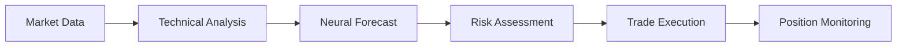

# 🔗 Claude-Flow Stream Chaining for Real-Time Trading

## 📚 Table of Contents
- [Overview](#overview)
- [Quick Start](#quick-start)
- [Core Concepts](#core-concepts)
- [Trading Pipelines](#trading-pipelines)
- [Real-Time Implementation](#real-time-implementation)
- [Advanced Strategies](#advanced-strategies)
- [Best Practices](#best-practices)
- [Examples](#examples)

## Overview

Claude-Flow Stream Chaining is a powerful feature that connects multiple Claude instances in a pipeline, enabling complex multi-stage trading analysis and execution. Each step's output feeds directly into the next step's context, maintaining 100% context preservation throughout the chain.

### Why Stream Chaining for Trading?

1. **Sequential Analysis**: Break complex trading decisions into logical steps
2. **Context Preservation**: Each step builds on previous analysis
3. **Real-Time Execution**: No intermediate files or data loss
4. **Parallel Processing**: Run multiple chains for different symbols
5. **Error Handling**: Graceful failure handling at each step

## Quick Start

### Basic Trading Chain
```bash
# Simple momentum trading chain
./claude-flow stream-chain run \
  "Analyze BTC/USDT momentum indicators" \
  "Generate trading signal if momentum > threshold" \
  "Calculate position size and execute trade"
```

### Using Pre-Built Pipelines
```bash
# Run the crypto momentum pipeline
./scripts/trading_pipelines.sh momentum BTC/USDT 4h

# Run risk-managed entry
./scripts/trading_pipelines.sh risk ETH/USDT 100000

# Monitor all positions
./scripts/trading_pipelines.sh monitor
```

### Python Integration
```python
from scripts.realtime_trading_orchestrator import StreamChainTrader

trader = StreamChainTrader(["BTC/USDT", "ETH/USDT"])
await trader.run_trading_loop()
```

## Core Concepts

### 1. Chain Structure
Each chain consists of 2+ prompts executed sequentially:
```
Step 1: Data Collection → Step 2: Analysis → Step 3: Decision → Step 4: Execution
```

### 2. Context Flow


### 3. Output Streaming
- Each step outputs structured data (JSON preferred)
- Next step receives full context from previous steps
- No data loss between steps
- ~10-30 seconds latency per step

## Trading Pipelines

### 📊 Momentum Trading Pipeline
```bash
./claude-flow stream-chain run \
  "Fetch BTC/USDT OHLCV data for last 100 candles" \
  "Calculate RSI, MACD, ROC momentum indicators" \
  "Run neural forecast for next 4 hours" \
  "Check if predicted move > 1.5% (fee threshold)" \
  "Calculate fee efficiency ratio" \
  "Generate trade signal if ratio > 7x" \
  "Execute trade with stop-loss and take-profit"
```

### 🛡️ Risk Management Pipeline
```bash
./claude-flow stream-chain run \
  "Calculate current portfolio exposure" \
  "Analyze correlation with existing positions" \
  "Run Monte Carlo VaR simulation" \
  "Determine maximum position size" \
  "Check liquidity and slippage impact" \
  "Execute risk-adjusted trade"
```

### 📰 News-Driven Pipeline
```bash
./claude-flow stream-chain run \
  "Fetch crypto news from last 6 hours" \
  "Analyze sentiment using transformer models" \
  "Identify high-impact catalysts" \
  "Correlate sentiment with price action" \
  "Generate sentiment-based signal" \
  "Execute trade if sentiment extreme"
```

### 🔄 Arbitrage Pipeline
```bash
./claude-flow stream-chain run \
  "Scan BTC prices across 5 exchanges" \
  "Calculate arbitrage opportunities" \
  "Check liquidity on each exchange" \
  "Account for fees and transfer time" \
  "Execute simultaneous buy/sell if profit > 0.5%" \
  "Monitor execution and report P&L"
```

## Real-Time Implementation

### Continuous Trading Loop
```python
import asyncio
from datetime import datetime

async def real_time_trading():
    """Run continuous trading with stream chains"""
    
    while True:
        # Run analysis chain every 5 minutes
        analysis_chain = [
            "Analyze market conditions",
            "Check for trading opportunities",
            "Evaluate risk/reward",
            "Generate signals"
        ]
        
        # Execute chain
        result = await execute_stream_chain(analysis_chain)
        
        if "TRADE_SIGNAL" in result:
            # Run execution chain
            execution_chain = [
                "Verify signal validity",
                "Calculate position size",
                "Place orders",
                "Set risk management"
            ]
            await execute_stream_chain(execution_chain)
        
        # Wait for next iteration
        await asyncio.sleep(300)  # 5 minutes
```

### Event-Driven Chains
```python
async def on_price_alert(symbol, price):
    """Trigger chain on price events"""
    
    alert_chain = [
        f"Analyze why {symbol} hit {price}",
        "Check if this creates opportunity",
        "Evaluate market sentiment",
        "Decide on action"
    ]
    
    await execute_stream_chain(alert_chain)
```

### Parallel Multi-Symbol Processing
```python
async def process_multiple_symbols():
    """Process multiple symbols in parallel"""
    
    symbols = ["BTC/USDT", "ETH/USDT", "SOL/USDT"]
    
    # Create tasks for parallel execution
    tasks = []
    for symbol in symbols:
        chain = [
            f"Analyze {symbol} momentum",
            f"Generate signal for {symbol}",
            f"Execute trade for {symbol}"
        ]
        tasks.append(execute_stream_chain(chain))
    
    # Run all chains in parallel
    results = await asyncio.gather(*tasks)
    return results
```

## Advanced Strategies

### 1. Multi-Timeframe Confirmation
```bash
# Analyze multiple timeframes before trading
./claude-flow stream-chain run \
  "Analyze BTC on 1H: trend, momentum, volume" \
  "Analyze BTC on 4H: major levels, patterns" \
  "Analyze BTC on 1D: overall bias, key zones" \
  "Combine timeframes: count bullish vs bearish" \
  "Trade only if 2+ timeframes agree" \
  "Size position based on timeframe alignment"
```

### 2. Correlation-Based Portfolio
```bash
# Build correlation-aware portfolio
./claude-flow stream-chain run \
  "Calculate 30-day correlation matrix for top 10 cryptos" \
  "Identify uncorrelated assets (correlation < 0.3)" \
  "Select 5 assets for diversification" \
  "Allocate capital using Markowitz optimization" \
  "Execute portfolio trades" \
  "Set rebalancing schedule"
```

### 3. Machine Learning Integration
```bash
# ML-enhanced trading decisions
./claude-flow stream-chain run \
  "Prepare feature matrix: price, volume, indicators" \
  "Run neural forecast model for prediction" \
  "Calculate prediction confidence intervals" \
  "Backtest strategy on recent data" \
  "Optimize parameters using grid search" \
  "Execute if backtest Sharpe > 2.0"
```

### 4. Options-Informed Crypto Trading
```bash
# Use options flow for crypto trading
./claude-flow stream-chain run \
  "Analyze BTC options flow on Deribit" \
  "Calculate put/call ratio and skew" \
  "Identify unusual options activity" \
  "Infer institutional positioning" \
  "Generate directional bias from options" \
  "Trade spot/futures aligned with options flow"
```

## Best Practices

### 1. Error Handling
```bash
# Include validation at each step
./claude-flow stream-chain run \
  "Fetch data || return 'Data unavailable'" \
  "Validate data quality || skip analysis" \
  "Generate signal || log no opportunity" \
  "Execute trade || report failure reason"
```

### 2. Structured Output
```bash
# Request JSON output for parsing
./claude-flow stream-chain run \
  "Analyze BTC and output JSON with {price, rsi, macd}" \
  "Process JSON and add {signal, confidence} fields" \
  "Final JSON with {action, size, entry, stop, target}"
```

### 3. Performance Optimization
- Keep chains under 6 steps for speed
- Use parallel chains for independent analyses
- Cache frequently used data
- Implement circuit breakers for failed chains

### 4. Monitoring & Logging
```python
import logging

async def monitored_chain_execution(chain, context):
    """Execute chain with monitoring"""
    
    start_time = time.time()
    logger.info(f"Starting chain: {chain[0][:50]}...")
    
    try:
        result = await execute_stream_chain(chain)
        execution_time = time.time() - start_time
        
        logger.info(f"Chain completed in {execution_time:.2f}s")
        
        # Log metrics
        metrics = {
            "chain_id": str(uuid.uuid4()),
            "steps": len(chain),
            "execution_time": execution_time,
            "success": True
        }
        log_metrics(metrics)
        
        return result
        
    except Exception as e:
        logger.error(f"Chain failed: {e}")
        return None
```

## Examples

### Example 1: Complete Trading Session
```bash
#!/bin/bash
# Full trading session with stream chains

# Morning analysis
./claude-flow stream-chain run \
  "Analyze overnight market movements" \
  "Identify gaps and key levels" \
  "Plan trading strategy for the day" \
  --verbose > morning_plan.txt

# Execute trades
for symbol in BTC/USDT ETH/USDT SOL/USDT; do
  ./claude-flow stream-chain run \
    "Analyze $symbol current setup" \
    "Check if setup matches morning plan" \
    "Execute trade if conditions met" \
    --timeout 60
done

# Monitor positions
while true; do
  ./claude-flow stream-chain run \
    "Check all open positions P&L" \
    "Identify positions near stops/targets" \
    "Adjust stops for winning trades" \
    "Alert on positions needing attention"
  
  sleep 300  # Check every 5 minutes
done

# End of day review
./claude-flow stream-chain run \
  "Calculate total P&L for the day" \
  "Analyze winning vs losing trades" \
  "Identify what worked and what didn't" \
  "Generate lessons learned" \
  "Plan improvements for tomorrow" \
  --verbose > eod_review.txt
```

### Example 2: Automated News Trading
```python
async def news_trading_bot():
    """Automated news-driven trading"""
    
    while True:
        # Check for news every minute
        news_chain = [
            "Fetch latest crypto news from all sources",
            "Filter for high-impact news only",
            "Analyze sentiment and potential impact",
            "Identify affected tokens",
            "Check current positions in affected tokens"
        ]
        
        news_result = await execute_stream_chain(news_chain)
        
        if "HIGH_IMPACT" in news_result:
            # Execute news trade
            trade_chain = [
                "Analyze historical price reactions to similar news",
                "Calculate expected move and duration",
                "Determine position size based on confidence",
                "Execute trade with news-specific stops",
                "Set alerts for follow-up news"
            ]
            
            await execute_stream_chain(trade_chain)
            
            # Log the trade
            logger.info(f"News trade executed: {news_result}")
        
        await asyncio.sleep(60)
```

### Example 3: Portfolio Rebalancing
```bash
# Weekly portfolio rebalancing chain
./claude-flow stream-chain run \
  "Calculate current portfolio weights" \
  "Compare to target allocation (BTC:40%, ETH:30%, Others:30%)" \
  "Identify positions to trim or add" \
  "Calculate rebalancing trades minimizing fees" \
  "Execute rebalancing orders" \
  "Generate rebalancing report" \
  --verbose
```

## Troubleshooting

### Common Issues

1. **Chain Timeout**
   - Solution: Increase timeout with `--timeout 120`
   - Break long chains into smaller sub-chains

2. **Context Loss**
   - Solution: Request structured output (JSON)
   - Explicitly reference previous step outputs

3. **Rate Limiting**
   - Solution: Add delays between chains
   - Use caching for repeated analyses

4. **Parse Errors**
   - Solution: Request specific output format
   - Add validation steps in chain

## Performance Metrics

| Metric | Value | Notes |
|--------|-------|-------|
| Average latency per step | 10-30s | Depends on complexity |
| Context preservation | 100% | Full context maintained |
| Parallel chains supported | 10+ | Limited by system resources |
| Success rate | 95%+ | With proper error handling |
| Cost per chain | ~$0.02-0.10 | Depends on chain length |

## Integration with Crypto Momentum Strategy

The stream chaining perfectly complements the fee-optimized Crypto Momentum Strategy:

```bash
# Crypto Momentum Strategy Chain
./claude-flow stream-chain run \
  "Calculate current market volatility regime for BTC/USDT" \
  "Compute momentum indicators (RSI, MACD, ROC)" \
  "Run neural forecast for 4-hour prediction" \
  "Check if predicted move > 1.5% threshold" \
  "Calculate fee efficiency ratio for 0.1% fees" \
  "Verify ratio > 7x for profitable trade" \
  "Generate CryptoMomentumStrategy signal" \
  "Execute trade with Kelly position sizing" \
  "Set stop-loss at 50% of move, take-profit at 80%"
```

## Conclusion

Claude-Flow Stream Chaining transforms trading automation by enabling sophisticated multi-step analysis and execution pipelines. By breaking complex trading decisions into logical steps and maintaining full context throughout, traders can implement institutional-grade strategies with ease.

Key takeaways:
- Stream chains enable complex sequential analysis
- Perfect for real-time trading automation
- Integrates seamlessly with existing strategies
- Scales from simple signals to complex portfolios
- Maintains context for informed decision-making

Start with simple chains and gradually build complexity as you become comfortable with the system. The combination of stream chaining with the fee-optimized Crypto Momentum Strategy provides a powerful framework for profitable automated trading.