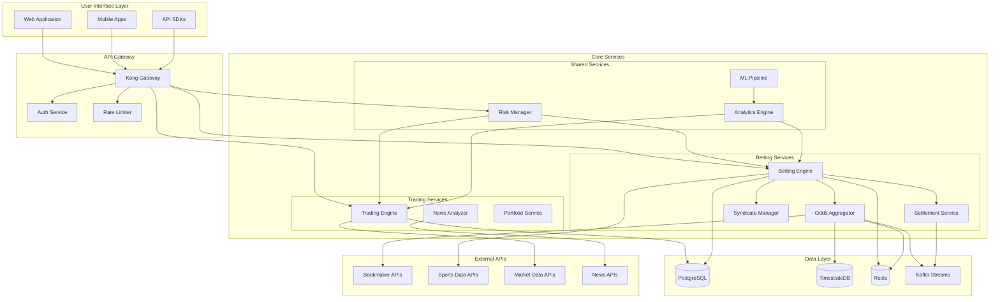
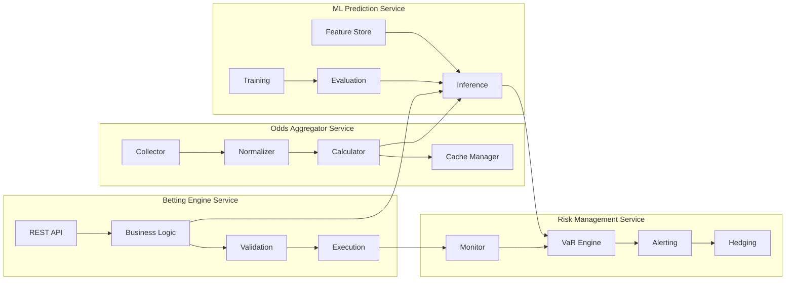
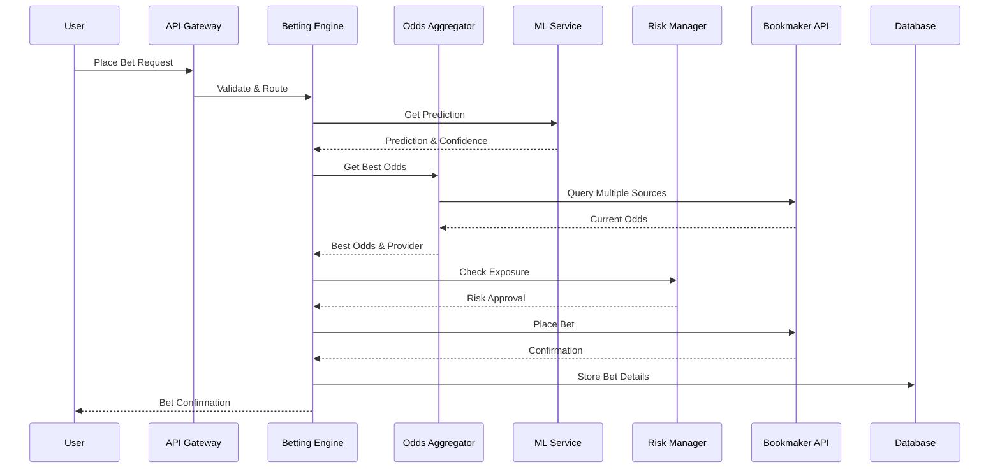
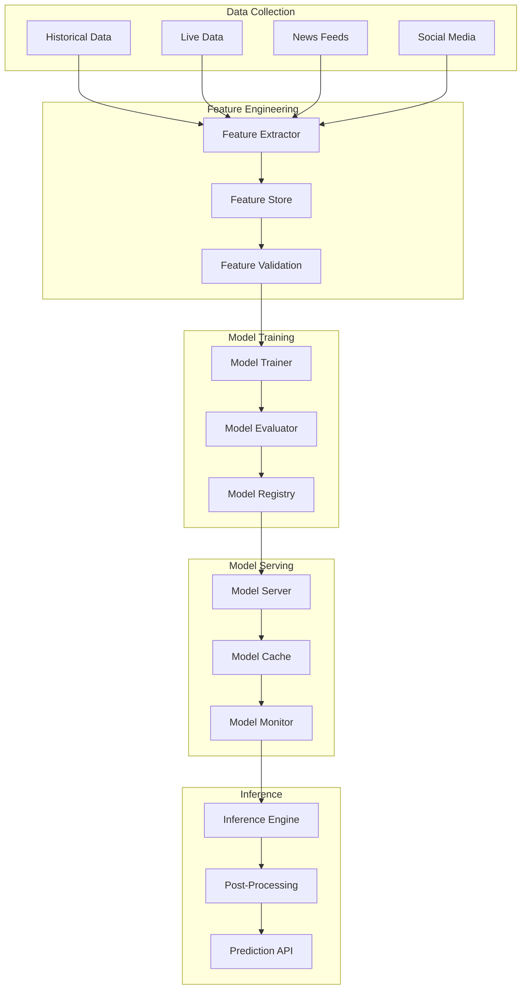
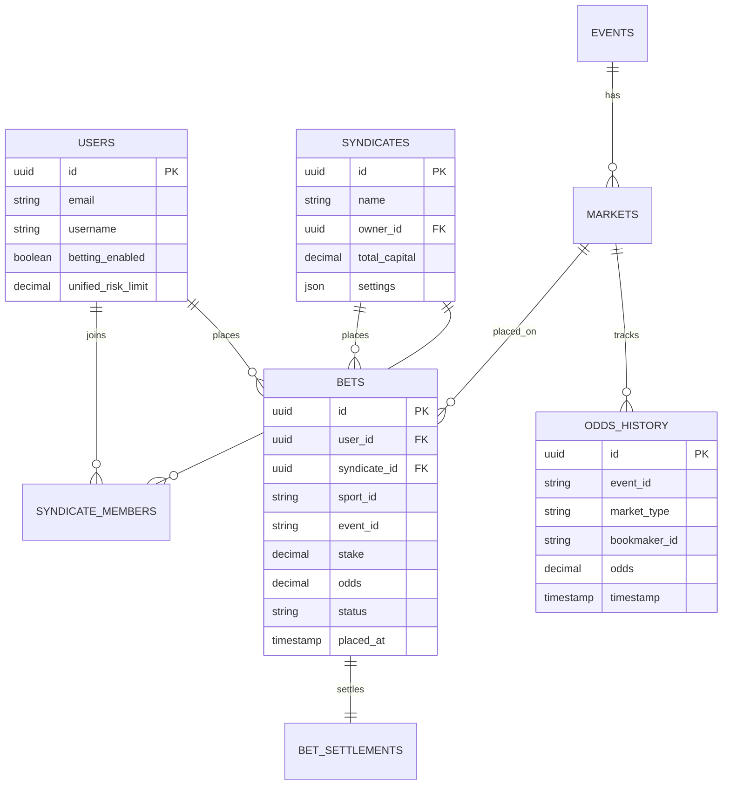
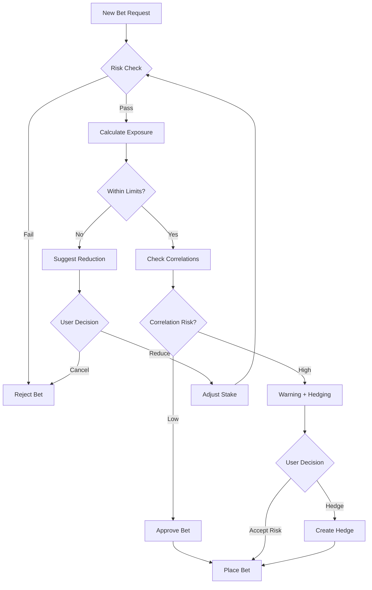
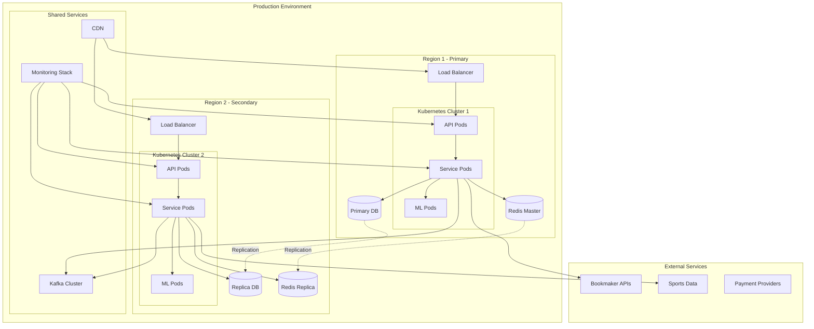
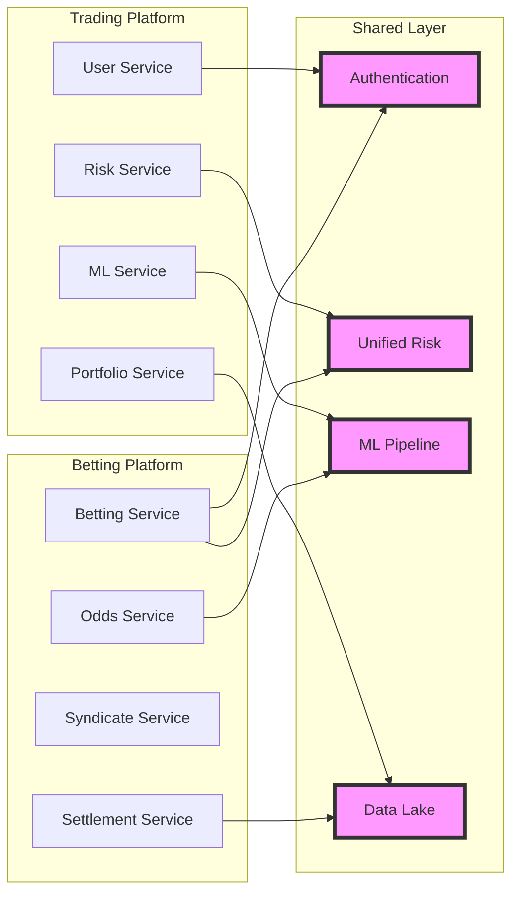
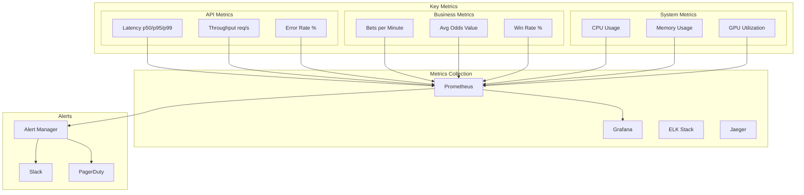

# Sports Betting Platform - Architecture Diagrams

## System Overview

## Microservices Architecture

## Data Flow Architecture

## ML Pipeline Architecture

## Database Schema Overview

## Risk Management Flow

## Deployment Architecture

## Integration Points

## Performance Monitoring Dashboard

---

These diagrams provide a comprehensive visual representation of the sports betting platform architecture, showing:

1. **System Overview**: High-level component relationships
2. **Microservices Architecture**: Internal service structure
3. **Data Flow**: Request processing sequence
4. **ML Pipeline**: Machine learning workflow
5. **Database Schema**: Entity relationships
6. **Risk Management**: Decision flow
7. **Deployment Architecture**: Infrastructure layout
8. **Integration Points**: Shared components with trading platform
9. **Performance Monitoring**: Metrics and alerting structure

Each diagram can be rendered using any Mermaid-compatible viewer or documentation tool.