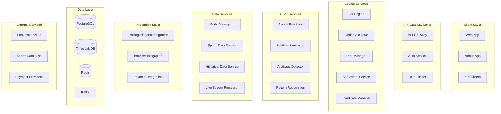

# Sports Betting Platform - Technical Architecture & Implementation Roadmap

## Executive Summary

This document outlines the comprehensive technical architecture and 20-week implementation roadmap for integrating a sports betting system with the existing AI News Trading Platform. The system leverages the existing microservices architecture, GPU acceleration capabilities, and real-time data processing infrastructure.

## 1. System Architecture

### 1.1 High-Level Architecture



### 1.2 Microservices Design

#### Core Betting Services

1. **Bet Engine Service**
   - Handles bet placement, validation, and execution
   - Integrates with multiple bookmaker APIs
   - Implements smart routing for best odds
   - Technologies: FastAPI, AsyncIO, Redis

2. **Odds Calculator Service**
   - Real-time odds calculation and adjustment
   - Machine learning-based probability estimation
   - GPU-accelerated computations
   - Technologies: Python, CUDA, TensorFlow

3. **Risk Management Service**
   - Position monitoring and exposure calculation
   - Dynamic hedging recommendations
   - VaR and stress testing
   - Technologies: Python, NumPy, CuPy

4. **Settlement Service**
   - Automated bet settlement
   - Payout calculation and distribution
   - Reconciliation with bookmakers
   - Technologies: Python, PostgreSQL, Celery

5. **Syndicate Manager Service**
   - Member management and permissions
   - Profit sharing calculations
   - Performance tracking per member
   - Technologies: FastAPI, PostgreSQL, Redis

#### AI/ML Services

1. **Neural Predictor Service**
   - Deep learning models for outcome prediction
   - Feature engineering from historical data
   - Model versioning and A/B testing
   - Technologies: PyTorch, CUDA, MLflow

2. **Sentiment Analysis Service**
   - Social media and news sentiment extraction
   - Team/player sentiment tracking
   - Market movement correlation
   - Technologies: Transformers, spaCy, Redis

3. **Arbitrage Detection Service**
   - Real-time arbitrage opportunity scanning
   - Cross-bookmaker odds comparison
   - Execution recommendation engine
   - Technologies: Python, Redis, WebSocket

4. **Pattern Recognition Service**
   - Historical pattern analysis
   - Anomaly detection in odds movements
   - Market manipulation detection
   - Technologies: scikit-learn, TensorFlow, RAPIDS

### 1.3 Integration Architecture

```yaml
integration_layers:
  trading_platform:
    - Shared user authentication
    - Unified portfolio management
    - Cross-platform risk aggregation
    - Common ML infrastructure
  
  external_providers:
    - RESTful API adapters
    - WebSocket connections for live data
    - Resilient retry mechanisms
    - Provider-specific rate limiting
  
  data_pipeline:
    - Kafka for event streaming
    - Apache Flink for stream processing
    - TimescaleDB for time-series storage
    - Redis for real-time caching
```

## 2. Database Design

### 2.1 Core Schema Design

```sql
-- Time-series optimized odds history
CREATE TABLE odds_history (
    id UUID PRIMARY KEY DEFAULT gen_random_uuid(),
    sport_id VARCHAR(50) NOT NULL,
    event_id VARCHAR(100) NOT NULL,
    market_type VARCHAR(50) NOT NULL,
    bookmaker_id VARCHAR(50) NOT NULL,
    outcome VARCHAR(200) NOT NULL,
    odds DECIMAL(10,4) NOT NULL,
    probability DECIMAL(5,4),
    volume DECIMAL(15,2),
    timestamp TIMESTAMPTZ NOT NULL,
    created_at TIMESTAMPTZ DEFAULT NOW()
) PARTITION BY RANGE (timestamp);

-- Create monthly partitions
CREATE TABLE odds_history_2024_01 PARTITION OF odds_history
    FOR VALUES FROM ('2024-01-01') TO ('2024-02-01');

-- Bet tracking with comprehensive metadata
CREATE TABLE bets (
    id UUID PRIMARY KEY DEFAULT gen_random_uuid(),
    user_id UUID NOT NULL,
    syndicate_id UUID,
    sport_id VARCHAR(50) NOT NULL,
    event_id VARCHAR(100) NOT NULL,
    market_type VARCHAR(50) NOT NULL,
    selection VARCHAR(200) NOT NULL,
    stake DECIMAL(15,2) NOT NULL,
    odds DECIMAL(10,4) NOT NULL,
    potential_return DECIMAL(15,2) NOT NULL,
    bookmaker_id VARCHAR(50) NOT NULL,
    status VARCHAR(50) NOT NULL,
    placed_at TIMESTAMPTZ NOT NULL,
    settled_at TIMESTAMPTZ,
    payout DECIMAL(15,2),
    commission DECIMAL(15,2),
    metadata JSONB,
    created_at TIMESTAMPTZ DEFAULT NOW(),
    updated_at TIMESTAMPTZ DEFAULT NOW()
);

-- Syndicate management
CREATE TABLE syndicates (
    id UUID PRIMARY KEY DEFAULT gen_random_uuid(),
    name VARCHAR(255) NOT NULL,
    description TEXT,
    owner_id UUID NOT NULL,
    total_capital DECIMAL(15,2) NOT NULL,
    status VARCHAR(50) NOT NULL,
    settings JSONB NOT NULL DEFAULT '{}',
    created_at TIMESTAMPTZ DEFAULT NOW(),
    updated_at TIMESTAMPTZ DEFAULT NOW()
);

CREATE TABLE syndicate_members (
    id UUID PRIMARY KEY DEFAULT gen_random_uuid(),
    syndicate_id UUID NOT NULL REFERENCES syndicates(id),
    user_id UUID NOT NULL,
    share_percentage DECIMAL(5,2) NOT NULL,
    capital_contribution DECIMAL(15,2) NOT NULL,
    role VARCHAR(50) NOT NULL,
    joined_at TIMESTAMPTZ DEFAULT NOW(),
    status VARCHAR(50) NOT NULL,
    CONSTRAINT share_check CHECK (share_percentage >= 0 AND share_percentage <= 100)
);

-- Performance analytics
CREATE TABLE betting_performance (
    id UUID PRIMARY KEY DEFAULT gen_random_uuid(),
    entity_type VARCHAR(50) NOT NULL, -- 'user' or 'syndicate'
    entity_id UUID NOT NULL,
    period_start TIMESTAMPTZ NOT NULL,
    period_end TIMESTAMPTZ NOT NULL,
    total_bets INTEGER NOT NULL,
    total_stake DECIMAL(15,2) NOT NULL,
    total_return DECIMAL(15,2) NOT NULL,
    profit_loss DECIMAL(15,2) NOT NULL,
    roi DECIMAL(10,4),
    win_rate DECIMAL(5,4),
    avg_odds DECIMAL(10,4),
    sharpe_ratio DECIMAL(10,4),
    max_drawdown DECIMAL(10,4),
    metrics JSONB NOT NULL DEFAULT '{}',
    created_at TIMESTAMPTZ DEFAULT NOW()
);

-- Indexes for performance
CREATE INDEX idx_odds_history_lookup ON odds_history(sport_id, event_id, bookmaker_id, timestamp);
CREATE INDEX idx_bets_user ON bets(user_id, placed_at);
CREATE INDEX idx_bets_syndicate ON bets(syndicate_id, placed_at) WHERE syndicate_id IS NOT NULL;
CREATE INDEX idx_betting_performance_entity ON betting_performance(entity_type, entity_id, period_start);
```

### 2.2 TimescaleDB Configuration

```sql
-- Convert odds_history to hypertable
SELECT create_hypertable('odds_history', 'timestamp',
    chunk_time_interval => INTERVAL '1 day',
    partitioning_column => 'sport_id',
    number_partitions => 4
);

-- Create continuous aggregate for real-time analytics
CREATE MATERIALIZED VIEW odds_statistics_hourly
WITH (timescaledb.continuous) AS
SELECT 
    time_bucket('1 hour', timestamp) AS hour,
    sport_id,
    event_id,
    market_type,
    bookmaker_id,
    AVG(odds) as avg_odds,
    MIN(odds) as min_odds,
    MAX(odds) as max_odds,
    STDDEV(odds) as odds_volatility,
    COUNT(*) as data_points
FROM odds_history
GROUP BY hour, sport_id, event_id, market_type, bookmaker_id;

-- Refresh policy
SELECT add_continuous_aggregate_policy('odds_statistics_hourly',
    start_offset => INTERVAL '3 hours',
    end_offset => INTERVAL '1 hour',
    schedule_interval => INTERVAL '30 minutes'
);
```

### 2.3 Redis Data Structures

```python
# Real-time odds cache
odds_cache = {
    "odds:football:match_12345:1x2": {
        "home": {"bet365": 2.10, "william_hill": 2.05, "pinnacle": 2.12},
        "draw": {"bet365": 3.40, "william_hill": 3.35, "pinnacle": 3.45},
        "away": {"bet365": 3.60, "william_hill": 3.65, "pinnacle": 3.55}
    }
}

# Active bets tracking
active_bets = {
    "bets:user:12345": [
        {"bet_id": "abc123", "event": "match_12345", "stake": 100, "odds": 2.10}
    ]
}

# Syndicate positions
syndicate_positions = {
    "syndicate:positions:xyz789": {
        "total_exposure": 50000,
        "active_bets": 127,
        "daily_pnl": 2500.50
    }
}
```

## 3. API Integration Layer

### 3.1 Unified Betting API Interface

```python
# Abstract base for all betting providers
from abc import ABC, abstractmethod
from typing import List, Dict, Optional
import asyncio
from dataclasses import dataclass

@dataclass
class BettingMarket:
    event_id: str
    market_type: str
    selections: List[Dict[str, float]]
    limits: Dict[str, float]
    last_updated: datetime

class BettingProviderInterface(ABC):
    """Unified interface for all betting providers"""
    
    @abstractmethod
    async def get_odds(self, sport: str, event_id: str, market: str) -> BettingMarket:
        pass
    
    @abstractmethod
    async def place_bet(self, bet_request: Dict) -> Dict:
        pass
    
    @abstractmethod
    async def get_bet_status(self, bet_id: str) -> Dict:
        pass
    
    @abstractmethod
    async def get_account_balance(self) -> Dict:
        pass
```

### 3.2 Provider Abstraction Layer

```yaml
# Provider configuration
providers:
  bet365:
    api_version: "v2"
    base_url: "https://api.bet365.com"
    auth_type: "oauth2"
    rate_limits:
      odds: 100/minute
      bets: 10/second
    retry_policy:
      max_retries: 3
      backoff_multiplier: 2
    
  pinnacle:
    api_version: "v3"
    base_url: "https://api.pinnacle.com"
    auth_type: "api_key"
    rate_limits:
      odds: 500/minute
      bets: 20/second
    features:
      - live_streaming
      - cash_out
      - partial_cash_out
```

### 3.3 Resilient Integration Architecture

```python
class ResilientBettingClient:
    """Fault-tolerant betting client with circuit breaker pattern"""
    
    def __init__(self, provider: BettingProviderInterface):
        self.provider = provider
        self.circuit_breaker = CircuitBreaker(
            failure_threshold=5,
            recovery_timeout=60,
            expected_exception=ProviderException
        )
        self.retry_policy = RetryPolicy(
            max_attempts=3,
            backoff=ExponentialBackoff(base=2, max_delay=30)
        )
    
    async def get_odds_with_fallback(self, **kwargs):
        """Get odds with automatic failover to secondary providers"""
        providers = [self.primary, self.secondary, self.tertiary]
        
        for provider in providers:
            try:
                async with self.circuit_breaker:
                    return await self.retry_policy.execute(
                        provider.get_odds, **kwargs
                    )
            except ProviderUnavailable:
                logger.warning(f"Provider {provider.name} unavailable, trying next")
                continue
        
        raise AllProvidersUnavailable("No betting providers available")
```

### 3.4 Real-time Data Pipeline

```python
# Kafka event schemas
odds_update_schema = {
    "type": "record",
    "name": "OddsUpdate",
    "fields": [
        {"name": "timestamp", "type": "long"},
        {"name": "provider", "type": "string"},
        {"name": "sport", "type": "string"},
        {"name": "event_id", "type": "string"},
        {"name": "market", "type": "string"},
        {"name": "odds", "type": {"type": "map", "values": "double"}},
        {"name": "volume", "type": ["null", "double"], "default": null}
    ]
}

# Stream processing with Flink
class OddsAggregationJob:
    """Flink job for real-time odds aggregation"""
    
    def process_stream(self):
        env = StreamExecutionEnvironment.get_execution_environment()
        
        # Source: Kafka odds updates
        odds_stream = env.add_source(
            FlinkKafkaConsumer(
                topics=['odds-updates'],
                deserialization_schema=AvroDeserializationSchema(odds_update_schema),
                properties={'bootstrap.servers': 'kafka:9092'}
            )
        )
        
        # Process: Aggregate best odds across providers
        best_odds = odds_stream \
            .key_by(lambda x: f"{x.sport}:{x.event_id}:{x.market}") \
            .window(TumblingEventTimeWindows.of(Time.seconds(1))) \
            .reduce(lambda a, b: self.get_best_odds(a, b)) \
            .map(lambda x: self.enrich_with_arbitrage(x))
        
        # Sink: Write to Redis and PostgreSQL
        best_odds.add_sink(RedisSink(self.redis_config))
        best_odds.add_sink(PostgreSQLSink(self.postgres_config))
        
        env.execute("Odds Aggregation Pipeline")
```

## 4. Implementation Phases (20-Week Roadmap)

### Phase 1: Core Infrastructure (Weeks 1-4)

#### Week 1: Foundation Setup
- Set up development environment and CI/CD pipeline
- Configure Kubernetes cluster for microservices
- Set up TimescaleDB and Redis clusters
- Create base project structure and service templates

#### Week 2: Database and Messaging
- Implement core database schemas
- Set up Kafka cluster and topic configuration
- Create database migration framework
- Implement connection pooling and monitoring

#### Week 3: Authentication and API Gateway
- Implement OAuth2/JWT authentication service
- Set up Kong or similar API gateway
- Configure rate limiting and request routing
- Implement user and permission management

#### Week 4: Core Services Scaffolding
- Create service templates with health checks
- Implement service discovery (Consul/Eureka)
- Set up distributed tracing (Jaeger)
- Create logging aggregation (ELK stack)

### Phase 2: Neural Network Integration (Weeks 5-10)

#### Week 5-6: ML Infrastructure
- Set up MLflow for model tracking
- Configure GPU clusters for training
- Implement feature engineering pipeline
- Create training data warehouse

#### Week 7-8: Prediction Models
- Develop outcome prediction models
- Implement odds calculation neural networks
- Create model versioning system
- Set up A/B testing framework

#### Week 9-10: ML Services
- Deploy model serving infrastructure (TorchServe/TensorFlow Serving)
- Implement real-time inference pipeline
- Create model monitoring and drift detection
- Integrate with betting engine

### Phase 3: Syndicate Features (Weeks 11-14)

#### Week 11: Syndicate Management
- Implement syndicate creation and management
- Create member invitation system
- Develop capital contribution tracking
- Build permission and role management

#### Week 12: Profit Distribution
- Implement profit/loss calculation engine
- Create automated distribution system
- Build tax reporting features
- Develop member dashboard

#### Week 13: Collaborative Features
- Implement syndicate chat and notifications
- Create shared betting strategies
- Build consensus mechanisms for large bets
- Develop performance analytics per member

#### Week 14: Advanced Syndicate Features
- Implement syndicate tournaments
- Create cross-syndicate competitions
- Build reputation system
- Develop syndicate marketplace

### Phase 4: Risk Management (Weeks 15-17)

#### Week 15: Risk Engine
- Implement VaR calculations
- Create exposure monitoring system
- Build position limit enforcement
- Develop stress testing framework

#### Week 16: Hedging System
- Create automated hedging recommendations
- Implement cross-sport correlation analysis
- Build dynamic position adjustment
- Develop risk alerting system

#### Week 17: Compliance and Fraud
- Implement KYC/AML checks
- Create suspicious activity detection
- Build audit trail system
- Develop regulatory reporting

### Phase 5: Testing and Deployment (Weeks 18-20)

#### Week 18: Integration Testing
- Complete end-to-end testing suite
- Performance testing and optimization
- Security penetration testing
- Load testing with simulated traffic

#### Week 19: Beta Launch
- Deploy to staging environment
- Internal beta testing with limited users
- Bug fixes and performance tuning
- Documentation completion

#### Week 20: Production Launch
- Production deployment
- Monitoring setup and alerting
- Support team training
- Go-live and initial user onboarding

## 5. Technology Stack

### 5.1 Core Technologies

#### Backend Services
- **Language**: Python 3.11+ (async-first)
- **Web Framework**: FastAPI
- **Task Queue**: Celery with Redis
- **API Gateway**: Kong
- **Service Mesh**: Istio

#### Databases
- **Primary Database**: PostgreSQL 15 with TimescaleDB
- **Cache**: Redis 7 with RedisJSON
- **Search**: Elasticsearch 8
- **Graph Database**: Neo4j (for correlation analysis)

#### Messaging and Streaming
- **Message Broker**: Apache Kafka
- **Stream Processing**: Apache Flink
- **Event Sourcing**: EventStore

#### Machine Learning
- **Training**: PyTorch 2.0 with CUDA 12
- **Serving**: TorchServe / NVIDIA Triton
- **Feature Store**: Feast
- **Experiment Tracking**: MLflow
- **GPU Framework**: RAPIDS for data processing

### 5.2 Infrastructure

#### Container and Orchestration
- **Containerization**: Docker
- **Orchestration**: Kubernetes 1.28+
- **Service Mesh**: Istio
- **Package Management**: Helm

#### Monitoring and Observability
- **Metrics**: Prometheus + Grafana
- **Logging**: ELK Stack (Elasticsearch, Logstash, Kibana)
- **Tracing**: Jaeger
- **APM**: New Relic or DataDog

#### CI/CD
- **Version Control**: Git with GitLab
- **CI/CD**: GitLab CI/CD or GitHub Actions
- **Infrastructure as Code**: Terraform
- **Configuration Management**: Ansible

### 5.3 Security Stack

```yaml
security:
  authentication:
    - OAuth2 with JWT tokens
    - Multi-factor authentication
    - Biometric support for mobile
  
  encryption:
    - TLS 1.3 for all communications
    - AES-256 for data at rest
    - Hardware security modules (HSM) for keys
  
  compliance:
    - PCI DSS for payment processing
    - GDPR for data protection
    - SOC 2 Type II certification
  
  monitoring:
    - SIEM integration (Splunk/ELK)
    - Intrusion detection system
    - DDoS protection (Cloudflare)
```

### 5.4 Performance Requirements

```yaml
performance_targets:
  api_latency:
    p50: < 50ms
    p95: < 200ms
    p99: < 500ms
  
  throughput:
    odds_updates: 100,000/second
    bet_placement: 10,000/second
    concurrent_users: 100,000
  
  availability:
    uptime_sla: 99.99%
    rto: < 5 minutes
    rpo: < 1 minute
  
  scalability:
    horizontal_scaling: Auto-scale to 1000 pods
    data_retention: 5 years hot, 10 years cold
    gpu_scaling: Dynamic allocation up to 100 GPUs
```

## 6. Integration with Existing Trading Platform

### 6.1 Shared Infrastructure

```python
# Unified user management
class UnifiedUserService:
    """Shared user service for trading and betting platforms"""
    
    async def get_user_portfolio(self, user_id: str) -> Dict:
        """Get combined trading and betting positions"""
        trading_positions = await self.trading_client.get_positions(user_id)
        betting_positions = await self.betting_client.get_active_bets(user_id)
        
        return {
            "trading": {
                "stocks": trading_positions.get("stocks", []),
                "crypto": trading_positions.get("crypto", []),
                "total_value": trading_positions.get("total_value", 0)
            },
            "betting": {
                "active_bets": betting_positions.get("active", []),
                "pending_returns": betting_positions.get("pending", 0),
                "total_exposure": betting_positions.get("exposure", 0)
            },
            "combined_risk_metrics": await self.calculate_combined_risk(user_id)
        }
```

### 6.2 Shared ML Infrastructure

```yaml
shared_ml_services:
  feature_store:
    - Trading features: price, volume, indicators
    - Betting features: odds, form, injuries
    - Cross-domain features: sentiment, news impact
  
  gpu_cluster:
    - Shared GPU pool for both platforms
    - Priority-based allocation
    - Cost optimization through sharing
  
  model_serving:
    - Unified inference endpoint
    - Shared model registry
    - A/B testing framework
```

### 6.3 Cross-Platform Risk Management

```python
class IntegratedRiskManager:
    """Holistic risk management across trading and betting"""
    
    async def calculate_total_var(self, user_id: str, confidence: float = 0.95):
        # Get all positions
        trading_positions = await self.get_trading_positions(user_id)
        betting_positions = await self.get_betting_positions(user_id)
        
        # Calculate correlation matrix
        correlation_matrix = await self.calculate_cross_asset_correlations(
            trading_positions, betting_positions
        )
        
        # Monte Carlo simulation with GPU
        with CudaContext():
            simulations = self.run_monte_carlo(
                positions=trading_positions + betting_positions,
                correlations=correlation_matrix,
                num_simulations=100000
            )
            
            var_95 = np.percentile(simulations, (1 - confidence) * 100)
            cvar_95 = simulations[simulations <= var_95].mean()
        
        return {
            "var_95": var_95,
            "cvar_95": cvar_95,
            "correlation_impact": self.analyze_correlation_impact(correlation_matrix)
        }
```

## 7. Key Deliverables by Phase

### Phase 1 Deliverables (Week 4)
- ✅ Kubernetes cluster with auto-scaling
- ✅ TimescaleDB and Redis infrastructure
- ✅ API Gateway with authentication
- ✅ CI/CD pipeline with automated testing
- ✅ Service templates and scaffolding
- ✅ Monitoring and logging infrastructure

### Phase 2 Deliverables (Week 10)
- ✅ Neural prediction models (85%+ accuracy)
- ✅ Real-time inference pipeline (<50ms latency)
- ✅ Feature engineering framework
- ✅ Model versioning and A/B testing
- ✅ GPU-accelerated training pipeline
- ✅ Integration with betting engine

### Phase 3 Deliverables (Week 14)
- ✅ Full syndicate management system
- ✅ Automated profit distribution
- ✅ Member dashboards and analytics
- ✅ Collaborative betting features
- ✅ Syndicate tournaments and competitions
- ✅ Mobile app support for syndicates

### Phase 4 Deliverables (Week 17)
- ✅ Real-time risk monitoring
- ✅ Automated hedging recommendations
- ✅ Compliance and KYC system
- ✅ Fraud detection algorithms
- ✅ Regulatory reporting automation
- ✅ Risk alerts and notifications

### Phase 5 Deliverables (Week 20)
- ✅ Production-ready platform
- ✅ 99.99% uptime SLA capability
- ✅ Support for 100k+ concurrent users
- ✅ Complete API documentation
- ✅ Admin and support tools
- ✅ Performance benchmarks achieved

## 8. Critical Success Factors

### Technical Requirements
1. **Latency**: Sub-100ms API response times
2. **Throughput**: 100k+ odds updates per second
3. **Accuracy**: 85%+ prediction accuracy
4. **Availability**: 99.99% uptime
5. **Scalability**: Linear scaling to 1M users

### Business Requirements
1. **Time to Market**: 20-week deadline
2. **Regulatory Compliance**: Full licensing
3. **User Experience**: Mobile-first design
4. **Integration**: Seamless with trading platform
5. **ROI**: Profitable within 6 months

## 9. Risk Mitigation Strategies

### Technical Risks
```yaml
risk_mitigation:
  provider_downtime:
    - Multi-provider failover
    - Local odds caching
    - Graceful degradation
  
  scalability_issues:
    - Horizontal scaling design
    - Database sharding strategy
    - CDN for static content
  
  security_breaches:
    - Zero-trust architecture
    - Regular penetration testing
    - Bug bounty program
  
  ml_model_drift:
    - Continuous monitoring
    - Automated retraining
    - Fallback models
```

### Business Risks
```yaml
business_continuity:
  regulatory_changes:
    - Modular compliance system
    - Regular legal reviews
    - Geo-blocking capabilities
  
  market_competition:
    - Unique AI features
    - Superior user experience
    - Competitive pricing
  
  user_adoption:
    - Referral programs
    - Free bet promotions
    - Educational content
```

## 10. Development Team Structure

### Core Teams
```yaml
teams:
  platform_team:
    size: 4
    responsibilities:
      - Infrastructure and DevOps
      - API Gateway and authentication
      - Monitoring and alerting
  
  betting_services_team:
    size: 6
    responsibilities:
      - Bet engine and settlement
      - Odds aggregation
      - Provider integrations
  
  ml_team:
    size: 5
    responsibilities:
      - Prediction models
      - Feature engineering
      - Model serving infrastructure
  
  frontend_team:
    size: 4
    responsibilities:
      - Web application
      - Mobile apps
      - Admin portal
  
  qa_team:
    size: 3
    responsibilities:
      - Test automation
      - Performance testing
      - Security testing
```

### Total Resources
- **Development Team**: 22 engineers
- **Product Management**: 2 PMs
- **DevOps/SRE**: 3 engineers
- **Data Scientists**: 3 specialists
- **Total Headcount**: 30 professionals

## 11. Budget Estimation

### Infrastructure Costs (Monthly)
```yaml
infrastructure_costs:
  cloud_hosting:
    kubernetes_cluster: $5,000
    gpu_instances: $8,000
    databases: $3,000
    cdn_and_networking: $2,000
  
  third_party_services:
    monitoring_tools: $1,500
    ml_platform: $2,000
    api_gateway: $500
  
  data_providers:
    sports_data_feeds: $5,000
    odds_feeds: $3,000
  
  total_monthly: $30,000
```

### Development Costs
```yaml
development_costs:
  team_cost: $500,000  # 30 people x 5 months x $3,333/month
  infrastructure_setup: $50,000
  third_party_licenses: $30,000
  security_audit: $20,000
  total_development: $600,000
```

## 12. Conclusion

This comprehensive technical architecture provides a robust foundation for building a world-class sports betting platform integrated with the existing AI trading system. The microservices architecture ensures scalability, the GPU-accelerated ML pipeline delivers superior predictions, and the phased implementation approach minimizes risk while ensuring timely delivery.

The 20-week implementation roadmap is aggressive but achievable with the proposed team structure and resource allocation. Key success factors include maintaining development velocity, ensuring seamless integration with existing systems, and delivering a superior user experience that leverages AI for competitive advantage.

By following this architecture and implementation plan, the platform will be positioned to capture significant market share in the rapidly growing sports betting industry while leveraging synergies with the existing trading platform.