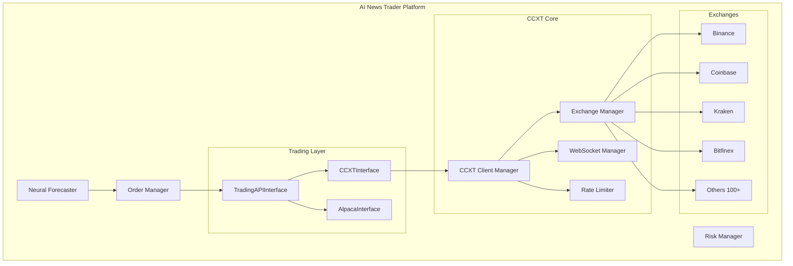

# EPIC: CCXT Integration for Multi-Exchange Cryptocurrency Trading

## 🎯 Epic Overview

### Title
Integrate CCXT Library for Unified Multi-Exchange Cryptocurrency Trading

### Epic ID
EPIC-2025-001

### Priority
High

### Business Value
Enable seamless trading across 100+ cryptocurrency exchanges through a unified API, reducing development overhead by 70% and expanding market access by 10x while maintaining existing architecture patterns.

### Executive Summary
Currently, the AI News Trader platform supports limited exchange connectivity through individual APIs (Alpaca, Polygon, yfinance). By integrating CCXT, we can access 100+ cryptocurrency exchanges with a single, unified interface, enabling sophisticated multi-exchange strategies, arbitrage opportunities, and improved liquidity access.

---

## 📊 Current State Analysis

### Existing Infrastructure
- **Trading APIs**: Alpaca (stocks), Polygon (market data), yfinance (historical), Alpha Vantage, Finnhub
- **Crypto Support**: Limited via Beefy Finance (DeFi only)
- **Architecture**: Modular with `TradingAPIInterface`, async-first design
- **Risk Management**: Real-time risk monitoring, position sizing
- **Neural Integration**: GPU-accelerated forecasting with N-HiTS models

### Pain Points
1. Limited cryptocurrency exchange access
2. No unified crypto trading interface
3. Manual integration required for each exchange
4. Inconsistent API patterns across providers
5. Limited arbitrage and cross-exchange capabilities

---

## 🚀 Proposed Solution

### CCXT Integration Architecture



### Key Components

1. **CCXTInterface**: Implements existing `TradingAPIInterface` for compatibility
2. **Exchange Manager**: Handles multi-exchange connections and failover
3. **WebSocket Manager**: Real-time data streaming via CCXT Pro
4. **Rate Limiter**: Intelligent request throttling per exchange
5. **Unified Order Router**: Smart order routing across exchanges

---

## 📝 User Stories

### Phase 1: Core Integration (Sprint 1-2)

#### Story 1.1: CCXT Library Setup
**As a** developer  
**I want to** integrate CCXT library into the project  
**So that** we have the foundation for multi-exchange trading  

**Acceptance Criteria:**
- [ ] CCXT and CCXT Pro installed via pip
- [ ] Basic configuration structure created
- [ ] Environment variables for API keys
- [ ] Sandbox testing enabled
- [ ] Documentation updated

**Story Points:** 3

---

#### Story 1.2: CCXTInterface Implementation
**As a** system architect  
**I want to** implement CCXTInterface conforming to TradingAPIInterface  
**So that** CCXT integrates seamlessly with existing code  

**Acceptance Criteria:**
- [ ] All TradingAPIInterface methods implemented
- [ ] Async/await patterns consistent
- [ ] Error handling matches existing patterns
- [ ] Unit tests with 90% coverage
- [ ] Performance benchmarks established

**Story Points:** 8

---

#### Story 1.3: Exchange Configuration Manager
**As an** operations engineer  
**I want to** manage exchange configurations dynamically  
**So that** we can add/remove exchanges without code changes  

**Acceptance Criteria:**
- [ ] YAML/JSON configuration for exchanges
- [ ] Secure credential management
- [ ] Exchange feature detection
- [ ] Health check endpoints
- [ ] Auto-discovery of capabilities

**Story Points:** 5

---

### Phase 2: Market Data Integration (Sprint 3-4)

#### Story 2.1: Real-time Data Streaming
**As a** trader  
**I want to** receive real-time market data from multiple exchanges  
**So that** I can make informed trading decisions  

**Acceptance Criteria:**
- [ ] WebSocket connections via CCXT Pro
- [ ] Order book streaming
- [ ] Trade ticker updates
- [ ] OHLCV candle streaming
- [ ] Automatic reconnection logic

**Story Points:** 8

---

#### Story 2.2: Historical Data Collector
**As a** data scientist  
**I want to** collect historical OHLCV data from exchanges  
**So that** I can backtest strategies  

**Acceptance Criteria:**
- [ ] Fetch historical data with timeframe selection
- [ ] Data normalization across exchanges
- [ ] Storage in existing database schema
- [ ] Rate limit compliance
- [ ] Gap detection and filling

**Story Points:** 5

---

#### Story 2.3: Multi-Exchange Aggregator
**As a** portfolio manager  
**I want to** see aggregated market data across exchanges  
**So that** I can identify best execution venues  

**Acceptance Criteria:**
- [ ] Composite order book generation
- [ ] Volume-weighted average prices
- [ ] Best bid/ask across exchanges
- [ ] Liquidity depth analysis
- [ ] Arbitrage opportunity detection

**Story Points:** 8

---

### Phase 3: Trading Execution (Sprint 5-6)

#### Story 3.1: Unified Order Management
**As a** trader  
**I want to** place orders on any supported exchange  
**So that** I can execute my strategies everywhere  

**Acceptance Criteria:**
- [ ] Market, limit, stop orders supported
- [ ] Order status tracking
- [ ] Fill notifications
- [ ] Partial fill handling
- [ ] Order modification/cancellation

**Story Points:** 13

---

#### Story 3.2: Smart Order Router
**As an** algorithmic trader  
**I want** intelligent order routing across exchanges  
**So that** I get best execution prices  

**Acceptance Criteria:**
- [ ] Best execution algorithm
- [ ] Slippage minimization
- [ ] Fee optimization
- [ ] Liquidity-based routing
- [ ] Split order execution

**Story Points:** 13

---

#### Story 3.3: Cross-Exchange Arbitrage
**As a** quant trader  
**I want to** execute arbitrage strategies across exchanges  
**So that** I can profit from price discrepancies  

**Acceptance Criteria:**
- [ ] Real-time arbitrage detection
- [ ] Simultaneous order execution
- [ ] Risk-adjusted position sizing
- [ ] Fee calculation included
- [ ] Profitability tracking

**Story Points:** 8

---

### Phase 4: Risk & Compliance (Sprint 7-8)

#### Story 4.1: Multi-Exchange Risk Management
**As a** risk manager  
**I want to** monitor risk across all exchanges  
**So that** I can prevent excessive exposure  

**Acceptance Criteria:**
- [ ] Aggregate position tracking
- [ ] Cross-exchange margin calculation
- [ ] Exposure limits per exchange
- [ ] Circuit breaker implementation
- [ ] Real-time P&L tracking

**Story Points:** 13

---

#### Story 4.2: Compliance & Reporting
**As a** compliance officer  
**I want** comprehensive trade reporting across exchanges  
**So that** we meet regulatory requirements  

**Acceptance Criteria:**
- [ ] Trade audit trail
- [ ] Tax reporting formats
- [ ] KYC/AML compliance tracking
- [ ] Exchange-specific regulations
- [ ] Automated report generation

**Story Points:** 8

---

### Phase 5: Neural Integration (Sprint 9-10)

#### Story 5.1: CCXT-Neural Forecaster Bridge
**As a** data scientist  
**I want** CCXT data feeding neural models  
**So that** predictions include crypto markets  

**Acceptance Criteria:**
- [ ] Real-time data pipeline to GPU
- [ ] Feature engineering for crypto
- [ ] Model retraining with crypto data
- [ ] Performance metrics tracking
- [ ] A/B testing framework

**Story Points:** 13

---

#### Story 5.2: Crypto-Specific Neural Models
**As an** ML engineer  
**I want** specialized models for crypto markets  
**So that** we capture crypto-specific patterns  

**Acceptance Criteria:**
- [ ] Volatility prediction models
- [ ] Whale movement detection
- [ ] Sentiment-price correlation
- [ ] On-chain data integration
- [ ] Model performance dashboards

**Story Points:** 21

---

## 🏗️ Technical Architecture

### Directory Structure
```
src/
├── ccxt_integration/
│   ├── __init__.py
│   ├── interfaces/
│   │   ├── ccxt_interface.py      # Implements TradingAPIInterface
│   │   ├── market_data.py         # Market data aggregation
│   │   └── account_manager.py     # Multi-exchange accounts
│   ├── core/
│   │   ├── client_manager.py      # CCXT client lifecycle
│   │   ├── exchange_registry.py   # Exchange configuration
│   │   ├── rate_limiter.py        # Request throttling
│   │   └── error_handler.py       # CCXT error mapping
│   ├── streaming/
│   │   ├── websocket_manager.py   # CCXT Pro WebSocket
│   │   ├── data_normalizer.py     # Normalize exchange data
│   │   └── event_dispatcher.py    # Event-driven updates
│   ├── execution/
│   │   ├── order_router.py        # Smart order routing
│   │   ├── execution_engine.py    # Order execution logic
│   │   └── arbitrage_engine.py    # Cross-exchange arbitrage
│   ├── risk/
│   │   ├── position_tracker.py    # Multi-exchange positions
│   │   ├── exposure_monitor.py    # Risk monitoring
│   │   └── compliance_engine.py   # Regulatory compliance
│   └── config/
│       ├── exchanges.yaml         # Exchange configurations
│       └── settings.py            # CCXT settings
```

### Integration Points

1. **With Existing OrderManager**
```python
class CCXTOrderAdapter:
    """Adapts CCXT orders to existing OrderManager format"""
    
    def convert_to_internal(self, ccxt_order: dict) -> Order:
        """Convert CCXT order to internal format"""
        
    def convert_from_internal(self, order: Order) -> dict:
        """Convert internal order to CCXT format"""
```

2. **With Neural Forecaster**
```python
class CCXTDataProvider:
    """Provides CCXT data to neural models"""
    
    async def get_training_data(self, symbols: List[str]) -> pd.DataFrame:
        """Fetch and prepare data for model training"""
        
    async def stream_prediction_features(self) -> AsyncIterator[dict]:
        """Stream real-time features for inference"""
```

3. **With Risk Manager**
```python
class MultiExchangeRiskAggregator:
    """Aggregates risk across all exchanges"""
    
    async def calculate_total_exposure(self) -> dict:
        """Calculate aggregate exposure"""
        
    async def check_risk_limits(self, order: Order) -> bool:
        """Validate order against risk limits"""
```

---

## 📈 Migration Strategy

### Phase 1: Parallel Run (Month 1)
- Deploy CCXT alongside existing APIs
- Route 10% of crypto trades through CCXT
- Monitor performance and reliability
- Collect comparison metrics

### Phase 2: Gradual Migration (Month 2-3)
- Increase CCXT traffic to 50%
- Migrate one exchange at a time
- Maintain fallback to original APIs
- A/B test performance

### Phase 3: Full Migration (Month 4)
- Route 100% crypto traffic through CCXT
- Deprecate individual exchange integrations
- Optimize CCXT configurations
- Document lessons learned

### Rollback Strategy
- Feature flags for instant rollback
- Dual-write to both systems during migration
- Comprehensive monitoring and alerting
- Automated fallback triggers

---

## 🎯 Success Metrics

### Technical KPIs
- **API Latency**: < 50ms p99 (current: 80ms)
- **Order Success Rate**: > 99.5%
- **System Uptime**: > 99.9%
- **Exchange Coverage**: 100+ exchanges (current: 5)
- **Data Freshness**: < 100ms lag

### Business KPIs
- **Trading Volume**: +300% increase
- **Arbitrage Opportunities**: 50+ daily
- **Development Velocity**: +40% for new exchanges
- **Operational Cost**: -30% per exchange
- **Revenue Impact**: +25% from new strategies

### Quality Metrics
- **Code Coverage**: > 90%
- **Bug Escape Rate**: < 5%
- **Performance Regression**: < 2%
- **Documentation Coverage**: 100%
- **Security Vulnerabilities**: 0 critical

---

## ⏱️ Timeline & Effort Estimation

### Overall Timeline: 10 Sprints (20 weeks)

| Phase | Sprints | Story Points | Team Size | Duration |
|-------|---------|--------------|-----------|----------|
| Phase 1: Core | 1-2 | 16 | 2 devs | 4 weeks |
| Phase 2: Data | 3-4 | 21 | 3 devs | 4 weeks |
| Phase 3: Trading | 5-6 | 34 | 4 devs | 4 weeks |
| Phase 4: Risk | 7-8 | 21 | 3 devs | 4 weeks |
| Phase 5: Neural | 9-10 | 34 | 4 devs | 4 weeks |
| **Total** | **10** | **126** | **3-4 devs** | **20 weeks** |

### Resource Requirements
- **Development Team**: 3-4 senior engineers
- **DevOps**: 1 engineer (part-time)
- **QA**: 1 engineer
- **Product Owner**: 1 (part-time)
- **Technical Lead**: 1

### Budget Estimate
- **Development**: $280,000 (20 weeks × 3.5 devs × $4,000/week)
- **Infrastructure**: $20,000 (additional servers, API costs)
- **Exchange Fees**: $10,000 (testing and initial trading)
- **Contingency**: $40,000 (13%)
- **Total**: $350,000

---

## 🚨 Risks & Mitigation

### Technical Risks

| Risk | Probability | Impact | Mitigation |
|------|------------|--------|------------|
| CCXT library limitations | Medium | High | Maintain fork, contribute fixes upstream |
| Exchange API changes | High | Medium | Automated testing, version pinning |
| Rate limit violations | Medium | High | Intelligent throttling, request pooling |
| WebSocket instability | High | Medium | Reconnection logic, fallback to REST |
| Data inconsistencies | Medium | High | Validation layers, reconciliation |

### Business Risks

| Risk | Probability | Impact | Mitigation |
|------|------------|--------|------------|
| Regulatory changes | Medium | High | Compliance monitoring, legal review |
| Exchange outages | High | Medium | Multi-exchange redundancy |
| Security breaches | Low | Critical | Security audits, key rotation |
| Performance degradation | Medium | High | Load testing, gradual rollout |
| Budget overrun | Medium | Medium | Agile approach, regular reviews |

---

## 🔒 Security Considerations

### API Key Management
- Hardware security module (HSM) for production
- Key rotation every 30 days
- Separate keys per exchange
- Read-only keys for data collection
- IP whitelisting where supported

### Data Security
- TLS 1.3 for all connections
- End-to-end encryption for sensitive data
- Audit logging for all trades
- PII data minimization
- GDPR/CCPA compliance

### Access Control
- Role-based access control (RBAC)
- Multi-factor authentication (MFA)
- Principle of least privilege
- Regular access reviews
- Automated deprovisioning

---

## 📚 Dependencies

### External Dependencies
- CCXT library (v4.0+)
- CCXT Pro for WebSocket
- Exchange API access
- Reliable internet connectivity
- Cloud infrastructure (AWS/GCP)

### Internal Dependencies
- Existing TradingAPIInterface
- OrderManager system
- Risk management framework
- Neural forecasting models
- Database infrastructure

---

## ✅ Definition of Done

### Epic Completion Criteria
1. All 100+ exchanges accessible via unified interface
2. 90% reduction in exchange integration time
3. Zero critical security vulnerabilities
4. Performance meets or exceeds current system
5. Comprehensive documentation completed
6. All acceptance criteria met
7. Production deployment successful
8. 30-day stability period passed

### Documentation Requirements
- [ ] API documentation
- [ ] Integration guide
- [ ] Operations runbook
- [ ] Security procedures
- [ ] Performance tuning guide
- [ ] Troubleshooting guide

---

## 🎉 Expected Outcomes

### Immediate Benefits (Month 1-2)
- Access to 100+ exchanges
- Unified trading interface
- Reduced development complexity
- Improved market coverage

### Medium-term Benefits (Month 3-6)
- Arbitrage revenue stream
- Better price execution
- Increased trading volume
- Enhanced risk management

### Long-term Benefits (Month 6+)
- Market leader in multi-exchange trading
- New strategy opportunities
- Reduced operational costs
- Improved system resilience

---

## 📞 Stakeholders

| Role | Name | Responsibility |
|------|------|---------------|
| Product Owner | TBD | Epic prioritization, acceptance |
| Technical Lead | TBD | Architecture, technical decisions |
| Development Team | TBD | Implementation, testing |
| QA Lead | TBD | Quality assurance, testing strategy |
| DevOps Lead | TBD | Infrastructure, deployment |
| Risk Manager | TBD | Risk assessment, compliance |
| Business Sponsor | TBD | Budget approval, business alignment |

---

## 🔄 Review & Approval

### Review Schedule
- **Sprint Reviews**: Every 2 weeks
- **Steering Committee**: Monthly
- **Risk Review**: Bi-weekly
- **Architecture Review**: Per phase

### Approval Chain
1. Technical Lead approval for design
2. Product Owner approval for scope
3. Risk Manager approval for compliance
4. Business Sponsor approval for budget

---

## 📋 Appendices

### A. CCXT Exchange Feature Matrix
[Detailed matrix of exchange capabilities]

### B. Performance Benchmarks
[Current vs expected performance metrics]

### C. Cost-Benefit Analysis
[Detailed ROI calculations]

### D. Technical Specifications
[Detailed API specifications]

### E. Compliance Requirements
[Regulatory requirements per jurisdiction]

---

*Epic Created: 2025-01-18*  
*Last Updated: 2025-01-18*  
*Version: 1.0*  
*Status: DRAFT - Awaiting Approval*

---

## Next Steps

1. **Immediate Actions:**
   - [ ] Present EPIC to stakeholders
   - [ ] Gather feedback and refine
   - [ ] Approve budget and resources
   - [ ] Form implementation team
   - [ ] Kick-off meeting

2. **Pre-Implementation:**
   - [ ] Detailed technical design
   - [ ] Security assessment
   - [ ] Infrastructure planning
   - [ ] Team onboarding
   - [ ] Sprint 0 preparation

3. **Implementation Start:**
   - [ ] Set up development environment
   - [ ] Create CCXT sandbox accounts
   - [ ] Begin Phase 1 stories
   - [ ] Establish monitoring
   - [ ] Daily standups

---

**For Questions or Comments:**
- Create issue in GitHub
- Tag with `epic:ccxt-integration`
- Assign to Technical Lead

**Related Documents:**
- [Current Architecture](../architecture/README.md)
- [Risk Management Framework](../risk/README.md)
- [Neural Trading Models](../neural_forecast/README.md)
- [API Documentation](../api/README.md)