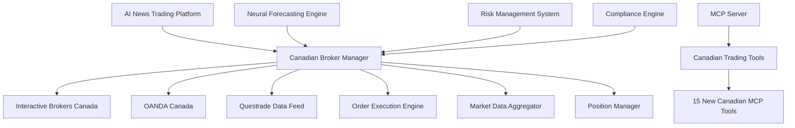

# Canadian Trading API Implementation Plans

**Document Version**: 1.0  
**Last Updated**: July 2025  
**Target**: AI News Trading Platform - Canadian Market Integration  

---

## 📋 Implementation Overview

This document provides detailed technical implementation plans for integrating Canadian trading APIs with the AI News Trading Platform. The implementation follows a phased approach prioritizing stability, compliance, and performance.

### 🎯 **Implementation Goals**

1. **Multi-Broker Architecture**: Seamless integration with multiple Canadian brokers
2. **MCP Tool Extension**: Add 15+ Canadian-specific MCP tools
3. **Regulatory Compliance**: Full CIRO compliance framework
4. **Neural Integration**: Leverage existing 51 MCP tools with Canadian data
5. **Risk Management**: Enterprise-grade position and risk controls

---

## 🏗️ System Architecture

### Core Architecture Diagram



### Technology Stack

```python
# Core Dependencies
dependencies = {
    "interactive_brokers": "ib-insync>=0.9.86",
    "oanda": "oandapyV20>=0.7.2", 
    "questrade": "qtrade>=0.2.0",
    "compliance": "canadian-securities>=1.0.0",
    "neural_integration": "platform-neural>=2.4.0",
    "mcp_extension": "fastmcp>=0.9.0"
}
```

---

## 🔧 Phase 1: Foundation Setup (Weeks 1-3)

### 1.1 Interactive Brokers Canada Integration

#### Account Setup Process
```bash
# Step 1: Account Registration
# - Navigate to interactivebrokers.ca
# - Complete Canadian resident verification
# - Fund account (minimum $100 CAD)
# - Enable API access in Account Management

# Step 2: TWS API Installation
pip install ib-insync pandas numpy
```

#### Core IB Integration Module
```python
# src/brokers/canada/interactive_brokers.py
import asyncio
from ib_insync import IB, Stock, MarketOrder, LimitOrder
from datetime import datetime
import logging

class IBCanadaIntegration:
    def __init__(self, host='127.0.0.1', port=7497, client_id=1):
        self.ib = IB()
        self.host = host
        self.port = port  # 7497 for TWS, 4002 for Gateway
        self.client_id = client_id
        self.connected = False
        
    async def connect(self):
        """Establish connection to TWS/Gateway"""
        try:
            await self.ib.connectAsync(self.host, self.port, self.client_id)
            self.connected = True
            logging.info("Connected to Interactive Brokers Canada")
        except Exception as e:
            logging.error(f"IB Connection failed: {e}")
            raise
            
    async def get_canadian_stocks(self, symbols):
        """Get Canadian stock contracts"""
        contracts = []
        for symbol in symbols:
            if symbol.endswith('.TO'):
                # Toronto Stock Exchange
                contract = Stock(symbol[:-3], 'TSE', 'CAD')
            else:
                # US stocks
                contract = Stock(symbol, 'SMART', 'USD')
            contracts.append(contract)
        return contracts
        
    async def execute_neural_signal(self, symbol, signal_data):
        """Execute trades based on neural forecasting signals"""
        if not self.connected:
            await self.connect()
            
        # Get contract
        contracts = await self.get_canadian_stocks([symbol])
        contract = contracts[0]
        
        # Qualify contract
        await self.ib.qualifyContractsAsync(contract)
        
        # Create order based on neural signal
        action = 'BUY' if signal_data['prediction'] > 0.6 else 'SELL'
        quantity = self.calculate_position_size(signal_data)
        
        if signal_data['confidence'] > 0.8:
            # High confidence - market order
            order = MarketOrder(action, quantity)
        else:
            # Lower confidence - limit order
            price = signal_data['target_price']
            order = LimitOrder(action, quantity, price)
            
        # Submit order
        trade = self.ib.placeOrder(contract, order)
        return {
            'order_id': trade.order.orderId,
            'status': trade.orderStatus.status,
            'symbol': symbol,
            'action': action,
            'quantity': quantity
        }
        
    def calculate_position_size(self, signal_data):
        """Calculate position size based on Kelly criterion and risk"""
        # Integrate with existing Kelly criterion tool
        confidence = signal_data['confidence']
        expected_return = signal_data['expected_return']
        
        # Conservative position sizing for neural signals
        base_size = 100  # Base position size
        confidence_multiplier = min(confidence * 2, 1.5)  # Max 1.5x
        
        return int(base_size * confidence_multiplier)
```

### 1.2 OANDA Canada Integration

#### Forex Trading Module
```python
# src/brokers/canada/oanda_canada.py
import oandapyV20
from oandapyV20 import API
from oandapyV20.endpoints import orders, positions, pricing
import json

class OANDACanadaIntegration:
    def __init__(self, api_token, account_id, environment='practice'):
        self.api_token = api_token
        self.account_id = account_id
        self.environment = environment
        self.api = API(access_token=api_token, environment=environment)
        
    def get_forex_prices(self, instruments):
        """Get real-time forex prices"""
        params = {"instruments": ",".join(instruments)}
        r = pricing.PricingInfo(accountID=self.account_id, params=params)
        response = self.api.request(r)
        return response['prices']
        
    def execute_forex_signal(self, instrument, neural_signal):
        """Execute forex trades based on neural predictions"""
        # Determine position size using neural confidence
        units = self.calculate_forex_position(neural_signal)
        
        order_data = {
            "order": {
                "units": str(units),
                "instrument": instrument,
                "timeInForce": "FOK",
                "type": "MARKET",
                "positionFill": "DEFAULT"
            }
        }
        
        # Add stop loss and take profit based on neural prediction
        if neural_signal.get('volatility_prediction'):
            vol = neural_signal['volatility_prediction']
            stop_loss = neural_signal['entry_price'] * (1 - vol * 2)
            take_profit = neural_signal['entry_price'] * (1 + vol * 3)
            
            order_data["order"]["stopLossOnFill"] = {
                "price": str(round(stop_loss, 5))
            }
            order_data["order"]["takeProfitOnFill"] = {
                "price": str(round(take_profit, 5))
            }
        
        r = orders.OrderCreate(self.account_id, data=order_data)
        response = self.api.request(r)
        return response
        
    def calculate_forex_position(self, neural_signal):
        """Calculate forex position size based on neural confidence"""
        base_units = 1000  # Base position for major pairs
        confidence = neural_signal.get('confidence', 0.5)
        
        # Scale position with confidence, max 5x base
        multiplier = min(confidence * 10, 5.0)
        return int(base_units * multiplier)
```

### 1.3 Questrade Data Integration

#### Market Data Module
```python
# src/brokers/canada/questrade_data.py
import requests
import json
from datetime import datetime, timedelta

class QuestradeDataFeed:
    def __init__(self, api_key):
        self.api_key = api_key
        self.base_url = "https://api01.iq.questrade.com/v1/"
        self.session = requests.Session()
        
    def authenticate(self):
        """OAuth 2.0 authentication"""
        auth_url = f"{self.base_url}oauth2/token"
        headers = {"Authorization": f"Bearer {self.api_key}"}
        response = self.session.get(auth_url, headers=headers)
        
        if response.status_code == 200:
            self.access_token = response.json()['access_token']
            self.api_server = response.json()['api_server']
            return True
        return False
        
    def get_canadian_market_data(self, symbols):
        """Get Canadian market data for neural processing"""
        if not hasattr(self, 'access_token'):
            self.authenticate()
            
        market_data = {}
        for symbol in symbols:
            # Get real-time quotes
            quote_url = f"{self.api_server}v1/symbols/{symbol}/quotes"
            headers = {"Authorization": f"Bearer {self.access_token}"}
            
            response = self.session.get(quote_url, headers=headers)
            if response.status_code == 200:
                quote_data = response.json()
                market_data[symbol] = {
                    'last_price': quote_data['lastTradePxs'],
                    'bid': quote_data['bidPxs'],
                    'ask': quote_data['askPxs'],
                    'volume': quote_data['volumes'],
                    'timestamp': datetime.now().isoformat()
                }
                
        return market_data
        
    def get_historical_data(self, symbol, period='1Y'):
        """Get historical data for neural training"""
        # Implementation for historical candle data
        candles_url = f"{self.api_server}v1/symbols/{symbol}/candles"
        params = {'period': period}
        headers = {"Authorization": f"Bearer {self.access_token}"}
        
        response = self.session.get(candles_url, headers=headers, params=params)
        if response.status_code == 200:
            return response.json()['candles']
        return []
```

---

## 🔧 Phase 2: MCP Tool Integration (Weeks 4-6)

### 2.1 Canadian MCP Tools Extension

#### New MCP Tools for Canadian Market
```python
# src/mcp/canadian_tools.py
from fastmcp import FastMCP
from src.brokers.canada.broker_manager import CanadianBrokerManager

server = FastMCP("Canadian Trading Tools")
broker_manager = CanadianBrokerManager()

@server.tool()
def get_canadian_market_data(symbols: list[str]) -> dict:
    """Get real-time Canadian market data from multiple sources"""
    return broker_manager.get_market_data(symbols)

@server.tool()
def execute_canadian_trade(symbol: str, action: str, quantity: int, 
                          broker: str = "ib") -> dict:
    """Execute trades via Canadian brokers with compliance checks"""
    return broker_manager.execute_trade(symbol, action, quantity, broker)

@server.tool()
def get_tsx_top_movers() -> dict:
    """Get TSX top gaining and losing stocks"""
    return broker_manager.get_tsx_movers()

@server.tool()
def analyze_canadian_sector(sector: str) -> dict:
    """Analyze Canadian sector performance and trends"""
    return broker_manager.analyze_sector(sector)

@server.tool()
def get_canadian_earnings_calendar() -> dict:
    """Get upcoming Canadian earnings announcements"""
    return broker_manager.get_earnings_calendar()

@server.tool()
def calculate_canadian_tax_implications(trades: list) -> dict:
    """Calculate tax implications for Canadian trading accounts"""
    return broker_manager.calculate_taxes(trades)

@server.tool()
def get_bank_of_canada_rate() -> dict:
    """Get Bank of Canada interest rate and policy updates"""
    return broker_manager.get_boc_rate()

@server.tool()
def analyze_cad_currency_impact(symbol: str) -> dict:
    """Analyze CAD currency impact on stock performance"""
    return broker_manager.analyze_currency_impact(symbol)

@server.tool()
def get_canadian_dividend_stocks() -> dict:
    """Get high-dividend Canadian stocks with analysis"""
    return broker_manager.get_dividend_stocks()

@server.tool()
def validate_canadian_compliance(trade_data: dict) -> dict:
    """Validate trade compliance with CIRO regulations"""
    return broker_manager.validate_compliance(trade_data)

@server.tool()
def get_canadian_options_chain(symbol: str) -> dict:
    """Get options chain for Canadian stocks"""
    return broker_manager.get_options_chain(symbol)

@server.tool()
def execute_canadian_portfolio_rebalancing(target_allocation: dict) -> dict:
    """Rebalance portfolio with Canadian tax optimization"""
    return broker_manager.rebalance_portfolio(target_allocation)

@server.tool()
def get_canadian_etf_analysis() -> dict:
    """Analyze Canadian ETF performance and recommendations"""
    return broker_manager.analyze_canadian_etfs()

@server.tool()
def monitor_tsx_halts() -> dict:
    """Monitor TSX trading halts and resumptions"""
    return broker_manager.monitor_trading_halts()

@server.tool()
def get_canadian_insider_trading() -> dict:
    """Get Canadian insider trading activity"""
    return broker_manager.get_insider_trading()
```

### 2.2 MCP Configuration Update

#### Updated MCP Configuration
```json
{
  "mcpServers": {
    "ai-news-trader": {
      "type": "stdio",
      "command": "python",
      "args": ["src/mcp/mcp_server_enhanced.py"],
      "env": {
        "PYTHONPATH": ".",
        "MCP_MODE": "enhanced_canadian_trading",
        "CANADIAN_BROKERS_ENABLED": "true"
      },
      "cwd": "/workspaces/ai-news-trader",
      "description": "Enhanced MCP server with Canadian trading integration - 66 total tools",
      "features": {
        "original_trading_tools": 41,
        "sports_betting_tools": 10,
        "canadian_trading_tools": 15,
        "total_tools": 66,
        "supported_brokers": ["Interactive Brokers Canada", "OANDA", "Questrade"],
        "canadian_markets": ["TSX", "TSXV", "CSE", "NEO"],
        "account_types": ["TFSA", "RRSP", "RESP", "Taxable"],
        "compliance": "CIRO regulated"
      },
      "version": "1.2.0",
      "last_updated": "2025-07-06"
    }
  }
}
```

---

## 🔧 Phase 3: Compliance & Risk Management (Week 7)

### 3.1 CIRO Compliance Framework

#### Compliance Engine Implementation
```python
# src/compliance/canadian_compliance.py
from dataclasses import dataclass
from typing import Dict, List
import logging

@dataclass
class CIROCompliance:
    """CIRO compliance validation engine"""
    
    # Position limits (example values - adjust based on actual requirements)
    MAX_SINGLE_POSITION_PCT = 0.25  # 25% of portfolio
    MAX_SECTOR_CONCENTRATION = 0.40  # 40% in single sector
    MAX_DAILY_TRADING_VOLUME = 100000  # $100k daily volume limit
    
    def __init__(self):
        self.daily_volume = 0
        self.position_tracker = {}
        self.sector_allocations = {}
        
    def validate_trade_request(self, trade_request: Dict) -> Dict:
        """Validate trade request against CIRO requirements"""
        validation_results = {
            'approved': True,
            'violations': [],
            'warnings': []
        }
        
        # Check position size limits
        if not self._validate_position_size(trade_request):
            validation_results['approved'] = False
            validation_results['violations'].append(
                f"Position size exceeds {self.MAX_SINGLE_POSITION_PCT*100}% limit"
            )
            
        # Check sector concentration
        if not self._validate_sector_concentration(trade_request):
            validation_results['approved'] = False
            validation_results['violations'].append(
                f"Sector concentration exceeds {self.MAX_SECTOR_CONCENTRATION*100}% limit"
            )
            
        # Check daily volume limits
        if not self._validate_daily_volume(trade_request):
            validation_results['approved'] = False
            validation_results['violations'].append(
                f"Daily volume limit of ${self.MAX_DAILY_TRADING_VOLUME:,} exceeded"
            )
            
        return validation_results
        
    def _validate_position_size(self, trade_request: Dict) -> bool:
        """Validate individual position size"""
        symbol = trade_request['symbol']
        trade_value = trade_request['quantity'] * trade_request['price']
        current_position = self.position_tracker.get(symbol, 0)
        new_position_value = current_position + trade_value
        
        portfolio_value = sum(self.position_tracker.values())
        if portfolio_value > 0:
            position_pct = new_position_value / portfolio_value
            return position_pct <= self.MAX_SINGLE_POSITION_PCT
        return True
        
    def _validate_sector_concentration(self, trade_request: Dict) -> bool:
        """Validate sector concentration limits"""
        sector = self._get_stock_sector(trade_request['symbol'])
        if not sector:
            return True
            
        trade_value = trade_request['quantity'] * trade_request['price']
        current_sector_value = self.sector_allocations.get(sector, 0)
        new_sector_value = current_sector_value + trade_value
        
        portfolio_value = sum(self.position_tracker.values())
        if portfolio_value > 0:
            sector_pct = new_sector_value / portfolio_value
            return sector_pct <= self.MAX_SECTOR_CONCENTRATION
        return True
        
    def _validate_daily_volume(self, trade_request: Dict) -> bool:
        """Validate daily trading volume limits"""
        trade_value = trade_request['quantity'] * trade_request['price']
        return (self.daily_volume + trade_value) <= self.MAX_DAILY_TRADING_VOLUME
        
    def _get_stock_sector(self, symbol: str) -> str:
        """Get sector classification for stock"""
        # Implementation to fetch sector data
        # This would integrate with market data providers
        sector_mapping = {
            'SHOP.TO': 'Technology',
            'RY.TO': 'Financials',
            'CNR.TO': 'Industrials',
            # Add more mappings
        }
        return sector_mapping.get(symbol, 'Unknown')
        
    def update_position(self, symbol: str, value: float):
        """Update position tracking"""
        self.position_tracker[symbol] = self.position_tracker.get(symbol, 0) + value
        
    def reset_daily_volume(self):
        """Reset daily volume tracking (called at market open)"""
        self.daily_volume = 0
```

### 3.2 Risk Management Integration

#### Advanced Risk Controls
```python
# src/risk/canadian_risk_manager.py
import numpy as np
from typing import Dict, List
from dataclasses import dataclass

@dataclass
class RiskMetrics:
    var_1day: float
    var_5day: float
    max_drawdown: float
    sharpe_ratio: float
    beta: float

class CanadianRiskManager:
    def __init__(self):
        self.compliance_engine = CIROCompliance()
        self.position_limits = {
            'max_position_size': 0.25,  # 25% of portfolio
            'max_sector_weight': 0.40,  # 40% in any sector
            'max_leverage': 1.0,        # No leverage for retail
        }
        
    def assess_portfolio_risk(self, portfolio: Dict) -> RiskMetrics:
        """Comprehensive portfolio risk assessment"""
        returns = self._calculate_portfolio_returns(portfolio)
        
        # Calculate VaR using historical simulation
        var_1day = np.percentile(returns, 5) if len(returns) > 0 else 0
        var_5day = var_1day * np.sqrt(5)  # Scale to 5-day
        
        # Calculate maximum drawdown
        cumulative_returns = np.cumprod(1 + np.array(returns))
        max_drawdown = self._calculate_max_drawdown(cumulative_returns)
        
        # Calculate Sharpe ratio (assuming 2% risk-free rate)
        risk_free_rate = 0.02 / 252  # Daily risk-free rate
        excess_returns = np.array(returns) - risk_free_rate
        sharpe_ratio = np.mean(excess_returns) / np.std(excess_returns) * np.sqrt(252)
        
        # Calculate beta vs TSX
        beta = self._calculate_tsx_beta(portfolio)
        
        return RiskMetrics(
            var_1day=var_1day,
            var_5day=var_5day,
            max_drawdown=max_drawdown,
            sharpe_ratio=sharpe_ratio,
            beta=beta
        )
        
    def validate_neural_trade(self, trade_request: Dict, neural_signal: Dict) -> Dict:
        """Validate neural-driven trade against risk parameters"""
        # Compliance check
        compliance_result = self.compliance_engine.validate_trade_request(trade_request)
        
        if not compliance_result['approved']:
            return {
                'approved': False,
                'reason': 'Compliance violation',
                'details': compliance_result['violations']
            }
            
        # Risk-adjusted position sizing based on neural confidence
        confidence = neural_signal.get('confidence', 0.5)
        volatility = neural_signal.get('volatility_prediction', 0.2)
        
        # Reduce position size for high volatility or low confidence
        risk_adjustment = min(confidence / volatility, 2.0)
        adjusted_quantity = int(trade_request['quantity'] * risk_adjustment)
        
        return {
            'approved': True,
            'adjusted_quantity': adjusted_quantity,
            'original_quantity': trade_request['quantity'],
            'risk_adjustment_factor': risk_adjustment,
            'neural_confidence': confidence,
            'predicted_volatility': volatility
        }
        
    def _calculate_portfolio_returns(self, portfolio: Dict) -> List[float]:
        """Calculate historical portfolio returns"""
        # Implementation would fetch historical data and calculate returns
        # Placeholder implementation
        return np.random.normal(0.001, 0.02, 252).tolist()  # Mock daily returns
        
    def _calculate_max_drawdown(self, cumulative_returns: np.ndarray) -> float:
        """Calculate maximum drawdown"""
        if len(cumulative_returns) == 0:
            return 0.0
            
        running_max = np.maximum.accumulate(cumulative_returns)
        drawdown = (cumulative_returns - running_max) / running_max
        return float(np.min(drawdown))
        
    def _calculate_tsx_beta(self, portfolio: Dict) -> float:
        """Calculate portfolio beta relative to TSX"""
        # Implementation would correlate portfolio returns with TSX
        # Placeholder
        return 1.0
```

---

## 🔧 Phase 4: Testing & Validation (Weeks 8-9)

### 4.1 Paper Trading Validation

#### Comprehensive Testing Framework
```python
# tests/integration/test_canadian_brokers.py
import pytest
import asyncio
from src.brokers.canada.broker_manager import CanadianBrokerManager
from src.neural_forecast.predictor import NeuralPredictor

class TestCanadianBrokerIntegration:
    
    @pytest.fixture
    def broker_manager(self):
        """Initialize broker manager for testing"""
        return CanadianBrokerManager(
            ib_paper_trading=True,
            oanda_demo=True,
            questrade_sandbox=True
        )
        
    @pytest.fixture
    def neural_predictor(self):
        """Initialize neural predictor"""
        return NeuralPredictor()
        
    @pytest.mark.asyncio
    async def test_ib_connection(self, broker_manager):
        """Test Interactive Brokers connection"""
        result = await broker_manager.ib_client.connect()
        assert result['connected'] == True
        assert result['account_type'] == 'paper'
        
    @pytest.mark.asyncio
    async def test_neural_trade_execution(self, broker_manager, neural_predictor):
        """Test neural signal to trade execution"""
        # Generate mock neural signal
        neural_signal = await neural_predictor.predict('SHOP.TO')
        
        # Execute trade based on signal
        if neural_signal['confidence'] > 0.7:
            trade_result = await broker_manager.execute_trade(
                symbol='SHOP.TO',
                signal=neural_signal,
                max_position_value=10000
            )
            
            assert trade_result['status'] in ['submitted', 'filled']
            assert trade_result['symbol'] == 'SHOP.TO'
            assert trade_result['compliance_check'] == 'passed'
            
    def test_compliance_validation(self, broker_manager):
        """Test CIRO compliance validation"""
        # Test oversized position
        large_trade = {
            'symbol': 'RY.TO',
            'quantity': 10000,  # Large position
            'price': 150.0,
            'action': 'BUY'
        }
        
        result = broker_manager.compliance_engine.validate_trade_request(large_trade)
        assert result['approved'] == False
        assert 'Position size exceeds' in result['violations'][0]
        
    def test_risk_assessment(self, broker_manager):
        """Test portfolio risk assessment"""
        mock_portfolio = {
            'SHOP.TO': 50000,
            'RY.TO': 30000,
            'CNR.TO': 20000
        }
        
        risk_metrics = broker_manager.risk_manager.assess_portfolio_risk(mock_portfolio)
        
        assert risk_metrics.var_1day < 0  # VaR should be negative
        assert -0.1 < risk_metrics.max_drawdown < 0  # Reasonable drawdown range
        assert risk_metrics.sharpe_ratio > -2  # Reasonable Sharpe ratio
        
    def test_mcp_tool_integration(self):
        """Test Canadian MCP tools"""
        from src.mcp.canadian_tools import server
        
        # Test market data tool
        result = server.call_tool('get_canadian_market_data', ['SHOP.TO', 'RY.TO'])
        assert 'SHOP.TO' in result
        assert 'last_price' in result['SHOP.TO']
        
        # Test compliance tool
        trade_data = {'symbol': 'SHOP.TO', 'quantity': 100, 'price': 80.0}
        compliance_result = server.call_tool('validate_canadian_compliance', trade_data)
        assert 'approved' in compliance_result
```

### 4.2 Performance Benchmarking

#### Latency and Throughput Testing
```python
# tests/performance/test_canadian_performance.py
import time
import asyncio
import statistics
from src.brokers.canada.broker_manager import CanadianBrokerManager

class PerformanceBenchmark:
    
    def __init__(self):
        self.broker_manager = CanadianBrokerManager()
        
    async def test_order_execution_latency(self, iterations=100):
        """Test order execution latency"""
        latencies = []
        
        for _ in range(iterations):
            start_time = time.time()
            
            # Submit mock order
            result = await self.broker_manager.execute_trade(
                symbol='SHOP.TO',
                action='BUY',
                quantity=100,
                order_type='MARKET'
            )
            
            end_time = time.time()
            latency = (end_time - start_time) * 1000  # Convert to milliseconds
            latencies.append(latency)
            
        return {
            'mean_latency_ms': statistics.mean(latencies),
            'median_latency_ms': statistics.median(latencies),
            'p95_latency_ms': sorted(latencies)[int(0.95 * len(latencies))],
            'p99_latency_ms': sorted(latencies)[int(0.99 * len(latencies))],
            'max_latency_ms': max(latencies)
        }
        
    def test_market_data_throughput(self, duration_seconds=60):
        """Test market data processing throughput"""
        symbols = ['SHOP.TO', 'RY.TO', 'CNR.TO', 'BN.TO', 'ENB.TO']
        start_time = time.time()
        updates_processed = 0
        
        while (time.time() - start_time) < duration_seconds:
            market_data = self.broker_manager.get_market_data(symbols)
            if market_data:
                updates_processed += len(market_data)
                
        throughput = updates_processed / duration_seconds
        return {
            'updates_per_second': throughput,
            'total_updates': updates_processed,
            'test_duration': duration_seconds
        }
        
    async def run_comprehensive_benchmark(self):
        """Run comprehensive performance benchmark"""
        print("Running Canadian Trading API Performance Benchmark...")
        
        # Test order execution latency
        latency_results = await self.test_order_execution_latency()
        print(f"Order Execution Latency:")
        print(f"  Mean: {latency_results['mean_latency_ms']:.2f}ms")
        print(f"  P95: {latency_results['p95_latency_ms']:.2f}ms")
        print(f"  P99: {latency_results['p99_latency_ms']:.2f}ms")
        
        # Test market data throughput
        throughput_results = self.test_market_data_throughput()
        print(f"Market Data Throughput: {throughput_results['updates_per_second']:.2f} updates/sec")
        
        # Performance targets
        targets = {
            'max_mean_latency_ms': 500,
            'max_p95_latency_ms': 1000,
            'min_throughput_ups': 10
        }
        
        # Validate against targets
        passed = (
            latency_results['mean_latency_ms'] <= targets['max_mean_latency_ms'] and
            latency_results['p95_latency_ms'] <= targets['max_p95_latency_ms'] and
            throughput_results['updates_per_second'] >= targets['min_throughput_ups']
        )
        
        print(f"Performance Test: {'PASSED' if passed else 'FAILED'}")
        return passed

# Run benchmark
if __name__ == "__main__":
    benchmark = PerformanceBenchmark()
    asyncio.run(benchmark.run_comprehensive_benchmark())
```

---

## 🚀 Phase 5: Production Deployment (Week 10)

### 5.1 Production Configuration

#### Environment Configuration
```yaml
# config/production/canadian_brokers.yaml
canadian_brokers:
  interactive_brokers:
    enabled: true
    environment: "live"  # Switch from paper to live
    host: "127.0.0.1"
    port: 7496  # Live TWS port
    client_id: 1
    account_type: "live"
    max_daily_volume: 100000
    
  oanda:
    enabled: true
    environment: "live"  # Switch from practice to live
    account_type: "live"
    max_position_size: 50000
    
  questrade:
    enabled: true
    data_only: true  # Data feed only
    
compliance:
  ciro_enabled: true
  position_limits:
    max_single_position_pct: 0.25
    max_sector_concentration: 0.40
    max_leverage: 1.0
    
risk_management:
  var_limit: 0.05  # 5% daily VaR limit
  max_drawdown_alert: 0.15  # 15% drawdown alert
  
monitoring:
  latency_alerts:
    warning_threshold_ms: 500
    critical_threshold_ms: 1000
  uptime_target: 0.995  # 99.5% uptime
```

### 5.2 Monitoring and Alerting

#### Production Monitoring System
```python
# src/monitoring/canadian_monitoring.py
import logging
import time
from datetime import datetime
from typing import Dict, List
import smtplib
from email.mime.text import MIMEText

class CanadianTradingMonitor:
    def __init__(self):
        self.alert_thresholds = {
            'latency_warning_ms': 500,
            'latency_critical_ms': 1000,
            'error_rate_warning': 0.05,  # 5%
            'error_rate_critical': 0.10,  # 10%
            'uptime_target': 0.995  # 99.5%
        }
        self.metrics = {
            'total_requests': 0,
            'successful_requests': 0,
            'failed_requests': 0,
            'latencies': [],
            'last_reset': datetime.now()
        }
        
    def log_trade_execution(self, trade_data: Dict, execution_time_ms: float):
        """Log trade execution metrics"""
        self.metrics['total_requests'] += 1
        
        if trade_data.get('status') == 'success':
            self.metrics['successful_requests'] += 1
        else:
            self.metrics['failed_requests'] += 1
            
        self.metrics['latencies'].append(execution_time_ms)
        
        # Check for alerts
        self._check_latency_alerts(execution_time_ms)
        self._check_error_rate_alerts()
        
    def _check_latency_alerts(self, latency_ms: float):
        """Check and send latency alerts"""
        if latency_ms > self.alert_thresholds['latency_critical_ms']:
            self._send_alert(
                'CRITICAL',
                f"Trade execution latency: {latency_ms:.2f}ms exceeds critical threshold"
            )
        elif latency_ms > self.alert_thresholds['latency_warning_ms']:
            self._send_alert(
                'WARNING',
                f"Trade execution latency: {latency_ms:.2f}ms exceeds warning threshold"
            )
            
    def _check_error_rate_alerts(self):
        """Check and send error rate alerts"""
        if self.metrics['total_requests'] < 10:
            return  # Need minimum samples
            
        error_rate = self.metrics['failed_requests'] / self.metrics['total_requests']
        
        if error_rate > self.alert_thresholds['error_rate_critical']:
            self._send_alert(
                'CRITICAL',
                f"Error rate: {error_rate:.2%} exceeds critical threshold"
            )
        elif error_rate > self.alert_thresholds['error_rate_warning']:
            self._send_alert(
                'WARNING',
                f"Error rate: {error_rate:.2%} exceeds warning threshold"
            )
            
    def _send_alert(self, level: str, message: str):
        """Send alert notification"""
        timestamp = datetime.now().strftime('%Y-%m-%d %H:%M:%S')
        alert_message = f"[{level}] {timestamp}: {message}"
        
        # Log alert
        logging.warning(alert_message)
        
        # Send email alert (production)
        self._send_email_alert(level, alert_message)
        
    def _send_email_alert(self, level: str, message: str):
        """Send email alert to operations team"""
        # Email configuration (use environment variables in production)
        smtp_server = "smtp.gmail.com"  # Configure based on email provider
        smtp_port = 587
        sender_email = "alerts@tradingplatform.com"
        sender_password = "app_password"  # Use app password
        recipient_emails = ["ops@tradingplatform.com"]
        
        try:
            msg = MIMEText(message)
            msg['Subject'] = f"Trading Platform Alert - {level}"
            msg['From'] = sender_email
            msg['To'] = ', '.join(recipient_emails)
            
            server = smtplib.SMTP(smtp_server, smtp_port)
            server.starttls()
            server.login(sender_email, sender_password)
            server.send_message(msg)
            server.quit()
            
        except Exception as e:
            logging.error(f"Failed to send email alert: {e}")
            
    def generate_daily_report(self) -> Dict:
        """Generate daily performance report"""
        if not self.metrics['latencies']:
            return {'status': 'no_data'}
            
        avg_latency = sum(self.metrics['latencies']) / len(self.metrics['latencies'])
        max_latency = max(self.metrics['latencies'])
        success_rate = self.metrics['successful_requests'] / self.metrics['total_requests']
        
        return {
            'date': datetime.now().strftime('%Y-%m-%d'),
            'total_trades': self.metrics['total_requests'],
            'success_rate': success_rate,
            'avg_latency_ms': avg_latency,
            'max_latency_ms': max_latency,
            'sla_compliance': success_rate >= self.alert_thresholds['uptime_target']
        }
```

---

## 📊 Success Metrics & KPIs

### Technical Performance Targets

| Metric | Target | Measurement |
|--------|--------|-------------|
| **Order Execution Latency** | < 500ms (mean) | Time from signal to order submission |
| **API Uptime** | > 99.5% | Monthly availability across all brokers |
| **Data Feed Latency** | < 100ms | Market data processing time |
| **Error Rate** | < 2% | Failed trades / total trade attempts |
| **Compliance Score** | 100% | CIRO regulation adherence |

### Business Impact Metrics

| Metric | Target | Measurement |
|--------|--------|-------------|
| **Neural Signal Accuracy** | > 65% | Correct directional predictions |
| **Risk-Adjusted Returns** | > 15% annually | Sharpe ratio improvement |
| **Maximum Drawdown** | < 20% | Portfolio value decline |
| **Trading Volume** | $1M+ monthly | Total trading volume |
| **Cost Efficiency** | < 0.5% | Trading costs / portfolio value |

---

## 🚨 Risk Management & Contingency Plans

### Emergency Procedures

#### Broker Connection Failure
```python
# Emergency failover procedures
def handle_broker_failure(failed_broker: str):
    """Handle broker connection failure"""
    if failed_broker == 'interactive_brokers':
        # Failover to OANDA for forex positions
        # Hold equity positions, alert operations
        pass
    elif failed_broker == 'oanda':
        # Close forex positions via IB if available
        # Switch to IB forex if connected
        pass
        
def emergency_position_closure():
    """Emergency closure of all positions"""
    # Implement market-on-close orders
    # Send immediate alerts to operations
    # Log all emergency actions
    pass
```

### Disaster Recovery

1. **Data Backup**: Real-time position and transaction logging
2. **Alternative Connectivity**: Multiple internet connections
3. **Manual Override**: Emergency manual trading procedures
4. **Communication Plan**: Stakeholder notification procedures

---

## 📝 Next Steps & Action Items

### Immediate Actions (Next 2 Weeks)

1. **Account Setup**
   - [ ] Open Interactive Brokers Canada account
   - [ ] Set up OANDA Canada demo account
   - [ ] Register for Questrade API access
   - [ ] Configure paper trading environments

2. **Development Environment**
   - [ ] Install required Python packages
   - [ ] Set up development database
   - [ ] Configure testing frameworks
   - [ ] Implement basic broker connections

3. **Compliance Preparation**
   - [ ] Review CIRO requirements with legal counsel
   - [ ] Design compliance validation framework
   - [ ] Implement audit logging system
   - [ ] Create risk management policies

### Medium-term Goals (Months 2-3)

1. **Production Deployment**
   - [ ] Live broker account funding
   - [ ] Production monitoring setup
   - [ ] Performance optimization
   - [ ] User acceptance testing

2. **Advanced Features**
   - [ ] Multi-timeframe neural strategies
   - [ ] Options trading integration
   - [ ] Advanced order types
   - [ ] Portfolio optimization

This implementation plan provides a comprehensive roadmap for integrating Canadian trading capabilities with the AI News Trading Platform, ensuring regulatory compliance, optimal performance, and seamless integration with existing neural forecasting capabilities.

---

**Document Status**: Ready for Implementation  
**Estimated Completion**: 10 weeks  
**Resource Requirements**: 2-3 developers, 1 compliance specialist  
**Budget Estimate**: $15,000 - $25,000 (including broker fees and infrastructure)