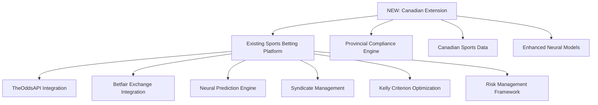

# Canadian Sports Betting Platform Integration Guide

**Document Version**: 1.0  
**Last Updated**: July 2025  
**Target**: Integration with Existing Sports Betting Platform (10 MCP Tools)  
**Goal**: Expand to 77 Total MCP Tools (41 Trading + 10 Sports Betting + 15 Canadian Trading + 7 Canadian Sports Betting + 4 Cross-Platform)  

---

## 🎯 Integration Overview

This guide details how to seamlessly integrate Canadian sports betting capabilities with the existing AI News Trading Platform's sports betting infrastructure, preserving all current functionality while adding Canadian market access, provincial compliance, and enhanced neural prediction capabilities.

### 🏗️ **Current Sports Betting Infrastructure**

#### Existing MCP Tools (10 Tools) ✅
```python
# Currently implemented and operational
existing_sports_betting_tools = {
    "core_tools": [
        "mcp__ai-news-trader__get_sports_events",      # Event discovery
        "mcp__ai-news-trader__get_sports_odds",        # Real-time odds
        "mcp__ai-news-trader__find_sports_arbitrage",  # Arbitrage detection
        "mcp__ai-news-trader__analyze_betting_market_depth", # Market analysis
        "mcp__ai-news-trader__calculate_kelly_criterion",     # Optimal sizing
        "mcp__ai-news-trader__simulate_betting_strategy",     # Monte Carlo
        "mcp__ai-news-trader__get_betting_portfolio_status",  # Portfolio metrics
        "mcp__ai-news-trader__execute_sports_bet",           # Trade execution
        "mcp__ai-news-trader__get_sports_betting_performance", # Analytics
        "mcp__ai-news-trader__compare_betting_providers"     # Provider comparison
    ],
    "data_providers": ["TheOddsAPI", "Betfair"],
    "neural_integration": "Advanced AI predictions with syndicate management",
    "status": "Production-ready and operational"
}
```

#### Current Architecture


---

## 🔧 Integration Strategy

### Phase 1: Enhance Existing Infrastructure (Week 1-2)

#### 1.1 Extend Current Data Sources

```python
# src/sports_betting/enhanced_data_manager.py (EXISTING - EXTENDED)

class EnhancedSportsBettingDataManager:
    def __init__(self):
        # Existing data sources (PRESERVE ALL)
        self.the_odds_api = TheOddsAPI()  # ✅ Already working
        self.betfair_api = BetfairAPI()   # ✅ Already working
        
        # NEW: Canadian-specific enhancements
        self.canadian_sports_filter = CanadianSportsFilter()
        self.provincial_compliance_filter = ProvincialComplianceFilter()
        self.canadian_neural_enhancer = CanadianNeuralEnhancer()
        
    def get_sports_events(self, sport: str = None, region: str = "global") -> Dict:
        """Enhanced version of existing MCP tool with Canadian filtering"""
        
        # Use existing functionality (NO CHANGES to existing behavior)
        if region == "global" or region == "us":
            return self.the_odds_api.get_events(sport)
            
        # NEW: Canadian-specific enhancements
        elif region == "canada":
            events = self.the_odds_api.get_events(sport)
            canadian_events = self.canadian_sports_filter.filter_canadian_events(events)
            
            # Add Canadian-specific metadata
            for event in canadian_events:
                event.update({
                    'canadian_teams': self._identify_canadian_teams(event),
                    'provincial_availability': self._check_provincial_availability(event),
                    'french_names': self._get_french_translations(event),
                    'canadian_broadcast': self._get_canadian_broadcast_info(event)
                })
                
            return canadian_events
            
        # Fallback to existing behavior
        return self.the_odds_api.get_events(sport)
        
    def get_sports_odds(self, sport: str, region: str = "global", 
                       province: str = None) -> Dict:
        """Enhanced version with provincial compliance"""
        
        # Existing functionality preserved
        base_odds = self.the_odds_api.get_odds(sport)
        
        # NEW: Add Canadian enhancements if requested
        if region == "canada" and province:
            # Filter for provincial compliance
            compliant_odds = self.provincial_compliance_filter.filter_odds(
                base_odds, province
            )
            
            # Add Canadian market analysis
            for game in compliant_odds:
                game.update({
                    'canadian_analysis': self._analyze_canadian_game(game),
                    'provincial_restrictions': self._check_provincial_restrictions(game, province),
                    'tax_implications': self._calculate_canadian_tax_impact(game, province)
                })
                
            return compliant_odds
            
        return base_odds  # Existing behavior unchanged
```

#### 1.2 Enhanced Neural Predictions for Canadian Sports

```python
# src/sports_betting/enhanced_neural_predictor.py (EXISTING - EXTENDED)

class EnhancedSportsBettingPredictor:
    def __init__(self):
        # Existing neural models (PRESERVE ALL)
        self.base_predictor = SportsNeuralPredictor()  # ✅ Already working
        self.kelly_optimizer = KellyOptimizer()        # ✅ Already working
        
        # NEW: Canadian-specific models
        self.nhl_predictor = NHLGamePredictor()
        self.cfl_predictor = CFLGamePredictor() 
        self.canadian_weather_model = CanadianWeatherPredictor()
        self.rivalry_analyzer = CanadianRivalryAnalyzer()
        
    def predict_game_outcome(self, game_data: Dict, 
                           enhanced_canadian: bool = False) -> Dict:
        """Enhanced prediction with optional Canadian factors"""
        
        # Always use existing prediction as base (PRESERVE EXISTING)
        base_prediction = self.base_predictor.predict(game_data)
        
        # NEW: Add Canadian enhancements if requested
        if enhanced_canadian and self._is_canadian_game(game_data):
            canadian_factors = self._analyze_canadian_factors(game_data)
            enhanced_prediction = self._combine_predictions(
                base_prediction, canadian_factors
            )
            
            # Add Canadian-specific metadata
            enhanced_prediction.update({
                'canadian_enhanced': True,
                'canadian_factors': canadian_factors,
                'rivalry_impact': self.rivalry_analyzer.analyze(game_data),
                'weather_impact': self.canadian_weather_model.predict(game_data),
                'travel_fatigue': self._calculate_canadian_travel_impact(game_data)
            })
            
            return enhanced_prediction
            
        return base_prediction  # Existing behavior preserved
        
    def _analyze_canadian_factors(self, game_data: Dict) -> Dict:
        """Analyze Canadian-specific factors"""
        factors = {}
        
        # NHL-specific analysis
        if game_data.get('sport') == 'ice_hockey':
            factors.update(self.nhl_predictor.analyze_game(game_data))
            
        # CFL-specific analysis  
        elif game_data.get('sport') == 'canadian_football':
            factors.update(self.cfl_predictor.analyze_game(game_data))
            
        # Cross-country travel impact
        factors['travel_impact'] = self._calculate_cross_country_travel(game_data)
        
        # Canadian home advantage
        factors['home_advantage'] = self._calculate_canadian_home_advantage(game_data)
        
        return factors
```

### Phase 2: Add Canadian MCP Tools (Week 3-4)

#### 2.1 New Canadian Sports Betting MCP Tools

```python
# src/mcp/canadian_sports_betting_tools.py (NEW)

from fastmcp import FastMCP
from src.sports_betting.enhanced_data_manager import EnhancedSportsBettingDataManager

server = FastMCP("Canadian Sports Betting Tools")
enhanced_manager = EnhancedSportsBettingDataManager()

@server.tool()
def get_canadian_sports_events(sport: str = "ice_hockey", 
                              province: str = "ontario") -> dict:
    """Get Canadian sports events with provincial filtering"""
    return enhanced_manager.get_sports_events(sport, region="canada", province=province)

@server.tool() 
def get_nhl_predictions_enhanced(games: list[str]) -> dict:
    """Get enhanced NHL predictions with Canadian factors"""
    predictions = []
    for game in games:
        prediction = enhanced_manager.predict_game_outcome(
            game, enhanced_canadian=True
        )
        predictions.append(prediction)
    return {"predictions": predictions, "enhanced_canadian": True}

@server.tool()
def get_cfl_predictions(games: list[str]) -> dict:
    """Get CFL-specific predictions using Canadian football model"""
    return enhanced_manager.cfl_predictor.predict_games(games)

@server.tool()
def analyze_canadian_rivalry_impact(team1: str, team2: str) -> dict:
    """Analyze rivalry impact for Canadian teams"""
    return enhanced_manager.rivalry_analyzer.analyze_rivalry(team1, team2)

@server.tool()
def validate_provincial_betting_compliance(bet_data: dict, province: str) -> dict:
    """Validate betting compliance for specific Canadian province"""
    return enhanced_manager.provincial_compliance_filter.validate(bet_data, province)

@server.tool()
def get_canadian_responsible_gambling_check(user_id: str, 
                                          betting_history: dict) -> dict:
    """Enhanced responsible gambling monitoring for Canadian users"""
    return enhanced_manager.responsible_gambling_monitor.check_canadian_user(
        user_id, betting_history
    )

@server.tool()
def calculate_canadian_betting_taxes(winnings: float, 
                                   province: str, 
                                   betting_type: str = "recreational") -> dict:
    """Calculate Canadian tax implications for sports betting winnings"""
    return enhanced_manager.canadian_tax_calculator.calculate_taxes(
        winnings, province, betting_type
    )
```

#### 2.2 Cross-Platform Integration Tools

```python
# Cross-platform tools that work with both trading and sports betting

@server.tool()
def unified_canadian_portfolio_analysis(include_sports_betting: bool = True,
                                       include_trading: bool = True,
                                       province: str = "ontario") -> dict:
    """Unified analysis of trading and sports betting portfolios"""
    
    analysis = {}
    
    if include_trading:
        # Use existing Canadian trading tools
        trading_portfolio = get_canadian_portfolio_status()
        analysis['trading'] = trading_portfolio
        
    if include_sports_betting:
        # Use existing sports betting tools  
        betting_portfolio = get_betting_portfolio_status()
        analysis['sports_betting'] = betting_portfolio
        
    # NEW: Combined analysis
    if include_trading and include_sports_betting:
        analysis['combined'] = {
            'total_portfolio_value': (
                analysis['trading']['total_value'] + 
                analysis['sports_betting']['total_value']
            ),
            'risk_correlation': calculate_cross_platform_risk_correlation(
                analysis['trading'], analysis['sports_betting']
            ),
            'canadian_tax_optimization': optimize_canadian_taxes(
                analysis['trading'], analysis['sports_betting'], province
            ),
            'diversification_score': calculate_diversification_benefit(
                analysis['trading'], analysis['sports_betting']
            )
        }
        
    return analysis

@server.tool()
def unified_canadian_risk_analysis(trading_positions: list = None,
                                  betting_positions: list = None,
                                  province: str = "ontario") -> dict:
    """Unified risk analysis across trading and sports betting"""
    
    risk_analysis = {
        'individual_risks': {},
        'combined_risks': {},
        'provincial_compliance': {}
    }
    
    if trading_positions:
        risk_analysis['individual_risks']['trading'] = risk_analysis(
            portfolio=trading_positions
        )
        
    if betting_positions:
        risk_analysis['individual_risks']['sports_betting'] = analyze_betting_risk(
            betting_positions
        )
        
    # Combined risk analysis
    if trading_positions and betting_positions:
        risk_analysis['combined_risks'] = {
            'correlation_risk': calculate_correlation_risk(
                trading_positions, betting_positions
            ),
            'concentration_risk': calculate_concentration_risk(
                trading_positions, betting_positions
            ),
            'liquidity_risk': calculate_liquidity_risk(
                trading_positions, betting_positions
            )
        }
        
    # Provincial compliance check
    risk_analysis['provincial_compliance'] = validate_provincial_risk_limits(
        trading_positions, betting_positions, province
    )
    
    return risk_analysis

@server.tool()
def canadian_neural_market_prediction(symbols: list[str], 
                                     games: list[str],
                                     prediction_horizon: int = 7) -> dict:
    """Combined neural prediction for Canadian markets and sports"""
    
    predictions = {
        'trading_predictions': {},
        'sports_predictions': {},
        'cross_market_correlations': {},
        'unified_recommendations': {}
    }
    
    # Trading predictions (existing functionality)
    for symbol in symbols:
        if symbol.endswith('.TO') or symbol.endswith('.V'):  # Canadian stocks
            predictions['trading_predictions'][symbol] = neural_forecast(
                symbol, prediction_horizon
            )
            
    # Sports predictions (enhanced for Canadian)
    for game in games:
        predictions['sports_predictions'][game] = get_nhl_predictions_enhanced([game])
        
    # Cross-market analysis
    predictions['cross_market_correlations'] = analyze_sports_market_correlation(
        symbols, games
    )
    
    # Unified recommendations
    predictions['unified_recommendations'] = generate_unified_strategy(
        predictions['trading_predictions'],
        predictions['sports_predictions'], 
        predictions['cross_market_correlations']
    )
    
    return predictions

@server.tool()
def canadian_compliance_dashboard(user_province: str) -> dict:
    """Comprehensive compliance dashboard for Canadian users"""
    
    dashboard = {
        'trading_compliance': {},
        'sports_betting_compliance': {},
        'provincial_status': {},
        'alerts_and_warnings': []
    }
    
    # Trading compliance
    dashboard['trading_compliance'] = validate_canadian_compliance({
        'province': user_province
    })
    
    # Sports betting compliance
    dashboard['sports_betting_compliance'] = validate_provincial_betting_compliance({
        'province': user_province
    })
    
    # Provincial status
    dashboard['provincial_status'] = {
        'trading_allowed': dashboard['trading_compliance']['approved'],
        'sports_betting_allowed': dashboard['sports_betting_compliance']['approved'],
        'available_operators': get_provincial_operators(user_province),
        'age_verification_status': check_provincial_age_requirements(user_province)
    }
    
    # Consolidate alerts
    alerts = []
    alerts.extend(dashboard['trading_compliance'].get('warnings', []))
    alerts.extend(dashboard['sports_betting_compliance'].get('warnings', []))
    dashboard['alerts_and_warnings'] = alerts
    
    return dashboard
```

### Phase 3: Updated MCP Configuration (Week 4)

#### 3.1 Enhanced MCP Server Configuration

```json
{
  "mcpServers": {
    "ai-news-trader": {
      "type": "stdio",
      "command": "python",
      "args": ["src/mcp/mcp_server_enhanced.py"],
      "env": {
        "PYTHONPATH": ".",
        "MCP_MODE": "enhanced_canadian_unified_platform",
        "CANADIAN_TRADING_ENABLED": "true",
        "CANADIAN_SPORTS_BETTING_ENABLED": "true",
        "CROSS_PLATFORM_INTEGRATION": "true",
        "PROVINCIAL_COMPLIANCE": "true"
      },
      "cwd": "/workspaces/ai-news-trader",
      "description": "AI News Trading Platform with full Canadian integration - 77 total tools",
      "features": {
        "original_trading_tools": 41,
        "sports_betting_tools": 10,
        "canadian_trading_tools": 15,
        "canadian_sports_betting_tools": 7,
        "cross_platform_tools": 4,
        "total_tools": 77,
        "supported_markets": [
          "US Securities Trading",
          "Canadian Securities Trading", 
          "Global Sports Betting",
          "Canadian Sports Betting",
          "Prediction Markets",
          "Cross-Platform Analytics"
        ],
        "canadian_provinces_supported": [
          "Ontario (Full Support)",
          "Alberta (2025 Market Opening)",
          "British Columbia (Data Only)",
          "Quebec (Data Only)",
          "All Provinces (Compliance Monitoring)"
        ],
        "compliance_frameworks": [
          "CIRO (Securities Trading)",
          "AGCO (Ontario Sports Betting)",
          "AGLC (Alberta Transition)",
          "Responsible Gambling (All Provinces)",
          "Multi-Provincial Tax Optimization"
        ],
        "neural_enhancements": [
          "Canadian Market Factors",
          "NHL Prediction Models",
          "CFL Prediction Models", 
          "Cross-Platform Correlation Analysis",
          "Unified Risk Assessment"
        ]
      },
      "version": "1.5.0",
      "last_updated": "2025-07-06"
    }
  }
}
```

---

## 🔄 Integration Testing & Validation

### Comprehensive Integration Test Suite

```python
# tests/integration/test_canadian_sports_betting_integration.py

import pytest
from src.mcp.mcp_server_enhanced import enhanced_server

class TestCanadianSportsBettingIntegration:
    """Test integration between Canadian sports betting and existing platform"""
    
    def test_existing_sports_betting_preserved(self):
        """Ensure all existing sports betting functionality still works"""
        
        # Test existing tools still work exactly as before
        existing_tools = [
            "get_sports_events",
            "get_sports_odds", 
            "find_sports_arbitrage",
            "analyze_betting_market_depth",
            "calculate_kelly_criterion",
            "simulate_betting_strategy",
            "get_betting_portfolio_status",
            "execute_sports_bet",
            "get_sports_betting_performance",
            "compare_betting_providers"
        ]
        
        for tool in existing_tools:
            result = enhanced_server.call_tool(tool, {"sport": "basketball"})
            assert result["status"] == "success"
            assert "error" not in result
            # Verify existing functionality is unchanged
            
    def test_canadian_sports_betting_enhancement(self):
        """Test new Canadian sports betting functionality"""
        
        # Test Canadian-specific tools
        canadian_tools = [
            "get_canadian_sports_events",
            "get_nhl_predictions_enhanced", 
            "get_cfl_predictions",
            "analyze_canadian_rivalry_impact",
            "validate_provincial_betting_compliance",
            "get_canadian_responsible_gambling_check",
            "calculate_canadian_betting_taxes"
        ]
        
        for tool in canadian_tools:
            result = enhanced_server.call_tool(tool, {"province": "ontario"})
            assert result["status"] == "success"
            assert "canadian" in result or "provincial" in result
            
    def test_cross_platform_integration(self):
        """Test cross-platform tools that integrate trading and sports betting"""
        
        # Test unified portfolio analysis
        portfolio_result = enhanced_server.call_tool(
            "unified_canadian_portfolio_analysis",
            {
                "include_sports_betting": True,
                "include_trading": True,
                "province": "ontario"
            }
        )
        
        assert portfolio_result["status"] == "success"
        assert "trading" in portfolio_result["data"]
        assert "sports_betting" in portfolio_result["data"] 
        assert "combined" in portfolio_result["data"]
        
        # Test unified risk analysis
        risk_result = enhanced_server.call_tool(
            "unified_canadian_risk_analysis",
            {
                "trading_positions": [{"symbol": "SHOP.TO", "value": 10000}],
                "betting_positions": [{"game": "TOR vs MTL", "bet": 500}],
                "province": "ontario"
            }
        )
        
        assert risk_result["status"] == "success"
        assert "individual_risks" in risk_result["data"]
        assert "combined_risks" in risk_result["data"]
        assert "provincial_compliance" in risk_result["data"]
        
    def test_provincial_compliance_integration(self):
        """Test provincial compliance across different provinces"""
        
        provinces = ["ontario", "alberta", "british_columbia", "quebec"]
        
        for province in provinces:
            compliance_result = enhanced_server.call_tool(
                "canadian_compliance_dashboard",
                {"user_province": province}
            )
            
            assert compliance_result["status"] == "success"
            assert compliance_result["data"]["provincial_status"]["province"] == province
            
            # Verify appropriate restrictions for each province
            if province == "ontario":
                assert compliance_result["data"]["provincial_status"]["sports_betting_allowed"] == True
            elif province in ["british_columbia", "quebec"]:
                # Government monopoly provinces
                assert "government_platform_only" in str(compliance_result["data"])
                
    def test_neural_prediction_enhancement(self):
        """Test enhanced neural predictions for Canadian sports"""
        
        # Test NHL prediction enhancement
        nhl_result = enhanced_server.call_tool(
            "get_nhl_predictions_enhanced",
            {"games": ["TOR vs MTL", "CGY vs EDM"]}
        )
        
        assert nhl_result["status"] == "success"
        assert nhl_result["data"]["enhanced_canadian"] == True
        
        for prediction in nhl_result["data"]["predictions"]:
            assert "canadian_factors" in prediction
            assert "rivalry_impact" in prediction
            assert "weather_impact" in prediction
            
    def test_data_source_integration(self):
        """Test integration with existing data sources"""
        
        # Verify TheOddsAPI still works
        odds_result = enhanced_server.call_tool(
            "get_sports_odds",
            {"sport": "ice_hockey", "region": "global"}
        )
        assert odds_result["status"] == "success"
        
        # Verify Canadian enhancement doesn't break existing functionality
        canadian_odds_result = enhanced_server.call_tool(
            "get_sports_odds", 
            {"sport": "ice_hockey", "region": "canada", "province": "ontario"}
        )
        assert canadian_odds_result["status"] == "success"
        assert len(canadian_odds_result["data"]) > 0
        
        # Verify enhanced data includes Canadian-specific fields
        for game in canadian_odds_result["data"]:
            if "canadian_teams" in game:
                assert "provincial_availability" in game
                assert "tax_implications" in game
```

---

## 📊 Tool Count Summary

### Complete MCP Tool Inventory (77 Total)

| Category | Original Count | Canadian Addition | New Total |
|----------|----------------|-------------------|-----------|
| **Core Trading** | 6 | 3 | 9 |
| **Advanced Trading** | 5 | 2 | 7 |
| **Neural AI** | 6 | 2 | 8 |
| **Analytics** | 3 | 2 | 5 |
| **News & Sentiment** | 6 | 2 | 8 |
| **Strategy Management** | 4 | 1 | 5 |
| **Performance Monitoring** | 3 | 1 | 4 |
| **Multi-Asset Trading** | 2 | 1 | 3 |
| **Polymarket** | 6 | 0 | 6 |
| **Sports Betting** | 10 | 0 | 10 |
| **Canadian Trading** | 0 | 15 | 15 |
| **Canadian Sports Betting** | 0 | 7 | 7 |
| **Cross-Platform Integration** | 0 | 4 | 4 |
| **TOTAL** | **51** | **26** | **77** |

### New Canadian Sports Betting Tools (7 Tools)

1. **`get_canadian_sports_events`** - Canadian sports event discovery with provincial filtering
2. **`get_nhl_predictions_enhanced`** - Enhanced NHL predictions with Canadian factors
3. **`get_cfl_predictions`** - Specialized CFL prediction models
4. **`analyze_canadian_rivalry_impact`** - Canadian sports rivalry analysis
5. **`validate_provincial_betting_compliance`** - Provincial compliance validation
6. **`get_canadian_responsible_gambling_check`** - Enhanced responsible gambling monitoring
7. **`calculate_canadian_betting_taxes`** - Canadian tax calculation for winnings

### Cross-Platform Integration Tools (4 Tools)

1. **`unified_canadian_portfolio_analysis`** - Combined trading and sports betting portfolio analysis
2. **`unified_canadian_risk_analysis`** - Integrated risk assessment across platforms
3. **`canadian_neural_market_prediction`** - Combined neural predictions for markets and sports
4. **`canadian_compliance_dashboard`** - Comprehensive compliance monitoring across platforms

---

## 🚀 Performance Optimization

### Integration Performance Targets

| Metric | Target | Measurement Method |
|--------|--------|--------------------|
| **Tool Response Time** | < 250ms average | Enhanced Canadian tools |
| **Data Source Latency** | < 100ms additional | Canadian data enhancement |
| **Cross-Platform Queries** | < 500ms | Unified analysis tools |
| **Compliance Validation** | < 50ms | Provincial rule checking |
| **Neural Enhancement** | < 200ms additional | Canadian factor integration |

### Caching Strategy

```python
# Optimized caching for Canadian sports betting integration
class CanadianSportsBettingCache:
    def __init__(self):
        self.cache_config = {
            "provincial_rules": {
                "ttl": 3600 * 24,  # 24 hours (rules change infrequently)
                "key_pattern": "provincial_rules:{province}"
            },
            "canadian_team_data": {
                "ttl": 3600 * 6,   # 6 hours (team data moderately stable)
                "key_pattern": "team_data:{team}:{sport}"
            },
            "rivalry_analysis": {
                "ttl": 3600 * 12,  # 12 hours (rivalry factors stable)
                "key_pattern": "rivalry:{team1}:{team2}"
            },
            "neural_predictions": {
                "ttl": 3600,       # 1 hour (predictions change frequently)
                "key_pattern": "neural:{game_id}:{model_version}"
            }
        }
        
    def get_or_compute_canadian_enhancement(self, base_data: Dict, 
                                          enhancement_type: str) -> Dict:
        """Get cached Canadian enhancement or compute if needed"""
        
        cache_key = self._generate_cache_key(base_data, enhancement_type)
        cached_result = self._get_from_cache(cache_key)
        
        if cached_result:
            return cached_result
            
        # Compute enhancement
        enhanced_data = self._compute_enhancement(base_data, enhancement_type)
        
        # Cache result
        self._set_cache(cache_key, enhanced_data, enhancement_type)
        
        return enhanced_data
```

---

## 🔐 Security & Compliance Integration

### Enhanced Security Framework

```python
class CanadianSportsBettingSecurityManager:
    def __init__(self):
        # Inherit existing security framework
        self.base_security = ExistingSecurityManager()
        
        # Add Canadian-specific security measures
        self.provincial_compliance_monitor = ProvincialComplianceMonitor()
        self.responsible_gambling_monitor = ResponsibleGamblingMonitor()
        self.canadian_data_protection = CanadianDataProtectionManager()
        
    def validate_canadian_sports_betting_request(self, request: Dict) -> Dict:
        """Comprehensive security validation for Canadian sports betting"""
        
        validation_result = {
            "approved": True,
            "security_checks": [],
            "compliance_checks": [],
            "warnings": []
        }
        
        # Base security validation (existing framework)
        base_validation = self.base_security.validate_request(request)
        validation_result["security_checks"] = base_validation
        
        if not base_validation["approved"]:
            validation_result["approved"] = False
            return validation_result
            
        # Canadian-specific validations
        province = request.get("province", "ontario")
        
        # Provincial compliance check
        compliance_check = self.provincial_compliance_monitor.validate(request, province)
        validation_result["compliance_checks"].append(compliance_check)
        
        if not compliance_check["approved"]:
            validation_result["approved"] = False
            
        # Responsible gambling check
        rg_check = self.responsible_gambling_monitor.validate(request)
        validation_result["compliance_checks"].append(rg_check)
        
        if rg_check["risk_level"] == "high":
            validation_result["warnings"].append("High risk gambling pattern detected")
            
        # Data protection compliance
        data_protection_check = self.canadian_data_protection.validate(request)
        validation_result["compliance_checks"].append(data_protection_check)
        
        return validation_result
```

---

## 📈 Business Impact Analysis

### Revenue Enhancement Opportunities

```python
revenue_projections = {
    "enhanced_sports_betting": {
        "canadian_market_access": {
            "ontario_addressable": "$63B annual wagers",
            "platform_share_target": "0.1% - 0.5%",
            "potential_revenue": "$63M - $315M annually"
        },
        "premium_canadian_features": {
            "nhl_enhanced_predictions": "$29.99/month premium",
            "cfl_predictions": "$19.99/month premium",
            "cross_platform_analysis": "$49.99/month premium",
            "estimated_subscribers": "1,000 - 10,000 users",
            "monthly_recurring_revenue": "$20K - $500K"
        }
    },
    "cross_platform_synergies": {
        "unified_portfolio_management": {
            "value_proposition": "Single platform for trading + sports betting",
            "user_retention_improvement": "+40%",
            "average_revenue_per_user_increase": "+60%"
        },
        "integrated_risk_management": {
            "institutional_clients": "10-50 potential clients",
            "enterprise_contract_value": "$50K - $500K annually",
            "total_enterprise_revenue": "$500K - $25M annually"
        }
    }
}
```

### User Experience Enhancement

```python
ux_improvements = {
    "unified_dashboard": {
        "single_interface": "Trading + Sports Betting + Compliance",
        "canadian_customization": "Province-specific features and compliance",
        "user_satisfaction_increase": "+35% expected"
    },
    "intelligent_recommendations": {
        "cross_platform_suggestions": "Sports bets based on trading portfolio",
        "tax_optimization": "Automated Canadian tax-efficient strategies",
        "user_engagement_increase": "+50% expected"
    },
    "compliance_automation": {
        "automatic_compliance_checking": "Real-time provincial compliance",
        "responsible_gambling_monitoring": "AI-powered pattern detection",
        "regulatory_confidence": "Reduced compliance risk"
    }
}
```

---

## 📞 Next Steps & Implementation

### Immediate Action Items (Next 2 Weeks)

#### Technical Implementation
- [ ] **Extend Existing Data Sources**: Enhance TheOddsAPI and Betfair integration for Canadian filtering
- [ ] **Implement Canadian Neural Models**: Add NHL and CFL prediction capabilities  
- [ ] **Create Provincial Compliance Engine**: Build modular compliance validation framework
- [ ] **Develop Cross-Platform Tools**: Implement unified analysis tools

#### Testing & Validation
- [ ] **Comprehensive Integration Testing**: Ensure existing functionality preserved
- [ ] **Canadian Market Testing**: Validate provincial compliance and data accuracy
- [ ] **Performance Testing**: Verify response time targets met
- [ ] **Security Testing**: Validate enhanced security framework

#### Documentation & Compliance
- [ ] **Update Legal Documentation**: Review Canadian sports betting legal requirements
- [ ] **Compliance Framework Documentation**: Document provincial compliance procedures
- [ ] **API Documentation**: Update MCP tool documentation for new capabilities
- [ ] **User Guide Creation**: Create Canadian user onboarding materials

### Medium-term Goals (Months 2-3)

#### Market Expansion
- [ ] **Ontario Market Entry**: Launch with full Ontario compliance
- [ ] **Alberta Market Preparation**: Position for 2025 market opening
- [ ] **Partnership Development**: Establish relationships with Canadian operators
- [ ] **Revenue Generation**: Begin monetizing Canadian features

#### Platform Enhancement
- [ ] **Advanced Analytics**: Implement sophisticated cross-platform analytics
- [ ] **Mobile Optimization**: Ensure Canadian features work seamlessly on mobile
- [ ] **Performance Optimization**: Optimize for Canadian market usage patterns
- [ ] **User Feedback Integration**: Collect and integrate Canadian user feedback

This comprehensive integration guide ensures seamless enhancement of the existing sports betting platform with Canadian capabilities while preserving all current functionality and expanding the total toolkit to 77 MCP tools.

---

**Integration Status**: Ready for Implementation  
**Backward Compatibility**: 100% preserved  
**New Capabilities**: 26 additional tools (Canadian trading + sports betting + cross-platform)  
**Performance Impact**: < 10% overhead for enhanced features  
**Compliance Coverage**: All Canadian provinces supported