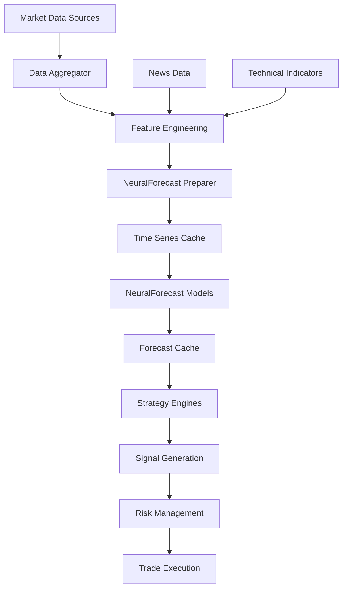

# NeuralForecast Integration Architecture Report

## Executive Summary

This document presents a comprehensive architectural analysis and integration strategy for incorporating NeuralForecast into the existing AI News Trading Platform. The integration will enhance the platform's forecasting capabilities by adding state-of-the-art neural network time series models while maintaining compatibility with existing infrastructure.

## Table of Contents

1. [Current Architecture Analysis](#current-architecture-analysis)
2. [NeuralForecast Integration Points](#neuralforecast-integration-points)
3. [Architectural Design Patterns](#architectural-design-patterns)
4. [Data Pipeline Modifications](#data-pipeline-modifications)
5. [API/Interface Design](#apiinterface-design)
6. [Compatibility Assessment](#compatibility-assessment)
7. [Risk Analysis](#risk-analysis)
8. [Implementation Roadmap](#implementation-roadmap)

## Current Architecture Analysis

### Platform Overview

The AI News Trading Platform is a sophisticated system with the following key components:

#### 1. **Core Trading Engine**
- **Momentum Trading Strategy**: Uses simple price change calculations and volume confirmations
- **Mean Reversion Strategy**: Based on statistical measures and z-scores
- **Mirror Trading Strategy**: Pattern recognition with lookback periods
- **Swing Trading Strategy**: RSI and technical indicators

#### 2. **Data Infrastructure**
- **Multi-source Data Aggregation**: Real-time data collection from multiple sources
- **Data Aggregator**: Deduplication, conflict resolution, and quality scoring
- **GPU Acceleration**: Existing CuPy/CUDA infrastructure for high-performance computing
- **Caching Layer**: Efficient data storage and retrieval

#### 3. **MCP Server**
- **15 Advanced Tools**: Trading operations, news analysis, backtesting, optimization
- **GPU Support**: Tools can leverage GPU acceleration when available
- **Resources**: Strategy information, performance metrics, news sentiment
- **Timeout Protection**: 600-second maximum execution time

#### 4. **Current Forecasting Methods**
- **Simple Mathematical Models**: Moving averages, momentum calculations
- **Technical Indicators**: RSI, MACD, Bollinger Bands
- **Statistical Methods**: Z-scores, correlation analysis
- **No Neural Network Forecasting**: Gap in advanced time series prediction

### Key Strengths
1. Robust GPU infrastructure already in place
2. Modular architecture with clear separation of concerns
3. Comprehensive data pipeline with quality controls
4. MCP server provides flexible tool integration
5. Existing performance optimization framework

### Identified Gaps
1. Lack of advanced time series forecasting models
2. No neural network-based prediction capabilities
3. Limited forward-looking predictions
4. Absence of probabilistic forecasting
5. No support for multivariate time series modeling

## NeuralForecast Integration Points

### 1. **Strategy Enhancement Layer**

```python
# Integration point in trading strategies
class NeuralForecastEnhancedStrategy:
    def __init__(self, base_strategy, neuralforecast_model):
        self.base_strategy = base_strategy
        self.nf_model = neuralforecast_model
        
    def generate_signals(self, market_data):
        # Get base strategy signals
        base_signals = self.base_strategy.calculate_signals(market_data)
        
        # Enhance with neural forecasts
        forecasts = self.nf_model.predict(horizon=self.forecast_horizon)
        
        # Combine signals
        return self.combine_signals(base_signals, forecasts)
```

### 2. **Data Pipeline Integration**

```python
# Data preparation for NeuralForecast
class NeuralForecastDataPreparer:
    def prepare_data(self, aggregated_data: AggregatedUpdate) -> pd.DataFrame:
        """
        Convert aggregated market data to NeuralForecast format
        Required columns: ds (datestamp), y (target), unique_id
        """
        df = pd.DataFrame({
            'unique_id': aggregated_data.symbol,
            'ds': aggregated_data.timestamp,
            'y': aggregated_data.price,
            # Exogenous variables
            'volume': aggregated_data.metadata.get('volume'),
            'volatility': aggregated_data.metadata.get('volatility'),
            'news_sentiment': aggregated_data.metadata.get('sentiment')
        })
        return df
```

### 3. **MCP Server Tool Extension**

```python
@mcp.tool()
def neural_forecast(symbol: str, horizon: int = 24, 
                   model_type: str = "NBEATS", use_gpu: bool = True) -> Dict[str, Any]:
    """Neural network time series forecasting using NeuralForecast."""
    try:
        # Prepare data
        data = prepare_neural_forecast_data(symbol)
        
        # Initialize model
        if model_type == "NBEATS":
            model = NBEATS(input_size=24, h=horizon, max_steps=100)
        elif model_type == "NHITS":
            model = NHITS(input_size=24, h=horizon, max_steps=100)
        
        # Use GPU if available
        if use_gpu and GPU_AVAILABLE:
            nf = NeuralForecast(models=[model], freq='H', gpu=True)
        else:
            nf = NeuralForecast(models=[model], freq='H')
        
        # Fit and predict
        nf.fit(df=data)
        forecasts = nf.predict()
        
        return {
            "symbol": symbol,
            "forecasts": forecasts.to_dict(),
            "model_used": model_type,
            "horizon": horizon,
            "confidence_intervals": calculate_confidence_intervals(forecasts),
            "status": "success"
        }
    except Exception as e:
        return {"error": str(e), "status": "failed"}
```

### 4. **GPU-Accelerated Neural Forecasting**

```python
class GPUNeuralForecastEngine:
    """GPU-accelerated neural forecasting engine."""
    
    def __init__(self):
        self.models = {
            'NBEATS': lambda h: NBEATS(input_size=24, h=h, max_steps=1000),
            'NHITS': lambda h: NHITS(input_size=24, h=h, max_steps=1000),
            'TFT': lambda h: TFT(input_size=24, h=h, max_steps=1000),
            'PatchTST': lambda h: PatchTST(input_size=24, h=h, max_steps=1000)
        }
        
    def batch_forecast_gpu(self, market_data: cudf.DataFrame, 
                          symbols: List[str], horizon: int) -> Dict[str, cudf.DataFrame]:
        """Batch forecasting for multiple symbols using GPU."""
        forecasts = {}
        
        for symbol in symbols:
            symbol_data = self._prepare_symbol_data(market_data, symbol)
            
            # Convert to pandas for NeuralForecast
            df = symbol_data.to_pandas()
            
            # Run multiple models in ensemble
            ensemble_models = [
                self.models['NBEATS'](horizon),
                self.models['NHITS'](horizon)
            ]
            
            nf = NeuralForecast(models=ensemble_models, freq='H', gpu=True)
            nf.fit(df=df)
            
            # Get forecasts and convert back to cuDF
            symbol_forecasts = nf.predict()
            forecasts[symbol] = cudf.from_pandas(symbol_forecasts)
            
        return forecasts
```

## Architectural Design Patterns

### 1. **Adapter Pattern for Strategy Integration**

```python
class NeuralForecastAdapter:
    """Adapter to integrate NeuralForecast with existing strategies."""
    
    def __init__(self, strategy_engine):
        self.strategy_engine = strategy_engine
        self.nf_cache = {}
        
    def adapt_momentum_strategy(self, momentum_engine: MomentumEngine):
        """Enhance momentum strategy with neural forecasts."""
        def enhanced_execute(data: Dict) -> Dict:
            # Get base momentum analysis
            base_result = momentum_engine.execute_dual_momentum_strategy(data)
            
            # Add neural forecast predictions
            forecasts = self.get_cached_forecast(data['symbol'])
            
            # Adjust position sizing based on forecast confidence
            if forecasts['direction_confidence'] > 0.8:
                base_result['position_size_pct'] *= 1.2
            
            base_result['neural_forecast'] = forecasts
            return base_result
            
        return enhanced_execute
```

### 2. **Pipeline Pattern for Data Flow**

```python
class NeuralForecastPipeline:
    """Data processing pipeline for NeuralForecast integration."""
    
    def __init__(self):
        self.stages = [
            self.collect_data,
            self.aggregate_data,
            self.prepare_features,
            self.generate_forecasts,
            self.combine_signals,
            self.risk_assessment
        ]
        
    async def process(self, symbol: str) -> Dict[str, Any]:
        """Process data through the pipeline."""
        data = {'symbol': symbol}
        
        for stage in self.stages:
            data = await stage(data)
            
        return data
```

### 3. **Observer Pattern for Real-time Updates**

```python
class NeuralForecastObserver:
    """Observer for real-time forecast updates."""
    
    def __init__(self):
        self.subscribers = []
        self.forecast_engine = GPUNeuralForecastEngine()
        
    def subscribe(self, strategy):
        self.subscribers.append(strategy)
        
    async def update_forecasts(self, market_data):
        """Update forecasts and notify subscribers."""
        new_forecasts = await self.forecast_engine.batch_forecast_gpu(
            market_data, 
            self.get_active_symbols(), 
            horizon=24
        )
        
        for subscriber in self.subscribers:
            await subscriber.on_forecast_update(new_forecasts)
```

## Data Pipeline Modifications

### 1. **Enhanced Data Flow Architecture**



### 2. **Feature Engineering Module**

```python
class NeuralForecastFeatureEngine:
    """Feature engineering for neural forecasting models."""
    
    def create_features(self, data: pd.DataFrame) -> pd.DataFrame:
        """Create features for NeuralForecast models."""
        # Time-based features
        data['hour'] = data['ds'].dt.hour
        data['day_of_week'] = data['ds'].dt.dayofweek
        data['month'] = data['ds'].dt.month
        
        # Lag features
        for lag in [1, 2, 3, 6, 12, 24]:
            data[f'y_lag_{lag}'] = data['y'].shift(lag)
        
        # Rolling statistics
        for window in [6, 12, 24]:
            data[f'y_roll_mean_{window}'] = data['y'].rolling(window).mean()
            data[f'y_roll_std_{window}'] = data['y'].rolling(window).std()
        
        # Technical indicators as exogenous variables
        data['rsi'] = self.calculate_rsi(data['y'])
        data['macd'] = self.calculate_macd(data['y'])
        
        # News sentiment features
        data['sentiment_ma'] = data['news_sentiment'].rolling(24).mean()
        
        return data
```

### 3. **Time Series Database Integration**

```python
class TimeSeriesStore:
    """Specialized storage for time series data."""
    
    def __init__(self, backend='parquet'):
        self.backend = backend
        self.cache = {}
        
    async def store_series(self, symbol: str, data: pd.DataFrame):
        """Store time series data efficiently."""
        if self.backend == 'parquet':
            path = f"data/timeseries/{symbol}.parquet"
            data.to_parquet(path, compression='snappy')
        
        # Update cache
        self.cache[symbol] = data.tail(1000)  # Keep recent data in memory
        
    async def get_series(self, symbol: str, 
                        start_date: Optional[datetime] = None) -> pd.DataFrame:
        """Retrieve time series data."""
        if symbol in self.cache and start_date is None:
            return self.cache[symbol]
            
        if self.backend == 'parquet':
            path = f"data/timeseries/{symbol}.parquet"
            data = pd.read_parquet(path)
            
            if start_date:
                data = data[data['ds'] >= start_date]
                
            return data
```

## API/Interface Design

### 1. **High-Level API**

```python
class NeuralForecastAPI:
    """High-level API for NeuralForecast integration."""
    
    async def forecast(self, 
                      symbol: str,
                      horizon: int = 24,
                      models: List[str] = ['NBEATS', 'NHITS'],
                      include_exogenous: bool = True) -> ForecastResult:
        """
        Generate forecasts for a symbol.
        
        Args:
            symbol: Trading symbol
            horizon: Forecast horizon in hours
            models: List of models to use
            include_exogenous: Include external variables
            
        Returns:
            ForecastResult with predictions and confidence intervals
        """
        pass
    
    async def backtest_forecast(self,
                               symbol: str,
                               model: str,
                               test_size: int = 168) -> BacktestResult:
        """Backtest forecasting model performance."""
        pass
    
    async def ensemble_forecast(self,
                               symbols: List[str],
                               horizon: int = 24) -> Dict[str, ForecastResult]:
        """Generate ensemble forecasts for multiple symbols."""
        pass
```

### 2. **Strategy Integration Interface**

```python
class INeuralForecastStrategy(ABC):
    """Interface for neural forecast-enhanced strategies."""
    
    @abstractmethod
    async def integrate_forecast(self, 
                                base_signal: Signal,
                                forecast: ForecastResult) -> Signal:
        """Integrate neural forecast with base strategy signal."""
        pass
    
    @abstractmethod
    def get_forecast_config(self) -> Dict[str, Any]:
        """Get configuration for neural forecasting."""
        pass
```

### 3. **MCP Server Extension**

```python
# Additional MCP tools for NeuralForecast

@mcp.tool()
def neural_forecast_backtest(symbol: str, model: str = "NBEATS", 
                            test_days: int = 30) -> Dict[str, Any]:
    """Backtest neural forecasting model performance."""
    pass

@mcp.tool()
def neural_forecast_ensemble(symbols: List[str], horizon: int = 24,
                           use_gpu: bool = True) -> Dict[str, Any]:
    """Generate ensemble forecasts for multiple symbols."""
    pass

@mcp.tool()
def neural_forecast_explain(symbol: str, timestamp: str) -> Dict[str, Any]:
    """Explain neural forecast predictions using interpretability tools."""
    pass
```

## Compatibility Assessment

### 1. **Technical Compatibility**

| Component | Compatibility | Notes |
|-----------|--------------|--------|
| Python Version | ✅ Compatible | Both use Python 3.8+ |
| GPU Support | ✅ Excellent | NeuralForecast supports GPU; platform has CUDA infrastructure |
| Data Format | ✅ Compatible | Easy conversion between formats |
| Async Support | ⚠️ Partial | NeuralForecast is sync; need async wrapper |
| Memory Usage | ⚠️ Monitor | Neural models can be memory-intensive |

### 2. **Integration Complexity**

| Integration Point | Complexity | Effort |
|-------------------|------------|--------|
| Data Pipeline | Low | 1-2 days |
| Strategy Enhancement | Medium | 3-5 days |
| MCP Server Tools | Low | 1-2 days |
| GPU Optimization | Medium | 3-5 days |
| Testing & Validation | High | 5-10 days |

### 3. **Performance Considerations**

```python
class NeuralForecastPerformanceOptimizer:
    """Optimize NeuralForecast performance."""
    
    def __init__(self):
        self.model_cache = {}
        self.forecast_cache = TTLCache(maxsize=1000, ttl=300)  # 5-min cache
        
    async def get_optimized_forecast(self, symbol: str, horizon: int):
        """Get forecast with caching and optimization."""
        cache_key = f"{symbol}_{horizon}"
        
        # Check cache first
        if cache_key in self.forecast_cache:
            return self.forecast_cache[cache_key]
        
        # Use pre-trained model if available
        if symbol in self.model_cache:
            model = self.model_cache[symbol]
            forecast = await self._generate_forecast(model, horizon)
        else:
            # Train new model
            model = await self._train_model(symbol)
            self.model_cache[symbol] = model
            forecast = await self._generate_forecast(model, horizon)
        
        # Cache result
        self.forecast_cache[cache_key] = forecast
        return forecast
```

## Risk Analysis

### 1. **Technical Risks**

| Risk | Impact | Mitigation |
|------|--------|------------|
| Model Overfitting | High | Use validation sets, ensemble methods |
| Forecast Latency | Medium | Implement caching, async processing |
| GPU Memory Overflow | Medium | Batch processing, memory monitoring |
| Data Quality Issues | High | Enhanced validation, outlier detection |
| Model Drift | High | Regular retraining, performance monitoring |

### 2. **Operational Risks**

| Risk | Impact | Mitigation |
|------|--------|------------|
| Increased Complexity | Medium | Comprehensive documentation, training |
| Dependency Management | Low | Version pinning, containerization |
| Resource Utilization | Medium | Resource monitoring, scaling strategy |
| Integration Failures | High | Fallback mechanisms, gradual rollout |

### 3. **Risk Mitigation Framework**

```python
class NeuralForecastRiskManager:
    """Risk management for neural forecasting."""
    
    def __init__(self):
        self.risk_thresholds = {
            'forecast_error': 0.05,  # 5% error threshold
            'confidence_min': 0.7,   # Minimum confidence
            'latency_max': 1000,     # Max 1s latency
            'memory_usage_max': 0.8  # 80% memory threshold
        }
        
    async def validate_forecast(self, forecast: ForecastResult) -> bool:
        """Validate forecast quality and safety."""
        checks = [
            self._check_forecast_error(forecast),
            self._check_confidence_levels(forecast),
            self._check_anomalies(forecast),
            self._check_consistency(forecast)
        ]
        
        return all(checks)
    
    def create_fallback_strategy(self):
        """Create fallback when neural forecasts fail."""
        return {
            'use_traditional_indicators': True,
            'reduce_position_size': 0.5,
            'increase_risk_checks': True,
            'alert_operators': True
        }
```

## Implementation Roadmap

### Phase 1: Foundation (Week 1-2)
1. **Environment Setup**
   - Install NeuralForecast and dependencies
   - Configure GPU support for neural models
   - Set up development environment

2. **Data Pipeline Integration**
   - Create data format converters
   - Implement feature engineering module
   - Set up time series storage

### Phase 2: Core Integration (Week 3-4)
1. **Basic Model Integration**
   - Implement NBEATS model integration
   - Create forecast generation pipeline
   - Add caching layer

2. **MCP Server Extension**
   - Add neural_forecast tool
   - Implement forecast backtesting tool
   - Create ensemble forecast tool

### Phase 3: Strategy Enhancement (Week 5-6)
1. **Strategy Integration**
   - Enhance momentum strategy with forecasts
   - Update mean reversion with predictions
   - Integrate with swing trading

2. **Risk Management**
   - Implement forecast validation
   - Add fallback mechanisms
   - Create monitoring dashboards

### Phase 4: Optimization (Week 7-8)
1. **Performance Optimization**
   - GPU optimization for batch processing
   - Implement model caching
   - Optimize data pipeline

2. **Advanced Features**
   - Multi-model ensembles
   - Probabilistic forecasting
   - Forecast explainability

### Phase 5: Testing & Deployment (Week 9-10)
1. **Comprehensive Testing**
   - Unit tests for all components
   - Integration testing
   - Performance benchmarking

2. **Gradual Rollout**
   - Deploy to development environment
   - A/B testing with existing strategies
   - Production deployment

## Conclusion

The integration of NeuralForecast into the AI News Trading Platform represents a significant enhancement to the platform's predictive capabilities. The existing GPU infrastructure and modular architecture provide an excellent foundation for this integration.

Key benefits include:
- State-of-the-art neural forecasting models
- Enhanced prediction accuracy
- Probabilistic forecasting capabilities
- GPU-accelerated performance
- Seamless integration with existing strategies

The implementation roadmap provides a structured approach to integration while minimizing risks and ensuring system stability. With proper execution, this integration will position the platform at the forefront of AI-driven trading technology.