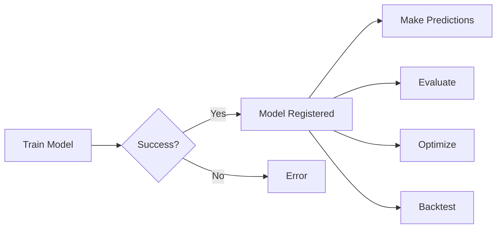

# Neural Module API Reference

## Quick Start

```javascript
const { neuralTrain, neuralForecast, neuralEvaluate, neuralModelStatus } = require('neural-trader-backend');

// 1. Train a model
const training = await neuralTrain(
  './data/prices.csv',
  'nhits',
  100,  // epochs
  true  // use_gpu
);
console.log('Model ID:', training.modelId);

// 2. Make predictions
const forecast = await neuralForecast(
  'AAPL',
  24,    // horizon (hours)
  true,  // use_gpu
  0.95   // confidence_level
);
console.log('Predictions:', forecast.predictions);

// 3. Evaluate model
const evaluation = await neuralEvaluate(
  training.modelId,
  './data/test.csv',
  true  // use_gpu
);
console.log('MAE:', evaluation.mae);

// 4. Check model status
const models = await neuralModelStatus();
console.log('Trained models:', models);
```

## API Functions

### neuralTrain()
Train a neural forecasting model.

**Signature:**
```typescript
async function neuralTrain(
  dataPath: string,
  modelType: string,
  epochs?: number,
  useGpu?: boolean,
  learningRate?: number,
  batchSize?: number
): Promise<TrainingResult>
```

**Parameters:**
- `dataPath` (required): Path to CSV training data with 'value' column
- `modelType` (required): Model architecture
  - `"nhits"` - Neural Hierarchical Interpolation (recommended)
  - `"lstm"` - LSTM with attention
  - `"gru"` - Gated Recurrent Unit
  - `"tcn"` - Temporal Convolutional Network
  - `"deepar"` - Probabilistic forecasting
  - `"nbeats"` - Neural Basis Expansion
  - `"transformer"` - Self-attention model
- `epochs` (optional): Number of training epochs (default: 100, max: 10000)
- `useGpu` (optional): Enable GPU acceleration (default: true)
- `learningRate` (optional): Learning rate (default: 0.001)
- `batchSize` (optional): Batch size (default: 32)

**Returns:**
```typescript
interface TrainingResult {
  modelId: string;           // Unique model identifier (UUID)
  modelType: string;         // Model architecture used
  trainingTimeMs: number;    // Training duration in milliseconds
  finalLoss: number;         // Final training loss
  validationAccuracy: number; // Validation accuracy (0-1)
}
```

**Example:**
```javascript
const result = await neuralTrain('./data/btc_prices.csv', 'nhits', 50, true);
console.log(`Model ${result.modelId} trained in ${result.trainingTimeMs}ms`);
console.log(`Accuracy: ${(result.validationAccuracy * 100).toFixed(2)}%`);
```

---

### neuralForecast()
Generate price forecasts using a trained model.

**Signature:**
```typescript
async function neuralForecast(
  symbol: string,
  horizon: number,
  useGpu?: boolean,
  confidenceLevel?: number,
  modelId?: string
): Promise<NeuralForecast>
```

**Parameters:**
- `symbol` (required): Trading symbol (e.g., 'AAPL', 'BTC')
- `horizon` (required): Number of time steps to forecast (1-365)
- `useGpu` (optional): Enable GPU acceleration (default: true)
- `confidenceLevel` (optional): Confidence interval level (0-1, default: 0.95)
- `modelId` (optional): Specific model to use (default: latest for symbol)

**Returns:**
```typescript
interface NeuralForecast {
  symbol: string;
  horizon: number;
  predictions: number[];              // Point forecasts
  confidenceIntervals: Array<{        // Uncertainty bounds
    lower: number;
    upper: number;
  }>;
  modelAccuracy: number;              // Model accuracy (0-1)
}
```

**Example:**
```javascript
const forecast = await neuralForecast('AAPL', 24, true, 0.95);

forecast.predictions.forEach((price, hour) => {
  const interval = forecast.confidenceIntervals[hour];
  console.log(`Hour ${hour + 1}: $${price.toFixed(2)} [$${interval.lower.toFixed(2)} - $${interval.upper.toFixed(2)}]`);
});
```

---

### neuralEvaluate()
Evaluate a trained model on test data.

**Signature:**
```typescript
async function neuralEvaluate(
  modelId: string,
  testData: string,
  useGpu?: boolean
): Promise<EvaluationResult>
```

**Parameters:**
- `modelId` (required): Model identifier from training
- `testData` (required): Path to CSV test data
- `useGpu` (optional): Enable GPU acceleration (default: true)

**Returns:**
```typescript
interface EvaluationResult {
  modelId: string;
  testSamples: number;     // Number of test samples
  mae: number;             // Mean Absolute Error
  rmse: number;            // Root Mean Squared Error
  mape: number;            // Mean Absolute Percentage Error
  r2Score: number;         // R-squared coefficient (0-1)
}
```

**Example:**
```javascript
const eval = await neuralEvaluate(modelId, './data/test.csv', true);
console.log(`MAE: ${eval.mae.toFixed(4)}, RMSE: ${eval.rmse.toFixed(4)}`);
console.log(`R²: ${(eval.r2Score * 100).toFixed(2)}%`);
```

---

### neuralModelStatus()
Get status of trained models.

**Signature:**
```typescript
async function neuralModelStatus(
  modelId?: string
): Promise<ModelStatus[]>
```

**Parameters:**
- `modelId` (optional): Specific model ID (omit to get all models)

**Returns:**
```typescript
interface ModelStatus {
  modelId: string;
  modelType: string;
  status: string;          // 'trained', 'training', 'error'
  createdAt: string;       // ISO 8601 timestamp
  accuracy: number;        // Model accuracy (0-1)
}
```

**Example:**
```javascript
// Get all models
const allModels = await neuralModelStatus();
allModels.forEach(model => {
  console.log(`${model.modelType} (${model.modelId}): ${(model.accuracy * 100).toFixed(2)}%`);
});

// Get specific model
const model = await neuralModelStatus('uuid-here');
if (model.length > 0) {
  console.log('Model found:', model[0]);
}
```

---

### neuralOptimize()
Optimize model hyperparameters.

**Signature:**
```typescript
async function neuralOptimize(
  modelId: string,
  parameterRanges: string,
  useGpu?: boolean,
  trials?: number
): Promise<OptimizationResult>
```

**Parameters:**
- `modelId` (required): Model identifier to optimize
- `parameterRanges` (required): JSON string with parameter ranges
- `useGpu` (optional): Enable GPU acceleration (default: true)
- `trials` (optional): Number of optimization trials (default: 100)

**Returns:**
```typescript
interface OptimizationResult {
  modelId: string;
  bestParams: string;          // JSON string with optimal parameters
  bestScore: number;           // Best validation score achieved
  trialsCompleted: number;     // Number of trials run
  optimizationTimeMs: number;  // Optimization duration
}
```

**Example:**
```javascript
const paramRanges = JSON.stringify({
  learning_rate: [0.0001, 0.01],
  batch_size: [16, 32, 64],
  hidden_size: [256, 512, 1024]
});

const optimized = await neuralOptimize(modelId, paramRanges, true, 50);
console.log('Best parameters:', JSON.parse(optimized.bestParams));
console.log(`Score improved to ${optimized.bestScore.toFixed(4)}`);
```

---

### neuralBacktest()
Run historical backtest.

**Signature:**
```typescript
async function neuralBacktest(
  modelId: string,
  startDate: string,
  endDate: string,
  benchmark?: string,
  useGpu?: boolean
): Promise<BacktestResult>
```

**Parameters:**
- `modelId` (required): Model identifier
- `startDate` (required): Start date (YYYY-MM-DD)
- `endDate` (required): End date (YYYY-MM-DD)
- `benchmark` (optional): Benchmark symbol (default: 'SPY')
- `useGpu` (optional): Enable GPU acceleration (default: true)

**Returns:**
```typescript
interface BacktestResult {
  modelId: string;
  startDate: string;
  endDate: string;
  totalReturn: number;     // Total return (-1 to +infinity)
  sharpeRatio: number;     // Risk-adjusted return
  maxDrawdown: number;     // Maximum drawdown (negative)
  winRate: number;         // Win rate (0-1)
  totalTrades: number;     // Number of trades executed
}
```

**Example:**
```javascript
const backtest = await neuralBacktest(
  modelId,
  '2024-01-01',
  '2024-06-30',
  'SPY',
  true
);

console.log(`Return: ${(backtest.totalReturn * 100).toFixed(2)}%`);
console.log(`Sharpe: ${backtest.sharpeRatio.toFixed(2)}`);
console.log(`Max Drawdown: ${(backtest.maxDrawdown * 100).toFixed(2)}%`);
console.log(`Win Rate: ${(backtest.winRate * 100).toFixed(2)}%`);
```

## Error Handling

All functions throw `NeuralTraderError` with descriptive messages:

```javascript
try {
  const result = await neuralTrain('./nonexistent.csv', 'nhits');
} catch (error) {
  if (error.message.includes('not found')) {
    console.error('Training data file not found');
  } else if (error.message.includes('Unsupported model type')) {
    console.error('Invalid model type specified');
  } else {
    console.error('Training error:', error.message);
  }
}
```

## Common Error Messages

| Error | Cause | Solution |
|-------|-------|----------|
| "Symbol cannot be empty" | Missing symbol parameter | Provide valid symbol string |
| "Training data not found" | Invalid file path | Check file exists and path is correct |
| "Model 'X' not found" | Invalid model ID | Use valid model ID from training |
| "Forecast horizon ... exceeds maximum" | Horizon > 365 | Reduce horizon to ≤ 365 |
| "Confidence level ... must be between 0 and 1" | Invalid confidence | Use value between 0 and 1 |
| "Unknown model type 'X'" | Unsupported model | Use: nhits, lstm, gru, tcn, etc. |
| "Invalid parameter ranges JSON" | Malformed JSON | Check JSON syntax |
| "Invalid start_date format" | Wrong date format | Use YYYY-MM-DD format |

## GPU Acceleration

GPU acceleration is automatically selected:
1. **CUDA** (NVIDIA) - fastest, requires CUDA toolkit
2. **Metal** (Apple Silicon) - fast on M-series Macs
3. **CPU** - fallback, slower but always available

To check GPU availability:
```javascript
// GPU will be used if available when useGpu=true
const result = await neuralTrain('./data.csv', 'nhits', 100, true);
// Check logs for "Neural module initialized with CUDA/Metal/CPU"
```

## Data Format

### Training Data CSV
```csv
timestamp,value
2024-01-01 00:00:00,150.25
2024-01-01 01:00:00,151.30
2024-01-01 02:00:00,150.85
...
```

Requirements:
- Must have 'value' column
- Timestamp column (optional but recommended)
- Numeric values only
- No missing values
- Sorted by time

### Test Data CSV
Same format as training data.

## Model Lifecycle



## Performance Tips

1. **Use GPU**: Enable `useGpu=true` for 10-100x speedup
2. **Batch Size**: Larger batches = faster training (GPU memory permitting)
3. **Early Stopping**: Training auto-stops when no improvement
4. **Model Selection**:
   - NHITS: Best for multi-horizon forecasting
   - LSTM: Best for long sequences with dependencies
   - GRU: Faster than LSTM, slightly less accurate
   - TCN: Good for parallel processing
5. **Data Size**: More data = better models (minimum 1000 samples recommended)

## Advanced Usage

### Custom Training Configuration
```javascript
// For advanced users needing fine control
const result = await neuralTrain(
  './data/prices.csv',
  'nhits',
  200,    // more epochs
  true,   // GPU
  0.0008, // custom learning rate
  64      // larger batch size
);
```

### Model Comparison
```javascript
const models = ['nhits', 'lstm', 'gru'];
const results = await Promise.all(
  models.map(type => neuralTrain('./data.csv', type, 50, true))
);

// Evaluate each model
const evaluations = await Promise.all(
  results.map(r => neuralEvaluate(r.modelId, './test.csv', true))
);

// Find best model
const best = evaluations.reduce((a, b) =>
  b.r2Score > a.r2Score ? b : a
);
console.log('Best model:', best.modelId);
```

### Ensemble Predictions
```javascript
// Train multiple models
const models = await Promise.all([
  neuralTrain('./data.csv', 'nhits', 100, true),
  neuralTrain('./data.csv', 'lstm', 100, true),
  neuralTrain('./data.csv', 'gru', 100, true)
]);

// Get predictions from each
const forecasts = await Promise.all(
  models.map(m => neuralForecast('AAPL', 24, true, 0.95, m.modelId))
);

// Average predictions (simple ensemble)
const ensemble = forecasts[0].predictions.map((_, i) =>
  forecasts.reduce((sum, f) => sum + f.predictions[i], 0) / forecasts.length
);

console.log('Ensemble forecast:', ensemble);
```

## Support

- **Documentation**: See NEURAL_INTEGRATION_SUMMARY.md
- **Examples**: Check examples/ directory
- **Issues**: Report on GitHub

---

Last Updated: 2025-11-14
Version: 2.0.0
