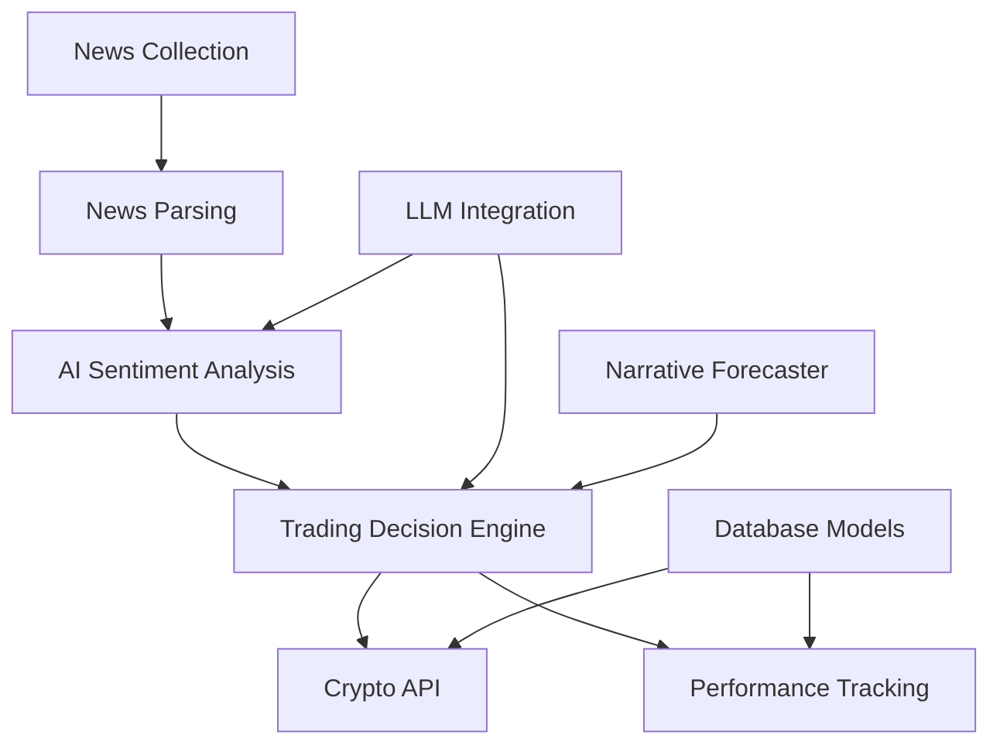

# AI News Trading Platform - Module Analysis

## Current Architecture Overview

The platform currently consists of the following main modules:

### 1. Core Trading Modules (`/src/trading/`)
- **trader.py**: Core trading logic with LLM integration
- **narrative_forecaster.py**: Future retrospective narrative generation for price prediction  
- **crypto_api.py**: Crypto.com Exchange API integration
- **models.py**: SQLAlchemy models for assets and purchase records
- **performance_metrics.py**: Performance calculation utilities

### 2. LLM Integration (`/src/llm_integration/`)
- **openrouter_client.py**: OpenRouter API client for LLM services

### 3. Mathematical Processing (`/src/`)
- **parser/parser.py**: Mathematical expression parser
- **transformers/**: Expression transformation utilities
  - transformer.py, differentiator.py, integrator.py, etc.
- **utils/expression_tree.py**: Expression tree utilities

### 4. Main Entry Point
- **main.py**: Symbolic Math Engine with trading mode configuration

## Missing Core Components for News Trading

### 1. News Collection Module
- Real-time news feed integration (Reuters, Bloomberg, Twitter, Reddit)
- News aggregation and deduplication
- News source credibility scoring
- Multi-language support

### 2. News Parsing Module  
- NLP-based article parsing
- Entity extraction (companies, cryptocurrencies, people)
- Event detection and classification
- Timestamp extraction and normalization

### 3. AI Sentiment Analysis Module
- Sentiment scoring (-1 to +1)
- Market impact prediction
- Contextual analysis for crypto/financial terms
- Multi-model ensemble for accuracy

### 4. Trading Decision Engine
- News-to-signal conversion
- Risk management integration
- Position sizing based on confidence
- Multi-asset correlation analysis

### 5. Performance Tracking Module
- Trade attribution to news events
- Performance metrics by news source
- ML model performance tracking
- A/B testing framework

## Module Dependencies

## Integration Points

1. **News → Trading Pipeline**
   - News events trigger sentiment analysis
   - Sentiment scores feed into trading decisions
   - Trading decisions execute via Crypto API

2. **LLM Integration**
   - Enhance sentiment analysis with context
   - Generate trading narratives
   - Validate trading decisions

3. **Performance Feedback Loop**
   - Track which news sources lead to profitable trades
   - Adjust sentiment model weights
   - Optimize trading parameters

## Next Steps

1. Design news collection interfaces
2. Create sentiment analysis pipeline
3. Integrate news signals with existing trading logic
4. Build comprehensive testing framework
5. Implement performance tracking and attribution