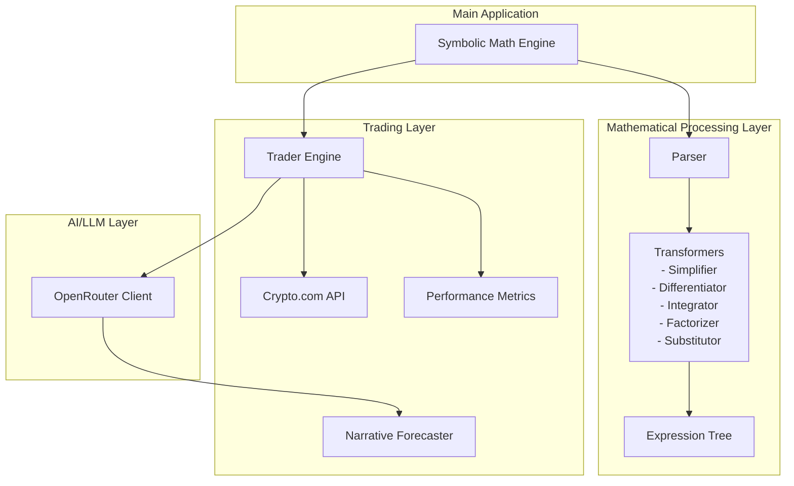

# AI News Trading Platform - Integration Testing Plan

## Executive Summary

This document outlines the comprehensive integration testing strategy for the AI News Trading platform. It maps all critical integration points between modules and defines test scenarios following Test-Driven Development (TDD) principles to ensure system reliability and performance.

## 1. System Architecture Overview

### 1.1 Core Components



### 1.2 Integration Points Matrix

| Component A | Component B | Integration Type | Critical Path |
|------------|-------------|-----------------|---------------|
| SymbolicMathEngine | Parser | Synchronous | Yes |
| Parser | Transformers | Synchronous | Yes |
| Trader | OpenRouterClient | Asynchronous | Yes |
| Trader | CryptoAPI | Asynchronous | Yes |
| NarrativeForecaster | OpenRouterClient | Asynchronous | Yes |
| Trader | PerformanceMetrics | Synchronous | No |
| Transformers | ExpressionTree | Synchronous | Yes |

## 2. Integration Test Scenarios

### 2.1 Critical Path: Math Expression → Trading Signal → Trade Execution

#### Test Scenario 2.1.1: End-to-End Trade Flow
```python
async def test_math_to_trade_integration():
    """
    Tests the complete flow from mathematical expression analysis to trade execution
    """
    # Given
    expression = "x^2 + 2*x - 8"  # Mathematical pattern
    market_conditions = {
        "symbol": "BTC-USD",
        "current_price": 50000,
        "volume": 1000000,
        "support": 48000,
        "resistance": 52000
    }
    
    # When
    # 1. Math engine processes expression
    # 2. Trader analyzes expression
    # 3. Narrative forecaster generates prediction
    # 4. Trade decision is made
    # 5. Trade is executed via CryptoAPI
    
    # Then
    # - Expression should be correctly parsed and simplified
    # - Trading signal should be generated
    # - Narrative forecast should include price prediction
    # - Trade should be executed (or simulated)
    # - Performance metrics should be updated
```

#### Test Scenario 2.1.2: Multi-Expression Portfolio Analysis
```python
async def test_portfolio_integration():
    """
    Tests handling multiple mathematical expressions for portfolio optimization
    """
    # Given
    expressions = [
        "sin(x) * cos(2*x)",  # Oscillating pattern
        "e^x - x^2",          # Exponential vs polynomial
        "log(x) + sqrt(x)"    # Logarithmic growth
    ]
    
    # When
    # Process each expression through the entire pipeline
    
    # Then
    # - Each expression should generate distinct trading signals
    # - Portfolio should be balanced based on signals
    # - Risk metrics should be calculated across all positions
```

### 2.2 External API Integration Tests

#### Test Scenario 2.2.1: CryptoAPI Connection and Trading
```python
async def test_crypto_api_integration():
    """
    Tests real API connection with mock responses
    """
    # Given
    mock_crypto_api = MockCryptoAPI()
    trade_params = {
        "symbol": "BTC-USD",
        "side": "BUY",
        "quantity": 0.1,
        "price": 50000
    }
    
    # When
    # 1. Get market ticker
    # 2. Check order book depth
    # 3. Place order
    # 4. Monitor order status
    # 5. Get account balance
    
    # Then
    # - All API calls should handle rate limiting
    # - Failed requests should retry with exponential backoff
    # - Order status should update correctly
    # - Balance should reflect executed trades
```

#### Test Scenario 2.2.2: OpenRouter LLM Integration
```python
async def test_openrouter_integration():
    """
    Tests LLM integration for expression analysis and narrative generation
    """
    # Given
    expression = "x^3 - 3*x + 2"
    mock_llm_response = {
        "analysis": "Complex cubic function with multiple roots",
        "complexity": "high",
        "trading_insight": "Expect high volatility"
    }
    
    # When
    # 1. Send expression to OpenRouter
    # 2. Parse response
    # 3. Handle timeout/errors
    
    # Then
    # - Response should be properly formatted
    # - Timeout should be handled gracefully
    # - Fallback analysis should be available
```

### 2.3 Data Flow Integration Tests

#### Test Scenario 2.3.1: Parser → Transformer Chain
```python
def test_parser_transformer_integration():
    """
    Tests the integration between parser and all transformer types
    """
    # Given
    expressions = {
        "simplify": "2*x + 3*x - x",
        "differentiate": "x^3 + 2*x^2 - 5*x + 7",
        "integrate": "3*x^2 + 2*x",
        "factor": "x^2 - 4",
        "substitute": "x^2 + y"
    }
    
    # When
    # Process each expression through appropriate transformer
    
    # Then
    # - Parser should create valid expression trees
    # - Each transformer should process trees correctly
    # - Results should be mathematically correct
```

#### Test Scenario 2.3.2: Narrative Forecaster → Trading Decision
```python
async def test_narrative_to_trade_integration():
    """
    Tests how narrative predictions influence trading decisions
    """
    # Given
    narrative = "Looking back from tomorrow, BTC surged past resistance..."
    price_prediction = 52000
    confidence_score = 0.85
    
    # When
    # 1. Extract sentiment from narrative
    # 2. Calculate profit threshold adjustments
    # 3. Generate trading signal
    
    # Then
    # - Sentiment score should align with narrative tone
    # - Profit threshold should adjust based on confidence
    # - Trading signal should reflect the analysis
```

### 2.4 Performance and Load Integration Tests

#### Test Scenario 2.4.1: High-Frequency Analysis
```python
async def test_high_frequency_integration():
    """
    Tests system behavior under high-frequency trading conditions
    """
    # Given
    request_rate = 100  # requests per second
    duration = 60  # seconds
    
    # When
    # Simulate high-frequency expression analysis and trading
    
    # Then
    # - System should handle rate without degradation
    # - API rate limits should be respected
    # - Queue should manage backpressure
    # - No memory leaks should occur
```

#### Test Scenario 2.4.2: Concurrent Trading Operations
```python
async def test_concurrent_operations():
    """
    Tests concurrent trade execution and analysis
    """
    # Given
    concurrent_trades = 10
    different_symbols = ["BTC-USD", "ETH-USD", "SOL-USD"]
    
    # When
    # Execute multiple trades simultaneously
    
    # Then
    # - All trades should execute without race conditions
    # - Account balance should remain consistent
    # - Performance metrics should aggregate correctly
```

## 3. Mock Strategies and Test Data

### 3.1 External API Mocking Strategy

```python
class MockCryptoAPI:
    def __init__(self):
        self.responses = {
            "ticker": {"bid": 50000, "ask": 50100, "last": 50050},
            "order": {"order_id": "12345", "status": "filled"},
            "balance": {"BTC": 1.5, "USD": 25000}
        }
    
    async def get_ticker(self, symbol):
        # Simulate network delay
        await asyncio.sleep(0.1)
        return self.responses["ticker"]

class MockOpenRouterClient:
    def __init__(self):
        self.responses = {
            "analyze": {"complexity": "medium", "suggestions": []},
            "narrative": {"price_prediction": 51000, "confidence": 0.75}
        }
    
    async def generate_response(self, prompt):
        # Simulate LLM processing time
        await asyncio.sleep(0.5)
        return "Mocked LLM response based on prompt analysis"
```

### 3.2 Test Data Sets

```python
TEST_DATA = {
    "expressions": [
        # Simple expressions
        "x + 2", "2*x", "x^2",
        # Complex expressions
        "sin(x) * e^x", "log(x^2 + 1)", "sqrt(x) / (x + 1)",
        # Edge cases
        "1/x", "x^0", "0*x"
    ],
    "market_conditions": [
        {"trend": "bullish", "volatility": 0.02},
        {"trend": "bearish", "volatility": 0.05},
        {"trend": "sideways", "volatility": 0.01}
    ],
    "historical_data": [
        # Time series data for backtesting
        {"timestamp": "2024-01-01", "price": 45000, "volume": 1000},
        {"timestamp": "2024-01-02", "price": 46000, "volume": 1200},
        # ... more data points
    ]
}
```

## 4. Failure Scenario Testing

### 4.1 API Failure Scenarios

```python
async def test_api_failure_handling():
    """
    Tests system resilience when external APIs fail
    """
    scenarios = [
        "connection_timeout",
        "rate_limit_exceeded", 
        "invalid_response",
        "authentication_failure",
        "service_unavailable"
    ]
    
    for scenario in scenarios:
        # Test each failure mode
        # Verify graceful degradation
        # Check error logging
        # Ensure system recovery
```

### 4.2 Data Corruption Scenarios

```python
def test_data_integrity():
    """
    Tests handling of corrupted or invalid data
    """
    invalid_inputs = [
        "malformed_expression": "x + + 2",
        "invalid_price": -1000,
        "null_response": None,
        "infinite_value": float('inf')
    ]
    
    # Verify each is handled without crashing
    # Check data validation at boundaries
    # Ensure error messages are informative
```

## 5. Performance Benchmarks

### 5.1 Integration Performance Targets

| Integration Point | Target Latency | Max Latency | Throughput |
|------------------|----------------|-------------|------------|
| Parser → Transformer | < 10ms | 50ms | 1000/sec |
| Trader → CryptoAPI | < 100ms | 500ms | 10/sec |
| Trader → OpenRouter | < 1000ms | 5000ms | 5/sec |
| Full Pipeline | < 2000ms | 10000ms | 1/sec |

### 5.2 Resource Usage Targets

```python
PERFORMANCE_TARGETS = {
    "memory_usage": {
        "idle": "< 100MB",
        "active": "< 500MB",
        "peak": "< 1GB"
    },
    "cpu_usage": {
        "idle": "< 5%",
        "active": "< 50%",
        "peak": "< 80%"
    },
    "api_efficiency": {
        "cache_hit_rate": "> 70%",
        "retry_rate": "< 5%",
        "error_rate": "< 1%"
    }
}
```

## 6. Integration Test Execution Plan

### 6.1 Test Phases

1. **Phase 1: Component Integration** (Week 1)
   - Parser ↔ Transformers
   - Trader ↔ Performance Metrics
   - Individual API integrations

2. **Phase 2: Chain Integration** (Week 2)
   - Math processing chain
   - Trading decision chain
   - Reporting chain

3. **Phase 3: End-to-End Integration** (Week 3)
   - Full pipeline testing
   - Concurrent operation testing
   - Load testing

4. **Phase 4: Failure and Recovery** (Week 4)
   - API failure scenarios
   - Data corruption handling
   - System recovery testing

### 6.2 Continuous Integration Setup

```yaml
# .github/workflows/integration-tests.yml
name: Integration Tests

on:
  push:
    branches: [main, develop]
  pull_request:
    branches: [main]

jobs:
  integration-tests:
    runs-on: ubuntu-latest
    
    services:
      mock-apis:
        image: mock-api-server:latest
        ports:
          - 8080:8080
    
    steps:
      - uses: actions/checkout@v2
      
      - name: Set up Python
        uses: actions/setup-python@v2
        with:
          python-version: 3.9
      
      - name: Install dependencies
        run: |
          pip install -r requirements.txt
          pip install pytest-asyncio pytest-mock
      
      - name: Run integration tests
        env:
          TRADING_MODE: simulation
          USE_MOCK_APIS: true
        run: |
          pytest tests/integration/ -v --tb=short
      
      - name: Upload test results
        uses: actions/upload-artifact@v2
        with:
          name: integration-test-results
          path: test-results/
```

## 7. Monitoring and Observability

### 7.1 Integration Health Metrics

```python
INTEGRATION_METRICS = {
    "api_latency": {
        "metric": "histogram",
        "labels": ["api", "endpoint", "status"]
    },
    "pipeline_duration": {
        "metric": "histogram",
        "labels": ["stage", "expression_type"]
    },
    "error_rate": {
        "metric": "counter",
        "labels": ["component", "error_type"]
    },
    "active_connections": {
        "metric": "gauge",
        "labels": ["api", "connection_type"]
    }
}
```

### 7.2 Distributed Tracing

```python
# Example trace span structure
TRACE_SPANS = {
    "root": "expression_to_trade",
    "children": [
        "parse_expression",
        "transform_expression",
        "analyze_with_llm",
        "generate_narrative",
        "make_trade_decision",
        "execute_trade",
        "update_metrics"
    ]
}
```

## 8. Test Documentation and Reporting

### 8.1 Test Report Template

```markdown
# Integration Test Report

## Test Run Summary
- Date: YYYY-MM-DD
- Duration: HH:MM:SS
- Total Tests: XXX
- Passed: XXX
- Failed: XXX
- Skipped: XXX

## Integration Points Tested
- [ ] Parser → Transformers
- [ ] Trader → CryptoAPI
- [ ] Trader → OpenRouter
- [ ] NarrativeForecaster → OpenRouter
- [ ] End-to-End Pipeline

## Performance Results
- Average Latency: XXXms
- 95th Percentile: XXXms
- Throughput: XXX req/sec

## Issues Found
1. Issue description
   - Severity: High/Medium/Low
   - Component: XXX
   - Status: Open/Fixed

## Recommendations
- ...
```

## 9. Conclusion

This integration testing plan provides a comprehensive framework for validating all critical integration points in the AI News Trading platform. By following TDD principles and implementing thorough test scenarios, we ensure system reliability, performance, and maintainability.

Key success factors:
- Comprehensive mock strategies for external dependencies
- Performance benchmarks for all integration points
- Failure scenario coverage
- Continuous integration and monitoring
- Clear documentation and reporting

Regular execution of these integration tests will maintain system quality and catch integration issues early in the development cycle.