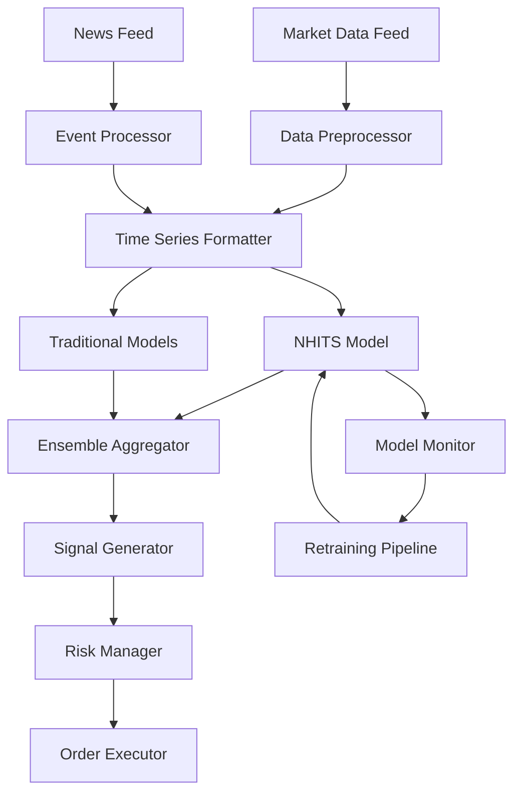

# NeuralForecast Technical Architecture
## Deep Dive into NHITS Integration

---

## System Architecture

### Component Overview

```
┌────────────────────────────────────────────────────────────────┐
│                         API Gateway                             │
│                    (FastAPI + WebSocket)                        │
├────────────────────────────────────────────────────────────────┤
│                      Service Layer                              │
│  ┌──────────────┐  ┌─────────────────┐  ┌─────────────────┐  │
│  │   Trading    │  │  NeuralForecast │  │    Market       │  │
│  │   Service    │  │     Service     │  │  Data Service   │  │
│  └──────────────┘  └─────────────────┘  └─────────────────┘  │
├────────────────────────────────────────────────────────────────┤
│                      Core Components                            │
│  ┌──────────────┐  ┌─────────────────┐  ┌─────────────────┐  │
│  │   Strategy   │  │   NHITS Model   │  │   Ensemble      │  │
│  │   Engine     │  │     Engine      │  │   Manager       │  │
│  └──────────────┘  └─────────────────┘  └─────────────────┘  │
├────────────────────────────────────────────────────────────────┤
│                    Infrastructure Layer                         │
│  ┌──────────────┐  ┌─────────────────┐  ┌─────────────────┐  │
│  │GPU Cluster   │  │  Redis Cache    │  │   PostgreSQL    │  │
│  │(CUDA/TensorRT)│ │  (Predictions)  │  │  (Time Series)  │  │
│  └──────────────┘  └─────────────────┘  └─────────────────┘  │
└────────────────────────────────────────────────────────────────┘
```

### Data Flow Architecture



### NHITS Model Architecture

```
Input Layer (Multivariate Time Series)
    │
    ├─── Stack 1: Long-term Patterns
    │    ├─── MaxPool1d (kernel=4)
    │    ├─── MLP Block [512, 512]
    │    └─── Linear Interpolation
    │
    ├─── Stack 2: Medium-term Patterns  
    │    ├─── MaxPool1d (kernel=2)
    │    ├─── MLP Block [512, 512]
    │    └─── Linear Interpolation
    │
    └─── Stack 3: Short-term Patterns
         ├─── No Pooling
         ├─── MLP Block [512, 512]
         └─── Direct Output
              │
         Hierarchical Aggregation
              │
         Output Layer (Forecasts + Uncertainty)
```

### GPU Acceleration Architecture

```python
# GPU Memory Management Strategy
class GPUMemoryManager:
    def __init__(self):
        self.memory_pools = {
            'model_weights': 2048,  # MB
            'batch_processing': 1024,
            'cache': 512,
            'workspace': 512
        }
        
    def allocate_for_inference(self, batch_size):
        # Dynamic allocation based on batch size
        required_memory = self.calculate_memory_requirement(batch_size)
        
        if self.get_available_memory() < required_memory:
            self.clear_cache()
            self.optimize_allocations()
```

### Microservices Communication

```yaml
# Service Mesh Configuration
services:
  neural_forecast_service:
    image: neural-forecast:latest
    replicas: 3
    resources:
      gpu: 1
      memory: 8Gi
    endpoints:
      - /forecast
      - /train
      - /evaluate
    
  model_registry:
    image: mlflow:latest
    volumes:
      - model-store:/models
    endpoints:
      - /models/register
      - /models/serve
      
  monitoring_service:
    image: prometheus-grafana:latest
    scrape_interval: 10s
    dashboards:
      - neural_forecast_metrics
      - gpu_utilization
      - prediction_accuracy
```

## Integration Points

### 1. MCP Server Integration

```python
# mcp_server_enhanced.py extensions
class NeuralForecastTools:
    @tool()
    async def neural_forecast(self, params: NeuralForecastParams):
        """MCP tool for neural forecasting."""
        
    @tool()
    async def neural_model_status(self):
        """Get status of all neural models."""
        
    @tool()
    async def neural_retrain(self, model_id: str):
        """Trigger model retraining."""
```

### 2. Strategy Enhancement Points

```python
# Injection points for neural forecasts
class StrategyEnhancementPoints:
    
    # Before signal generation
    async def pre_signal_hook(self, market_data):
        forecast = await self.neural_forecaster.predict(market_data)
        return self.merge_forecast_with_data(market_data, forecast)
    
    # After signal generation  
    async def post_signal_hook(self, signals, forecast_confidence):
        return self.adjust_signals_by_confidence(signals, forecast_confidence)
    
    # Risk adjustment
    async def risk_adjustment_hook(self, position_size, forecast_uncertainty):
        return self.scale_position_by_uncertainty(position_size, forecast_uncertainty)
```

### 3. Data Pipeline Integration

```python
# Data pipeline modifications
class NeuralDataPipeline:
    def __init__(self):
        self.transformers = [
            TimeSeriesNormalizer(),
            OutlierDetector(),
            MissingValueImputer(),
            FeatureEngineer(),
            NeuralFormatter()
        ]
    
    async def prepare_for_nhits(self, raw_data):
        # NHITS specific formatting
        formatted_data = {
            'ds': raw_data.index,
            'y': raw_data['close'],
            'unique_id': raw_data['symbol']
        }
        
        # Add exogenous variables
        if 'volume' in raw_data:
            formatted_data['volume'] = raw_data['volume']
        
        return pd.DataFrame(formatted_data)
```

## Performance Optimization Details

### 1. Inference Optimization

```python
# Optimized inference pipeline
class OptimizedInference:
    def __init__(self):
        self.model_cache = {}
        self.prediction_cache = LRUCache(maxsize=1000)
        self.batch_queue = asyncio.Queue(maxsize=100)
        
    async def predict_with_caching(self, symbol, horizon):
        cache_key = f"{symbol}_{horizon}_{self.get_cache_timestamp()}"
        
        if cache_key in self.prediction_cache:
            return self.prediction_cache[cache_key]
        
        # Batch similar requests
        await self.batch_queue.put((symbol, horizon))
        
        if self.batch_queue.qsize() >= self.batch_threshold:
            predictions = await self.process_batch()
            self.update_cache(predictions)
            
        return predictions[symbol]
```

### 2. GPU Optimization Techniques

```python
# Multi-GPU strategy
class MultiGPUStrategy:
    def __init__(self, n_gpus=4):
        self.n_gpus = n_gpus
        self.device_map = self.create_device_map()
        
    def create_device_map(self):
        return {
            'model_parallel': [0, 1],  # Model across 2 GPUs
            'data_parallel': [2, 3]    # Data across 2 GPUs
        }
    
    async def distributed_forecast(self, data_batch):
        # Split data across GPUs
        chunks = np.array_split(data_batch, self.n_gpus)
        
        # Parallel processing
        tasks = [
            self.process_on_gpu(chunk, gpu_id) 
            for chunk, gpu_id in zip(chunks, range(self.n_gpus))
        ]
        
        results = await asyncio.gather(*tasks)
        return self.merge_results(results)
```

### 3. Memory Management

```python
# Efficient memory management
class MemoryEfficientNHITS:
    def __init__(self):
        self.gradient_checkpointing = True
        self.mixed_precision = True
        self.activation_checkpointing = True
        
    def configure_memory_savings(self):
        return {
            'gradient_accumulation_steps': 4,
            'fp16': True,
            'offload_to_cpu': True,
            'sharded_ddp': True,
            'find_unused_parameters': False
        }
```

## Monitoring and Observability

### 1. Metrics Collection

```python
# Comprehensive metrics
class NeuralMetricsCollector:
    def __init__(self):
        self.metrics = {
            'model_metrics': {
                'inference_latency': Histogram('neural_inference_latency_seconds'),
                'prediction_error': Gauge('neural_prediction_error'),
                'gpu_utilization': Gauge('neural_gpu_utilization_percent'),
                'cache_hit_rate': Counter('neural_cache_hits_total')
            },
            'business_metrics': {
                'forecast_accuracy': Gauge('forecast_accuracy_percentage'),
                'signal_confidence': Histogram('signal_confidence_score'),
                'profit_attribution': Gauge('neural_profit_attribution')
            }
        }
```

### 2. Distributed Tracing

```python
# OpenTelemetry integration
from opentelemetry import trace

tracer = trace.get_tracer("neural_forecast")

class TracedNeuralForecaster:
    @tracer.start_as_current_span("neural_forecast")
    async def forecast(self, data):
        span = trace.get_current_span()
        span.set_attribute("model.type", "nhits")
        span.set_attribute("data.size", len(data))
        
        with tracer.start_as_current_span("preprocessing"):
            preprocessed = await self.preprocess(data)
            
        with tracer.start_as_current_span("inference"):
            prediction = await self.model.predict(preprocessed)
            
        span.set_attribute("prediction.horizon", len(prediction))
        return prediction
```

## Security Considerations

### 1. Model Security

```python
# Model security wrapper
class SecureNeuralModel:
    def __init__(self, model):
        self.model = model
        self.encryption_key = self.load_encryption_key()
        
    def save_encrypted(self, path):
        # Encrypt model weights
        encrypted_state = self.encrypt_state_dict(
            self.model.state_dict()
        )
        torch.save(encrypted_state, path)
        
    def load_encrypted(self, path):
        # Decrypt and load
        encrypted_state = torch.load(path)
        state_dict = self.decrypt_state_dict(encrypted_state)
        self.model.load_state_dict(state_dict)
```

### 2. Input Validation

```python
# Input validation for neural models
class NeuralInputValidator:
    def validate_forecast_request(self, request):
        # Check data integrity
        if not self.is_valid_timeseries(request.data):
            raise ValueError("Invalid time series format")
            
        # Check for adversarial inputs
        if self.detect_adversarial_pattern(request.data):
            raise SecurityError("Potential adversarial input detected")
            
        # Validate ranges
        if request.horizon > self.max_allowed_horizon:
            raise ValueError(f"Horizon exceeds maximum of {self.max_allowed_horizon}")
```

## Conclusion

This technical architecture provides a robust foundation for integrating NeuralForecast with NHITS into the AI News Trading Platform. The modular design ensures scalability, maintainability, and high performance while maintaining compatibility with existing systems.