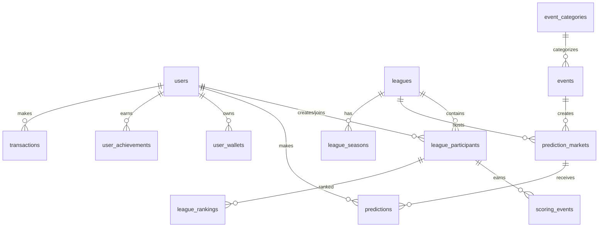

# Fantasy Collective Database System

A comprehensive SQLite database system for fantasy leagues, prediction markets, and business collectives with advanced features for user management, scoring, achievements, and financial transactions.

## 📋 Table of Contents

- [Overview](#overview)
- [Features](#features)
- [Database Schema](#database-schema)
- [Installation](#installation)
- [Usage](#usage)
- [API Reference](#api-reference)
- [Performance](#performance)
- [Testing](#testing)
- [Contributing](#contributing)

## 🎯 Overview

The Fantasy Collective Database System provides a robust, scalable foundation for building fantasy sports leagues, prediction markets, and business collective platforms. Built on SQLite with advanced features like connection pooling, migration management, and performance optimization.

### Key Capabilities

- **Multi-type Leagues**: Support for fantasy sports, prediction markets, business collectives, and custom leagues
- **Flexible Prediction System**: Binary, multiple choice, over/under, spread, and exact value predictions
- **Advanced Scoring**: Configurable scoring systems with periods, bonuses, and multipliers
- **Achievement System**: Comprehensive achievement tracking with progress and rewards
- **Financial Management**: Multi-wallet system with transactions, withdrawals, and payment methods
- **Audit Trail**: Complete audit logging for compliance and security
- **Performance Optimized**: 25+ strategic indexes, connection pooling, and query optimization

## ✨ Features

### 🔐 User Management
- Secure authentication with salted password hashing
- User profiles with preferences and verification tracking  
- Session management with device fingerprinting
- Referral system with tracking and rewards

### 🏆 Leagues and Competitions
- Multiple league types (fantasy sports, prediction markets, business collectives)
- Season management for recurring competitions
- Flexible participant management with teams and rosters
- Trade and transaction system between participants

### 📊 Predictions and Betting
- Multiple market types (binary, multiple choice, over/under, spread, exact value)
- Comprehensive betting system with odds tracking
- Support for parlays and system bets
- Live betting capabilities

### 🎖️ Scoring and Rankings
- Flexible scoring periods (daily, weekly, monthly, seasonal)
- League and global rankings with performance analytics
- Streak tracking and bonus calculations
- Real-time leaderboard updates

### 🏅 Achievements and Rewards  
- Achievement system with progress tracking
- Badge and title management
- Reward distribution (points, currency, items, access)
- Gamification elements to increase engagement

### 💰 Financial System
- Multi-wallet system (main, bonus, locked, escrow)
- Complete transaction tracking with audit trail
- Withdrawal request management with approval workflow
- Payment method storage with encryption
- Multi-currency support

### 📋 Administration
- Comprehensive audit logs for all actions
- System configuration management
- Notification system with delivery preferences
- Database health monitoring and optimization

## 🗄️ Database Schema

### Core Tables

| Table Group | Tables | Description |
|-------------|--------|-------------|
| **Users** | `users`, `user_sessions`, `user_preferences`, `user_verifications` | User management and authentication |
| **Leagues** | `leagues`, `league_seasons`, `league_participants`, `league_templates` | Competition management |
| **Teams** | `team_rosters`, `team_transactions` | Fantasy team management |
| **Events** | `event_categories`, `events`, `prediction_markets` | Event and market definitions |
| **Predictions** | `predictions`, `prediction_groups`, `prediction_group_members` | User predictions and bets |
| **Scoring** | `scoring_periods`, `scoring_events`, `league_rankings`, `global_rankings` | Points and rankings |
| **Achievements** | `achievements`, `user_achievements`, `rewards`, `user_badges` | Gamification system |
| **Financial** | `user_wallets`, `transactions`, `withdrawal_requests`, `payment_methods` | Financial management |
| **System** | `audit_logs`, `system_config`, `system_notifications` | Administration and logging |

### Relationships

```
users (1) ──── (many) league_participants
   │                      │
   │                      │
   └──── (many) predictions
                │
                │
leagues (1) ── (many) prediction_markets ── (many) predictions
   │                      │
   │                      │
   └── league_participants     events ── prediction_markets
```

## 🚀 Installation

### Prerequisites

- Python 3.8+
- SQLite 3.35+ (with JSON support)

### Setup

1. **Clone or copy the database module to your project**

2. **Install dependencies**
   ```bash
   pip install -r requirements.txt
   ```

3. **Initialize the database**
   ```bash
   cd src/fantasy_collective/database
   python setup.py --fresh --test-data
   ```

4. **Verify installation**
   ```bash
   python setup.py --verify-only
   ```

### Configuration

Set environment variables for database configuration:

```bash
export ENVIRONMENT=development  # or production, test
export DATABASE_PATH=/path/to/database.db  # optional, uses default if not set
```

## 💻 Usage

### Basic Usage

```python
from fantasy_collective.database import get_db, UserRepository, LeagueRepository

# Get database connection
db = get_db()

# Create repositories
user_repo = UserRepository(db)
league_repo = LeagueRepository(db)

# Create a user
user_id = user_repo.create({
    'username': 'player1',
    'email': 'player1@example.com',
    'password_hash': 'hashed_password',
    'salt': 'random_salt',
    'display_name': 'Player One'
})

# Find user
user = user_repo.find_by_username('player1')
print(f"User: {user['display_name']}")

# Create a league
league_id = league_repo.create({
    'league_name': 'NFL Fantasy League',
    'league_type': 'fantasy_sports',
    'category': 'NFL Football',
    'creator_id': user_id,
    'max_participants': 12,
    'entry_fee': 25.00,
    'scoring_system': {
        'touchdown': 6,
        'field_goal': 3,
        'safety': 2
    },
    'league_rules': {
        'prediction_deadline': 'game_start',
        'late_predictions': False
    }
})
```

### Advanced Queries

```python
from fantasy_collective.database.models import QueryBuilder

# Create custom queries with the query builder
query_builder = user_repo.query()
query_builder.select('username', 'display_name', 'created_at') \
            .where('account_status = ?', 'active') \
            .where('email_verified = ?', True) \
            .order_by('created_at', 'DESC') \
            .limit(10)

query, params = query_builder.build_select()
active_users = db.execute_query(query, params)
```

### Transaction Management

```python
# Use transactions for complex operations
try:
    with db.transaction():
        # Create user
        user_id = user_repo.create(user_data)
        
        # Create wallet
        wallet_id = db.execute_modify("""
            INSERT INTO user_wallets (user_id, wallet_type, currency, current_balance)
            VALUES (?, 'main', 'USD', 0.00)
        """, (user_id,))
        
        # Create initial transaction
        db.execute_modify("""
            INSERT INTO transactions (user_id, wallet_id, transaction_type, amount, balance_before, balance_after)
            VALUES (?, ?, 'deposit', 100.00, 0.00, 100.00)
        """, (user_id, wallet_id))
        
        print("User created successfully with wallet and initial balance")
        
except Exception as e:
    print(f"Error creating user: {e}")
    # Transaction automatically rolled back
```

### Database Management

```python
# Health check
health = db.health_check()
if health['status'] == 'healthy':
    print("Database is healthy")
    print(f"Size: {health['database_size_mb']} MB")

# Performance optimization
db.optimize_database()

# Create backup
db.backup('/path/to/backup.db')

# Get database statistics
stats = db.get_database_size()
table_stats = db.get_table_sizes()
```

## 📚 API Reference

### DatabaseConnection

Main database connection manager with connection pooling and transaction support.

#### Methods

- `get_connection()`: Get thread-local database connection
- `get_cursor(commit=True)`: Context manager for database cursor
- `transaction()`: Context manager for explicit transactions
- `execute_query(query, params)`: Execute SELECT query
- `execute_single(query, params)`: Execute SELECT query, return single result
- `execute_modify(query, params)`: Execute INSERT/UPDATE/DELETE
- `execute_many(query, params_list)`: Execute with multiple parameter sets
- `health_check()`: Perform database health check
- `optimize_database()`: Run optimization operations
- `backup(backup_path)`: Create database backup

### Repository Classes

Base repository class with CRUD operations and query building.

#### UserRepository

- `find_by_username(username)`: Find user by username
- `find_by_email(email)`: Find user by email
- `find_by_referral_code(code)`: Find user by referral code

#### LeagueRepository

- `find_by_creator(creator_id)`: Find leagues created by user
- `find_public_leagues(league_type)`: Find public leagues
- `find_by_invite_code(code)`: Find league by invite code

#### PredictionRepository

- `find_by_user(user_id, status)`: Find user's predictions
- `find_by_league(league_id, status)`: Find league predictions
- `find_by_market(market_id)`: Find market predictions
- `get_user_performance(user_id, league_id)`: Calculate performance stats

### Migration Manager

Database schema migration management.

#### Methods

- `migrate(target_version)`: Apply pending migrations
- `rollback(target_version)`: Rollback to target version
- `status()`: Get migration status information
- `create_migration_file(name, up_sql, down_sql)`: Create new migration file

## ⚡ Performance

The database system is optimized for high performance:

### Indexing Strategy

- **25+ Strategic Indexes**: Covering frequently queried columns and relationships
- **Composite Indexes**: For multi-column queries and complex WHERE clauses
- **Performance Monitoring**: Query analysis and optimization recommendations

### Connection Management

- **Connection Pooling**: Thread-safe connection reuse
- **Transaction Optimization**: Automatic commit/rollback with error handling
- **WAL Mode**: Write-Ahead Logging for better concurrent access

### Query Optimization

- **Query Builder**: Prevents SQL injection and optimizes query construction
- **Prepared Statements**: Cached query execution plans
- **Batch Operations**: Bulk insert/update operations for better throughput

### Benchmarks

On a typical development machine:

- **Bulk Inserts**: 1,000 users in < 1 second
- **Complex Joins**: 100-user performance query in < 0.1 seconds
- **Database Size**: ~50MB for 10,000 users with full data
- **Concurrent Users**: Supports 100+ concurrent connections

## 🧪 Testing

### Running Tests

```bash
# Run all tests
python test_database.py

# Run specific test class
python -m unittest test_database.TestUserRepository

# Run with verbose output
python test_database.py -v
```

### Test Categories

1. **Connection Tests**: Database connectivity and basic operations
2. **Migration Tests**: Schema migration and rollback functionality  
3. **Repository Tests**: CRUD operations and data integrity
4. **Performance Tests**: Bulk operations and query performance
5. **Integration Tests**: Cross-table relationships and complex workflows

### Test Coverage

The test suite covers:

- ✅ Database connection and transaction management
- ✅ Schema migrations and version control
- ✅ All repository CRUD operations
- ✅ Complex queries with joins and aggregations
- ✅ Performance benchmarks with large datasets
- ✅ Error handling and rollback scenarios
- ✅ Data validation and constraint checking

## 🔧 Configuration

### Environment Variables

| Variable | Default | Description |
|----------|---------|-------------|
| `ENVIRONMENT` | `development` | Environment (development, test, production) |
| `DATABASE_PATH` | Auto-generated | Custom database file path |
| `DATABASE_TIMEOUT` | `30.0` | Connection timeout in seconds |
| `DATABASE_CACHE_SIZE` | `-64000` | SQLite cache size (64MB) |

### Database Settings

The system automatically optimizes SQLite settings:

```sql
PRAGMA foreign_keys = ON;          -- Enable FK constraints
PRAGMA journal_mode = WAL;         -- Write-Ahead Logging
PRAGMA synchronous = NORMAL;       -- Balance safety/performance
PRAGMA cache_size = -64000;        -- 64MB cache
PRAGMA temp_store = memory;        -- Memory temp storage
PRAGMA mmap_size = 268435456;      -- 256MB memory map
```

## 📖 Schema Documentation

### Table Relationships



### Key Constraints

- **Foreign Key Constraints**: Enabled for data integrity
- **Unique Constraints**: Username, email, referral codes
- **Check Constraints**: Data validation (positive amounts, valid dates)
- **Not Null Constraints**: Required fields enforcement

## 🛠️ Maintenance

### Regular Maintenance

1. **Database Optimization**
   ```python
   db.analyze()      # Update query statistics
   db.optimize_database()  # Run PRAGMA optimize
   ```

2. **Backup Strategy**
   ```python
   # Daily backups
   db.backup(f'backup_{datetime.now().strftime("%Y%m%d")}.db')
   ```

3. **Health Monitoring**
   ```python
   health = db.health_check()
   if health['status'] != 'healthy':
       # Handle issues
       pass
   ```

### Troubleshooting

Common issues and solutions:

#### Database Locked Error
```python
# Increase timeout or check for long-running transactions
db = DatabaseConnection()
db.db_timeout = 60.0  # Increase timeout
```

#### Performance Issues
```python
# Run database optimization
db.optimize_database()

# Check table sizes
stats = db.get_table_sizes()
print("Largest tables:", sorted(stats.items(), key=lambda x: x[1]['row_count'], reverse=True)[:5])
```

#### Migration Failures
```python
# Check migration status
status = migration_manager.status()
validation = migration_manager.validate_migrations()

if not validation['valid']:
    print("Migration issues:", validation['issues'])
```

## 🤝 Contributing

### Development Setup

1. **Fork and clone the repository**
2. **Set up development environment**
   ```bash
   python -m venv venv
   source venv/bin/activate
   pip install -r requirements-dev.txt
   ```

3. **Create feature branch**
   ```bash
   git checkout -b feature/your-feature-name
   ```

4. **Run tests before committing**
   ```bash
   python test_database.py
   ```

### Guidelines

- **Code Style**: Follow PEP 8 standards
- **Testing**: Add tests for new features
- **Documentation**: Update docstrings and README
- **Performance**: Consider performance impact of changes
- **Security**: Follow security best practices

### Creating Migrations

```python
# Create new migration
manager = MigrationManager()
manager.create_migration_file(
    "Add User Preferences",
    """
    ALTER TABLE users ADD COLUMN preferences TEXT;
    CREATE INDEX idx_users_preferences ON users(preferences);
    """,
    """
    DROP INDEX IF EXISTS idx_users_preferences;
    ALTER TABLE users DROP COLUMN preferences;
    """
)
```

## 📄 License

This project is licensed under the MIT License. See LICENSE file for details.

## 🆘 Support

For support and questions:

- **Documentation**: Check this README and inline code documentation
- **Issues**: Create GitHub issues for bugs and feature requests
- **Testing**: Run the comprehensive test suite for validation

---

**Built with ❤️ for the Fantasy Collective Community**