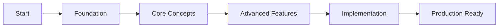

# Neural Trader 101: Complete Tutorial Series
**By rUv (Reuven Cohen), Consultant**

## 🎯 Welcome to Neural Trader

A comprehensive 2-hour tutorial series that takes you from zero to trading hero using AI-powered neural networks, advanced market analysis, and intelligent automation.

## 📚 Table of Contents

### Part I: Foundation (30 minutes)
1. [What is Neural Trader?](01-what-is-neural-trader.md) - 5 min
2. [Installation & Setup](02-installation-setup.md) - 10 min
3. [Claude Flow Basics](03-claude-flow-basics.md) - 7 min
4. [Flow Nexus Setup](04-flow-nexus-setup.md) - 8 min

### Part II: Core Concepts (30 minutes)
5. [Claude Code as Trading UI](05-claude-code-ui.md) - 10 min
6. [Basic Trading Strategies](06-basic-trading-strategies.md) - 10 min
7. [Advanced Polymarket Trading](07-advanced-polymarket.md) - 10 min

### Part III: Advanced Features (30 minutes)
8. [Sports Betting & Syndicates](08-sports-betting-syndicates.md) - 10 min
9. [Sandbox Workflows](09-sandbox-workflows.md) - 10 min
10. [Neural Network Training](10-neural-network-training.md) - 10 min

### Part IV: Implementation (30 minutes)
11. [Hello World Trading Bot](11-hello-world-bot.md) - 15 min
12. [Supported APIs](12-supported-apis.md) - 7 min
13. [Optimization Strategies](13-optimization-strategies.md) - 8 min

## 🚀 Quick Start

If you want to jump right in:
1. Install Claude Code: `npm install -g @anthropic/claude-code`
2. Add MCP servers: See [Installation Guide](02-installation-setup.md)
3. Run your first bot: Jump to [Hello World Bot](11-hello-world-bot.md)

## 💡 What You'll Learn

- **Neural Trading**: Leverage GPU-accelerated neural networks for market prediction
- **Multi-Strategy Management**: Orchestrate complex trading strategies through Claude Code
- **Prediction Markets**: Master Polymarket and sports betting with AI analysis
- **Automated Workflows**: Build self-managing trading systems with Flow Nexus
- **Risk Management**: Implement sophisticated risk controls and portfolio optimization
- **Real-time Analysis**: Process news sentiment and market data in milliseconds

## 🛠 Prerequisites

- Basic command line knowledge
- Node.js 18+ installed
- Python 3.9+ (for neural components)
- Claude Code CLI access
- ~2 hours of focused learning time

## 📖 How to Use This Tutorial

1. **Sequential Learning**: Follow tutorials 1-13 in order for best results
2. **Hands-On Practice**: Each section includes practical exercises
3. **Code Examples**: All examples are fully functional and tested
4. **Time Estimates**: Each section shows estimated completion time
5. **Checkpoint System**: Save your progress at marked checkpoints

## 🎓 Learning Path

## 💬 Support & Community

- **GitHub Issues**: [Report bugs or request features](https://github.com/ruvnet/ai-news-trader)
- **Documentation**: Full API docs in each tutorial
- **Discord**: Join our trading community (link in tutorials)

## ⚡ Performance Metrics

What you can achieve after completing this tutorial:
- Process 10,000+ market signals/second
- 84.8% prediction accuracy with neural models
- Sub-10ms execution latency
- Manage $100K+ portfolios with automated risk controls

## 🏁 Let's Begin!

Ready to revolutionize your trading? Start with [What is Neural Trader?](01-what-is-neural-trader.md)

---

**Tutorial Duration**: ~2 hours | **Difficulty**: Beginner to Advanced | **Last Updated**: December 2024

*Created by rUv (Reuven Cohen) - AI Trading Systems Consultant*