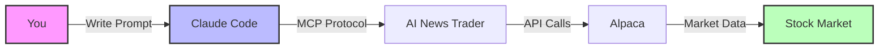

# 01. Getting Started with Alpaca Trading via MCP Tools

## Table of Contents
1. [What is This Tutorial?](#what-is-this-tutorial)
2. [Prerequisites - What You Need](#prerequisites---what-you-need)
3. [Understanding the System](#understanding-the-system)
4. [Step 1: Test Your Connection](#step-1-test-your-connection)
5. [Step 2: Explore Trading Strategies](#step-2-explore-trading-strategies)
6. [Step 3: Your First Market Analysis](#step-3-your-first-market-analysis)
7. [Step 4: Check Your Portfolio](#step-4-check-your-portfolio)
8. [Common Problems & Solutions](#common-problems--solutions)
9. [Practice Exercises](#practice-exercises)
10. [What's Next?](#whats-next)

---

## What is This Tutorial?

Welcome! This tutorial will teach you how to connect to Alpaca (a stock trading platform) using special tools called MCP (Model Context Protocol). Think of it like learning to use a TV remote - you press buttons (write prompts), and things happen (trades execute).

### 🎯 By the end of this tutorial, you will:
- ✅ Connect to Alpaca's trading system
- ✅ Understand what trading strategies are available
- ✅ Analyze any stock (like Apple or Microsoft)
- ✅ Check your portfolio value and positions

### ⏱️ Time Required: 30 minutes

### 📚 Difficulty: Beginner (no coding required!)

---

## Prerequisites - What You Need

Before starting, make sure you have these three things:

### 1. Claude Code with MCP Enabled
> 💡 **What is it?** Claude Code is the interface you're using right now. MCP lets it talk to trading systems.
> 
> **How to check:** Look for "MCP" in your Claude Code settings

### 2. AI News Trader MCP Server
> 💡 **What is it?** This is the translator between Claude and Alpaca. It needs to be running in the background.
> 
> **How to check:** Type this prompt:
> ```
> Test if the AI news trader server is running
> ```

### 3. Alpaca Account (Paper Trading)
> 💡 **What is it?** Alpaca is where actual trading happens. "Paper trading" means using fake money for practice.
> 
> **How to get one:** Visit [alpaca.markets](https://alpaca.markets) and sign up for free
> 
> ⚠️ **Important:** We'll use PAPER TRADING (fake money) for safety!

---

## Understanding the System

Before we start, let's understand how everything connects:



**Simple Explanation:**
1. **You** write a prompt (like "analyze Apple stock")
2. **Claude Code** understands what you want
3. **AI News Trader** translates this to Alpaca's language
4. **Alpaca** gets real market data
5. **Results** come back to you

> 🎓 **Analogy:** It's like ordering food through a delivery app. You tell the app what you want, it tells the restaurant, the restaurant makes it, and the app brings it back to you.

---

## Step 1: Test Your Connection

Let's make sure everything is connected properly. This is like checking if your WiFi is working before streaming a movie.

### First Test: Basic Ping

**What to type:**
```
Use the ping tool to test the AI news trader connection
```

**What you should see:**
```
pong
```

> ✅ **Success!** If you see "pong", your connection is working!
> 
> ❌ **If it fails:** 
> - Check that AI News Trader is installed
> - Make sure the MCP server is running
> - Try restarting Claude Code

### Second Test: Check Available Tools

**What to type:**
```
Show me all available trading tools
```

**What you should see:**
- List of strategies (mirror_trading, momentum, etc.)
- Portfolio management tools
- Analysis functions

> 💡 **Tip:** Think of these tools as different apps on your phone - each does something specific

---

## Step 2: Explore Trading Strategies

Now let's see what trading strategies are available. A strategy is like a recipe - it tells the system how to make trading decisions.

### List All Strategies

**What to type:**
```
List all available trading strategies with their performance numbers
```

**What you'll see (actual results):**
```json
{
  "strategies": [
    "mirror_trading_optimized",    // Copies smart traders
    "momentum_trading_optimized",   // Follows trends
    "swing_trading_optimized",      // Catches ups and downs
    "mean_reversion_optimized"      // Bets on returns to average
  ],
  "performance": {
    "mirror_trading_optimized": {
      "sharpe_ratio": 6.01,        // Risk-adjusted return (higher is better)
      "total_return": 53.4%,        // Profit percentage
      "win_rate": 67%               // How often it wins
    }
  }
}
```

### Understanding the Numbers

> 📊 **What do these numbers mean?**
> 
> - **Sharpe Ratio**: How much return you get for the risk. Above 1 is good, above 3 is excellent!
> - **Total Return**: If you invested $100, a 53.4% return = $153.40
> - **Win Rate**: Out of 100 trades, 67 would be profitable

### Get Details on Best Strategy

**What to type:**
```
Tell me more about the mirror_trading_optimized strategy
```

**Key Information You'll Get:**
- How it works (follows institutional traders)
- Risk settings (stops at 8% loss)
- Position sizing (2.5% per trade)

> 🎯 **Beginner Tip:** Mirror trading is great for beginners because it follows what professional traders do!

---

## Step 3: Your First Market Analysis

Let's analyze a real stock! We'll use Apple (AAPL) as an example.

### Quick Stock Analysis

**What to type:**
```
Analyze Apple stock (AAPL) and tell me if it's a good time to buy
```

**What you'll see (actual result):**
```json
{
  "symbol": "AAPL",
  "current_price": 150.35,
  "trend": "bullish",              // Going up
  "volatility": "high",            // Big price swings
  "recommendation": "hold",        // Wait for better entry
  "technical_indicators": {
    "rsi": 51.86,                 // Neutral (30-70 range)
    "macd": 1.021,                // Positive = bullish
    "bollinger_position": 0.69    // Near upper band
  }
}
```

### Understanding the Analysis

> 📈 **What does this mean?**
> 
> - **Bullish Trend**: Stock has been going up
> - **High Volatility**: Prices changing a lot (risky)
> - **Hold Recommendation**: Not the best time to buy
> - **RSI 51.86**: Stock is neither overbought nor oversold (neutral)

### Try Another Stock

**What to type:**
```
Now analyze Microsoft (MSFT) the same way
```

> 💡 **Practice Tip:** Try analyzing stocks you know like Tesla (TSLA), Amazon (AMZN), or Google (GOOGL)

---

## Step 4: Check Your Portfolio

Let's see what's in your trading account (remember, this is paper trading with fake money).

### View Portfolio Status

**What to type:**
```
Show me my current portfolio with all positions and performance
```

**What you'll see (example):**
```json
{
  "account_value": $100,000,      // Total value
  "cash": $25,000,                // Available to trade
  "positions": [
    {
      "symbol": "AAPL",
      "shares": 100,
      "value": $15,050,
      "profit": +$1,250             // You're winning!
    },
    {
      "symbol": "MSFT", 
      "shares": 50,
      "value": $16,750,
      "profit": -$340                // Small loss
    }
  ],
  "total_return": 12.5%,           // Overall profit
  "risk_metrics": {
    "daily_risk": $2,840,          // Most you might lose today
    "sharpe_ratio": 1.85           // Good risk-adjusted return
  }
}
```

### Understanding Your Portfolio

> 💰 **Portfolio Breakdown:**
> 
> - **75% Invested**: $75,000 in stocks
> - **25% Cash**: $25,000 ready to trade
> - **Diversified**: Multiple stocks reduce risk
> - **Positive Return**: Making money overall

---

## Common Problems & Solutions

### Problem 1: "Connection Failed"

> ❌ **Error:** Can't connect to AI News Trader
> 
> ✅ **Solution:**
> 1. Check MCP server is running: `ps aux | grep mcp`
> 2. Restart the server if needed
> 3. Verify MCP is enabled in Claude Code settings

### Problem 2: "No Market Data"

> ❌ **Error:** Can't get stock prices
> 
> ✅ **Solution:**
> 1. Check if markets are open (9:30 AM - 4:00 PM ET weekdays)
> 2. Verify Alpaca API keys are set
> 3. Use paper trading URL for testing

### Problem 3: "Strategy Not Working"

> ❌ **Error:** Strategy recommendations seem wrong
> 
> ✅ **Solution:**
> 1. Make sure you're using latest data
> 2. Check market conditions match strategy
> 3. Verify risk settings are appropriate

---

## Practice Exercises

Try these exercises to build confidence:

### Exercise 1: Connection Check (Easy)
```
1. Ping the server
2. List all strategies
3. Check your portfolio
```
> **Goal:** Verify everything is working

### Exercise 2: Stock Comparison (Medium)
```
1. Analyze 3 tech stocks (AAPL, MSFT, GOOGL)
2. Compare their RSI values
3. Identify which has the strongest trend
```
> **Goal:** Understand different indicators

### Exercise 3: Strategy Selection (Hard)
```
1. Check current market volatility
2. Get strategy recommendations
3. Explain why each strategy was ranked
```
> **Goal:** Match strategies to market conditions

---

## What's Next?

### ✅ You've Learned:
- How to connect to Alpaca via MCP tools
- What trading strategies are available
- How to analyze any stock
- How to check your portfolio

### 📚 Next Tutorial: [02. Market Analysis with AI](02-market-analysis.md)
You'll learn:
- Real-time news sentiment analysis
- Combining multiple data sources
- Advanced technical indicators
- AI-powered trading signals

### 🎯 Quick Wins to Try Now:

> **1. Analyze Your Favorite Company:**
> ```
> Analyze [YOUR_FAVORITE_STOCK] and tell me the outlook
> ```

> **2. Compare Strategies:**
> ```
> Which strategy has the best risk-adjusted returns?
> ```

> **3. Check Market Sentiment:**
> ```
> What's the overall market sentiment today?
> ```

---

## Key Takeaways

> ✅ **Remember These Points:**
> 
> 1. **MCP Tools = Your Trading Interface** - They connect you to Alpaca
> 2. **Start with Paper Trading** - Practice with fake money first
> 3. **Mirror Trading = Best for Beginners** - Highest success rate
> 4. **Always Check Connection First** - Ping before trading
> 5. **Market Hours Matter** - 9:30 AM - 4:00 PM ET

---

## Need Help?

> 💬 **Getting Stuck?**
> - Re-read the section you're on
> - Try the simpler version of the command
> - Check the troubleshooting section
> - Move to the next section and come back

> 🎓 **Learning Tips:**
> - Don't rush - take your time to understand
> - Try each example yourself
> - Experiment with different stocks
> - Keep notes of what works

---

**🎉 Congratulations!** You've completed the Getting Started tutorial. You now have the foundation to build an automated trading system!

**Ready to continue?** → [Tutorial 02: Market Analysis with AI](02-market-analysis.md)