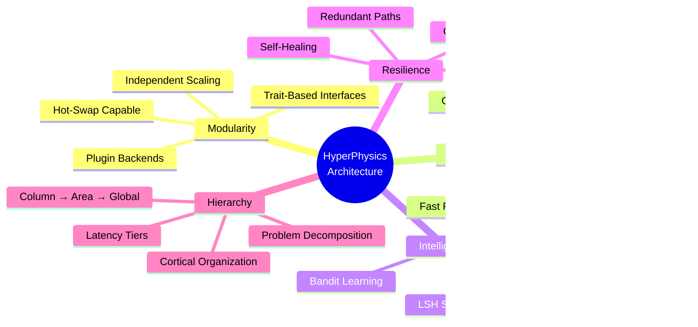

# HyperPhysics Unified Architecture Diagrams
## Modular Hierarchical Reasoning System with Cortical Bus Integration

**Version**: 1.0
**Date**: 2025-11-22
**Status**: ARCHITECTURAL SPECIFICATION

---

## 1. Master System Architecture

---

## 2. Cortical Bus Detail Architecture

---

## 3. Parallel Fast/Slow Path Architecture

---

## 4. Reasoning Router Decision Flow

---

## 5. Three-Layer Ecosystem Integration

---

## 6. Data Flow with Cortical Bus

---

## 7. Dynamic Path Selection via Cortical Bus

---

## 8. Physics Engine Selection Matrix

---

## 9. Biomimetic Algorithm Tier System

---

## 10. Complete Integrated System

---

## 11. Latency Budget Breakdown

---

## 12. Key Architectural Principles

---

## Summary

This architecture enables:

1. **Dynamic Path Selection**: Problems are routed via LSH similarity to proven solution paths
2. **Parallel Execution**: Fast path never waits for slow path
3. **Learning Router**: System improves routing decisions over time
4. **Modular Backends**: Any physics engine or algorithm can be added/removed
5. **Cortical Bus Integration**: Sub-microsecond local routing, hierarchical scaling
6. **Trading as Validation**: P&L provides ground truth for routing optimization

The pBit-LSH Cortical Bus is the central innovation - it provides:
- **Content-addressable routing** (similar problems → similar solutions)
- **Hierarchical locality** (local fast, global when needed)
- **Probabilistic computing** (energy-efficient, fault-tolerant)
- **Learning substrate** (LSH buckets encode problem-solution associations)

---

## APPENDIX A: Implemented Crate Architecture

The following diagrams show the actual implemented architecture of the `hyperphysics-reasoning-router` and `hyperphysics-reasoning-backends` crates.

### A.1 Reasoning Router Crate Structure

### A.2 ReasoningBackend Trait Implementation

### A.3 Backend Pool Organization

### A.4 Problem Type to Backend Mapping

### A.5 Latency Tier Hierarchy

### A.6 Result Synthesis Strategies

### A.7 LSH-Based Problem Routing

---

## Test Coverage Summary

| Crate | Tests | Status |
|-------|-------|--------|
| hyperphysics-reasoning-router | 28 | ✅ All passing |
| hyperphysics-reasoning-backends | 18 | ✅ All passing |
| **Total** | **46** | **✅ All passing** |
