# HyperPhysics-Nautilus Integration Diagrams

This document contains Mermaid diagrams documenting the integration architecture between HyperPhysics and Nautilus Trader.

---

## 1. High-Level System Architecture

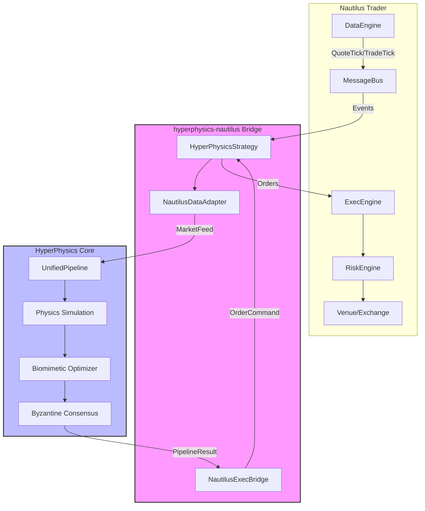

---

## 2. Data Flow Sequence

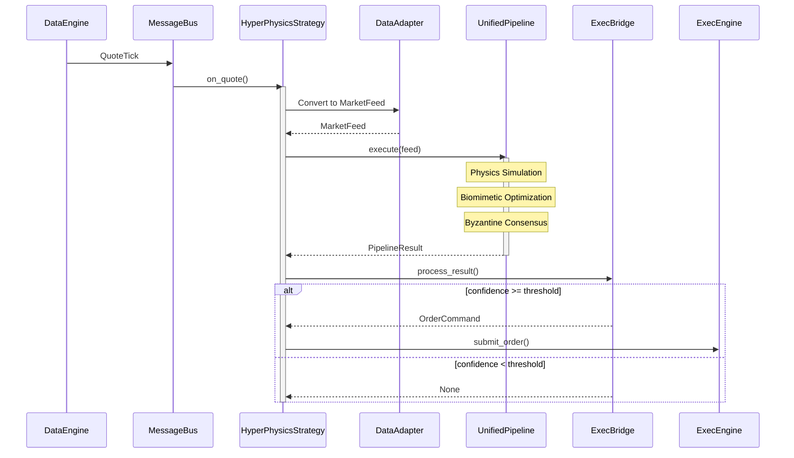

---

## 3. Type Conversion Layer

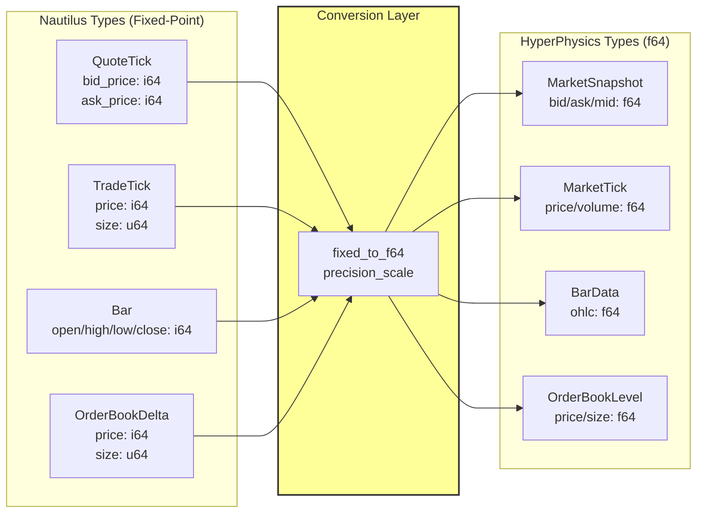

---

## 4. Strategy State Machine

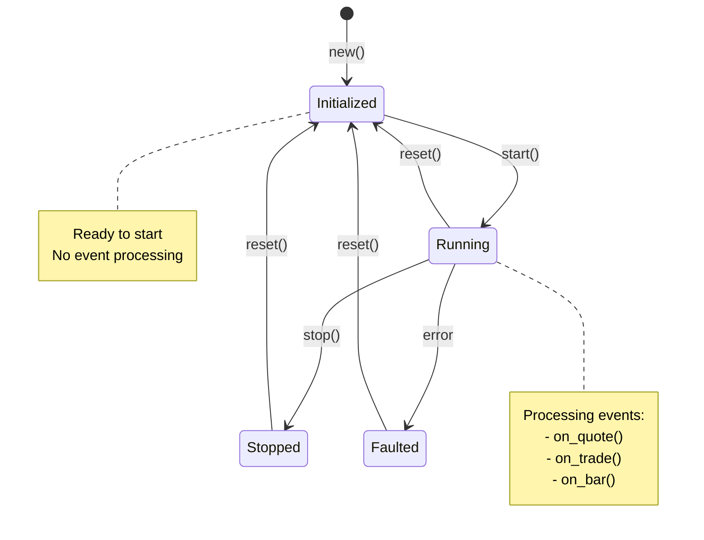

---

## 5. HyperPhysics Pipeline Internals

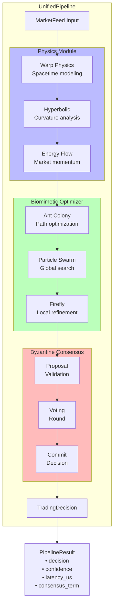

---

## 6. Backtest Architecture

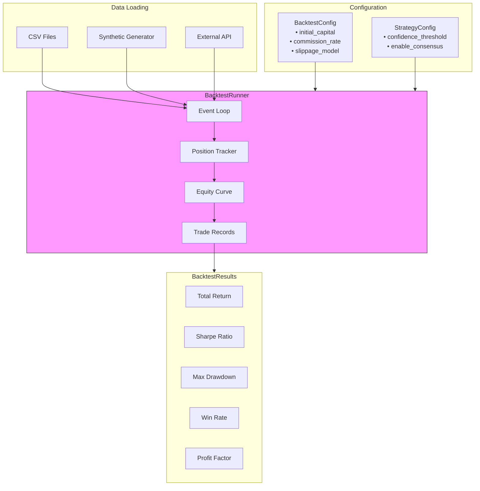

---

## 7. Order Command Flow

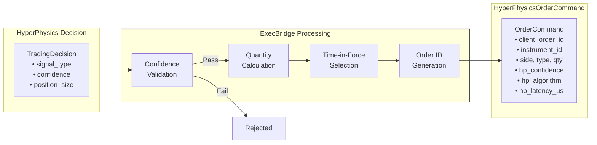

---

## 8. Module Dependencies

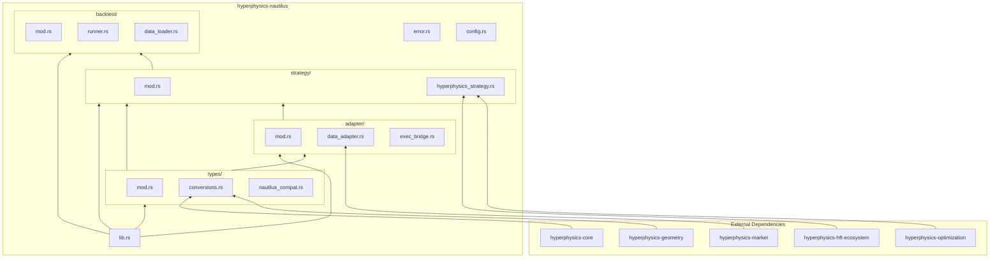

---

## 9. Performance Metrics Flow

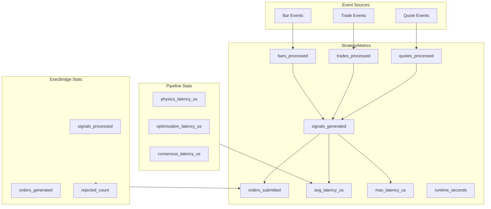

---

## 10. Error Handling Flow

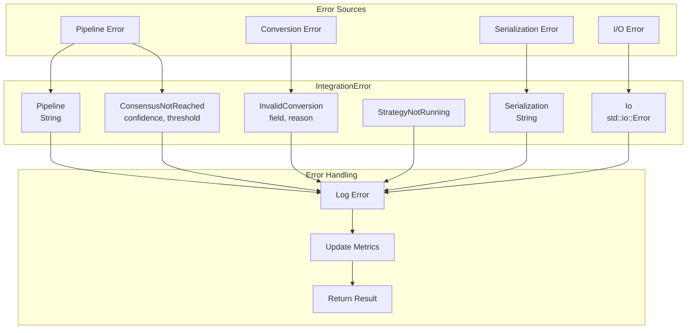

---

## 11. Integration Deployment Options

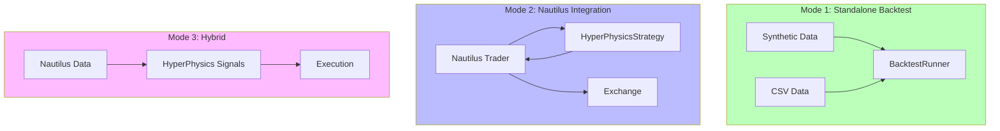

---

## 12. Full Integration Overview

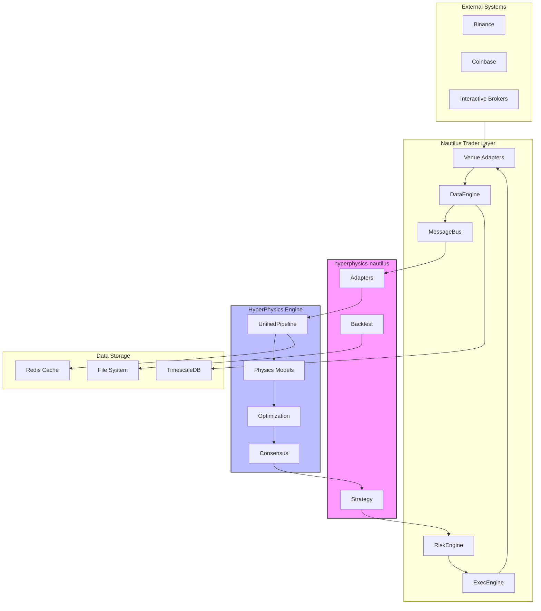

---

## Usage Notes

These diagrams can be rendered using:
- GitHub Markdown (native Mermaid support)
- VS Code with Mermaid extension
- Mermaid Live Editor: https://mermaid.live
- Any documentation tool supporting Mermaid

To embed in other documentation:
```markdown
```mermaid
[diagram code here]
```
```

---

## Related Documentation

- [Nautilus Assessment](../integration/NAUTILUS_TRADER_ASSESSMENT.md)
- [Integration Architecture](../integration/HYPERPHYSICS_NAUTILUS_ARCHITECTURE.md)
- [HyperPhysics Architecture](../architecture/hyperphysics_unified_architecture_diagrams.md)
