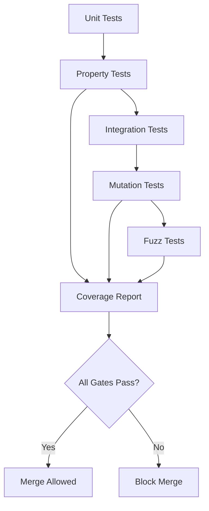

# HyperPhysics Testing Protocol

## Multi-Tier Testing Strategy

### Tier 1: Unit Tests (Fast, Isolated)
**Coverage Target**: 100%
**Execution Time**: < 1 second per crate

```rust
#[cfg(test)]
mod tests {
    use super::*;

    #[test]
    fn test_pbit_initialization() {
        let pbit = PBit::new(0.5);
        assert_eq!(pbit.probability(), 0.5);
    }

    #[test]
    fn test_lattice_neighbors() {
        let lattice = PBitLattice::square(4).unwrap();
        let neighbors = lattice.neighbors(0);
        assert_eq!(neighbors.len(), 2); // Corner has 2 neighbors
    }
}
```

### Tier 2: Property-Based Tests (Comprehensive)
**Coverage Target**: All public APIs
**Execution Time**: < 10 seconds per crate

```rust
proptest! {
    #[test]
    fn prop_always_valid_state(
        temperature in 0.1f64..1000.0,
        steps in 1usize..1000
    ) {
        // Generate random scenarios
        // Verify invariants always hold
    }
}
```

### Tier 3: Integration Tests (Cross-Module)
**Coverage Target**: All module interactions
**Execution Time**: < 30 seconds total

```rust
#[test]
fn test_gillespie_metropolis_equivalence() {
    // Same system, different algorithms
    // Should converge to same equilibrium
}
```

### Tier 4: Mutation Tests (Quality Assurance)
**Coverage Target**: 95% mutation score
**Execution Time**: < 5 minutes

```bash
cargo mutants --workspace --timeout 300
```

### Tier 5: Fuzz Tests (Edge Cases & Crashes)
**Coverage Target**: 1M iterations without crashes
**Execution Time**: Continuous

```bash
cargo fuzz run fuzz_target -- -max_total_time=3600
```

## Test Execution Order



## Running Tests

### Quick Check (Pre-Commit)
```bash
# Fast unit tests only
cargo test --workspace --lib
```

### Standard Check (PR Validation)
```bash
# Unit + property tests
cargo test --workspace --all-features

# Coverage report
cargo tarpaulin --workspace --out Html
```

### Full Validation (Before Merge)
```bash
# All tests + mutation testing
./scripts/run_full_tests.sh
```

### Continuous Fuzzing (Background)
```bash
# Run on dedicated server
cargo fuzz run --all -- -max_total_time=86400
```

## Test Organization

```
HyperPhysics/
├── crates/
│   └── hyperphysics-pbit/
│       ├── src/
│       │   └── *.rs          # Inline unit tests (#[cfg(test)])
│       ├── tests/
│       │   ├── unit/         # Module-specific tests
│       │   ├── proptest_*.rs # Property-based tests
│       │   └── integration/  # Cross-module tests
│       └── benches/          # Performance benchmarks
├── fuzz/
│   └── fuzz_targets/
│       └── fuzz_*.rs         # Fuzzing harnesses
└── docs/
    └── testing/
        ├── MUTATION_BASELINE.md
        ├── TESTING_PROTOCOL.md
        └── COVERAGE_REPORT.md
```

## Quality Gates

### Gate 1: Basic Functionality
- ✅ All unit tests pass
- ✅ No compiler warnings
- ✅ Code compiles in release mode

### Gate 2: Comprehensive Coverage
- ✅ Line coverage ≥ 90%
- ✅ Branch coverage ≥ 85%
- ✅ All property tests pass

### Gate 3: Mutation Resistance
- ✅ Mutation score ≥ 90%
- ✅ Critical paths 100% mutation tested
- ✅ No surviving mutants in core algorithms

### Gate 4: Stability
- ✅ Fuzz tests run 100K iterations without crash
- ✅ No memory leaks detected
- ✅ No undefined behavior under sanitizers

## Debugging Failed Tests

### Property Test Failures
```bash
# Minimal failing case
PROPTEST_CASES=1 cargo test failing_test

# Reproduce with seed
PROPTEST_RNGALGO=ChaCha cargo test failing_test
```

### Mutation Test Failures
```bash
# See specific mutation
cargo mutants --list

# Test single mutant
cargo mutants --mutant "path/to/file.rs:123"
```

### Fuzz Crash Debugging
```bash
# Minimize crashing input
cargo fuzz cmin fuzz_target

# Debug specific crash
cargo fuzz run fuzz_target crash-file.txt
```

## Performance Benchmarks

```bash
# Run criterion benchmarks
cargo bench --workspace

# Compare with baseline
cargo bench --workspace -- --save-baseline main
cargo bench --workspace -- --baseline main
```

## Test Metrics Dashboard

### Key Performance Indicators
- **Test Suite Runtime**: Target < 60s for full suite
- **Mutation Score**: Target ≥ 95%
- **Code Coverage**: Target 100%
- **Fuzz Stability**: Target 1M iterations
- **False Positive Rate**: Target < 1%

### Tracking
```bash
# Generate metrics
./scripts/collect_test_metrics.sh > metrics.json

# Visualize trends
./scripts/plot_test_trends.py metrics.json
```

---

**Version**: 1.0.0
**Last Updated**: 2025-11-12
**Maintained By**: QA-Lead Agent
