# HyperPhysics Unified HFT Pipeline

## Architecture Flowchart

```mermaid
flowchart TB
    subgraph Input["Market Data Input"]
        MF[("MarketFeed<br/>price, returns, volatility,<br/>vwap, spread, timestamp")]
    end

    subgraph Phase1["Phase 1: Market Data Processing"]
        P1_START([Start Pipeline])
        P1_PROC["process_market_data()"]
        P1_TICK[("MarketTick<br/>timestamp, orderbook, trades")]
        P1_LAT["Record market_data_latency_us"]

        P1_START --> P1_PROC
        P1_PROC --> P1_TICK
        P1_TICK --> P1_LAT
    end

    subgraph Phase2["Phase 2: Physics Simulation"]
        P2_SIM["run_physics_simulation()<br/>(Rapier/Jolt/Warp)"]
        P2_SIG[("PhysicsSignal<br/>direction, momentum, energy")]
        P2_LAT["Record physics_latency_us"]

        P2_SIM --> P2_SIG
        P2_SIG --> P2_LAT
    end

    subgraph Phase3["Phase 3: Neural Forecasting (Optional)"]
        P3_CHECK{{"feature =<br/>neural-forecasting?"}}
        P3_CONVERT["Convert MarketFeed<br/>→ neural_trader::MarketFeed"]
        P3_ADAPT["neural_adapter.process_feed()<br/>Extract NeuralFeatures"]
        P3_ENGINE["neural_engine.forecast()<br/>(NHITS/LSTM/Transformer)"]
        P3_RESULT[("ForecastResult<br/>predictions, confidence,<br/>variance, model_type")]
        P3_SUMMARY["Create NeuralForecastSummary<br/>prediction, confidence_interval,<br/>quality_score, model"]
        P3_LAT["Record neural_latency_us"]
        P3_SKIP["neural_latency_us = 0"]

        P3_CHECK -->|Yes| P3_CONVERT
        P3_CHECK -->|No| P3_SKIP
        P3_CONVERT --> P3_ADAPT
        P3_ADAPT --> P3_ENGINE
        P3_ENGINE --> P3_RESULT
        P3_RESULT --> P3_SUMMARY
        P3_SUMMARY --> P3_LAT
    end

    subgraph Phase4["Phase 4: Biomimetic Optimization"]
        P4_CHECK{{"feature =<br/>optimization-real?"}}
        P4_OBJ["Create MarketObjective<br/>returns, volatility, trend"]
        P4_OPT["RealOptimizer.optimize_whale()"]
        P4_ALGOS["Bio-inspired Algorithms:<br/>• WhaleOptimizer<br/>• BatOptimizer<br/>• FireflyOptimizer<br/>• CuckooSearch"]
        P4_SIG[("OptimizationSignal<br/>position, confidence,<br/>algorithm, converged")]
        P4_LAT["Record optimization_latency_us"]
        P4_NOOP["NoOp Signal<br/>position=0, confidence=0"]

        P4_CHECK -->|Yes| P4_OBJ
        P4_CHECK -->|No| P4_NOOP
        P4_OBJ --> P4_OPT
        P4_OPT --> P4_ALGOS
        P4_ALGOS --> P4_SIG
        P4_SIG --> P4_LAT
        P4_NOOP --> P4_LAT
    end

    subgraph Phase5["Phase 5: Byzantine Consensus"]
        P5_CONS["validate_consensus()<br/>(PBFT Protocol)"]
        P5_QUORUM["Quorum Check<br/>2f+1 out of 3f+1 nodes"]
        P5_VOTE{{"Consensus<br/>Reached?"}}
        P5_STATE[("ConsensusState<br/>leader_id, term,<br/>active_nodes, threshold")]
        P5_LAT["Record consensus_latency_us"]

        P5_CONS --> P5_QUORUM
        P5_QUORUM --> P5_VOTE
        P5_VOTE --> P5_STATE
        P5_STATE --> P5_LAT
    end

    subgraph Decision["Final Decision"]
        D_COMPUTE["compute_final_decision()<br/>Combine physics_signal,<br/>opt_signal, consensus"]
        D_RESULT[("TradingDecision<br/>action, tier, confidence,<br/>latency_budget_us")]
        D_STATS["update_stats()<br/>total_executions,<br/>avg_latency_us"]
    end

    subgraph Output["Pipeline Result"]
        OUT[("PipelineResult<br/>decision, total_latency_us,<br/>market_data_latency_us,<br/>physics_latency_us,<br/>neural_latency_us,<br/>optimization_latency_us,<br/>consensus_latency_us,<br/>consensus_state,<br/>consensus_reached,<br/>neural_forecast")]
    end

    %% Main Flow
    MF --> P1_START
    P1_LAT --> P2_SIM
    P2_LAT --> P3_CHECK
    P3_LAT --> P4_CHECK
    P3_SKIP --> P4_CHECK
    P4_LAT --> P5_CONS
    P5_LAT --> D_COMPUTE
    D_COMPUTE --> D_RESULT
    D_RESULT --> D_STATS
    D_STATS --> OUT

    %% Styling
    classDef inputOutput fill:#e1f5fe,stroke:#01579b,stroke-width:2px
    classDef process fill:#fff3e0,stroke:#e65100,stroke-width:2px
    classDef decision fill:#f3e5f5,stroke:#7b1fa2,stroke-width:2px
    classDef data fill:#e8f5e9,stroke:#2e7d32,stroke-width:2px
    classDef optional fill:#fce4ec,stroke:#c2185b,stroke-width:2px

    class MF,OUT inputOutput
    class P1_PROC,P2_SIM,P3_ADAPT,P3_ENGINE,P4_OPT,P5_CONS,D_COMPUTE process
    class P3_CHECK,P4_CHECK,P5_VOTE decision
    class P1_TICK,P2_SIG,P3_RESULT,P4_SIG,P5_STATE,D_RESULT data
    class P3_CONVERT,P3_SUMMARY,P4_ALGOS optional
```



## Component Details

### Neural Forecasting Models (Phase 3)
| Model | Description | Use Case |
|-------|-------------|----------|
| NHITS | N-HiTS hierarchical interpolation | Multi-scale forecasting |
| LSTMAttention | LSTM with attention mechanism | Sequential patterns |
| Transformer | Self-attention architecture | Long-range dependencies |
| GRU | Gated Recurrent Unit | Efficient sequence modeling |
| TCN | Temporal Convolutional Network | Dilated convolutions |
| DeepAR | Autoregressive RNN | Probabilistic forecasting |
| NBeats | Neural Basis Expansion | Interpretable forecasting |
| Prophet | Facebook Prophet adaptation | Trend + seasonality |

### Biomimetic Optimization (Phase 4)
| Algorithm | Inspiration | Strength |
|-----------|-------------|----------|
| WhaleOptimizer | Humpback whale hunting | Exploration/exploitation balance |
| BatOptimizer | Bat echolocation | Local search refinement |
| FireflyOptimizer | Firefly attraction | Multi-modal optimization |
| CuckooSearch | Cuckoo breeding parasitism | Lévy flight exploration |

### Consensus Protocol (Phase 5)
- **Protocol**: Practical Byzantine Fault Tolerance (PBFT)
- **Nodes**: 3f+1 (minimum 4 for f=1)
- **Quorum**: 2f+1 votes required
- **Byzantine Threshold**: Tolerates f faulty/malicious nodes

## Feature Flags

```toml
[features]
neural-forecasting = ["hyperphysics-neural-trader"]
optimization-real = ["hyperphysics-optimization"]
```

## Latency Targets
- **Total Pipeline**: < 10ms
- **Market Data Processing**: < 100μs
- **Physics Simulation**: < 1ms
- **Neural Forecasting**: < 5ms
- **Optimization**: < 3ms
- **Consensus**: < 1ms
